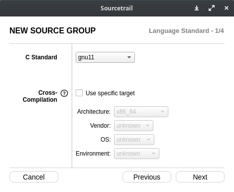
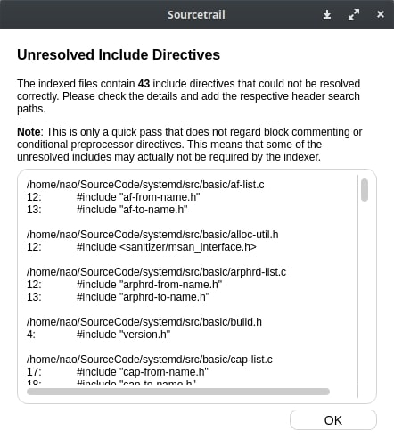
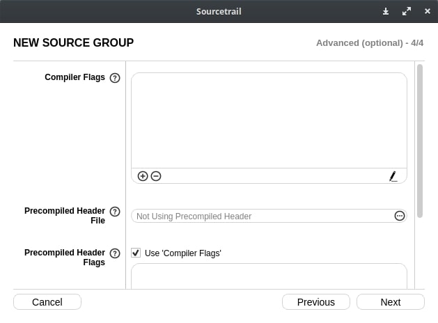

## 前書き：Sourcetrailとは 

[Sourcetrail](https://www.sourcetrail.com/)は、C／C++／Java／Pythonで書かれたコードを解析し、クラス（構造体）やメソッドの依存関係／呼び出し関係を可視化してくれるツールです。

以下の特徴を持つため、会社での業務利用でも気軽にSourcetrailを使用可能です。

- Windows／Mac／Linuxで動作
- ライセンスはGPL v3（使用は自由ですが、Sourcetrail自体の改変や販売はソースコード公開義務が発生）
- オフラインで動作（DBを作成しますが、外部サーバにアップロードしません）

使用例を下図に示します。

ウィンドウ左側に構造体の依存関係、ウィンドウ右側に構造体定義や構造体参照に関するソースコードが表示されます。バグフィックスの際に、サッと影響範囲を調べるのに便利です。

                         

本記事では、Sourcetrailのインストール方法や環境設定手順を紹介します。解析例として取り上げるプロジェクトは、systemd（Linuxのユーザランド起動／監視／終了プロセス、C言語、約43万Step）とします。

## 検証環境

検証環境として、Debian 10.7を用います。

```
       _,met$$$$$gg.          nao@debian 
    ,g$$$$$$$$$$$$$$$P.       ---------- 
  ,g$$P"     """Y$$.".        OS: Debian GNU/Linux 10 (buster) x86_64 
 ,$$P'              `$$$.     Kernel: 4.19.67 
',$$P       ,ggs.     `$$b:   Uptime: 1 hour, 26 mins 
`d$$'     ,$P"'   .    $$$    Packages: 4198 (dpkg), 13 (flatpak), 6 (snap) 
 $$P      d$'     ,    $$P    Shell: fish 3.0.2 
 $$:      $$.   - ,d$$'    Resolution: 2560x1080 
 $$;      Y$b._   _,d$P'      DE: Pantheon 
 Y$$.    `.`"Y$$$$P"'         WM: Mutter(Gala) 
 `$$b      "-.__              Terminal: io.elementary.t 
  `Y$$                        CPU: AMD Ryzen 7 3800X 8- (16) @ 3.900GHz 
   `Y$$.                      GPU: NVIDIA NVIDIA Corporation TU107 
     `$$b.                    Memory: 6900MiB / 64404MiB 
       `Y$$b.
          `"Y$b._                                     
              `"""
```

## Sourcetrailインストール

2020年12月現在、SourcetrailはDebianパッケージが存在しません。そのため、[公式サイト（GitHub）のリリースページ](https://github.com/CoatiSoftware/Sourcetrail/releases)からバイナリをダウンロードします。

Sourcetrail 2020.2.43を例に、インストール手順を以下に示します。wgetコマンドでバイナリを取得していますが、WebブラウザからGUIでダウンロードしても構いません。

```
(注釈) Linux版のリリースバイナリを取得
$ wget https://github.com/CoatiSoftware/Sourcetrail/releases/download/2020.2.43/Sourcetrail_2020_2_43_Linux_64bit.tar.gz

(注釈) Tarballの展開
$ tar xf Sourcetrail_2020_2_43_Linux_64bit.tar.gz

(注釈) Sourcetrailのインストール 
$ cd Sourcetrail/ 
$ sudo ./install.sh 

```

インストール後はターミナルで"$ sourcetrail"と入力すれば、Sourcetrailウィンドウを起動できます。

Sourcetrailデスクトップファイルおよびアイコンも同時にインストールされているため、GUIアイコンからの起動もできます。

## systemd（解析対象）ソースコードのダウンロード

systemdはGitHubで管理されているため、gitコマンドで最新版のソースコードを取得します。

```
$ git clone https://github.com/systemd/systemd.git

```

Sourcetrailによるソースコード解析時、systemdが依存しているライブラリのヘッダファイルを使用します。そのため、systemdのビルドに必要なパッケージを全てインストールします。

DebianやUbuntuでは、aptコマンドのbuild-dep（サブコマンド）を使用すれば、systemdのビルドに必要なパッケージを一括でインストールできます。それ以外の環境の方は、他の方法で依存を満たしてください。

```
$ sudo apt build-dep systemd

```

ビルド確認を行います。ビルドに関する情報は[README](https://github.com/systemd/systemd/blob/master/README)に書いてあります。

systemdは、ビルドツールに[ninja（ビルド高速化ツール）](https://github.com/ninja-build/ninja)と[meson（ビルド自動化ツール）](https://mesonbuild.com/)を使用するため、それらをインストールしてからビルドを行います（gccとmakeコマンドだけでビルドが完結しない時点で、Sourcetrailの題材としては不適切だった気が……）

```
(注釈) systemdのビルドに必要なツールをインストール
$ sudo apt install build-essential meson ninja-build

(注釈) systemdのルートディレクトリへ移動
$ cd $(systemdが存在するディレクトリ)

(注釈) ビルド用ディレクトリの作成
$ mkdir build

(注釈) ninja用のビルド情報ファイルを生成（configure相当の処理）
$ meson build

(注釈) ビルド実行
$ ninja -C build

```

上記のビルドが通らなくても、Sourcetrailでソースコード解析がある程度できるので、次の手順に進んで大丈夫です。

ビルド失敗した状態で解析できないのは、ビルド時に生成されるヘッダファイルおよびそれらを使用するソースコードです。

## Sourcetrailプロジェクトにおける設定項目

Sourcetrailでソースコード解析するには、解析対象のソースコード（system）に関する以下の情報を入力する必要があります。

- プロジェクト基本情報
- ソースコードグループ
- ソースコード（\*.c）が存在するPATH
- ヘッダファイル（依存ライブラリヘッダ含む）が存在するPATH
- コンパイラフラグ

上記の設定方法に関して、順に説明します。

## プロジェクト基本情報の設定

まずは、Sourcetrailを起動した後、New Projectを押下すると以下の画面が表示されます。入力項目は、以下の2点です。自由に設定してください。

- Sourcetrail Project Name：任意の名前（例：解析対象の名前）
- Sourcetrail Project Location：Sourcetrailプロジェクトファイルの保存先


## ソースコードグループの設定

先程の画面下部にあるAdd Source Groupボタンを押下すると、以下の画面（New Source Group）が表示されます。

今回はC言語のソースコードを解析するため、"Source Gropu Types"はCを選択し、"Empty C Source Group"を選択してください。


各Source Group Typesに関する説明は、以下の通りです。解析対象のプロジェクト（ビルドシステム）に応じて、選択を変えてください。

| **Source Group Types** | **役割** |
| --- | --- |
| C/C++ from Compilation Database | 既存のCompilation DBファイル(compile\_commands.json)から生成します。   このファイルは「CmakeとMakeを利用したプロジェクト」や「Qt Creator」からソースグループを生成します。 |
| C/C++ from Visual Studio | Visual Studio Solutionファイルからソースグループを生成します。 |
| C/C++ from Code::Blocks | Code::Blocks（IDE）プロジェクトファイルからソースグループを生成します。 |
| Empty C Source Group | Sourcegroupがインデックスを作成する事によってソースグループを生成します。 |

systemdは、Compilation DBファイルもなく、IDE（Visual Studio、Code::Blocks）も使用しないため、Empty C Source Groupしか選択できません。

Source Groupを選択後にNextボタンを押すと、コンパイル設定画面に移行します。ここでの設定（以下の2点）は、デフォルト値で構いません。設定が必要になるのは、「古いプロジェクトである場合」や「組み込み環境向けのプロジェクトの場合」です。

- C Standard：言語の規格
- Cross-Cimpilation：クロスコンパイル（別CPU向けコンパイル）の設定



## ソースコード（\*.c）が存在するPATHの設定

コンパイル設定画面でNextボタンを押下すると、解析対象／解析対象外のソースコードPATHを選択する画面に遷移します。ここでの設定項目は、以下の3点です。

- Files & Directories to Index：解析対象ソースコードもしくは解析対象ディレクトリのPATH
- Excluded Files & Directories：解析対象外ソースコードもしくは解析対象外ディレクトリのPATH
- Source Files Extensions：解析対象ソースコードの拡張子（今回はC言語のみ）


一般的なC言語のプロジェクトでは、\*.cファイルはsrcディレクトリ直下に存在します。そのため、今回の例であれば、systemd/src以下を解析対象としています。

## ヘッダファイル（依存ライブラリヘッダ含む）が存在するPATHの設定

解析対象／解析対象外のソースコードPATHを選択する画面でNextボタンを押下すると、ヘッダファイルPATHの設定画面に遷移します。

ここでの設定項目は以下の2点であり、特に外部ライブラリヘッダのPATHを調べるのが面倒です。

- Include Paths：解析対象プロジェクト内に存在するヘッダファイルへのPATH
- Global Include Paths：依存している外部ライブラリヘッダファイルへのPATH


Include Paths（解析対象プロジェクト内のヘッダファイル）は、自動で設定できます。auto-detectボタンを押下し、Detect Include Paths画面でプロジェクトルートディレクトリを指定してからStartボタンを押下すれば設定完了します。

Global Include Paths（依存外部ライブラリヘッダ）は、detectボタンを押下しただけでは、設定完了しません。私の環境では、以下のPATH設定が自動で検出されませんでした。

- /usr/include/efi
- /usr/include/libmount
- /usr/include/libfdisk
- /usr/include/p11-kit-1

PATH情報が不足しているヘッダファイルの一覧は、validate include directivesボタンを押下すると取得できます（下図参照）。



ヘッダファイルがどのPATHに存在するかは、apt-fileコマンドで調査できます。もしくは、[Debianパッケージ検索（Webサイト）](https://www.debian.org/distrib/packages.ja.html)でも調査できます。

例えば、"#include <libmount.h>"のPATH情報が解決できていない場合、以下の手順で調査します。

```
(注釈) apt-fileが未インストールの場合のみ、以下のコマンドでインストールします
$ sudo apt install apt-file

(注釈) パッケージ情報の更新
$ sudo apt-file update

(注釈) ヘッダファイルのPATHを検索
$ apt-file search libmount.h
libmount-dev: /usr/include/libmount/libmount.h

```

apt-file searchコマンドでPATH情報が出てこない場合は諦めて、次の手順に進んでください。

Debianはパッケージが古いため、最新のパッケージ（例：libfido2-dev）が存在しない事が多々あります。そのため、最新のsystemdを上流からダウンロードすると、Debianでは存在しないヘッダファイルを要求されてしまいます。

PATH情報が全て解決できていない状態でも、プロジェクトの解析はできます。厳密に調査したい場合は完璧なPATH設定が必要ですが、そもそも厳密さに重きを置く場合はソースコードをそのまま読んだ方が速いです。

## コンパイラフラグの設定

ヘッダファイルPATHの設定画面でNextボタンを押下すると、コンパイラフラグ設定画面に遷移します。設定項目は以下の3点ですが、今回は全てデフォルト設定とします。

- Compiler Flags：Clangコンパイラフラグ
- Precompiled Header File：プリコンパイル済みヘッダ（pch.h）へのPATH
- Precompiled Header Flags：プリコンパイル済みヘッダ生成時のコンパイラフラグ



systemdはコンパイラにClangではなく、gccを使用しています。プリコンパイルヘッダも使用していません。そのため、上記の項目全てが、設定不要です。

## 最後に

以上の設定を完了すると、Sourcetrailがソースコード解析を開始します。

defineマクロを使用した行で閉じカッコを上手く検出できていないエラーが発生しますが、大部分のクラス（構造体）やメソッドの依存関係／呼び出し関係を可視化できている筈です。
