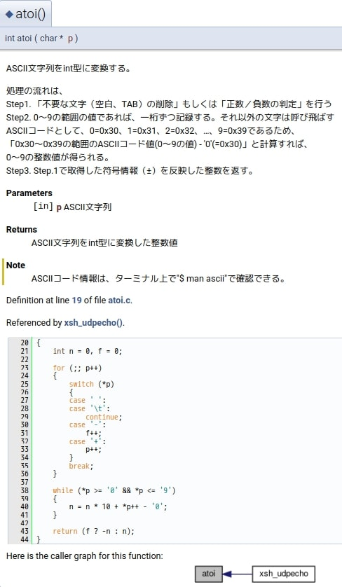

### 前書き：未だにC言語で消耗中

2020年現在、C言語ライブラリをフルスクラッチで開発する機会はほぼ無いと思われますが、歴史のある企業に勤めている方は内製ライブラリ（秘伝のタレ）を修正／機能追加する機会があるのではないでしょうか。

「今どきC言語で開発なんて……」と敬遠される方が相当数いると思いますが、

- C言語ソフト資産が数千万〜数億単位で稼ぐ
- 数百万Step規模のC言語ソフト資産を別言語に移植するメリットが薄い
- C言語しか書けないオッサンを別言語ソフトエンジニアに育成する余裕がない

という背景があり、金銭的な観点ではC言語でソフト開発を続けて技術的負債を増やし続けても仕方ないのかな、と個人的には考えています。「企業の将来性」や「技術者のモチベ」には悪い影響があると思いますが、そこを定量化して説明できる人が居ないのでC言語が生き残っています。

そんな背景があるため、私は2020年なのに6000Step規模のC言語ライブラリをフルスクラッチで開発し、その過程で「設計／実装を誤ってしまった」、「内製ライブラリの◯◯な部分は駄目だ」、「OSSライブラリの☓☓は設計が上手い」等と感じる瞬間がありました。

このような経験を踏まえて、本記事ではC言語ライブラリAPIを実装する際に注意したい事を紹介します。

---


### APIの引数規則を決定し、遵守する

C言語では、引数（パラメータ）を３つのカテゴリーに分類できます。

1. 入力（不変）パラメータ
2. 可変パラメータ
3. 結果用パラメータ（ポインタ変数）

APIを使用するユーザは、引数が上記のどれに相当するのかを判断しなければいけません。  
ユーザの判断負荷を減らすため、以下の規則が考えられます。

- 入力（不変）パラメータには、const指定子を付与
- 結果を返すポインタ変数には、"ret\_"や"o\_"などのプレフィックスを付与
- 引数の順番を第一引数=入力パラ、第二引数=可変パラ、第三引数=結果用パラに固定

実装例は、以下の通りです。

```
static int sample_func(
                  const char *input,         /* 不変な入力パラメータ */
                  Sample* object,            /* 可変パラメータ */
                  char **ret_func) {        /* 結果用パラメータ */
          …
          return 0;
}
```

上記のような規則を決定した後は、規則を遵守しましょう。

規則を破り、引数の順番が変わったり（例：第一引数に結果用パラメータ、第二引数に入力パラメータ）、結果用パラメータのプレフィックスの有無が変化する場合、ライブラリを使用するユーザは混乱してしまいます。

---


### 非推奨なC言語APIを強制的に使用禁止

C言語は歴史のある言語のため、「非推奨の関数（例：strcat）」と「非推奨関数の代替関数（例：strncat）」があります。

非推奨の関数の多くはメモリアクセス違反を引き起こしやすく、不正なメモリアクセスは未定義の動作となります。このようなバグは、システムをSegmentation Faultで停止させたり、悪意のあるユーザによる攻撃対象の的になります。

多くの開発者は、静的解析やレビューで非推奨関数を段階的に排除しますが、実装規模と開発者が増えれば増えるほど、非推奨関数が紛れ込む可能性が上がります。

そこで、非推奨の関数を使用した場合、コンパイルエラーが発生するようにします。コンパイルが通らなければ、非推奨関数が紛れ込む事はありません。

具体的な実装方法は、以下の記事で紹介しています。

- [C言語で非推奨なC標準関数(例:strcpy)をコンパイルエラーにする方法](https://debimate.jp/post/2019-09-07-c%E8%A8%80%E8%AA%9E%E3%81%A7%E9%9D%9E%E6%8E%A8%E5%A5%A8%E3%81%AAc%E6%A8%99%E6%BA%96%E9%96%A2%E6%95%B0%E4%BE%8Bstrcpy%E3%82%92%E3%82%B3%E3%83%B3%E3%83%91%E3%82%A4%E3%83%AB%E3%82%A8%E3%83%A9%E3%83%BC/)

---


### 失敗時の返り値で、NULL以外を返す

C言語では、エラー発生時にNULLを返すAPIが多いですが、NULLだけではエラーが発生した事実しか分かりません。

この課題を解決するために、C言語標準APIではグローバル変数errnoにエラー情報が書き込まれ、ユーザはerrnoを参照する事によってエラー情報を得ます。  
しかし、errnoは、エラー発生後に別スレッド処理によって書き換えられる可能性があります。

上記の課題に対して、Linux KernelではNULL以外のポインタ値を返し、エラー内容を判別できるようなAPIを用意しています。このような手法で、ユーザにより多くのエラー情報を返すべきでしょう。

| 関数名 | 使用タイミング | 説明 |
| --- | --- | --- |
| ERR\_PTR | エラー発生時にポインタを返す時 | エラー番号（1〜4095）をポインタとして返す |
| IS\_ERR | 返り値（ポインタ）がエラーかどうかを判断する時 | 返り値（ポインタ）が有効なエラー番号を符号反転した値（-4095〜-1）であれば、真。 |
| PTR\_ERR | 返り値（ポインタ）のエラー原因を取得する時 | 返り値（ポインタ）から符号反転したエラー番号を取得する。 |

なお、上記APIの詳細な説明は、以下の記事にあります。

- [Linux Kernel: NULLポインタエラーハンドリング(ERR_PTR, IS_ERR, PTR_ERR)](https://debimate.jp/post/2019-03-02-linux-kernel-null%E3%83%9D%E3%82%A4%E3%83%B3%E3%82%BF%E3%82%A8%E3%83%A9%E3%83%BC%E3%83%8F%E3%83%B3%E3%83%89%E3%83%AA%E3%83%B3%E3%82%B0err_ptr-is_err-ptr_err/)

---


### Doxygen等でAPIドキュメントを生成

APIドキュメントが存在しないライブラリは、使用する際にコードを読み解く必要があり、開発時にかなりの負担がかかります。しかし、WordやExcelを用いてAPIドキュメントを作成するのは、作成や更新が大変です。

そこで、コメントからAPIドキュメントを生成する[Doxygen](http://www.doxygen.jp/)等を活用して、なるべく少ない負荷でAPIドキュメントを作成しましょう。Doxygenは、HTML形式でAPIドキュメントを生成できるため、HTMLをサーバ上で公開していると好ましいです。

「Doxygenスタイルのコメント」と「生成されたAPIドキュメント」を以下に例示します。処理の流れが書いてあるのは私の勉強用に書いただけであり、実際はユーザ向けの説明を書きます。

```
/**
 * @file atoi.c
 * @brief ASCII文字列をint型の整数に変換する。
 */

/**
 * @brief ASCII文字列をint型に変換する。
 * @details 処理の流れは、<br>
 * Step1. 「不要な文字（空白、TAB）の削除」もしくは「正数／負数の判定」を行う<br>
 * Step2. 0〜9の範囲の値であれば、一桁ずつ記録する。それ以外の文字は呼び飛ばす<br>
 *         ASCIIコードとして、0=0x30、1=0x31、2=0x32、…、9=0x39であるため、<br>
 *         「0x30〜0x39の範囲のASCIIコード値(0〜9の値) - '0'(=0x30)」と計算すれば、<br>
 *         0〜9の整数値が得られる。<br>
 * Step3. Step.1で取得した符号情報（±）を反映した整数を返す。
 * @param[in] p ASCII文字列
 * @return ASCII文字列をint型に変換した整数値
 * @note ASCIIコード情報は、ターミナル上で"$ man ascii"で確認できる。
 */
int atoi(char *p)
{
    int n = 0, f = 0;

    for (;; p++)
    {
        switch (*p)
        {
        case ' ':
        case '\t':
            continue;
        case '-':
            f++;
        case '+':
            p++;
        }
        break;
    }

    while (*p >= '0' && *p <= '9')
    {
        n = n * 10 + *p++ - '0';
    }

    return (f ? -n : n);
}
```



[私がDoxygenで生成したドキュメント（サンプル）のリンクを貼っておきます](https://nao1215.github.io/LearningXinuFromSource/html/index.html)。Doxygenは、画像の挿入やコールグラフの描画もできるため、ライブラリ開発者にも役立ちます。

---


### 詳細を書くまではないが、注意したい事柄

C言語のお約束レベルの注意事項を下表に示します。

| **注意事項** | **理由** |
| --- | --- |
| 処理が類推できるAPI名にする | 不適切なAPI名は、ユーザが処理を誤解する。 |
| グローバル変数を避ける | コード再利用性の低下し、データ変更の流れが不透明になる。   また、APIがスレッドセーフではなくなる。 |
| static変数を避ける | APIがスレッドセーフではなくなる。 |
| ヘッダのインクルード順を指定しない | 不要なインクルードが発生する可能性がある。   ユーザがライブラリに使いづらさを感じる。 |
| 処理失敗時は引数の値を変えない | ユーザが失敗時のパラメータ情報をロギングする可能性がある。 |
| ユニットテストする | ユニットテストしないコードは複雑になりがちで、バグりやすい。   （[static関数もテスト可能](https://debimate.jp/post/2020-04-26-c%E8%A8%80%E8%AA%9Estaticprivate%E9%96%A2%E6%95%B0%E3%82%92%E3%83%A6%E3%83%8B%E3%83%83%E3%83%88%E3%83%86%E3%82%B9%E3%83%88%E3%81%99%E3%82%8B3%E3%81%A4%E3%81%AE%E6%96%B9%E6%B3%95/)であり、組み込みでもユニットテストする） |
