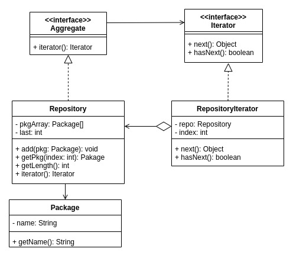

## 前書き：デザインパターンという認識がなかった

Iteratorデザインパターンは、配列／List／Mapなどのコレクション（要素の集合）を順次アクセスする際に、どのようなコレクションであっても同じAPIで操作可能にする設計方法です。

あまりにも一般的な手法であり、私はIteratorパターンがGoF（Gang of Four）デザインパターンという認識がありませんでした。オブジェクト指向を言語サポートしていないC言語ですら、Iteratorパターンの実装があるぐらいです。様々な場面で見かける機会が多いデザインパターンではないでしょうか。

本記事では、復習の意味を込めて、Iteratorパターンの実装例をJavaとRubyで紹介します。

## Iteratorパターンの概要 

本記事では、複数のPackageクラスを管理（集約）するRepositoryクラスに対して、Iteratorデザインパターンを適用します。下図は登場人物となるクラス、下表は各クラスの役割説明です。



| **クラス名** | **役割** |
| :-- | :-- |
| Aggregate | 集合（コレクション）を表すインターフェース |
| Iterator | 集合（コレクション）を操作するためのインターフェース |
| Package | パッケージを表すクラス |
| Repository | パッケージの格納先であるリポジトリを表すクラス |
| RepositoryIterator | リポジトリを操作するためのクラス |

最終的な実装のイメージとしては、リポジトリの中にあるパッケージを一つずつ、iteratorインターフェースで取り出していきます。その過程で重要になるのは、Iteratorインターフェースの持つhasNext()とnext()です。次の要素（= パッケージ）が存在するかをhasNext()で調べ、次の要素が存在する場合はnext()で要素を取得します。


## Iteratorパターンの実装例：Java

Javaの場合は、Iteratorインターフェースが[java.util.Iterator](https://docs.oracle.com/javase/jp/8/docs/api/java/util/Iterator.html)として提供されているため、Iteratorインターフェースを改めて定義する必要がありません。

実装例は、以下の通りです。Aggregate、RepositoryIterator、Repository、Packageの実装を順に示した後、それらを操作するAppクラスの実装を示します。

```
import java.util.Iterator;

/**
 * 集合体を表すインターフェース。
 * 集合体の数え上げやスキャンを行う場合は、本クラスのiterator()インターフェースを
 * 実装したクラスを使用する。
 */
public interface Aggregate {
    //! iteratorインターフェース
    public abstract Iterator iterator();
}

```

```
import java.util.Iterator;

/**
 * Repositoryクラス操作用のiteratorを実装したRepositoryIteratorクラス
 */
public class RepositoryIterator implements Iterator {
    //! Packageクラスを集約しているRepositoryクラス
    private Repository repo;
    //! iteratorでRepositoryを操作する際に用いるインデックス
    private int index;

    /**
     * RepositoryIteratorクラスのコンストラクタ
     * @param repo 操作対象のRepositoryクラス
     */
    public RepositoryIterator(Repository repo) {
        this.repo = repo;
        this.index = 0;
    }

    /**
     * 繰り返し処理中に、次の要素（Packageクラス）が存在するかどうかを返す。
     * @return true:次の要素が存在する場合、false:次の要素が存在しない場合
     */
    public boolean hasNext() {
        if(index < repo.getLength()) {
            return true;
        } else {
            return false;
        }
    }

    /**
     * Repositoryから次の要素（Packageクラス）を返す。
     */
    public Object next() {
        Package pkg = repo.getPkg(index);
        index++;
        return pkg;
    }
}

```

```
import java.util.Iterator;
import java.util.List;

/**
 * Packageクラスを格納（集約）するRepositoryクラス
 */
public class Repository implements Aggregate {
    //! リポジトリに格納するパッケージクラスのリスト
    private Package[] pkgs;
    //! パッケージクラスリストの末尾
    private int last;

    /**
     * Repositoryクラスのコンストラクタ
     * @param max_size リポジトリに格納できるパッケージ数の最大値
     */
    public Repository(int max_size) {
        this.pkgs = new Package[max_size];
        last = 0;
    }

    /**
     * リポジトリからパッケージを返す。
     * @param index パッケージクラスのリストインデックス
     */
    public Package getPkg(int index) {
        return pkgs[index];
    }

    /**
     * リポジトリにパッケージを追加する。
     * @param pkg 追加するパッケージ
     */
    public void add(Package pkg) {
        this.pkgs[last] =  pkg;
        last++;
    }

    /**
     * リポジトリに存在するパッケージ数を返す。
     */
    public int getLength() {
        return last;
    }

    /**
     * Repository操作用のiteratorを返す。
     */
    public Iterator iterator() {
        return new RepositoryIterator(this);
    }
}

```

```
/**
 * リポジトリ内に格納されるパッケージを表すPackageクラス
 */
public class Package {
    //! パッケージ名称
    private String name;

    /**
     * Packageクラスのコンストラクタ
     * @param name パッケージ名称
     */
    public Package(String name) {
        this.name = name;
    }

    /**
     * パッケージ名称を返す
     */
    public String getName() {
        return name;
    }
}

```

```
import java.util.Iterator;

/**
 * IteratorサンプルコードのMainクラス
 */
public class App {
    /**
     * リポジトリにパッケージを3個追加し、iteratorを用いてパッケージを取り出す。
     * @param args 未使用
     */
    public static void main(String[] args) {
        Repository repo = new Repository(3);

        repo.add(new Package("basename"));
        repo.add(new Package("gtk+3.0"));
        repo.add(new Package("build-essential"));

        Iterator it = repo.iterator();
        while(it.hasNext()) {
            Package pkg = (Package)it.next();
            System.out.println(pkg.getName());
        }
    }
}

```

以下、実行例です。リポジトリにパッケージを3個（パッケージ名称はbasename、gtk+3.0、build-essential）追加した後に、それらを取り出し、パッケージ名称を表示しています。

```
$ gradle run

> Task :run
basename
gtk+3.0
build-essentia

```

ちなみに、[java.util.Collectionインターフェース](https://docs.oracle.com/javase/jp/8/docs/api/java/util/Collection.html)にもiterator()が存在します。つまり、Collectionインターフェースを実装しているList／Set（Java標準API）では、上記のiteratorパターンを実装せずに使用できます。

また、Javaには[java.lang.Iterableインターフェース](https://docs.oracle.com/javase/jp/8/docs/api/java/lang/Iterable.html)も存在します。拡張For文を用いて集合を操作する際は、Iterableインターフェースを実装します。

## Iteratorパターンの実装例：Ruby

Rubyは、そもそもインターフェースの仕組みが言語仕様として存在しません。インターフェースと同じ役割を果たすクラスを用意すると、段々と形式張った言語（静的型付け言語）に見えてきます。

Rubyの生みの親である"まつもとゆきひろ氏"も、インターフェース（正確にはmodule）を使いすぎるとRubyっぽくなくなると発言しています。

<blockquote class="twitter-tweet" data-conversation="none"><p dir="ltr" lang="ja">Rubyでは、型やインターフェースはあなたの心の中にあるのです。<br><br>まあ、抽象クラスやインターフェースの代わりにmoduleが使えますが、使いすぎるとRubyっぽくなくなるので、ほどほどに。</p>— Yukihiro Matsumoto (@yukihiro_matz) <a href="https://twitter.com/yukihiro_matz/status/1066980158429552640?ref_src=twsrc%5Etfw">November 26, 2018</a></blockquote>

Rubyには、Iterator自身が次の要素への処理を決定する「内部Iterator」と呼ばれる仕組みが存在します。Javaのサンプルコードで示したように、hasNext()やnext()を呼び出す方法は、外部Iteratorと呼ばれています。

外部Iteratorと比較して内部Iteratorは実装の柔軟性に欠けるものの、どのようなコレクションであっても（配列、連想配列などのいずれであっても）、各コレクションを同じように操作する方法を提供してくれます。

内部Iteratorの具体例として、Rubyはeachメソッドでコレクションを操作できます。以下、実装例です。

```
#!/usr/bin/ruby
# リポジトリ内に格納されるパッケージを表すPackageクラス
class Package
  # Packageクラスのコンストラクタ
  # @param name パッケージ名称
  def initialize(name)
    @name = name
  end

  # パッケージ名称を返す
  def name
    @name
  end
end

class Repository
  # Repositoryクラスのコンストラクタ
  # @param max_size リポジトリに格納できるパッケージ数の最大値
  def initialize(max_size)
    @pkgs = Array.new(max_size, Package)
    @last = 0
  end

  def packages
    @pkgs
  end

  # リポジトリにパッケージを追加する。
  # @param pkg 追加するパッケージ
  def add(pkg)
    @pkgs[@last] = pkg
    @last += 1
  end
end

repo = Repository.new(3)
repo.add(Package.new('basename'))
repo.add(Package.new('gtk+3.0'))
repo.add(Package.new('build-essential'))

repo.packages.each { |i| p i.name }

```

上記のコードには、「抽象メソッド（Iterator、Aggregation）」および「Iteratorインターフェースの実装（RepositoryIterator）」が存在しません。

以下、実行例です。

```
$ ./ruby.rb 
"basename"
"gtk+3.0"
"build-essential"

```

Ruby側は全体的にシンプルな実装であり、Javaの厳格さと比べると、遥かにRubyが書きやすい言語ですね（実装規模が大きくなると、Javaが良いな、となりますが）

## 他のデザインパターンに関して

GoFデザインパターン（23種類）に関しては、以下の記事でまとめてあります。

https://debimate.jp/2021/01/07/%e3%80%90%e3%82%aa%e3%83%96%e3%82%b8%e3%82%a7%e3%82%af%e3%83%88%e6%8c%87%e5%90%91%e3%80%91%e5%85%a823%e7%a8%ae%e9%a1%9e%e3%81%aegof%e3%83%87%e3%82%b6%e3%82%a4%e3%83%b3%e3%83%91%e3%82%bf%e3%83%bc/
