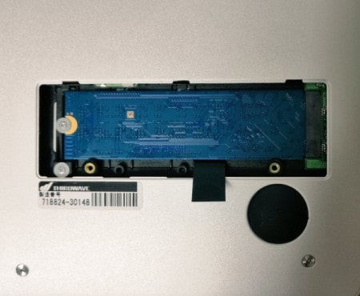

## 前書き：安価なノートPC VF-AD4を購入しました

私は以前から、物書きやコードリーディングの用途で、ノートPCの購入を検討していました。

で、2020年 賞与をいただいたタイミングで、[ドスパラ THIRDWAVE VF-AD4](https://www.dospara.co.jp/5shopping/detail_prime.php?mc=9479&sn=0)の購入に踏み切りました。お金をケチって整備品を購入したので、27,755円！安い！

<blockquote class="twitter-tweet">
ドスパラのVF-AD4、設定完了 見た目がシンプルで、余計なロゴ無し、薄い、SSD増設が楽と完璧。  Ubuntu派生のelementary OSは、見た目がMacで、設定項目が少ないのも似ている。  デスクトップ環境はGTKとVala言語で構築されているっぽい。Vala開発者集めるの、大変じゃないのかな。 自分なら別言語使う <a href="https://t.co/exQpe9xjL5">pic.twitter.com/exQpe9xjL5</a>
— Nao03 (@ARC_AED) <a href="https://twitter.com/ARC_AED/status/1340438267498356738?ref_src=twsrc%5Etfw">December 19, 2020</a></blockquote>

本記事では、「VF-AD4を購入（選択）した理由」、「elementary OSユーザの使用感」を中心に紹介したいと思います。

本記事で説明する内容

- VF-AD4の価格帯で購入を検討したPC
- elementary OSのインストール方法
- elementary OSへの所感

## VF-AD4の価格帯で購入を検討したPC

前提情報ですが、私がノートPCを購入するにあたって、押さえておきたかったポイントは以下の通りです。

押さえておきたかったポイント

- 技適が通っている事（この問題がなければ[PINEBOOK Pro](https://www.pine64.org/pinebook-pro/)を購入予定でした）
- elementary OS（もしくはLinux）がインストールできる事
- 3〜5万の価格帯
- SSD増設可能
- それなりの薄さ、重さ

正直な話、ノートPCの使用頻度が高いのであれば[Apple M1を搭載したMacBook Air](https://www.apple.com/jp/macbook-air/)が最有力候補でした。が、2019年にデスクトップ環境を一新しており、ノートPCを頻繁に使わなさそうだったので、Macを除外しました。

このような事情を踏まえて、以下のPCが候補に挙がりました（入出力ポートの情報は省略）

| **PC名** | **[THIRDWAVE VF-AD4](https://www.dospara.co.jp/5shopping/detail_prime.php?tg=3&tc=275&ft=&mc=9479&sn=0&st=1&vr=10&tb=2#tabContents)** | **[TECLAST F7Plus](https://amzn.to/383EQeK)** | **[ThinkPad E595](https://amzn.to/3pLFkfz)** |
| :-- | :-- | :-- | :-- |
| **ディスプレイ** | 14.0インチ（1920×1080） | 14インチ（1920×1080） |  15.6インチ（1920×1080） |
| **OS** | Windows 10 Pro 64 | Windows 10 Home | Windows 10 Home |
| **CPU** | Celeron N4000 | Celeron N4100 | Ryzen 3 3200U |
| **RAM** | 4GB | 8GB | 4GB |
| **SSD/HHD** | 64GB (eMMC、M.2増設可) | 256GB (SSD、M.2換装可) | 128GB (SSD) |
| **カードリーダ** | microSD | microSD | microSD |
| **Bluetooth** | Bluetooth 5.0 | Bluetooth 4.0 | Bluetooth 5.0 |
| **無線LAN** | 802.11 ac/a/b/g/n | 802.11 ac | 802.11ac/a/b/g/n |
| **キーボード** | JIS | US | JIS |
| **重量** | 1.28kg | 1.5kg | 2.1kg |
| **金額** | 29,980円(+税と送料) | 39,900円 | 57,600円 |

上表の中では、性能だけを見ればThinkPadが最有力でした。残念ながら、「販売終了」かつ「この金額ならMacを買った方が幸せになれそう」と判断し、購入を見送りました。

TECLAST F7Plusは聞いたことのないシリーズでしたが、コスパは良さそうでした。が、キーボード配列がUSであり、私はUS配列を使った経験がありません。日本語キーボード配列化シールが付いてきますが、そんな物をペタペタと貼ったら見栄え悪そうなので、購入断念。

最終的に、VF-AD4を消去法で選択しました。しかし、低性能CPU以外は不満がなく、「メーカロゴが存在しない筐体」や「USB Type Cで給電できる点」などは好印象でした。

強いて不満を挙げれば、M.2 SSDの取り付け向きでしょうか。ノートPCでは、SSD基板面を裏にして取り付けるのが普通なのでしょうか？ 妻に指摘されるまで、表裏の間違いに気づけませんでした。

## elementary OSのインストール方法

[elementary OS](https://elementary.io/ja/)は、完成度の高いUbuntuから派生したディストリビューションなので、インストーラが親切な作りになっています。そのため、インストール画面まで到達すれば、インストールで困る事はないでしょう。

なお、elementary OS公式サイトでOS imageを配布していますが、無料／有償のどちらかを選択してからダウンロードする仕組みです（以下、参考画像）

ソフト開発費を回収しようとする姿勢には、大いに賛同します。残念ながら、ユーザーの約99.875%は無料でダウンロードしているようで、オープンソースで健全に資金を集める難しさを感じてしまいます。

肝心のインストール方法ですが、以下の手順でelementary OSを導入できます。

1. [elementary OS公式サイト](https://elementary.io/ja/)でOS imageをダウンロード
2. [balenaEtcher](https://www.balena.io/etcher)などを用いて、USBメモリにelementary OS imageを書き込み
3. USBメモリをVF-AD4に指し、VF-AD4を起動。BIOS画面を出すため起動時にDelteキー連打
4. BIOSの\[Securityタブ\] / \[Secure Boot\] = Disableに変更
5. BIOSの\[Save & Exitタブ\] / \[Boot Override\] = USBメモリに変更
6. BIOS設定を保存し、BIOSメニュー終了
7. elementary OSインストーラの設問に答えながら、インストール（[他サイトによる詳細な手順](https://kb.seeck.jp/archives/11669)）

上記手順4.を実施しないと、「Verification failed: (0x1A) Security Violation 」と表示されて、elementary OSインストーラが起動できません。

## elementary OSへの所感

elementary OSは、Ubuntu派生であるため、堅実な作りの印象。

「基本の、初歩の（= elementary）」と冠している通り、Linux初心者でもとっつきやすいGUIです。Linuxデスクトップ環境にありがちな使いづらさを改善するため、

- UIの簡素化による全体的な美観の向上
- C／Valaで開発したデスクトップアプリによってソフトウェア依存関係を減らす事
- ターミナルへのアクセスを減らす事

を目的として、設計／開発しているようです。

Macに近いGUIを提供しつつ、Linuxにありがちなカスタマイズ要素を削ぎ落とし、Linux初心者が操作時に迷わないように作られています。

[次バージョンでは、タッチパッドのマルチタッチジェスチャーに対応](https://blog.elementary.io/our-2020-in-review/)するようなので、ますます使い勝手はMacに近づきそうです。

ソフトウェアは、基本的にはUbuntuのaptパッケージマネージャで取得できるものは、全て取得できます。elementary OS 5.x系はUbuntu bionic（18.04 LTS）から派生しているようで、elementary OSのパッケージがUbuntuのパッケージより約2年程度、古そうです。

パッケージインストールを検証した所、[Visual Studio Code](https://code.visualstudio.com/)、[Google Chrome](https://www.google.com/intl/ja_jp/chrome/)、[Joplin](https://joplinapp.org/)などの開発ツールを使えましたし、C／C++、各種スクリプト言語、Java、Goなどのプログラミング言語も問題なく使えました。

elementary OSのシステム要件には、「Intel Core i3 またはそれと同等のデュアルコア 64bit プロセッサ」と書かれていますが、Celeron N4000で動作しました。若干、Twitterなどで画像読み込み時にカクつきますが、タイピング中はキビキビ動作します。

これからのリリースで、致命的な不具合（例：GUIクラッシュなど）が発生しない限り、「elementary OSはユーザが増えていきそうなディストリビューション」という印象を受けました。

## 余談：Valaとは一体……？

elementary OSのデスクトップアプリ開発で用いられるVala言語。

馴染みのないプログラミング言語だったので調べたら、

- C#ライクな文法
- valacコンパイラがvala言語ソースからC言語ソースを生成
- GTK（GUIツールキット）開発で採用されやすい

と、「無茶しやがって……」なプログラミング言語の印象。

Win／Macと違って、デスクトップアプリ作成にGTKを選択するしかないLinux開発者が産み出してしまった印象が強く、Vala言語が普及する気配がありません。

<blockquote class="twitter-tweet">
GTKアプリ開発を容易にする"Vala言語"は、日本人の開発者が殆ど居なさそう。Qiitaには記事4本、Zennには記事がない。  Valaを使う動機は「高速なGTKアプリをC/C++以外でコーディングしたい」ぐらいなので、 ・Pythonが使いたい（速度キニシナイ） ・GTKは嫌 ・Webで良くね？ と思う人は、使わない筈。 <a href="https://t.co/fQlKtzgNvZ">pic.twitter.com/fQlKtzgNvZ</a>
— Nao03 (@ARC_AED) <a href="https://twitter.com/ARC_AED/status/1342657344711184385?ref_src=twsrc%5Etfw">December 26, 2020</a></blockquote>

GTKアプリ開発で速度面を考慮すると、C／C++／Rustしか選択肢になく、

- Cでオブジェクト指向ライクな実装してしまうと実装量が増加
- C++は、言語仕様がカオス
- Rustはコンパイラとの戦いが辛い（GTKとのバインディングも微妙）

などの背景があり、Vala言語を採用するしか無かったのでしょう。

Vala言語は、日本語の情報量の少なさも致命的で、新規参入が難しい印象です（私も試しましたが、書きやすい一方で、サンプルコードが少ない）
