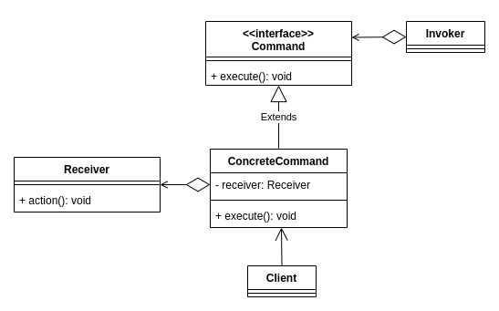
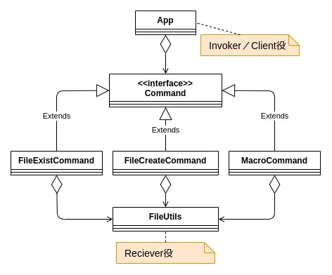

### 前書き：Commandパターンとは 

Commandパターンは、一つの命令（操作）に対応するメソッドを作成するのではなく、命令に対応するクラス（コマンド）を作成する方法です。

命令をクラス化する事によって得られるメリットは、以下の3点があります

Commandパターンのメリット

- 命令の追加が容易（拡張性が高い）
- 複数のコマンドを組み合わせて新しいコマンドを作成可能（再利用性が高い）
- 履歴保存が容易（コマンド単位で保存可能）

Commandパターンは、イベント駆動型アプリ（例：GUIアプリ）で使用される機会が多いです。例えば、マウス押下やドラッグ＆ドロップなどのイベントを発生順にキューイングし、各イベントに対応したコマンドでキューを順番に処理していきます。

本記事では、「Commandパターンのクラス図／シーケンス図」を示した後に、「Javaによる実装例」を紹介します。

---


###  Commandパターンのクラス図



| **クラス名** | **説明** |
| :-- | :-- |
| Invoker | Commandを起動するクラス。後述のClientクラスに統合される場合もあります。 |
| Client | ConcreteCommandクラスを生成します。 |
| Command | 命令のインターフェース |
| ConcreteCommand | Receiverクラスのメソッドを用いて、Commandインターフェースのメソッドを実装します。 |
| Receiver | 実処理を担当するクラス。 |

---


###  Commandパターンのシーケンス図


---


### Commandパターンの実装例

Commandパターンの例として、

- ファイルの存在を確認するコマンド
- ファイルを作成するコマンド
- 複数のコマンドを連続実行するマクロコマンド

を実装し、それらの実行結果を後述します。

紹介するサンプルコードは、クラス図で表すと以下の構成になります。



複数のコマンドを処理するMacroCommandクラスは、Commandインターフェースを実装したクラスをリスト形式で保持し、リストの内容を順次実行します。今回の例では、ファイル作成コマンド→ファイル存在確認コマンドの順で処理が実行されるように、実装します。

**実装例** 

```
/**
 * CommandパターンのCommandインターフェース
 */
public interface Command {
    // コマンドを実行する
    public abstract boolean execute();
}
```

```
import java.nio.file.Path;
import java.nio.file.Paths;

/**
 * ファイル作成を行うコマンドクラス。
 */
public class FileCreateCommand implements Command {
    // 作成対象のファイルパス
    private Path path;

    /**
     * コンストラクタ
     * @param path 作成したいファイルのPATH
     */
    FileCreateCommand(String path) {
        this.path = Paths.get(path);
    }

    /**
     * ファイルを作成する。
     */
    @Override
    public boolean execute() {
        return FileUtils.Create(path);
    }
}
```

```
import java.nio.file.Path;
import java.nio.file.Paths;

/**
 * ファイルの存在確認を行うコマンドクラス
 */
public class FileExistCheckCommand implements Command {

    // チェック対象のファイルパス
    private Path path;

    /**
     * コンストラクタ
     * @param path 存在確認をしたいファイルのPATH
     */
    FileExistCheckCommand(String path) {
        this.path = Paths.get(path);
    }

    /**
     * ファイルの存在確認を行う。
     * @return true: ファイルが存在する、false: ファイルが存在しない
     */
    @Override
    public boolean execute() {
        boolean result = FileUtils.Exist(path);
        if (result) {
            System.out.println(path + "が存在します");
        } else {
            System.out.println(path + "が存在しません");
        }
        return result;
    }
}
```

```
import java.util.ArrayList;
import java.util.Iterator;
import java.util.List;

/**
 * 複数のコマンドを組み合わせて処理を行うクラス
 */
public class MacroCommand implements Command {
    // コマンドを保持するリスト
    private List cmdList = new ArrayList<>();

    /**
     * 複数のコマンドを実行する。
     */
    @Override
    public boolean execute() {
        boolean result = true;
        Iterator it = cmdList.iterator();

        while (it.hasNext()) {
            Command command = it.next();
            result = command.execute();
            if (result == false) {
                System.err.println("コマンドの連続実行に失敗しました");
                break;
            }
        }
        return result;
    }

    /**
     * Listにコマンドを追加する。
     * @param cmd 追加したいコマンド
     */
    public void addCmd(Command cmd) {
        cmdList.add(cmd);
    }
}

```

```
import java.nio.file.Path;
import java.io.IOException;
import java.nio.file.Files;

/**
 * ファイル操作のユーティリティクラス
 */
public class FileUtils {
    /**
     * ファイルが存在するかどうかを返す。
     *
     * @param path ファイルパス
     * @return true: ファイルが存在する、false: ファイルが存在しない
     */
    public static boolean Exist(Path path) {
        return Files.exists(path);
    }

    /**
     * ファイルを作成する。
     *
     * @param path 作成したファイルのPATH
     * @return true: ファイル作成に成功、false: ファイル作成に失敗
     */
    public static boolean Create(Path path) {
        try {
            Files.createFile(path);
            System.out.println(path + "を作成しました。");
        } catch (IOException e) {
            System.err.println(path + "の作成に失敗しました。");
            e.printStackTrace();
            return false;
        }
        return true;
    }
}

```

```
/**
 * CommandパターンサンプルコードのMainクラス
 */
public class App {
    public static void main(String[] args) {
        String filePath = "./test.txt";

        Command fileExistCheck = new FileExistCheckCommand(filePath);
        System.out.println("[Info] 存在しないファイルのチェックを行う。");
        fileExistCheck.execute();
        System.out.println("");

        MacroCommand macroCmd = new MacroCommand();
        Command fileCreate = new FileCreateCommand(filePath);
        Command fileExist = new FileExistCheckCommand(filePath);

        System.out.println("[Info] ファイルを作成してから、ファイルの存在確認を行う。");
        macroCmd.addCmd(fileCreate);
        macroCmd.addCmd(fileExist);
        macroCmd.execute();
    }
}

```

**実行例**

今回の実装例では、存在しないファイル（text.txt）の存在確認を行った後、text.txtを作成し、再度text.txtの存在確認を行います。

```
$ gradle run
[Info] 存在しないファイルのチェックを行う。
./test.txtが存在しません

[Info] ファイルを作成してから、ファイルの存在確認を行う。
./test.txtを作成しました。
./test.txtが存在します

```

なお、最近は関数型言語で用いられるラムダ式（JavaもSE 8からサポート済み）を用いれば、Commandデザインパターンを用いずに同様の内容をよりシンプルに実装できます。

---


### 他のデザインパターンに関して

GoFデザインパターン（23種類）に関しては、以下の記事でまとめてあります。

- [【オブジェクト指向】全23種類のGoFデザインパターンに関する説明と参考書籍](https://debimate.jp/post/2021-01-07-%E3%82%AA%E3%83%96%E3%82%B8%E3%82%A7%E3%82%AF%E3%83%88%E6%8C%87%E5%90%91%E5%85%A823%E7%A8%AE%E9%A1%9E%E3%81%AEgof%E3%83%87%E3%82%B6%E3%82%A4%E3%83%B3%E3%83%91%E3%82%BF%E3%83%BC/)
