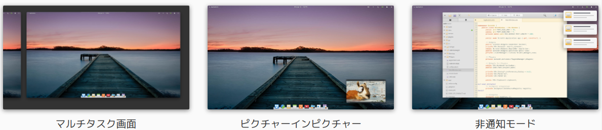
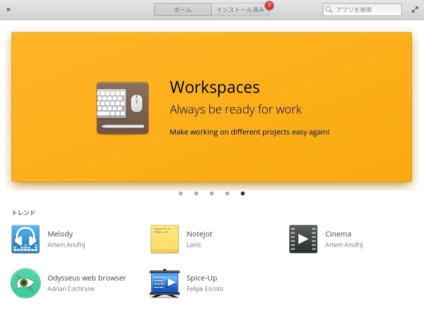
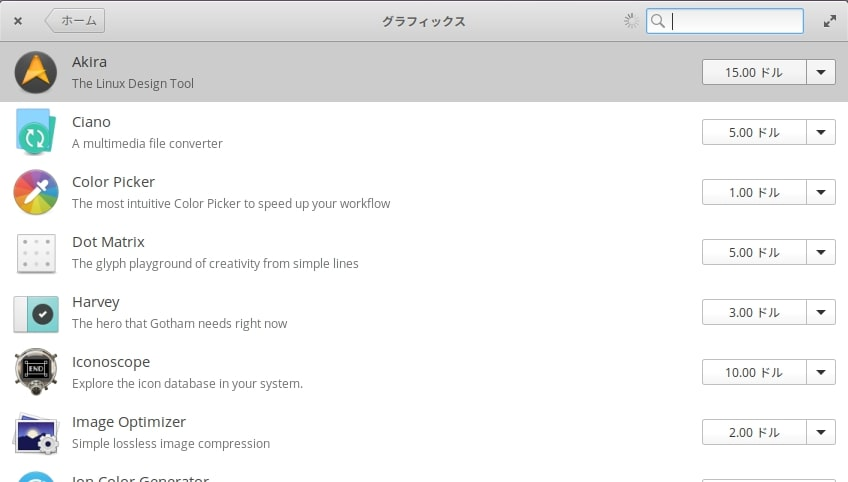
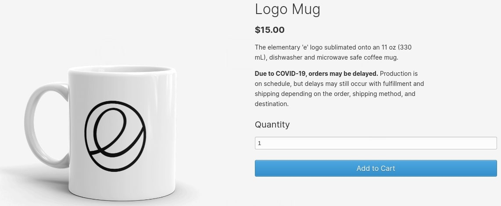
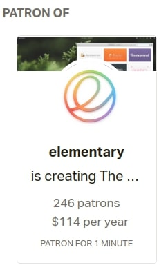

###  前書き：日頃からお世話になっているOSSへの貢献

_**2021年は、elementary OSに金銭面（超少額）サポートします！**_

私はプロプラエタリソフトよりも、ソースコードが公開されているOSS（Open Source Software）を好んで使用します。OSSは技術的な仕様がコードベースで確認でき、プロプラエタリと違って企業の方針転換に振り回される事が少ないからです。

しかし、私はOSSに対して貢献した経験がなく、フリーライド（タダ乗り）している感覚がありました。一度、Debianメンテナ（debパッケージメンテナ）を目指した事がありましたが、

- 目指した時期は、仕事が多忙（年間残業600時間超え）
- 初心者メンテナ向けのパッケージに愛着がなく、低モチベ
- 貢献の全体像（必要な工数）が読み取れず、時間を割きづらかった

と、貢献が上手く出来ませんでした（言い訳）。

今では、「自身のやりたい事（ブログ運営やソフト開発）」や「私生活（家庭へのコミット）」を考えると、今後もDebianメンテナを目指すのは難しいのではないかと感じています。

では、開発者としてのサポート以外に、どのようにOSSへ貢献する方法があるかと考え直した時、[elementary OSのサイト](https://elementary.io/ja/get-involved)で見かけた金銭的なサポートがパッと思いつきました。

### elementary OSは収益面を意識したOSS

elementary OSは、Ubuntu派生（UbuntuはDebian派生）のLinuxディストリビューションであり、「安定かつ新し目のパッケージ」および「Macを意識したLook & Feel」を提供しており、[私もノートPCにインストールして愛用させてもらっています](https://debimate.jp/post/2021-01-02-%E3%83%89%E3%82%B9%E3%83%91%E3%83%A9%E3%81%AEthirdwave-vf-ad4%E3%81%ABelementary-osubuntu%E6%B4%BE%E7%94%9F%E3%82%92%E5%85%A5%E3%82%8C%E3%81%9F%E6%84%9F%E6%83%B3/)。

elementary OSの挑戦的な部分は、OSのダウンロード時に、"Pay What You Want"方式（購入者の望む金額 = 0円以上で支払う方式）を採用しています。

一昔前は「基本ソフトであるOSにお金を取るMicrosoftは守銭奴」、「Linuxは無料。サイコー」というような主張が見かけられましたが、その時期と比べるとLinux関係のソフト開発者の意識が変わってきた感じがします。

elementary OSは、アプリケーションを販売する場としてAppCenterを用意しています。AppCenterは、WindowのMicrosoft Store、MacのiTunes、UbuntuのUbntuソフトと同じようなアプリであり、こちらも"Pay What You Want"方式を採用しています。

LinuxのOSやアプリが有料であるパターン（正確には無料／有料のどちらでもインストール可能なパターン）は、そこそこ珍しいのではないでしょうか。

"Pay What You Want"方式を採用した背景には、従来のLinuxが大事にしてきたFree（自由）の重要性を踏まえつつ、ボランティア主体でプロジェクトを推進し続けられない現実と真剣に向き合った結果があるのではないかなと、推測しています。

私は、ソフト開発者は正当な対価を得られるべきだと考えているため、elementary OSの姿勢には賛同しています。

### elementary OSへの金銭的な貢献とは

elementary OSに対しては、以下の手段で金銭サポートができるようです。スポンサーになれば、elementary OSプロジェクトから開発中ソフトにアクセスする権利やelementary OSグッズを貰えるようです。

| **方法** | **支払い時期** | **金額** | **内容** |
| --- | --- | --- | --- |
| [GitHub Sponsors](https://github.com/sponsors/elementary) | 月ごと | 2ドル, 10ドル, 20ドル, 50ドル | 支払い金額に応じて、GitHubバッジやアーリーアクセスの権利が付与されます。手数料がない事がメリットの一つ。 |
| [Patreon](https://www.patreon.com/elementary) | 月ごと | 3ドル、10ドル、250ドル | 支払い金額に応じて、ニュースやステッカー、マグカップが提供されます。提供される品物の種類が多いです。 |
| [PayPal](https://www.paypal.com/donate?token=fMRN6F-6IndDQkhbtoKjMz0FcQhXDXqx0-kgcXi3R3BUxPnxbY2nUCTN4QpHh8JL8yPDbth7VRg0wmdt) | 一度 or 月ごと | 任意 | 支払うだけ。 |
| [Liberapay](https://liberapay.com/elementary/)  | 1週間 | 任意 | 支払うだけ。 |
| [Coinbase](https://commerce.coinbase.com/charges/7GJTJRT2) | 一度 | 任意 | 支払うだけ |
| [グッズを買う](https://elementary.io/ja/store/) | 一度 | 15〜26ドル | マグカップやTシャツなどのグッズが提供されます。 |

例えば、GitHub Sponserは2021年1月現在で582人います。意外と多くの方が金銭サポートしていますね。

### グッズ + Patreonを選択

私は形に残るものが欲しかったので、マグカップを選びました！

ただし、本記事の執筆段階では[購入画面から次の画面に進めないバグ（住所情報を入力後、何も表示されずに購入画面に戻るバグ）](https://github.com/elementary/website/issues/2606)があるため、elementary OSプロジェクトの修正待ちです。どうせコロナで出荷が遅れるようなので、気長に待ちます。

グッズの購入はあまりプロジェクトの金銭的なサポートにはならないと考え、Patreonで月10ドルの支援も行いました！

1年分を一回払いすると、5% OFFになるようです。こちらもグッズを提供していただけるので、届くのが楽しみです。

### 後書き

「Vtuberへの投げ銭」や「ソシャゲへの課金」と同じように、ソフト開発者にマネーが流れ込む未来が待っていると、ソフト開発者としては嬉しいですよね（無料に慣れすぎた日本人が、その域に達せられるかは疑問ですが）。

あと、私はソフト開発者の端くれなので、金銭的なサポートだけでなく、可能な限りソフト開発面でもサポートできるように何とか都合を付けたいです。
