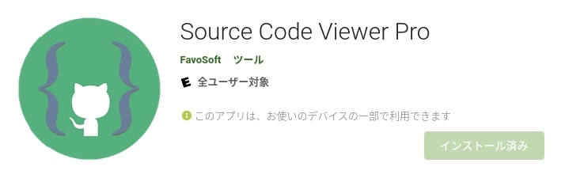
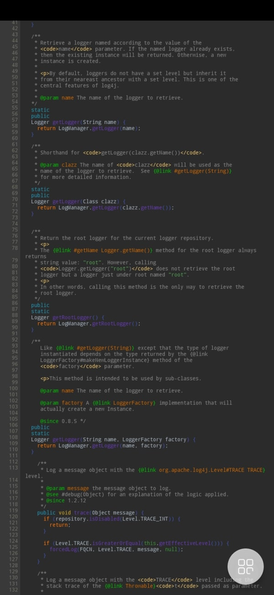
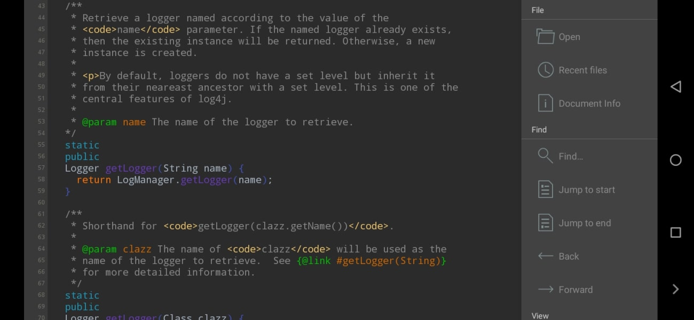
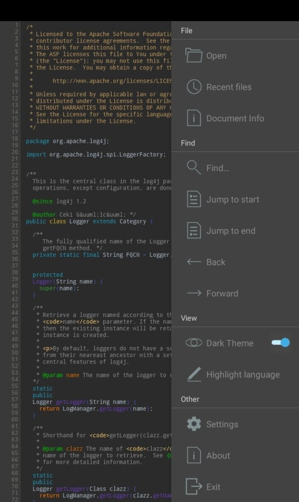
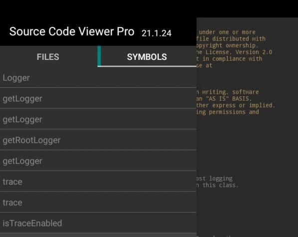

## 前書き：UserLAndは遅かった

約2年前の2019年、私は[AndroidスマホでコードリーディングするにはUserLAndが最適](https://debimate.jp/2019/03/16/android%e3%81%ablinux%e7%92%b0%e5%a2%83%e3%82%92%e6%a7%8b%e7%af%89%e3%81%99%e3%82%8buserland%e3%81%8c%e3%82%bd%e3%83%bc%e3%82%b9%e3%83%aa%e3%83%bc%e3%83%87%e3%82%a3%e3%83%b3%e3%82%b0%e7%92%b0/)だと結論づけていました。

しかし、使い込んでいく内にUserLAnd特有の**「ファイル操作が遅い点」**に我慢できなくなりました。

システムコール単位でフック処理を入れているUserLAndは、ミドルレンジスマホがCeleron PCと同等に感じられるぐらい遅いです。特に、パッケージマネージャによるインストール処理などの待ち時間は長く、下手すると数十分から数時間待たされます。

UserLAndは「Android環境でのLinux」という点でまだまだ魅力的な存在ですが、コードを読むだけであればAndroidアプリを選択した方が良いのではないかと感じ始めました。

そこで、本記事ではAndroidでコードリーディングするために[「Source Code Viewer Pro（有料）」](https://play.google.com/store/apps/details?id=com.sourceviewerpro&hl=ja&gl=US)を試した感想を記載します。

## Source Code Viewer Proの特徴

Source Code Viewer Proの良い点／悪い点は、以下の通りです。作り込まれたアプリであるのは間違いないですが、痒いところに手が届いていない印象を受けました。

良い点

- 無料版あり
- 多言語対応（C/C++、Go、Java、Python、Ruby、Rust、etc.）
- 2021年現在もアプリの定期的なアップデートあり
- 基本的なジェスチャーが存在（例：ピンチイン／ピンチアウトで文字サイズ変更）
- シンタックスハイライト、検索機能、Functionリスト（有料版のみ）が存在

悪い点

- 有料版（720円）で追加される機能が少ない（Functionリストのみ）
- Androidにリーディング対象のコードを用意するのがやや手間
- **「定義元へジャンプ」、「変数や関数の参照一覧」がない**
- ソースコードをプロジェクト単位でまとめられない

正直な話、定義元へジャンプがない点は許容し難いデメリットです。2年前の私も定義元へのジャンプがない事を嫌ってUserLAndを選択したようです。

> Androidでソースコードを読む場合、使い慣れないCode Viewerを使用し、タグジャンプもできない等、不満が多々ありました。これらの不満は、UserLAndによって「普段の開発環境(Debian)と同じ状態をAndroidに構築できた」ため、解消されました。
> 
> 2019年の管理人Naoの発言

とは言っても、他のAndroidアプリも「定義元へジャンプ」を提供していないため、その他の機能や開発状況が良いSource Code Viewer Proを選ぶしかありませんでした。消去法ですね。

## ソースコードの表示（外観）

行の折り返しが少ない状態でソースコードを表示すると、以下のような状態となります。フォントサイズがかなり小さいので、目が悪い人は縦持ちでコードを読むのは難しいと思います。揺れる電車の中では、私は殆ど読めませんでした。

横持ち状態であれば、それなりのフォントサイズなので文字が読みやすいです。行の折り返しが発生する事は少ないですが、一画面に表示される行数は20行程度になります。

ちなみに、上記のスクリーンショットは[OUKITEL WP8 Pro（6.3インチ）](https://amzn.to/3biVDLa)で取得しました。つまり、前述の感想は、かなり大型のスマホでの使用感です。小型のスマホでSource Code Viewer Proを使った場合では、読みづらさが増す筈です。

大型スマホも横持ちしづらい欠点があるので、スマホリングを付けた方が便利です。

## 基本機能一覧

基本的な機能は、画面の右から左へスワイプする事によって表示されます。コードリーディングの際に使う機能として、以下が提供されています。

- ファイルを開く
- 最近開いたファイル一覧を表示する
- 表示しているファイルのシステム情報を表示する
- キーワード検索
- ファイル先頭／終端へ移動
- 一つ前／一つ後へ移動
- ダークテーマのON/OFF
- ハイライトの設定

## 最近開いたファイル一覧／関数一覧

最近開いたファイル一覧（FILES）／関数一覧（SYMBOLS）は、画面の左から右へスワイプする事によって表示されます。ファイルや関数をタップすれば、選択したファイル／関数の位置にジャンプします。

関数一覧（SYMBOLS）は、有料版にのみ存在する機能です。

表示しているファイル内の関数を一通り眺める場合には便利です。ファイル内に登場する全ての関数（他ファイルで定義されている関数）が表示される訳ではありません。

##  後書き：電車の移動時間(20分)でコード読めない

そもそものお話です。

私がAndroidスマホでコードを読み始めたキッカケは、電車の移動時間でTwitterを読むよりもコードを読んだ方がタメになるかなと考えたからです。

しかしながら、PCよりも貧弱な環境（スマホ）でコードを読むのは予想以上に難しく、短い移動時間（20分）の間で脳がコードリーディングモードに切り替わりません。不完全燃焼の状態で、会社に到着してしまいます。

もう少し高機能なAndroidアプリ（Code Viewer）があると便利ですが、恐らく需要ないのでしょうね。
