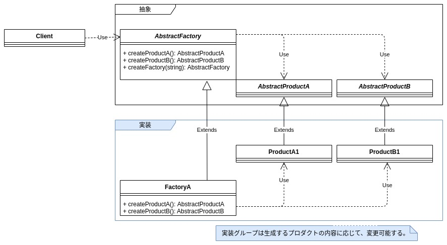
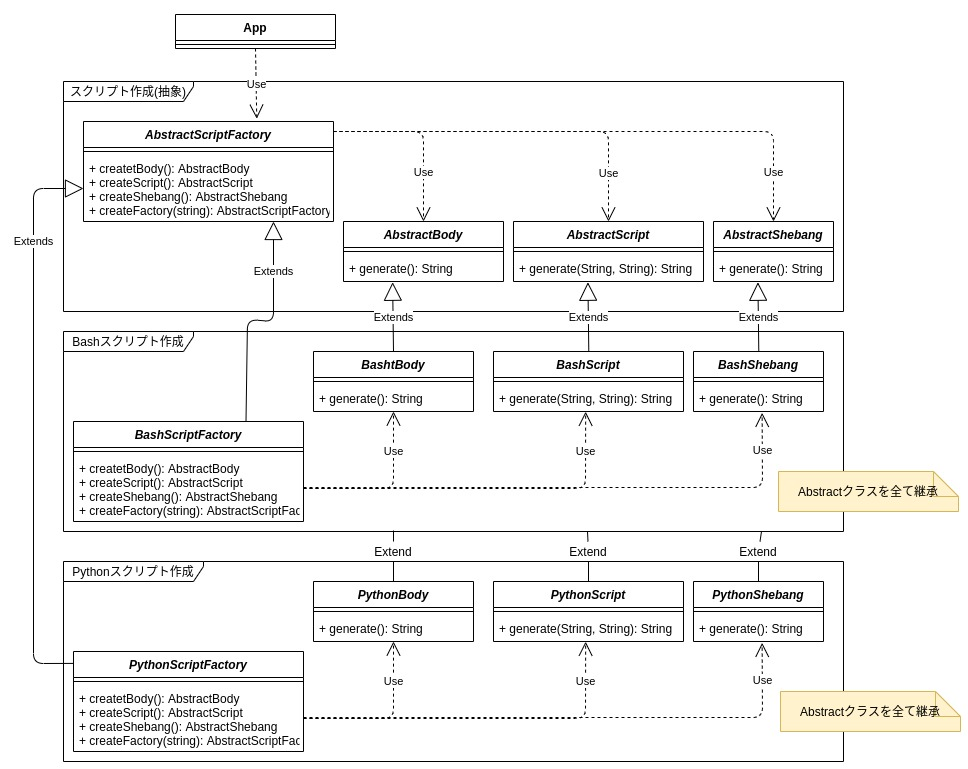

## 前書き：Abstract Factoryパターンとは

Abstract Factoryパターンは、関連するインスタンスの生成APIを抽象化クラスに集約し（= 生成に関するインターフェースを定義し）、生成処理は抽象化クラスを継承（実装）したクラスに任せる設計手法です。

Abstract Factoryパターンを利用するメリットは、以下の3点です。

Abstract Factoryパターンのメリット

- 複雑な生成処理をパターン化可能
- コンポジットクラス内に存在するインスタンスグループを変更／追加しやすい
- あるインスタンスグループを変更／追加しても、他のインスタンスグループに影響がない

本記事では、Abstract Factoryのクラス図、実装例を示します。

## Abstract Factoryパターンのクラス図



| **クラス名** | **説明** |
| --- | --- |
| Client | AbstractFactoryを用いて、各インスタンスを生成するクラス |
| AbstractFactory | 各部品（インスタンス）の生成方法を定義した抽象クラス |
| AbstractProductA | 部品（抽象） |
| AbstractProductB | 部品（抽象） |
| FactoryA | 各部品（インスタンス）の生成方法を定義したクラス |
| ProductA | 部品 |
| ProductB | 部品 |

## Abstract Factoryパターンの実装例

Abstract Factoryの実装例として、Bash／Pythonのスクリプトファイルを作成する処理を実装します。工場が生成する部品は、

- シェバン（スクリプト一行目の文字列）を生成するインスタンス
- スクリプトの実処理（標準出力を行う命令文）を生成するインスタンス
- スクリプトファイルを作成するインスタンス

の3点です。

紹介するサンプルコードは、クラス図で表すと以下の構成になります。



## 実装例：抽象クラス

```
package AbstractFactory;

import java.util.Objects;

/** 抽象ファクトリークラス */
public abstract class AbstractScriptFactory {
    /**
     * クラス名に応じたファクトリーを返す。
     * @param className クラス名
     * @return クラス名に応じたファクトリーインスタンス。異常発生時はnullを返す。
     */
    public static AbstractScriptFactory createFactory(String className) {
        AbstractScriptFactory factory = null;
        try {
            factory = (AbstractScriptFactory)Class.forName(className).getDeclaredConstructor().newInstance();
        } catch (ClassNotFoundException e) {
            System.out.printf("Class name is not found");
            e.printStackTrace();
        } catch (Exception e) { /** 種類が多いので、例外を丸めて処理する */
            e.printStackTrace();
        }
        return factory;
    }

    /** スクリプトのシェバンを生成する抽象クラスインスタンスを取得する */
    public abstract AbstractShebang createShebang();
    /** スクリプトのメイン処理を生成するクラスインスタンスを取得する */
    public abstract AbstractBody createBody();
    /** スクリプトを生成するクラスインスタンスを取得する */
    public abstract AbstractScript createScript();
}
```

```
package AbstractFactory;

/** スクリプトBody抽象クラス */
public abstract class AbstractBody {
    /** スクリプトBodyの文字列を生成する抽象メソッド */
    public abstract String generate();
}
```

```
package AbstractFactory;

/** 抽象スクリプトクラス */
public abstract class AbstractScript {
    /** スクリプトを生成する */
    public abstract void generate(String shebang, String body);
}

```

```
package AbstractFactory;

/** 抽象シェバンクラス */
public abstract class AbstractShebang {
    /** シェバン文字列を生成する抽象メソッド */
    public abstract String generate();
}

```

## 実装例：Bashスクリプト作成クラス群

```
package AbstractFactory;

/** Bashスクリプトファクトリークラス */
public class BashFactory extends AbstractScriptFactory {
    /**
     * Bashスクリプトのシェバンを生成するクラスインスタンスを取得する
     * @return Bashスクリプトのシェバンを生成するクラスインスタンス
     */
    public AbstractShebang createShebang() {
        return new BashShebang();
    }

    /**
     * Bashスクリプトのメイン処理を生成するクラスインスタンスを返す。
     * @return Bashスクリプトのシェバンを生成するクラスインスタンス
     */
    public AbstractBody createBody(){
        return new BashBody();
    }

    /**
     * Bashスクリプトファイルを作成するクラスインスタンスを取得する
     * @return Bashスクリプトファイルを作成するクラスインスタンス
     */
    public AbstractScript createScript() {
        return new BashScript();
    }
}

```

```
package AbstractFactory;

/** Bashスクリプト用のBodyクラス */
public  class BashBody extends AbstractBody {
    /**
     * BashスクリプトのBody文字列を返す。
     * Bodyとは、スクリプトの実処理を指し、今回の実処理部はechoのみ行う。
     * @return スクリプトの実処理（文字列）
     */
    public String generate() {
        return "echo BashScript";
    }
}

```

```
package AbstractFactory;

import java.io.FileWriter;
import java.io.IOException;

/** Bashスクリプトを生成するクラス */
public class BashScript extends AbstractScript {
    /**
     * Bashスクリプトを生成する。
     * @param shebang シェバンを表す文字列
     * @param body スクリプト実処理部
     */
    public void generate(String shebang, String body) {
        try {
            FileWriter fileWriter = new FileWriter("./bash.sh");
            fileWriter.write(shebang);
            fileWriter.write(System.lineSeparator());
            fileWriter.write(body);
            fileWriter.close();
        } catch (IOException e) {
            e.printStackTrace();
        }
    }
}

```

```
package AbstractFactory;

/** Bash用のシェバンクラス */
public class BashShebang extends AbstractShebang {
    /**
     * Bashスクリプト用のシェバン文字列を返す。
     * @return Bashスクリプト用のシェバン文字列
     */
    public String generate() {
        return "#/bin/bash";
    }
}

```

## 実装例：Pythonスクリプト作成クラス群

```
package AbstractFactory;

/** Pythonスクリプトファクトリークラス */
public class PythonFactory extends AbstractScriptFactory {
    /**
     * Pythonスクリプトのシェバンを生成するクラスインスタンスを取得する
     * @return Pythonスクリプトのシェバンを生成するクラスインスタンス
     */
    public AbstractShebang createShebang() {
        return new PythonShebang();
    }

    /**
     * Pythonスクリプトのメイン処理を生成するクラスインスタンスを返す。
     * @return Pythonスクリプトのシェバンを生成するクラスインスタンス
     */
    public AbstractBody createBody(){
        return new PythonBody();
    }

    /**
     * Pythonスクリプト本体を生成するクラスのインスタンスを取得する
     * @return
     */
    public AbstractScript createScript() {
        return new PythonScript();
    }
}

```

```
package AbstractFactory;

/** Pythonスクリプト用のBodyクラス */
public  class PythonBody extends AbstractBody {
    /**
     * PythonスクリプトのBody文字列を返す。
     * Bodyとは、スクリプトの実処理を指し、今回の実処理部はechoのみ行う。
     * @return スクリプトの実処理（文字列）
     */
    public String generate() {
        return "print(\"Python Script\")";
    }
}

```

```
package AbstractFactory;

import java.io.FileWriter;
import java.io.IOException;

/** Pythonスクリプトを生成するクラス */
public class PythonScript extends AbstractScript {
    /**
     * Pythonスクリプトを生成する。
     * @param shebang シェバンを表す文字列
     * @param body スクリプト実処理部
     */
    public void generate(String shebang, String body) {
        try {
            FileWriter fileWriter = new FileWriter("./python.py");
            fileWriter.write(shebang);
            fileWriter.write(System.lineSeparator());
            fileWriter.write(body);
            fileWriter.close();
        } catch (IOException e) {
            e.printStackTrace();
        }
    }
}

```

```
package AbstractFactory;

/** Python用のシェバンクラス */
public class PythonShebang extends AbstractShebang {
    /**
     * Pythonスクリプト用のシェバン文字列を返す。
     * @return Pythonスクリプト用のシェバン文字列
     */
    public String generate() {
        return "#!/usr/bin/python3";
    }
}

```

## 実装例：Abstract Factoryの利用者

各インスタンスの生成処理がAbstract Factoryパターンによって統一されているため、Bashスクリプト作成もPythonスクリプト作成も、同じ手順で行なえます。

そのため、[Iteratorパターン](https://debimate.jp/2021/01/02/%E3%80%90iterator%E3%83%91%E3%82%BF%E3%83%BC%E3%83%B3%E3%80%91c%E8%A8%80%E8%AA%9E%E3%81%A7%E8%A6%8B%E3%81%8B%E3%81%91%E3%82%8B%E3%81%90%E3%82%89%E3%81%84%E9%A0%BB%E5%87%BA%E3%81%AE%E3%83%87%E3%82%B6/)を使って、スクリプト２点をループ処理内で作成できます。

```
package AbstractFactory;

import java.util.List;
import java.util.Iterator;
import java.util.ArrayList;

public class App {
    public static void main(String[] args) {
        List factorys = new ArrayList();
        factorys.add(AbstractScriptFactory.createFactory("AbstractFactory.BashFactory"));
        factorys.add(AbstractScriptFactory.createFactory("AbstractFactory.PythonFactory"));

        Iterator it = factorys.iterator();
        while(it.hasNext()){
            AbstractScriptFactory factory = it.next();
            AbstractScript script = factory.createScript();
            script.generate(factory.createShebang().generate(), factory.createBody().generate());
        }
    }
}

```

## 実行例

上記のクラスをビルド後、jarファイルを実行すると、以下のファイル２点（bash.sh、python.py）が生成されます。

```
#/bin/bash
echo BashScript

```

```
#!/usr/bin/python3
print("Python Script")

```

## Abstract Factoryパターンのデメリット

Abstract Factoryパターンのデメリット

- 関連するインスタンス（部品）の数が増えると複雑化
- インスタンス（部品）の種類を増やした場合、全てのFactoryに影響

## 他のデザインパターンに関して

GoFデザインパターン（23種類）に関しては、以下の記事でまとめてあります。

https://debimate.jp/2021/01/07/%e3%80%90%e3%82%aa%e3%83%96%e3%82%b8%e3%82%a7%e3%82%af%e3%83%88%e6%8c%87%e5%90%91%e3%80%91%e5%85%a823%e7%a8%ae%e9%a1%9e%e3%81%aegof%e3%83%87%e3%82%b6%e3%82%a4%e3%83%b3%e3%83%91%e3%82%bf%e3%83%bc/
