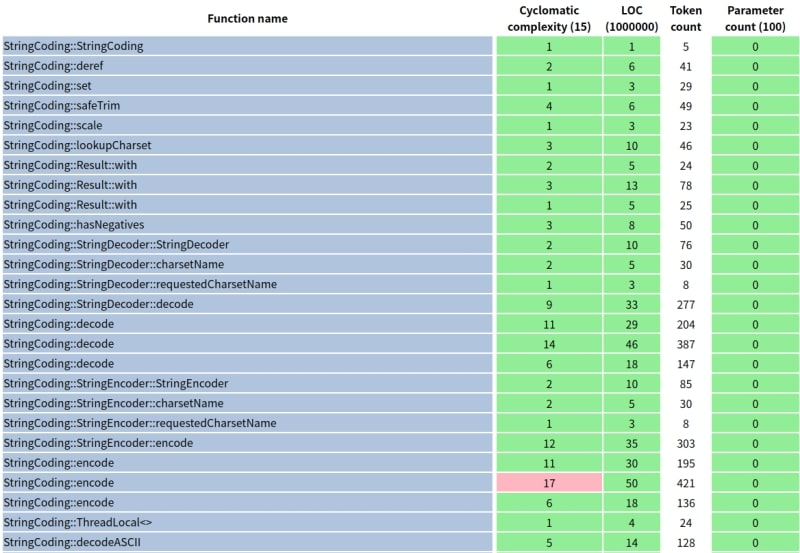

## 前書き：ネストの深さを指摘する時間が勿体無い 

コードレビューを効果的に実施したいと考えた事はありませんか？

例えば、短い期間でソフト開発する場合、レビュー時間を潤沢に取れないケースがあります。このような場合は、

- 基本的なコーディング不備（ネストが深いなど）は、静的解析ツールで検出
- ビジネスロジック不備は、ヒトがコードレビューで検出

と、レビュー目的に応じて作業分担した方が効果的です。しかし、静的解析ツールは数多くありますが、ライセンスが必要であったり、商用利用が難しい場合があります。

本記事では、MITライセンス（商用利用可能）でリリースされている「[循環的複雑度の計測ツール lizard（Python製）](http://www.lizard.ws/)」の概要、インストール方法、使用方法を紹介します。

## 検証環境

elementary OS5（Ubuntu派生）上で、lizard version 1.17.7およびPython 3.6.9を使用します。

```
         eeeeeeeeeeeeeeeee            nao@nao-VF-AD4 
      eeeeeeeeeeeeeeeeeeeeeee         -------------- 
    eeeee  eeeeeeeeeeee   eeeee       OS: elementary OS 5.1.7 Hera x86_64 
  eeee   eeeee       eee     eeee     Host: B450 I AORUS PRO WIFI 
 eeee   eeee          eee     eeee    Kernel: 5.4.0-73-generic 
eee    eee            eee       eee   Uptime: 55 mins 
eee   eee            eee        eee   Packages: 2823 
ee    eee           eeee       eeee   Shell: fish 2.7.1 
ee    eee         eeeee      eeeeee   Resolution: 2560x1080 
ee    eee       eeeee      eeeee ee   DE: Pantheon 
eee   eeee   eeeeee      eeeee  eee   WM: Mutter(Gala) 
eee    eeeeeeeeee     eeeeee    eee   Theme: Elementary [GTK3] 
 eeeeeeeeeeeeeeeeeeeeeeee    eeeee    Icons: Elementary [GTK3] 
  eeeeeeee eeeeeeeeeeee      eeee     Terminal: io.elementary.t 
    eeeee                 eeeee       CPU: AMD Ryzen 5 3400G (8) @ 3.700GHz 
      eeeeeee         eeeeeee         GPU: AMD Picasso 
         eeeeeeeeeeeeeeeee            Memory: 2315MiB / 30108MiB 
```

## lizardが提供する機能

lizardは、ソースコードの循環的複雑度（Cyclomatic Complexity Number）、メソッドの行数、メソッドのパラメータ数、ファイル内のメソッド数を算出します。任意の閾値を超えた場合、閾値以上のメソッドに警告を出せます。

静的解析結果は、標準出力、csvファイル、hmtlファイルに残せます。

## lizardの対応言語

> A list of supported languages:
> 
> - C/C++ (works with C++14)
> - Java
> - C# (C Sharp)
> - JavaScript (With ES6 and JSX)
> - TypeScript
> - Objective-C
> - Swift
> - Python
> - Ruby
> - TTCN-3
> - PHP
> - Scala
> - GDScript
> - Golang
> - Lua
> - Rust
> 
> [\---lizard READMEより--](https://github.com/terryyin/lizard/blob/master/README.rst)

## インストール方法

aptパッケージマネージャとpip3コマンドでインストールします。なお、lizardと一緒にインストールするjinja2は、lizardによる静的解析結果をHTMLに変換する際に使用するテンプレートエンジンです。

```
$ sudo apt install python3 python3-pip
$ pip3 install lizard jinja2
```

## 実行例と結果の読み方

lizardコマンドを実行すると、カレントディレクトリ以下のファイルに対して静的解析します。

以下の実行例では、[JavaのCore API](https://www.oracle.com/jp/java/technologies/javase/documentation/api-jsp.html)を静的解析しています。各ファイル内のメソッド毎に循環的複雑度を算出した後、閾値を超えたメソッドに対して警告を出します。

```
$ pwd
/home/nao/Code/javaCoreAPI/java.base/java/lang

$ lizard 
================================================
  NLOC    CCN   token  PARAM  length  location  
------------------------------------------------
      12      3     69      0      12 platformProcessHelper@42-53@./jdk.jcmd/sun/tools/common/ProcessHelper.java
      16      6     91      1      16 ProcessArgumentMatcher::ProcessArgumentMatcher@52-67@./jdk.jcmd/sun/tools/common/ProcessArgumentMatcher.java
      10      3     60      1      10 ProcessArgumentMatcher::getExcludeStringFrom@69-78@./jdk.jcmd/sun/tools/common/ProcessArgumentMatcher.java
      27      9    177      3      42 ProcessArgumentMatcher::check@80-121@./jdk.jcmd/sun/tools/common/ProcessArgumentMatcher.java
      12      4     79      1      12 ProcessArgumentMatcher::getSingleVMD@123-134@./jdk.jcmd/sun/tools/common/ProcessArgumentMatcher.java

(省略)

===========================================================================================================
!!!! Warnings (cyclomatic_complexity > 15 or length > 1000 or nloc > 1000000 or parameter_count > 100) !!!!
================================================
  NLOC    CCN   token  PARAM  length  location  
------------------------------------------------
      65     17    628      2      70 DirectMethodHandle::makePreparedLambdaForm@220-289@./invoke/DirectMethodHandle.java
      56     40    287      3      56 DirectMethodHandle::getFieldKind@646-701@./invoke/DirectMethodHandle.java
      89     33    873      3     101 DirectMethodHandle::makePreparedFieldLambdaForm@703-803@./invoke/DirectMethodHandle.java
     107     57    842      4     114 VarHandles::makeFieldHandle@32-145@./invoke/VarHandles.java
      69     19    613      2      72 MethodHandleProxies::asInterfaceInstance@156-227@./invoke/MethodHandleProxies.java
     188     18   1618      0     236 ClassSpecializer<T,K,S::Factory::generateConcreteSpeciesCodeFile@627-862@./invoke/ClassSpecializer.java
      73     22    638      3      80 Invokers::invokeHandleForm@258-337@./invoke/Invokers.java
      55     16    398      5      59 MemberName::Factory::getMembers@985-1043@./invoke/MemberName.java
      92     20    704      1     102 MethodTypeForm::MethodTypeForm@158-259@./invoke/MethodTypeForm.java
      43     22    227      2      48 MethodTypeForm::canonicalize@361-408@./invoke/MethodTypeForm.java
      89     23    535      2      93 LambdaFormEditor::putInCache@283-375@./invoke/LambdaFormEditor.java
      74     18    666      2      76 LambdaFormEditor::permuteArgumentsForm@848-923@./invoke/LambdaFormEditor.java
      72     18    443      9      83 AbstractValidatingLambdaMetafactory::AbstractValidatingLambdaMetafactory@108-190@./invoke/AbstractValidatingLambdaMetafactory.java
      78     16    469      0     100 AbstractValidatingLambdaMetafactory::buildCallSite@199-298@./invoke/AbstractValidatingLambdaMetafactory.java
     105     25    843      6     144 BootstrapMethodInvoker::invoke@53-196@./invoke/BootstrapMethodInvoker.java
      66     20    367      1      67 InvokerBytecodeGenerator::emitConst@338-404@./invoke/InvokerBytecodeGenerator.java
      50     37    259      2      51 InvokerBytecodeGenerator::lookupPregenerated@633-683@./invoke/InvokerBytecodeGenerator.java
      87     19    512      0     108 InvokerBytecodeGenerator::addMethod@747-854@./invoke/InvokerBytecodeGenerator.java
      24     16    194      1      26 InvokerBytecodeGenerator::isStaticallyInvocable@940-965@./invoke/InvokerBytecodeGenerator.java
     210     24   1099      5     297 StringConcatFactory::BytecodeStringBuilderStrategy::generate@838-1134@./invoke/StringConcatFactory.java
      53     18    398      3      80 Proxy::ProxyBuilder::mapToModule@752-831@./reflect/Proxy.java

（省略）

      97     24    866      5     114 ProcessImpl::start@187-300@./ProcessImpl.java
      79     26    602      2     107 ProcessImpl::initStreams@373-479@./ProcessImpl.java
     203     44   1793      2     250 FdLibm::Pow::compute@346-595@./FdLibm.java
     101     25    773      3     131 Module::defineModules@1066-1196@./Module.java
      55     17    418      4      69 Module::initExportsAndOpens@1263-1331@./Module.java
      32     16    197      0      33 Character::offsetByCodePoints@8683-8715@./Character.java
      54     16    323      4      58 Integer::parseInt@693-750@./Integer.java
      42     19    373      2      54 String::split@2265-2318@./String.java
      28     18    194      1      40 ConditionalSpecialCasing::isCased@374-413@./ConditionalSpecialCasing.java
     219    202   1893      1     221 CharacterData01::getNumericValue@200-420@./CharacterData01.java
==========================================================================================
Total nloc   Avg.NLOC  AvgCCN  Avg.token   Fun Cnt  Warning cnt   Fun Rt   nloc Rt
------------------------------------------------------------------------------------------
     62134       8.0     2.3       56.4     5695           48      0.01    0.09

```

上記の結果に登場する用語を下表で説明します。

| **用語** | **説明** |
| --- | --- |
| CCN | 循環的複雑度。if文、for文、switch-case文が増えると数値が上がります。0〜10は最良、11〜20はやや複雑、21〜40はテストしづらい、50以上は危険。 |
| NLOC | メソッドやファイルのコード行数（コメントを除く） |
| token | トークンとはコンパイラが字句解析／構文解析する際の最小単位（要素）であり、ここでは関数中のトークン数です |
| PARAM | メソッドのパラメータ数 |
| length | メソッドやファイルのコード行数（コメントを含む） |

上表の中で、トークンという用語には馴染みがない方がいらっしゃるかもしれません。以下にトークンの例を示します。

> For example: \`if (abc % 3 != 0)\` Has \`\[‘if’, ‘(‘, ‘abc’, ‘%’, ‘3’, ‘!=‘, ‘0’, ‘)’\]\` 8 tokens.
> 
> [\--lizard公式GitHubのIssue--](https://github.com/terryyin/lizard/issues/237)

## csvファイルの残し方

csvオプションとリダイレクトを使用します。どの列がどの結果かは出力されないので、不親切。

```
$ lizard --csv NoSuchMethodError.java > NoSuchMethodError.csv

$ cat NoSuchMethodError.csv 
3,1,9,0,3,"NoSuchMethodError::NoSuchMethodError@47-49@NoSuchMethodError.java","NoSuchMethodError.java","NoSuchMethodError::NoSuchMethodError","NoSuchMethodError::NoSuchMethodError()",47,49
3,1,12,1,3,"NoSuchMethodError::NoSuchMethodError@57-59@NoSuchMethodError.java","NoSuchMethodError.java","NoSuchMethodError::NoSuchMethodError","NoSuchMethodError::NoSuchMethodError( String s)",57,59

```

## HTMLファイルの残し方

htmlオプションとリダイレクトを使用します。

```
$ lizard --html > all.html

```

HTMLの表示例は、以下の通りです。閾値を超えている結果は、背景色が赤くなります。



## 警告のみを出す場合

\--warnings\_only(w)オプションを使用します。

```
$ lizard -w
./invoke/DirectMethodHandle.java:220: warning: DirectMethodHandle::makePreparedLambdaForm has 65 NLOC, 17 CCN, 628 token, 2 PARAM, 70 length
./invoke/DirectMethodHandle.java:646: warning: DirectMethodHandle::getFieldKind has 56 NLOC, 40 CCN, 287 token, 3 PARAM, 56 length
./invoke/DirectMethodHandle.java:703: warning: DirectMethodHandle::makePreparedFieldLambdaForm has 89 NLOC, 33 CCN, 873 token, 3 PARAM, 101 length
./invoke/VarHandles.java:32: warning: VarHandles::makeFieldHandle has 107 NLOC, 57 CCN, 842 token, 4 PARAM, 114 length
./invoke/MethodHandleProxies.java:156: warning: MethodHandleProxies::asInterfaceInstance has 69 NLOC, 19 CCN, 613 token, 2 PARAM, 72 length
(省略)

```

## 警告閾値を変更する場合

デフォルトでは、以下の閾値設定がされています。正直、循環的複雑度を除いて、設定がテキトーすぎる印象です。

- 循環的複雑度（CCN）＞ 15
- メソッド行数 ＞ 1000
- ファイル行数 ＞ 1000000
- パラメータ個数 ＞ 100

閾値の変更はThreshold(T)オプションで行います。

閾値を変更できるパラメータは、helpを読む限りnloc、cyclomatic\_complexity、token\_count、parameter\_countと書かれています。メソッド行数（length）のみ、length(L)オプションで閾値変更します。

以下の例では、CCN>10、メソッド行数>100を閾値として設定しています。

```
$ lizard -Tcyclomatic_complexity=10  -L100 -w
./invoke/DirectMethodHandle.java:220: warning: DirectMethodHandle::makePreparedLambdaForm has 65 NLOC, 17 CCN, 628 token, 2 PARAM, 70 length
./invoke/DirectMethodHandle.java:323: warning: DirectMethodHandle::shouldBeInitialized has 25 NLOC, 11 CCN, 126 token, 1 PARAM, 30 length
./invoke/DirectMethodHandle.java:646: warning: DirectMethodHandle::getFieldKind has 56 NLOC, 40 CCN, 287 token, 3 PARAM, 56 length
./invoke/DirectMethodHandle.java:703: warning: DirectMethodHandle::makePreparedFieldLambdaForm has 89 NLOC, 33 CCN, 873 token, 3 PARAM, 101 length
./invoke/DirectMethodHandle.java:839: warning: DirectMethodHandle::createFunction has 40 NLOC, 14 CCN, 268 token, 1 PARAM, 40 length
./invoke/MethodHandleImpl.java:323: warning: MethodHandleImpl::makePairwiseConvertIndirect has 69 NLOC, 13 CCN, 622 token, 4 PARAM, 82 length
(省略)

```

## ホワイトリストの設定

「このメソッドは警告が出ても仕方がない」という場合は、テキストファイルに当該メソッド名を書く事で警告を抑止できます。

以下、書式です。カレントディレクトリにwhitelizard.txtを置かなくても、Wオプションでホワイトリストファイルパスを指定できます。

```
# whitelizard.txt
# ホワイトリストファイルは"whitelizard.txt"と名付けなければならず、
# カレントディレクトリに格納します。
# コメントは、"#"が登場した位置からです。.
function_name1, function_name2    # カンマ区切りでメソッド名を列挙
file/path/name:function1, function2  # ファイルパスの指定も可能 

```

## おまけ：利用を断念した静的解析ツール

基本的にはライセンス面（購入が必要）で断念しています。ただし、Understand、C++Test、Coverityは多機能であるため、「金銭コスト」と「解析時間の長さ」が気にならない人は採用を検討して良いかもしれません。

| **静的解析ツール** | **断念理由／個人的な印象** |
| --- | --- |
| [Understand](https://www.techmatrix.co.jp/product/understand/index.html) | ライセンス購入必須。ソースコードの構造を様々な方法で可視化する機能を持つ。個人的には、似た機能を持つ[Sourcetrail](https://debimate.jp/post/2020-12-12-%E9%9D%99%E7%9A%84%E8%A7%A3%E6%9E%90%E3%82%BD%E3%83%BC%E3%82%B9%E3%82%B3%E3%83%BC%E3%83%89%E8%A7%A3%E6%9E%90%E8%A3%9C%E5%8A%A9%E3%83%84%E3%83%BC%E3%83%ABsourcetrail%E3%81%AE%E5%B0%8E/)の方が気軽に使いやすい。 |
| [C++Test](https://www.techmatrix.co.jp/product/ctest/casestudy/index.html) | ライセンス購入必須。単体テストのカバレッジ取得、コーディングルールチェック、フロー解析が強い。C/C++向けツールのため、組み込みソフト向け。 |
| [Coverity](https://www.synopsys.com/ja-jp/software-integrity/security-testing/static-analysis-sast.html) | ライセンス購入必須。到達不可能なコード、推奨されないコーディング、不要な初期化など幅広い指摘を出す。C++Testに近い機能だが、Coverityは対応言語が多い（21個の言語対応）。 |
| [SourceMonitor](http://www.campwoodsw.com/sourcemonitor.html) | 対応言語が若干少ない（C/C++/C#、VB.NET、Java、Delphi、VB、HTML）。[商用のソフト開発に利用可能なライセンス](http://www.campwoodsw.com/smlicense.html)であり、利用を断念する理由はあまり無い。ただ、公式サイトが古臭くて調査しなかった。 |
| [cppcheck](http://cppcheck.sourceforge.net/) | [ライセンスはGPLv3](http://cppcheck.sourceforge.net/)。C/C++向けであり、組み込みソフトであれば利用を検討した可能性あり。 |
