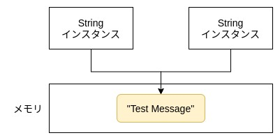

## 前書き：これだからC言語プログラマは……

Immutable object（不変クラス）とは、コンストラクタによるインスタンス生成時から状態（フィールド変数の値）が変わらないクラスを意味します。代表例は[Stringクラス](https://docs.oracle.com/javase/jp/11/docs/api/java.base/java/lang/String.html)。

C言語（手続き型）の経験が長い私は、オブジェクトが不変である事の利点を考えた事がありませんでした。他言語の経験が浅いC言語プログラマはシーケンスを綺麗に整えるスキルはありますが、データ設計には無頓着な傾向があります。私もその嫌いがあります。

本記事では、immutable object（不変クラス）の利点／欠点を示した後、どのような条件を満たせば不変クラスと呼べるのかを紹介します。また、どのようなタイミングで不変クラスを採用すべきかも説明します。

## 不変クラスの利点

- 複製コストが低い（Deep Copyしなくても、Shallow Copyで良い）
- 比較コストが低い（インスタンスの参照をチェックすれば良い）
- スレッドセーフ（状態が常に同じのため）
- インスタンスが不変のため、[HashMapキー](https://docs.oracle.com/javase/jp/8/docs/api/java/util/HashMap.html)／[HashSet要素](https://docs.oracle.com/javase/jp/8/docs/api/java/util/HashSet.html)に最適
- キャッシュ可能（HashMapでは高速操作を提供）
- 実装者がインスタンスの状態に注意しなくて良い（利用しやすい）

例えば、同じ文字列を持つStringインスタンスの場合、メモリ上にある"Test Message"への参照さえコピーすれば、同等のインスタンスを作成できます。比較も参照先が同じかどうかを確認すれば良く、文字列の中身を一文字ずつ確認する必要がありません。

```
String msg1 = "Test Message";
String msg2 = msg1;              // new String(msg1);とするよりもコストが低い

System.out.println(msg1 == msg2);  // true
```



また、インスタンスが不変であるため、スレッドセーフである事は自明でしょう。複数スレッドが不変インスタンスをどのタイミングでチェックしても、結果は変わりません。また、常に同じ結果を返せるという点（一意である点）は、HashMapキー／HashSet要素／キャッシュに利用できる事を意味します。

最後に、実装者がインスタンスの状態に注意しなくて良い点について補足します。まずは、逆のパターン、すなわちインスタンスの状態に注意が必要な例を以下に示します。

以下に示すコードでは、exec()メソッドを呼び出す前にstart()メソッドを呼び出す必要があり、メソッドの呼び出しに順序性があります。実装者は、この順序性に注意を払いながら実装する必要があります。

```
public class Job {
    /** 状態一覧 */
    enum STATE {IDLE, RUNNING};
    /** インスタンスの状態 */
    private STATE state;

    /** コンストラクタ */
    public Job() {
        state = STATE.IDLE;
    }

    /** ジョブの開始 */
    public void start() { 
        if(state != STATE.IDLE) {
            return;
        }
        state = STATE.RUNNING;
        System.out.println("STATE change IDLE to RUNNIG");    
    }

    /** ジョブの本実行。実行にはジョブが開始している必要あり。 */
    public void exec() {
        if(state != STATE.RUNNING) {
            return;
        }
        System.out.println("Execute");
    }

    /** ジョブの停止 */
    private void stop() {
        if(state != STATE.RUNNING) {
            return;
        }
        state = STATE.IDLE;
        System.out.println("STATE change RUNNING to IDLE");    
    }   
}
```

上記の例よりも規模が大きいクラスの場合、実装者がインスタンス状態を考慮しながら実装するのは負荷が高い作業です。また、他人が実装したコードであれば、状態遷移を読み解く難易度がより一層増します。

その一方で、不変クラスはどのようなタイミングでメソッドを呼び出しても同じ結果が得られるため、可変クラスより使いやすい傾向があります。状態に関する勘違い（バグ）も発生しづらいです。

## 不変クラスの欠点

- フィールド変数の値を変える事 = 新規インスタンス生成必須（手間がかかる）

## 不変クラスの条件

- クラスの拡張を禁ずる事（finalクラスである事）
-  全てのフィールド変数にprivate修飾子およびfinal修飾子を付ける事
- コンストラクタでフィールドを初期化する事
- 状態を変更させるためのメソッド（setter等）を持たない事
- フィールドに含まれる可変インスタンスの独占アクセスを保証する事

上記の不変クラスの条件で、ピンとこない表現は最後の「独占アクセス保証」でしょう。言い換えると、独占アクセスを保証する場合は、可変インスタンスをDeep Copyする必要があります。

駄目な例（独占アクセスを保証できていない） 

```
public final class Immutable {
    private finale Job job;
    public Immutable(Job job) {
        this.job = job;
    }
}
```

上記のコードの場合、「①Immutableコンストラクタの呼び出し元」と「②新たに生成したImmutableインスタンス」の2つがJobインスタンスを共有しています。①側でJobインスタンスの状態を変更すれば、②側のJobインスタンスの状態も変わってしまいます。

良い例（独占アクセスを保証できている） 

例えば、JobクラスがCloneableをimplementsしていれば、clone()メソッドによるコピーを実施します。

```
public final class Immutable {
    private final Job job;
    public immutable(Job job) {
        this.job = job.clone();  // clone()の実装は省略
    }
}
```

別の方法としては、JobクラスにJobインスタンスを複製するためのコンストラクタをもたせ、それを利用して複製する方法も考えられます。以下に例を示します。

```
public class Job {
    /** 状態一覧 */
    enum STATE {IDLE, RUNNING};
    /** インスタンスの状態 */
    private STATE state;

    /** コンストラクタ */
    public Job() {
        state = STATE.IDLE;
    }

    /** 複製用のコンストラクタ */
    public Job(Job job) {
        this.state = job.getState();
    }

    /** 状態を取得する */
    public STATE getState() {
        return this.state;
    }
    /* 残りのメソッドは省略 */
}
```

```
public final class Immutable {
    private final Job job;
    public immutable(Job job) {
        this.job = new Job(job);
    }
}
```

## 不変クラスで実装する場面

> 可変にすべき正当な理由がない限り、クラスは不変であるべきです。
> 
> [Effective Java 第三版 第４章 項目17 p88](https://amzn.to/3fCyl52)

逆に、可変クラスの実装が許される場面は「ジョブ実行状態（シーケンス）を保持するクラス」がパッと思いつきます。が、仕事の実装を思い返すと殆ど可変クラスで実装している気がしないでもない（ = 設計が甘い）。

## 最後に

不変クラスを突き詰めると、「ステートレス（状態を持たない）クラス」や「関数型プログラミング（全てのクラスが状態を持たず、状態と振る舞いを完全分離）」にたどり着きます。

[Haskell](https://www.haskell.org/)や[Scala](https://docs.scala-lang.org/ja/tour/tour-of-scala.html)に触れて、関数型パラダイムを学ぶとスキルアップできそうです。
