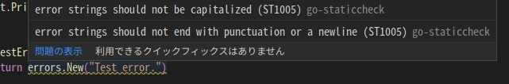

## 前書き：君、err != nilしかできないの?

Golangでは、errorがnilでなければ上位関数にそのままerrorを戻す処理が頻繁にあります。

```
f, err := os.Create(path)
if err != nil {
	return err
}
```

「エラーが発生した事実」を上位関数へ伝えるだけであれば、上記コードの対応で問題ありません。しかし、エラーの種類によって異なる対応をしたい場合は、nilチェックだけでは物足りません。

そこで、本記事ではerrorsパッケージに備わるメソッドNew()、Unwrap()、Is()、As()の使い方および注意点を説明し、基本的なgolangエラーハンドリング方法を押さえます。

## 調査環境

Ubuntu21.04、go1.17（linux/amd64）で調査しました。

```
           ./oydmMMMMMMmdyo/.              nao@nao 
        :smMMMMMMMMMMMhs+:++yhs:           ------- 
     `omMMMMMMMMMMMN+`        `odo`        OS: Ubuntu Budgie 21.04 x86_64 
    /NMMMMMMMMMMMMN- `sN/       Host: B450 I AORUS PRO WIFI 
  `hMMMMmhhmMMMMMMh               sMh`     Kernel: 5.11.0-41-generic 
 .mMmo- /yMMMMm`              `MMm.    Uptime: 2 hours, 6 mins 
 mN/       yMMMMMMMd- MMMm    Packages: 3270 (dpkg), 16 (snap) 
oN- oMMMMMMMMMms+//+o+:    :MMMMo   Shell: bash 5.1.4 
m/          +NMMMMMMMMMMMMMMMMm. :NMMMMm   Resolution: 1920x1080, 2560x1080 
M`           .NMMMMMMMMMMMMMMMNodMMMMMMM   DE: Budgie 10.5.2 
M- sMMMMMMMMMMMMMMMMMMMMMMMMM   WM: Mutter(Budgie) 
mm`           mMMMMMMMMMNdhhdNMMMMMMMMMm   Theme: Yaru-dark [GTK2/3] 
oMm/        .dMMMMMMMMh:      :dMMMMMMMo   Icons: ubuntu-mono-dark [GTK2/3] 
 mMMNyo/:/sdMMMMMMMMM+          sMMMMMm    Terminal: vscode 
 .mMMMMMMMMMMMMMMMMMs           `NMMMm.    CPU: AMD Ryzen 5 3400G (8) @ 3.700GHz 
  `hMMMMMMMMMMM.oo+.            `MMMh`     GPU: AMD ATI 09:00.0 Picasso 
    /NMMMMMMMMMo                sMN/       Memory: 5460MiB / 30034MiB 
     `omMMMMMMMMy.            :dmo`
        :smMMMMMMMh+-`   `.:ohs:                                   
           ./oydmMMMMMMdhyo/.   
}
```

## New()：基本仕様

```
func New(text string) error
```

errors.New()は、新しいエラーを上位関数に返す場合に使用します。

New()は、エラーメッセージを引数として受け取り、新しいerrorインターフェース（buit-in interface）を返します。通常、上位関数は"error == nil"であれば、エラーがないと判断します。

errorインターフェースはError()メソッドのみを持ち、Error()はエラー文字列を返します。Javaで言えば、各オブジェクトが備えるtoString()に近いです。

```
type error interface {
	Error() string
}
```

go/src/errors/errors.goに、errors.New()の定義があります。New()は非常にシンプルな実装で、errorString構造体にエラーメッセージ（text）をセットし、その構造体ポインタを返しているだけです。Error()の実装も、セットした文字列を無加工で返すだけです。

```
func New(text string) error {
	return &errorString{text}
}

type errorString struct {
	s string
}

func (e *errorString) Error() string {
	return e.s
}
```

## New()：エラーメッセージ出力方法

他言語経験者は「エラーメッセージを表示するには、fmt.Println(error.Error())とすれば良いのかな」と考えるでしょう。その方法でも間違いではありませんが、fmt.Println(error)でもエラーメッセージを出力できます。

参考として、エラーメッセージ出力の実装例と実行結果を以下に示します。

```
func main() {
	fmt.Println(testErr())            // 主流な書き方
	fmt.Println(testErr().Error())   // あまり見ない書き方
}

func testErr() error {
	return errors.New("test error")
}
```

```
$ go build main.go 
$ ./main            (注釈)：どちらのPrintln()も、出力結果は同じ
test error
test error
```

fmt.Println()にerrorインターフェースをそのまま渡して標準出力できる理由は、fmt.Println()内部で引数に対して型検査やリフレクションを行い、引数に合わせたメソッド（fmtパッケージ内のメソッド）を内部で呼び分けているからです。

前提として、fmt.Println(a ...interface{})は、任意の個数のinterfaceを引数として受け取るメソッドです。interfaceのままでは標準出力できないので、引数の型に合わせて文字列を取得します。例えば、引数がerrorインターフェースの場合、以下のコード①部分でerror.Error()を呼び出して文字列を取得しています。

```
func (p *pp) handleMethods(verb rune) (handled bool) {
			// 省略

			switch v := p.arg.(type) {  // p.argは、Println()の引数
			case error:
				handled = true
				defer p.catchPanic(p.arg, verb, "Error")
				p.fmtString(v.Error(), verb)   // ①
				return
				
			// 省略
```

## New()：エラーメッセージに関する2つの注意点

errors.New()に渡すメッセージでは、

- メッセージの開始が大文字
- メッセージの終了が句読点や改行

の2つは、lint（静的解析ツール）に指摘されます。以下に例を示します。

```
func testErr() error {
	return errors.New("Test error.")
}
```



"error strings should not be capitalized"は「エラー文字列は大文字にしないでください」

"error strings should not end with punctuation or a newline"は、「エラー文字列は句読点や改行で終わらせないでください」

[Golang公式コードレビュー観点](https://github.com/golang/go/wiki/CodeReviewComments)（以下の引用）を要約すると、「エラーメッセージは文脈に沿って表示される（エラーメッセージは他のメッセージと連結される可能性がある）」という事でしょうか。

> Error strings should not be capitalized (unless beginning with proper nouns or acronyms) or end with punctuation, since they are usually printed following other context. That is, use `fmt.Errorf("something bad")` not `fmt.Errorf("Something bad")`, so that `log.Printf("Reading %s: %v", filename, err)` formats without a spurious capital letter mid-message. This does not apply to logging, which is implicitly line-oriented and not combined inside other messages.
> 
> **上記の和訳**
> 
> エラー文字列は、通常、他のコンテキスト（文脈）に従って表示されます。そのため、大文字（適切な名詞または頭文字で開始される場合を除く）や句読点で終わらせないでください。つまり、fmt.Errof("Something bad")ではなくfmt.Errorf("something bad")としてください。そうすれば、log.Printf("Reading %s: %v", filename, err) は、中間メッセージが見せかけの大文字になりません。これは、暗黙的に行指向であり、他のメッセージ内で結合されないロギングには適用されません。
> 
> [Go Code Review Commentsより引用](https://github.com/golang/go/wiki/CodeReviewComments#error-strings)

上記の静的解析指摘を受けるようになってから、エラーメッセージ（golangに限らず、様々な言語で実装されたバイナリのエラー）を何点か追ってみたのですが、

**"コマンド(オブジェクト名): メッセージ1: メッセージ2"**

のように、メッセージをコロン":"で繋ぐ出力が多い事に気づきました。

英文では、":"は句読点の一種であり、説明を追加するために用いられます。そのため、プログラムであってもメッセージを":"で繋ぐのは、英語圏の視点では当たり前なんだよなーと感じました。当たり前の視点ですが、英語苦手なので抜け落ちてました。

## Unwrap()：基本仕様

```
func Unwrap(err error) error
```

errors.Unwrap()は、「ラッピングされたエラー（引数）」から「ラッピングされる前のエラー」を取り出します。

前提として、エラーはfmt.Errorf()に"%w"フォーマットを適用する事によって、ラッピングできます（errors.Wrap()はありません）。以下に実装例と実行結果を示します。

```
func main() {
	fmt.Println(fmt.Errorf("wrapping: %w", testErr()))
}

func testErr() error {
	return errors.New("test error")
}

```

```
wrapping: test error

```

fmt.Errorf()が返すのは、wrapError構造体ポインタです（以下の定義を参照）

wrapError構造体のメンバ変数は、1）新しく追加したエラーメッセージ、2）ラッピング対象のerrorインターフェースです。wrapError構造体のインターフェースは、エラーメッセージを返すError()、ラッピング前のerrorインターフェースを返すUnwrap()です。

```
func Errorf(format string, a ...interface{}) error {
	p := newPrinter()
	p.wrapErrs = true
	p.doPrintf(format, a)  // ★ この中でp.wrappedErrにラッピング対象エラーをセット
	s := string(p.buf)
	var err error
	if p.wrappedErr == nil {
		err = errors.New(s)
	} else {
		err = &wrapError{s, p.wrappedErr}
	}
	p.free()
	return err
}

type wrapError struct {
	msg string
	err error
}

func (e *wrapError) Error() string {
	return e.msg
}

func (e *wrapError) Unwrap() error {  // ★ errors.Unwrap()に関係するメソッド（後述）
	return e.err
}

```

errors.Unwrap()の定義（以下の実装を参照）を確認すると、型アサーションで引数errがUnwrap()メソッドを持つかどうかをチェックした後、ラッピングされたエラー（= fmt.Errorf()の返り値）であればwrapError構造体が持つUnwrap()メソッドをコールします。それ以外のエラーの場合は、nilを返しています。

```
func Unwrap(err error) error {
	u, ok := err.(interface {  // 型アサーションによるチェック
		Unwrap() error
	})
	if !ok {
		return nil
	}
	return u.Unwrap()
}

```

errors.Unwrap()を用いた実装例と実行例を以下に示します。

前述したerrors.Unwrap()の定義通り、ラッピングされたエラーを引数とした場合はラッピング前のエラーが持つメッセージが表示されます。それ以外を引数とした場合は、返り値がnilです。

```
func main() {
	err := fmt.Errorf("wrapping: %w", testErr())
	fmt.Println(errors.Unwrap(err)) // ラッピングされたerrorインターフェースが引数の場合
	fmt.Println(testErr())     // ラッピングされていないerrorインターフェースが引数の場合
}

func testErr() error {
	return errors.New("test error")
}

```

```
$ ./main 
test error
<nil>

```

## Unwrap()：errorをラッピングする理由

そもそも論ですが、errorインターフェースをラッピングすると何が嬉しいのでしょうか。

errorインターフェースをラッピングする利点

1. プリミティブなエラーに情報を追加できる
2. 上位関数で定義したエラーでラッピングする事によって、下位関数との依存を薄める

プリミティブなエラーに情報を追加できる点については、各実装レイヤーのコンテキストを付与する事によって、エラーメッセージの質を向上させたい背景があります。

例えば、プリミティブエラーメッセージ「I/Oエラーが起きた（原因）」に対して「コピーに失敗した（結果）」と情報を付与した方が情報量も増えていますし、何が出来ないのかも分かりやすいです。

下位関数との依存を薄める点については、標準ライブラリのメソッドをラッピングしてから使う作法と殆ど同じです。ただし、errorインターフェースをラッピングする方法がエラーハンドリングの最適解とは限らず、独自の情報（例：スタックトレース、エラー番号など）を付与したカスタムエラー構造体を実装する方法も考えられます。

注意点としてはカスタムエラー構造体をラッピングした場合も、fmt.Errorf()はwrapError構造体を返してきます（以下の実装例と実行結果を参照）。Unwrap()して中身のカスタムエラー構造体を取り出さないと、カスタムエラー構造体が持つ独自メンバ変数／メソッドにアクセスできません。

```
type errorType uint
const (
	read errorType = iota
)

type customError struct {
	etype errorType  // カスタム要素
	err   error
}

func main() {
	var customErr customError
	ce := customErr.New(read, "not readable")
	wrappedCustomErr := fmt.Errorf("wrapped: %w", ce)

	fmt.Println(reflect.TypeOf(wrappedCustomErr))
	fmt.Println(reflect.TypeOf(errors.Unwrap(wrappedCustomErr)))
}

// インスタンス生成
func (ce customError) New(et errorType, msg string) *customError {
	return &customError{et, errors.New(msg)}
}

// エラーメッセージを返す
func (ce customError) Error() string {
	return ce.err.Error()
}

// エラー種別を返す
func (ce customError) Type() errorType {
	return ce.etype
}

```

```
$ ./main 
*fmt.wrapError        (注釈) カスタムエラー構造体のラッピング結果
*main.customError     (注釈) ラッピングエラーのUnwrap()結果

```

## Is()：基本仕様

```
func Is(err, target error) bool
```

errors.Is()は、引数で渡されたエラー（err）が指定エラー（target）と一致するかどうかを返します。調査対象のエラーは再帰的にUnwrap()され、指定エラーとの一致／不一致が検証されます。

errors.Is()の定義は、以下の通りです。定義の後に補足説明を記載しています。

```
func Is(err, target error) bool {
	if target == nil {
		return err == target
	}

	isComparable := reflectlite.TypeOf(target).Comparable() // ①
	for {
		if isComparable && err == target {
			return true
		}
		if x, ok := err.(interface{ Is(error) bool }); ok && x.Is(target) { // ②
			return true
		}
		if err = Unwrap(err); err == nil {  // ③
			return false
		}
	}
}

```

①では、reflectlite.TypeOf(target).Comparable()を用いて、引数targetが比較対象とできるかどうかを確認しています。なお、関数やスライスは比較対象にできません。

②では、型アサーションで引数errがIs()メソッドを持つかどうかをチェックし、持つ場合はerrとtargetの一致確認を行います。

③では、引数errをアンラップして、forループの頭に戻ります。Unwrap()の結果が"err == nil"の場合は、大本のerrorインターフェースに辿り着いた事を意味するため、errとtargetの不一致が確定します。

## Is()：使用方法

errors.Is()は、ラッピングされたエラーであっても、エラーが任意エラーと一致するかどうかを期待通りに返せます（以下の実装例におけるprintReadableErrByIs()と実行結果を参照）。

その一方で、switch-case文を用いた場合、ラッピングされたエラーが任意エラーと一致するかどうかを期待通りに返してくれません（以下の実装例におけるprintReadableErrBySwitch()と実行結果を参照）。

以下、任意エラーとの一致／不一致を検証するコードと実行結果です

```
var ErrNotRead = errors.New("not readable")

func main() {
	printReadableErrByIs(ErrNotRead)
	printReadableErrByIs(fmt.Errorf("wrapping: %w", ErrNotRead))

	printReadableErrBySwitch(ErrNotRead)
	printReadableErrBySwitch(fmt.Errorf("wrapping: %w", ErrNotRead))
}

func printReadableErrByIs(err error) {
	if errors.Is(err, ErrNotRead) {
		fmt.Println(err.Error())
	}
}

func printReadableErrBySwitch(err error) {
	switch err {
	case ErrNotRead:
		fmt.Println(err.Error())
	default:
		fmt.Println("default")
	}
}

```

```
$ ./main 
not readable
wrapping: not readable
not readable
default                              (注釈)：期待通りに判定できていない

```

## As()：基本仕様

```
func As(err error, target interface{}) bool
```

errors.As()は、引数で渡されたエラー（err）が指定インターフェース（target）と一致するかどうかを返します。errors.Is()との違いは、カスタムエラー構造体と一致するかどうかを判定できる点です。

調査対象のエラーは再帰的にUnwrap()され、指定インターフェースとの一致／不一致が検証される点は、errors.Is()と同様です。

errors.As()の定義は、以下の通りです。

```
func As(err error, target interface{}) bool {
	if target == nil {
		panic("errors: target cannot be nil")
	}
	val := reflectlite.ValueOf(target)  // ①
	typ := val.Type()
	if typ.Kind() != reflectlite.Ptr || val.IsNil() {  // ①'
		panic("errors: target must be a non-nil pointer")
	}
	targetType := typ.Elem()
	if targetType.Kind() != reflectlite.Interface && !targetType.Implements(errorType) { // ②
		panic("errors: *target must be interface or implement error")
	}
	for err != nil {  // ③
		if reflectlite.TypeOf(err).AssignableTo(targetType) {
			val.Elem().Set(reflectlite.ValueOf(err))
			return true
		}
		if x, ok := err.(interface{ As(interface{}) bool }); ok && x.As(target) {
			return true
		}
		err = Unwrap(err)
	}
	return false
}

```

①ValueOf(target)から①'typ.Kind() != reflectlite.Ptr || val.IsNil()まででは、引数targetに有効なポインタが入っているかどうかを確認します。有効なポインタではない場合はpanic()します。

②では、引数targetがインターフェースではない場合、もしくはerrorインターフェースではない場合にpanic()します。

③以降のforループでは、引数targetに引数errが代入可能であれば代入後にtrueを返します。代入不可の場合における処理の流れは、errors.Is()とほぼ同様です。引数errがAs()メソッドを持つ場合はコールし、コールしても引数errとtargetが一致していない場合はerrをUnwrap()し、forループ先頭に戻ります。

As()とIs()の使い方はほぼ同様のため、As()の使用方法は省略します。

## 最後に

New()、Unwrap()、Is()、As()を押さえて、ようやくgolangエラーハンドリングのスタート地点に立てた状態な気がします。実装レイヤー単位でどのようにエラーを処理していくかが大事な設計であり、私は最適解になかなか達せません。

余談ですが、他言語の経験者は、golangのエラーハンドリングに戸惑いませんか？（私はかなり違和感を覚えながら実装しています）
