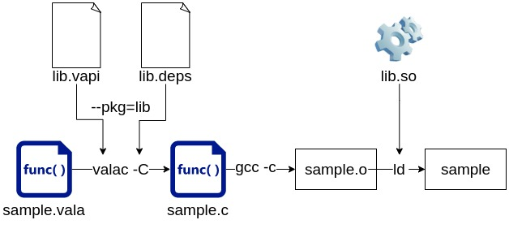

## マイナーなプログラミング言語：Vala言語とは

あなたは[Vala言語](https://wiki.gnome.org/Projects/Vala)をご存知でしょうか？

Vala言語は、プログラミング言語ランキングでは圏外（50位以下）であり、クロスプラットホーム言語にも関わらずLinux環境のGUIプログラミングでしか用いられる機会がありません。GUIに強みを持つ言語であるため、Linuxでシステムプログラミング開発する人でも、Vala言語の存在を知らない可能性があります。THE マイナー言語。

しかし、Vala言語は2006年から2022年現在まで緩やかに開発が続けられており、[elementary OS（GUIに力を入れているLinuxディストリ）](https://elementary.io/ja/)で積極的に採用されています。マイナーですが、死にゆく言語ではありません。

コードの見た目もC#やJavaに似たスタイルであり、オブジェクト指向かつ静的型付け言語に慣れている開発者にとって受け入れやすいです。

```
class Demo.HelloWorld : GLib.Object {
    public static int main(string[] args) {
        stdout.printf("Hello, World\n");
        return 0;
    }
}
```

## Valaの利点：「高速」かつ「GTKと相性が良い」

Vala言語は、実行速度が高速です。その理由は、Vala言語で書いたコードからC言語が生成され、そのC言語コードをもとにしてバイナリを作成するからです。C言語が高速なのは、言うまでもないでしょう。ただし、valac（valaコンパイラ）は冗長なCコードを生成するため、Vala言語製バイナリの実行速度はピュアなC／C++製バイナリより遅い可能性が高いです（それでも、スクリプト言語よりは高速です）。

\[caption id="attachment\_6924" align="aligncenter" width="628"\] Introducing Vala Programming（Michael Lauer著、35頁）より引用\[/caption\] 

また、Vala言語が[GTK（GNOME Tool Kit）](https://www.gtk.org/)と相性が良い理由は、GTKが利用しているGObjectやGLibのラッパーAPI（GTK自体のラッパーAPI含む）が多数用意されているからです。C／C++もGLibやGTKを利用できますが、Valaの方がプログラマに優しい点が多いです。例えば、Valaの方がC／C++よりコード記述量が少ない傾向があり、GCがあるためメモリ管理も不要です。

## Vala言語の立ち位置

Vala言語は、WindowsにおけるC#、Apple製品におけるSwiftのような立ち位置です。**Linux環境でのみ、輝きます。**

C#やSwiftはクロスプラットホームの言語ですが、実際は「特定プラットフォームでしか採用されない言語」という印象です。Valaも同じです。Valaが活躍できる環境は、Linux（それもGUI開発）に限られるのです。

当然、C#やSwiftもLinux向けアプリ開発に採用できます。しかし、採用したとしても、LinuxではC#やSwiftのライブラリやSDKが不足しているという課題があります。また、他の選択肢、つまりJVM言語（JavaやScala等）はライセンスや速度面を考慮すると採用の第一候補になりません。

実行速度／ライセンス／開発実績／自由（Free）を踏まえて考えると、Linuxでシステムプログラミング／GUIプログラミングするには、C／C++／Vala／Golang／Rust／各種スクリプト言語が候補となります。

Valaはシステムプログラミングができない訳でありませんが、ソフト資産のあるCやC++、書きやすいGolang、メモリ管理に長けたRustより優れているとは言いづらいです。しかし、GUI（GTK）プログラミングという土俵であれば、Valaは採用候補に挙がります。

そんな微妙な立ち位置にいるValaが、Windows／Mac環境の第一線で戦えるかと言えば、勝ち目がある筈もなく。なので、ValaはLinux環境でのみ輝く言語と言えるのです。

## Vala言語の物足りなさ その1：開発環境がイマイチ

Vala言語は開発ツール（下表）が存在しますが、導入が一苦労であったり、上手く動作しないケースがあります（ビルドし直し、ツールの再インストールが多いです）。Golangと比較すると、気持ちよくコードを書けません。

| **ツール名** | **役割** | **不満点や備考** |
| --- | --- | --- |
| [valac](https://gitlab.gnome.org/GNOME/vala) | コンパイラ | vala language serverがクラッシュする原因を作っている事 |
| [meson](https://mesonbuild.com/Unit-tests.html) | ビルドシステム | 特になし。ただし、日本語情報が少ないため、導入時に手間取った |
| [ninja](https://github.com/ninja-build/ninja) | ビルドシステム | 特になし。 |
| [vala language server](https://github.com/Prince781/vala-language-server) | 言語サーバ（LSP） | Valaのバージョンによってクラッシュする事。VS Codeを利用する場合は[Valaプラグイン](https://marketplace.visualstudio.com/items?itemName=prince781.vala)が必須。 |
| [uncrustify](https://github.com/uncrustify/uncrustify) | コードフォーマッタ | Vala言語用フォーマット規約がない事（elementary OS用の設定ファイルはある） |
| [valdo](https://github.com/Prince781/valdo) | プロジェクトテンプレート | 特になし。ただし、最新コンパイラでビルドエラーになる。 |
| [vala-lint](https://github.com/vala-lang/vala-lint) | 静的解析 | VS Codeプラグインがあれば完璧 |
| 不明 | デバッガ | gdbでデバッグできるが、Valaコードから生成されたC言語に対してデバッグ情報が出力される。やや直感的ではない。 |
| [gcovr](https://gcovr.com/en/stable/) | カバレッジ | mesonバージョンが古いとカバレッジ出力時にファイルが見つけられずエラーとなる。[使い方はコチラ](https://github.com/lcallarec/vala-meson-flatpak-example)を参照すると分かりやすい。 |
| [valadoc](https://wiki.gnome.org/Projects/Valadoc) | ドキュメントジェネレータ | valadoc自体のドキュメントが不足している事 |

Vala言語の開発ツールは、最新ライブラリや最新機能を使う場合が多く、コードを書く前の事前準備が多いです。私はVala開発環境として[以前はelementary OSを使用していました](https://debimate.jp/2021/01/02/%e3%83%89%e3%82%b9%e3%83%91%e3%83%a9%e3%81%aethirdwave-vf-ad4%e3%81%abelementary-osubuntu%e6%b4%be%e7%94%9f%e3%82%92%e5%85%a5%e3%82%8c%e3%81%9f%e6%84%9f%e6%83%b3/)が、パッケージが比較的新しいUbuntuを利用するようになりました。

Debian環境を使用していた頃は、満足のいくVala開発環境を構築できませんでした。そのため、Vala言語に興味がある方は、Ubuntu、Fedora、Arch Linuxあたりを使うと良いかもしれません。

## 物足りなさ その2：標準コアライブラリがイマイチ

Vala言語は、[Glibライブラリが標準コアライブラリ](https://valadoc.org/glib-2.0/index.htm)とみなせます。このGlibライブラリがJava、Golang、Python等の言語と比べると、使いづらいです。また、Valadocが生成したAPIドキュメントから、お目当てのAPIを探すのが一苦労だったりします。

例えば、"test.txt"がファイルかどうかのチェックの場合、私はFile.isFile()やos.path.isfile()のような"is"プレフィックスを持つメソッドを期待します。しかし、Valaでは「FileUtils.test ("test.txt", FileTest.IS\_REGULAR)」や「query\_file\_type()で取得したファイル種別がファイルかどうかの検証」など、他言語と違うやり方を求められます。

まさかファイルかどうかのチェック処理がtest()やquery\_file\_type()とは思ってもいないので、APIドキュメントの検索に手間取ります。このような手間が、ほぼ全ての処理（コーディング）で発生する印象があります。

## 対策：コアライブラリを自作

標準コアライブラリが使いづらいので、どうすれば良いのか。作れば良いじゃない。

という事で、[libvalacoreライブラリ](https://github.com/nao1215/libvalacore)の開発を開始しました。まだ全然コードを書いていません。ユニットテスト環境やCI周りを準備した所です。目指す姿は、Java Core APIに近いライブラリ。地道にクラスを追加していこうかと考えています。

## 最後に

Vala言語を書いてみたい方は、以下のリンクが参考になります。

- [JavaプログラマーからみたVala (1)　ソースコード](https://m12i.hatenablog.com/entry/20110316/1300224426)
- [JavaプログラマーからみたVala（2）　型](https://m12i.hatenablog.com/entry/20110317/1300309339)
- [JavaプログラマーからみたVala (3)　クラス](https://m12i.hatenablog.com/entry/20110318/1300393519)
- [JavaプログラマーからみたVala (4)　クラス②](https://m12i.hatenablog.com/entry/20110319/1300463019)
- [JavaプログラマーからみたVala（5）　通知](https://m12i.hatenablog.com/entry/20110321/1300708387)
- [JavaプログラマーからみたVala（6）　引数](https://m12i.hatenablog.com/entry/20110322/1300764428)
- [JavaプログラマーからみたVala（7）　その他](https://m12i.hatenablog.com/entry/20110323/1300829814)

他は、GNOMEの[チュートリアル（英語）](https://wiki.gnome.org/Projects/Vala/Tutorial)や唯一の書籍と言っても良い「[Introducing Vala Programming: A Language and Techniques to Boost Productivity](https://www.amazon.co.jp/Introducing-Vala-Programming-Techniques-Productivity-ebook/dp/B0814HS8L5?__mk_ja_JP=%E3%82%AB%E3%82%BF%E3%82%AB%E3%83%8A&crid=1NQ2NJXMGIUT&keywords=vala&qid=1641368089&sprefix=introduction+vala%2Caps%2C285&sr=8-1&linkCode=ll1&tag=debimate07-22&linkId=7da745b8db3aeb8070e9a0a57e594af0&language=ja_JP&ref_=as_li_ss_tl)」があります。

基本的が分かった後は、[elementary OSのリポジトリ](https://github.com/elementary)を眺めると何となく書き方が分かってきます。
