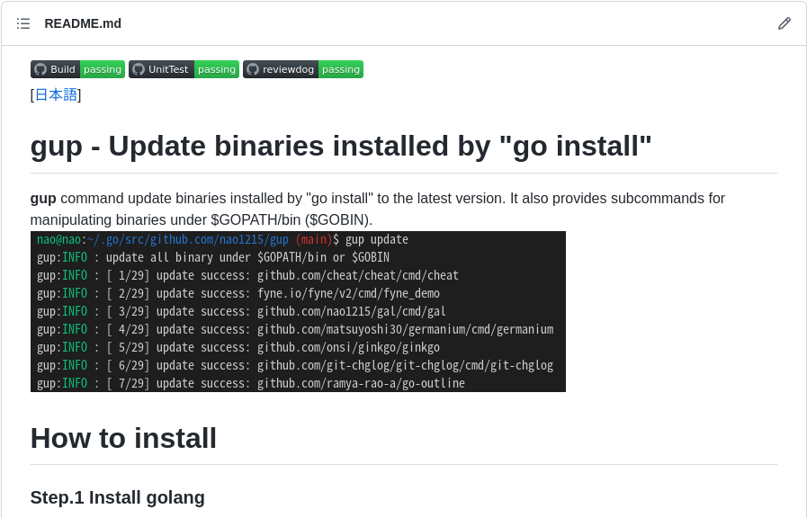

## 前書き：人生で初めてGitHub Star 50個超え

["go install"したバイナリをアップデートするgupコマンド](https://github.com/nao1215/gup)が、公開から一週間でGitHub Starを50個以上獲得しました！ちょっと嬉しい。最新の仕様は、[Zenn](https://zenn.dev/nao1215/articles/aef3fe318848d6)で説明しています。

gupコマンドの初期版は、4〜6時間で完成しました。それなのに1ヶ月以上かけて作成した[MimixBox（golang製のBusyBox）](https://github.com/nao1215/mimixbox)のStar数をアッサリと抜き去り、私を悲しい気持ちにさせました。

<blockquote class="twitter-tweet">
なんだろう、1.5ヶ月かけて作ったOSS（画像の上側）のStar数を一日で抜くの止めてもらっていいですか？  golangのバイナリをアップデートするだけのgupコマンドが、ここまで伸びるとは思わなかった。 gup（<a href="https://t.co/gvTIlaoh9Q">https://t.co/gvTIlaoh9Q</a>）はシェルでも作れるレベルなのに……OSS良く分からん。 <a href="https://t.co/wVCKmG9TN5">pic.twitter.com/wVCKmG9TN5</a>
— Nao31 (@ARC_AED) <a href="https://twitter.com/ARC_AED/status/1496093095641124865?ref_src=twsrc%5Etfw">February 22, 2022</a></blockquote>

今回、GitHub Starを思いがけず大量獲得したため、「GitHub Starを獲得する方法論があるのではないか」と考え、調査してみました。本記事では、その方法論の内容と「gupコマンドでは、それらの方法論を実践していたかどうか」を記載します。

## GitHub Starを獲得するためにすべき事

[creativeit](https://www.creativeit.io/blog/how-to-collect-github-stars-and-create-github-trending-repos-1)や[dev.to](https://dev.to/nastyox1/8-concrete-steps-to-get-stars-on-github-355c)、[その他のサイト](https://zenn.dev/hand_dot/articles/542449fe4fc771)（複数）で語られていた方法の中で、他の人の力を借りず再現できる内容は以下の通りでした。

1. 綺麗かつ分かりやすいREADMEを作成
2. SNS共有用に、リポジトリの[Open Graphic Protocol](https://e-words.jp/w/OGP.html)を設定
3. RedditやTwitterで宣伝

上記とは逆に、「他の人の力を借りるパターン」はインフルエンサーに宣伝してもらう等です。知人にインフルエンサーがいる場合は宣伝を気軽にお願いできますが、いない場合は依頼のハードルが上がります（依頼しても拒否られる可能性もあります）。

## gupの場合：READMEは無骨

gupコマンドは、格好良いロゴも綺麗なアイキャッチもないので、スクショをペタッと貼ったREADMEでした。ターミナル画像（スクショ）は、gifですらありません！

文字だけのREADMEよりマシですが、[最近のOSSはもう少し小綺麗](https://github.com/sharkdp/bat/blob/master/doc/README-ja.md)ですよね。

ユーザー視点で考えると、綺麗なREADMEは「おっ、このOSS良さそう」と目を引かれる要因になるでしょう。開発者視点で考えると、「ロゴやアイキャッチをどうやって作ろう」と困ってしまうのではないでしょうか。

ロゴやアイキャッチを頑張るなら、良い感じの無料ロゴメーカーを探すか、[ココナラ](https://coconala.com/)等で制作依頼（有料）を出すか。私の場合は、気合入っていないOSSなら、スクショで十分じゃないかと考えています（自作したOSSがヒットするか分からないので）

## gupの場合：OGP設定をしていない

GitHubでは、リポジトリの\[Settings\] > \[General\] > \[Social preview\]からOGP設定ができます。gupでは、OGP設定をしませんでした。その理由は、ロゴもアイキャッチもないので、OGP設定用の画像がないから。

以下、OGP設定がされている場合とされていない場合の比較です。ちなみに、[下側（ubumeコマンド）](https://github.com/nao1215/ubume)はOGPを設定していますが、Starを獲得できていません！

\[caption id="attachment\_7886" align="aligncenter" width="397"\] OGP設定なし\[/caption\] \[caption id="attachment\_7887" align="aligncenter" width="396"\] OGP設定あり\[/caption\] 

## gupの場合：Redditで宣伝し、効果があった

gupコマンドは、[Redditで宣伝記事](https://www.reddit.com/r/golang/comments/sxr6jn/gup_update_binaries_installed_by_go_install/)を書いており、9,300PVを集めました。RedditからGitHubへの流入は100人ぐらい来ていました。Redditに書いた次の日には、Starを10〜20個ほど獲得していました。

[GitHub Issueでコメント](https://github.com/nao1215/gup/issues/2)を残す人がいたり、Redditで意見もいただけました。そのため、Redditへの投稿は、費用対効果の高い活動だと考えてます。ただし、一回限りの技だと思います。

（ちなみに、上記の画像でGitHub内から流入が多い理由は不明）

## 番外：インフルエンサーのツイートは強い

gupコマンドは、golang界隈で有名なmattn氏によってツイート（紹介）されました。

その結果、Twitterからの流入がRedditからの流入より多い結果になりました。このツイートをきっかけに、日本人からStarを獲得できたり、Pull Requestが飛んできたりしました。インフルエンサー強い。

<blockquote class="twitter-tweet">
go install でインストールしたバイナリを更新するプログラム。go version -m を使う手法。 <a href="https://twitter.com/hashtag/golang?src=hash&amp;ref_src=twsrc%5Etfw">#golang</a> / “GitHub - nao1215/gup: gup - Update binaries installed by "go install"” <a href="https://t.co/PKmfRNRCAc">https://t.co/PKmfRNRCAc</a>
— mattn (@mattn_jp) <a href="https://twitter.com/mattn_jp/status/1495990584322162693?ref_src=twsrc%5Etfw">February 22, 2022</a></blockquote>

## 最後に：上記の方法論、再現性無いですよね？

結局の所、**「OSSがユーザーの課題を解決しているか」**という点が、小手先のStar獲得方法より大事という印象を持ちました。微妙なOSSを凄そうに見せかけても、ユーザーは見抜く筈です。

gupコマンドは、golangユーザーの「"go install"で取得したバイナリを一括でアップデートする方法がない」という課題を解決したから、ある程度Starを獲得できました。その一方でMimixBoxコマンドは趣味で作成したOSSであり、既存の課題は何も解決していません。[BusyBox（C言語）](https://www.busybox.net/)のGolang実装であり、Mimixboxは間違いなく劣化版BusyBoxです。

MimixBoxもRedditで宣伝していますが、gupコマンドと比較するとそこまでヒットしていません。今後は、「趣味以外で作るOSSは、想定ユーザーを設定してから開発しようかな」と考えています。Star多いとモチベが維持できるので。

## おまけ：2022年に作成したGolang製コマンド一覧

https://debimate.jp/2022/02/05/%e3%80%90golang%e3%80%912022%e5%b9%b4%e3%81%ab%e9%96%8b%e7%99%ba%e3%81%97%e3%81%9f%e8%87%aa%e4%bd%9ccli%e3%82%b3%e3%83%9e%e3%83%b3%e3%83%89%ef%bc%8f%e3%83%a9%e3%82%a4%e3%83%96%e3%83%a9%e3%83%aa/
