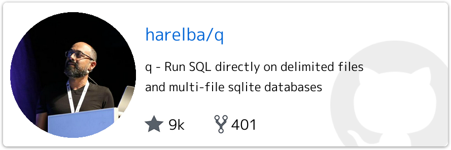
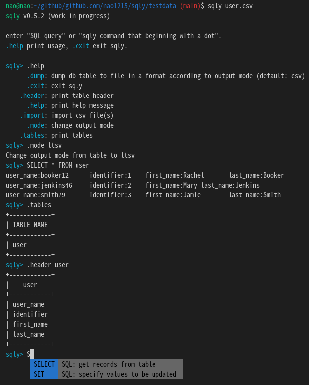

## 前書き

本記事は、[フラー株式会社](https://www.fuller-inc.com/) [Advent Calendar 2022](https://qiita.com/advent-calendar/2022/fuller-inc)の5日目の記事です。4日目の記事は、「[フラーを卒業していった優秀な学生アルバイトに向けたポエム](https://furusax0621.hatenablog.com/entry/2022/12/04/000000)（[@furusax](https://twitter.com/furusax)）」です。ポエムと言いつつ、技術的なお話でしたね。

本記事では、CSV／TSV／LTSV／JSONに対してSQLを実行する"sqly"コマンド（自作ツール）について解説します。sqlyの基本機能を簡単に説明した後、開発した背景、設計、使用しているパッケージについて説明し、利用例と今後の展望を説明します。

sqlyで使用している言語はGolang、主たる依存ライブラリはSQLite3です。

[](https://github.com/nao1215/sqly)

なお、sqlyの名前の由来は「有名な [jmoiron/sqlx](https://github.com/jmoiron/sqlx) を超えるツールを作る（xの次はy）」という気持ちを込めて命名しました。嘘です。正しい由来は、スラングの「literally（マジで？）」のように「（CSVに）SQLぅ？（正気かコイツ）」というニュアンスで名付けました。

## sqlyの基本機能

sqlyの目玉機能は、シェル（クライアント）を備えていることです。以下のgif画像で、シェルを使った実行例を示します。


上記以外の基本機能は、以下のとおりです。

- SQLite3シンタックスによるSQLサポート
- CSV／TSV／LTSV／JSON間でのファイル形式変換（例：CSV to LTSV変換）
- CSV／TSV／LTSV／JSON／ASCIIテーブルのいずれかで、SQL実行結果を出力
- SQLシンタックス入力補完
- 入力履歴管理
- emacsキーバインド
- sqlyシェルヘルパーコマンド

## sqlyを開発した背景

私は、巨大なCSVを簡単にチェックするためにsqlyを開発しました。

フラー株式会社のとある案件では、アプリのマスターデータをCSVで管理しています。ここでのCSVは、以下の特徴／制約があります。

- サイズが大き目（20,000行×300列以上、10万行など）
- golangでCSVファイルを読み込み、DBの複数のテーブルにレコードを挿入
- CSVとDBテーブルは、1対1で対応していない（一つのCSVのデータが、複数テーブルに挿入される）
- CSVファイルを編集する人は、エンジニアではない。また、編集者が複数存在
- 月に数回、CSVを更新

上記の特徴／制約を踏まえた上で、CSVを用いた運用の辛かった点は以下のとおりです。

CSV運用の辛かった点

- Excel／Numbers／Google Sheetsの起動に時間がかかる（稀に良くクラッシュする）
- DBへのインポート時に型不一致エラー（CSVカラムの記載ミス）が発生し、該当箇所を探すコストが高い　　

例えば、数値を書くべきカラムに文字列を書いた場合、デコードエラーが発生します。残念なことに、エラーメッセージが「デコードエラーが起きたよ！（どのカラムが悪いかは教えない！）」という状態なので、問題のあるカラムを人力で探す作業が発生します。

Google Sheetsを用いて、300以上あるカラムの中から問題のあるカラムを探すことは、非常にストレスフルです。エンジニアの仕事ではありません。なので、「SQLで検索をかけ、楽をしたい」と考え、sqlyを開発しました。

（「CSVデコードエラーのメッセージを変えたほうが良いのでは？」という正論は、ここでは置いておきます）

## 類似のツールはないのか？

類似のツールはあります。例えば、以下の4つが挙げられます。多機能さでは、trdsqlがずば抜けていました。

[](https://github.com/noborus/trdsql)[](https://github.com/harelba/q)[](https://github.com/mithrandie/csvq)[](https://github.com/dinedal/textql)

上記のツールは、どれも素晴らしいものでした。

しかし、私にとっては問題がありました。私はSQLが苦手で、SQLシンタックスをタイピングするのが遅いです。また、補完のない状態でSQLを書くのは苦痛でした。

このような背景から、SQL入力補完機能があるツールが欲しかったです。ツールを探す／試すのが面倒だったので、自作を選びました。思い立ってから一週間後には、sqlyができました。

## sqly の設計

sqlyは、CSV／TSV／LTSV／JSONを読み込んだ後に、読み込んだデータをSQLite3（in-memory）に挿入し、SQLite3に対してSQLを実行する仕組みになっています。

この設計の利点は、SQLパーサーを自作する必要がなくて実装が楽（大事）という点に集約されます。対応ファイル形式が増えたとしても、DBにデータ挿入する処理を実装すれば、SQLパーサー部分の修正が発生しません。

以下のブロック図は、sqlyの構成を示しています。

ユーザーとのインターフェースにsqly shell（sqliteやmysqlのクライアントコマンドに似たもの）があり、ユーザーの操作を楽にするためのヘルパーコマンド（例：ファイルをDBにインポートするコマンド）が定義されています。sqlyは、ヘルパーコマンドを経由して、各ファイルを読み書きし、SQLを実行する流れになっています（若干嘘をついています）


sqlyは、DDD（Domain Driven Design、ドメイン駆動設計）を採用し、その設計を実現するためにレイヤードアーキテクチャを採用しています。そもそも論として、sqlyレベルのコード規模でDDDを採用する必要は無いと考えましたが、以下の利点があったため採用しました。

- **テストコード作成の負荷軽減**
    - DBにデータを投入せずにテストコードを書ける
    - とは言え、テストデータファイルを用意すればsqlyは簡単にDBの準備ができるため、一般的なWebサービス用サーバーアプリと比べて恩恵は少なかった
- **インフラストラクチャ層（DB）の変更が容易**
    - SQLite3だけでなく、MySQLやPostgreSQLにも対応可能
    - 対応可能だが、まだ対応はしていない

[loov/goda](https://github.com/loov/goda) で、sqlyパッケージ内の依存関係を確認すると、左（UIに近い部分）から右（DBに近い部分）に依存が流れていき、右端のmodelパッケージに依存が集まっている形になります。依存関係が破綻している部分がない（== 自分より上位レイヤーに依存しているパッケージがいない）ので、見た目上は綺麗な構成です。


ここでモデリングについて熱く語れると格好良いのですが、sqlyでは雑に考えました。具体的には、「各インプットデータからDBテーブルを表すモデルに変換しやすければ、設計として十分」と考えました。

この雑さを反映するように、sqlyでは「ファイル形式と一対一対応するモデル（例：CSVファイルに対応したCSVモデル）」と「DBテーブル一つに対応するモデル（Tableモデル）」が存在し、sqly内部で最終的にTableモデルへ変換するシンプルな構造となっています。


上記の変換図を書いて失敗に気づきましたが、DBテーブル内容をファイルへアウトプットする時はTableモデルから直接各ファイル形式にデータを変換しています。TableモデルをCSV モデルなどに変換してからファイル出力すべきでした。雑に考えると駄目ですね。反省。

最後に余談ですが、フラー株式会社の最新アーキテクチャではDBトランザクション管理はユースケース層の責務です。この設計方針となった理由は、インフラストラクチャ層でトランザクションを管理した場合はDBに最も近い層にロジックが入り込み、ユニットテストの作成が大変だったからです。

その一方で、sqlyはインフラストラクチャ層でトランザクションを管理します。理由は、sqlyでは1回のトランザクションで発行するクエリが1つだけのため、インフラストラクチャ層にロジックが入り込む余地がないからです。

## 利用したパッケージ選定と採用理由

sqlyの構想を実現するには、以下の機能が必要でした。これらを全て自作すると、膨大な工数が必要となるので外部パッケージ（OSS、ライセンスの緩いもの）を探しました。

- SQLite3 ドライバ
- ターミナル上でのユーザー入力取得（一行単位ではなく、一文字単位の取得）
- Dependency Injectionを楽にするパッケージ
- Golden Test 用のテスティングフレームワーク

SQLite3ドライバは、[mattn/go-sqlite3](https://github.com/mattn/go-sqlite3)を採用しました。採用理由は、[database/sqlインターフェース](https://pkg.go.dev/database/sql)を満たしているパッケージであること、採用事例が多いこと、[mattn氏](https://twitter.com/mattn_jp)への信頼感が挙げられます。他のパッケージも選択肢にありましたが、クラッシュ事例があったので採用しませんでした。

ターミナル上でのユーザー入力取得は、最初に[mattn/go-tty](https://github.com/mattn/go-tty)を採用した後、[c-bata/go-prompt](https://github.com/c-bata/go-prompt)に乗り換えました。採用理由は、go-promptは入力補完や入力履歴をサポートしており、実装量がgo-ttyより格段に減るからです。しかし、go-promptは開発が年単位で停滞し、PRが溜まっています。コマンド終了後にターミナル入力が見えなくなるバグが放置されていたりします（sqly側でワークアラウンド対応を追加しました）。致命的な問題が起きたときに、PRで貢献するか代替案を探すかどうかで迷っています。

Dependency Injectionを楽にするパッケージは、[google/wire](https://github.com/google/wire)を採用しました。DDDを採用するとDIが増えるため、このようなパッケージは実装負荷を下げてくれます。採用理由は、会社で使っていることと、私は使用経験がなくて勉強したかったからです（テクニカルマネージャーを担当しているとコードを書く暇が殆ど無く、キャッチアップが会社でできない......）

Golden Test用のテスティングフレームワークは、[sebdah/goldie](https://github.com/sebdah/goldie) を採用しました。Golden Testというテスト方式は、SQL結果をゴールデンファイルとして管理し、テスト時にゴールデンファイルとsqly出力結果を比較する作業を楽にするために採用しました。

goldieは「調べたパッケージの中で一番スターが多いからコレにしよう！」と雑に考え、採用しました。が、Windows非対応、deprecatedな関数の使用、低いテストカバレッジに気づいて、即座に[フォーク](https://github.com/nao1215/golden)して自分の手元で管理することにしました。

（オリジナルの開発者がPRを放置していたり、開発が停滞していたのでフォークしました）

## sqlyの使用例

sqlyの使い方の詳細は、[GitHub](https://github.com/nao1215/sqly)で確認してください。本記事では、簡単な使い方を紹介するだけとします。

前提として、sqlyには「シェルモード」と「ノンシェルモード」があります。この2つを切り分けるのは、sqlyにsqlオプション引数としてSQLクエリを渡して起動したかどうかです。渡さなかった場合は、sqlyがシェルモードで起動し、ユーザーは対話的にSQLクエリを実行できます。

sqlyの必須引数は、インプットファイル（例：CSVファイル）へのパスです。sqlyはファイルの拡張子から自動的にファイル種別を判別し、DBへインポートします。DBへインポートするとき、テーブル名称はファイル名（拡張子を除く）としています。

制約事項ですが、sqlyはインポート対象がCSVやTSVの場合、ファイルの先頭がヘッダ行であることを期待しています（実装上の制約ではなく、私が面倒くさがっただけです）

以上を踏まえて、ノンシェルモードにおけるSQLクエリ実行結果を示します。この例では、user.csv と identifier.csv を INNER JOIN（内部結合）して、position が manager のユーザーを抽出しています。

```
$ cat user.csv 
user_name,identifier,first_name,last_name
booker12,1,Rachel,Booker
jenkins46,2,Mary,Jenkins
smith79,3,Jamie,Smith

$ cat identifier.csv 
id,position
1,developrt
2,manager
3,neet

$ sqly --sql "SELECT user_name, position FROM user INNER JOIN identifier ON user.identifier = identifier.id WHERE position = 'manager'" user.csv identifier.csv 
+-----------+----------+
| user_name | position |
+-----------+----------+
| jenkins46 | manager  |
+-----------+----------+
```

シェルモードの例を以下に示します。シェルモードでは”.”始まりのsqlyヘルパーコマンドが使用できます。ヘルパーコマンドを用いて、ファイルをインポート、DBテーブルをエクスポート、SQL結果の出力形式変更などを行います。



## 今後の展望

sqlyは、2022年11月に実装したばかりなので、まだ枯れたツールではありません。テストカバレッジは78%ありますが、バグが潜んでいるはずです。ここからさらにツールとして安定させるには、まずは自分がドッグフーディングしてバグを検出する必要があると考えています。

また、機能面では以下の機能追加を検討しています。

- 文字コードを自動検出し、必要であればUTF-8に変換する機能
- sqlyシェルにcd, pwd, lsなどの一般的なシェルで使うコマンドを一部導入
- Excelファイルのインポート／エクスポート機能
- 圧縮ファイル（例：\*.gz）のインポート機能
- MySQL／PostgreSQLドライバのサポート
- 各種パッケージマネージャでの配布

## 最後に

私はフラー株式会社に転職してから1年経っていませんが、転職後に勉強を始めたGolangで23個のツールを作りました（形にならなかったツール含む）。数を作ると、徐々にOSSプロジェクトが上手に作れていくようになり、実践に勝る訓練はないなと感じるばかりです。

来年は、Androidアプリ（Kotlin）の習得を第一目標として、「Androidアプリ／Golangによるサーバーアプリ／AWSによるインフラ」を一人で実装できるようになろうと考えています（フルスタックエンジニアになりたいというモチベーションではありません。前職でGUI〜デバドラまで実装していたので、サーバーしかできない現状が気持ち悪いだけです）

6日目のアドベントカレンダーは、「[Androidエンジニアになってから4年経った振り返り](https://nanaten.github.io/blog/for-four-years/)（[@m.coder](https://twitter.com/_m_coder)）」です。今気づけば、自分の前後（4日目、6日目）、二人共テックリードですね。
