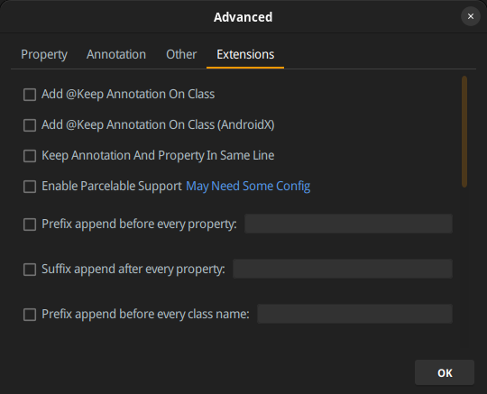

### 前書き

Androidアプリでは、RESTful APIの実行結果（≒ jsonデータ）に対応するdata classを作成し、[kotlinx.serialization](https://github.com/Kotlin/kotlinx.serialization)でjsonをdata classにデシリアライズする処理があります。

data classを利用する理由は、フィールドをvalとして宣言すればdata classの不変性（Immutable）を保証できる点、アクセッサメソッドなど（getters、setters、equals()、hashCode()、toString()）が自動生成されるので実装量が減る点が挙げられます。

新規のRESTful APIのレスポンス（json）をdata classをマッピングする場合は、まずはマッピング先となるdata classを定義する必要があります。フィールドが2〜3個であれば温かみのある手作業で実施しますが、10個以上となると面倒です。

このような面倒臭さを解消するツールを調べたところ、JSON To Kotlin Classプラグインがあったので、その使い方を備忘録として残します。[Web版](https://json2kt.com/)もありますが、ファイルをダウンロードする手間があるので、私はプラグインを使うことにしました。

### 検証環境

Android Studio Dolphin | 2021.3.1（ちょっと古い）、JSON To Kotlin Class 3.7.4を使用しています。

開発環境としてUbuntu 22.04を使用していますが、Windows, Mac環境でも動作すると思われます。

```
           ./oydmMMMMMMmdyo/.              nao@nao 
        :smMMMMMMMMMMMhs+:++yhs:           ------- 
     `omMMMMMMMMMMMN+`        `odo`        OS: Ubuntu Budgie 22.04.1 LTS x86_64 
    /NMMMMMMMMMMMMN- `sN/       Host: B450 I AORUS PRO WIFI 
  `hMMMMmhhmMMMMMMh               sMh`     Kernel: 5.19.0-35-generic 
 .mMmo- /yMMMMm`              `MMm.    Uptime: 7 days, 16 hours 
 mN/       yMMMMMMMd- MMMm    Packages: 3941 (dpkg), 1 (brew), 4 ( 
oN- oMMMMMMMMMms+//+o+:    :MMMMo   Shell: bash 5.1.16 
m/          +NMMMMMMMMMMMMMMMMm. :NMMMMm   Resolution: 2560x1080, 1920x1080 
M`           .NMMMMMMMMMMMMMMMNodMMMMMMM   DE: Budgie 10.6.1 
M- sMMMMMMMMMMMMMMMMMMMMMMMMM   WM: Mutter(Budgie) 
mm`           mMMMMMMMMMNdhhdNMMMMMMMMMm   Theme: Yaru-dark [GTK2/3] 
oMm/        .dMMMMMMMMh:      :dMMMMMMMo   Icons: ubuntu-mono-dark [GTK2/3] 
 mMMNyo/:/sdMMMMMMMMM+          sMMMMMm    Terminal: tilix 
 .mMMMMMMMMMMMMMMMMMs           `NMMMm.    CPU: AMD Ryzen 5 3400G (8) @ 3.700GH 
  `hMMMMMMMMMMM.oo+.            `MMMh`     GPU: AMD ATI Radeon Vega Series / Ra 
    /NMMMMMMMMMo                sMN/       Memory: 17088MiB / 30029MiB 
     `omMMMMMMMMy.            :dmo`
        :smMMMMMMMh+-`   `.:ohs:                                   
           ./oydmMMMMMMdhyo/.                                      
```

### JSON To Kotlin Classのインストール

1. Android Studioメニューの「File」->「Settings」をクリック
2. 「Plugins」を選択し、右上の「Marketplace」タブをクリック
3. 検索ボックスに「JSON To Kotlin Class」と入力し、検索結果から「JSON To Kotlin Class」を選択
4. 「Install」ボタンをクリックして、プラグインをインストール
5. プラグインがインストールされたら、Android Studioを再起動


### JSONからKotlin data classを作成

今回の例では、[GitHub APIの特定ユーザーのリポジトリリストを取得するAPI](_wp_link_placeholder)（GET /users/{username}/repos）のレスポンスをdata classに変換します。変換した結果（data class）は、jp.debimate.leadtime.domain.modelパッケージのRepository data classとして保存します。

1. Android StudioのProject（デフォルトでは画面左にあるファイラ）でdata classを作成したいpackageを右クリックし、「Kotlin data class File from JSON」を選択
2. \[Generate Kotlin Data Class Code\]画面の「JSON Text」フィールドにJSONを入力
3. \[Generate Kotlin Data Class Code\]画面の「Class Name」フィールドにクラス名を入力。今回はRepositoryとします。

上記の手順3. まで実施すると、以下の画像の状態になります。


4\. \[Generate Kotlin Data Class Code\]画面の「ADVANCED」ボタンを押下し、生成するdata classの細かい設定を行う（任意）。設定項目を以下の画像で示します。フィールドをValにするかVarにするか、nullを許容するか、どのライブラリでデシリアライズするか等はjsonによって設定値が異なると思われます。




INPUTとして渡したjsonが複雑すぎると、不要なクラスを生成する傾向が見られるので、適宜jsonを整形してからJSON To Kotlin Classを利用した方が良さそうです（GitHub APIドキュメントにサンプルとして提示されていたjsonをそのまま利用したら、不自然なクラスが生成されました）

### 最後に

Kotlinは、RESTful APIのラッパー（クライアント）ライブラリが無い印象を受けました。比較対象はGolangですが、「見つからない…」と困ることが多いです。Javaライブラリは見つかるので、そちらを皆さん使っているのでしょうか？
