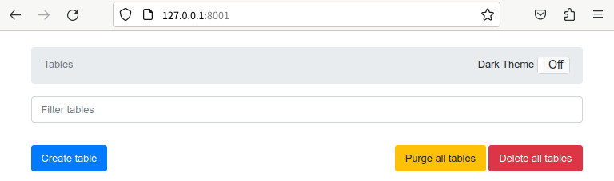

## 前書き：DynamoDB、はじめまして

本記事では、DynamoDBをローカルで起動する方法を説明します。[DynamoDB](https://aws.amazon.com/jp/dynamodb/)は、AWSが提供するNoSQLデータベースです。サーバーレスのKey Valueストアであり、フルマネージドサービスです。

## 検証環境

本記事は、Ubuntu環境で検証しています。Docker Composeを使用するため、別途インストールが必要です。

```
            .-:/++oooo++/:-.               nao@nao 
        `:/oooooooooooooooooo/-`           ------- 
      -/oooooooooooooooooooo+ooo/- OS: Ubuntu Cinnamon 23.04 x86_64 
    .+oooooooooooooooooo+/-`.ooooo+.       Host: B450 I AORUS PRO WIFI 
   :oooooooooooo+//:://++:. .ooooooo:      Kernel: 6.2.0-32-generic 
  /oooooooooo+o:`.----.``./+/oooooooo/     Uptime: 1 hour, 31 mins 
 /ooooooooo+. +ooooooooo+:``/ooooooooo/    Packages: 5364 (dpkg), 2 (brew), 4 ( 
.ooooooooo: .+ooooooooooooo- -ooooooooo.   Shell: bash 5.2.15 
/oooooo/o+ .ooooooo:`+oo+ooo- :oooooooo/   Resolution: 2560x1080 
ooo+:. .o: :ooooo:` .+/. ./o+:/ooooooooo   DE: Cinnamon 5.6.7 
oooo/-`.o: :ooo/` `/+.     ./.:ooooooooo   WM: Mutter (Muffin) 
/oooooo+o+``++. `:+- /oooooooo/   WM Theme: Green-Submarine (Default) 
.ooooooooo/``  -+:`          :ooooooooo.   Theme: QogirBudgie-Dark [GTK2/3] 
 /ooooooooo+--+/`          .+ooooooooo/    Icons: Yaru-red-dark [GTK2/3] 
  /ooooooooooo+.`      `.:++:oooooooo/     Terminal: gnome-terminal 
   :oooooooooooooo++++oo+-` .ooooooo:      CPU: AMD Ryzen 5 3400G (8) @ 3.700GH 
    .+ooooooooooooooooooo+:..ooooo+.       GPU: AMD ATI Radeon Vega Series / Ra 
      -/oooooooooooooooooooooooo/- Memory: 6046MiB / 30012MiB 
        `-/oooooooooooooooooo/:`
            .-:/++oooo++/:-.                                       
                                                                   

```

```
$ docker compose version
Docker Compose version v2.6.1                                  

```

## Docker上でDynamoDB本体と管理画面を立ち上げ 

[DynamoDBをローカル上で立ち上げる方法がAWS公式サイト](https://docs.aws.amazon.com/ja_jp/amazondynamodb/latest/developerguide/DynamoDBLocal.DownloadingAndRunning.html)に書かれています。jarファイルをローカルにインストールしてDynamoDBを立ち上げる方法もありますが、JREを準備する必要があり、手間がかかります。

そこで、[AWS公式が提供しているamazon/dynamodb-local（Dockerイメージ）](https://hub.docker.com/r/amazon/dynamodb-local)を利用して、DynamoDBをローカルに立ち上げます。ローカルで立ち上がったDynamoDBをAWS CLIで操作するのは億劫なので、管理画面ブラウザから操作できるようにします。具体的には、[aaronshaf/dynamodb-admin（Dockerイメージ）](https://github.com/aaronshaf/dynamodb-admin)を使用します。こちらのイメージはAWS公式提供ではないので、気になる方はAWS CLIで操作しましょう。

## compose.ymlの中身

```
version: '3.8'
services:
  dynamodb-local:
    image: "amazon/dynamodb-local:latest"
    container_name: dynamodb-local
    ports:
      - "8000:8000"
    volumes:
      - "./dynamodb:/home/dynamodblocal/data"
    working_dir: /home/dynamodblocal
    command: "-jar DynamoDBLocal.jar -sharedDb -dbPath ./data"

  dynamodb-admin:
    image: "aaronshaf/dynamodb-admin:latest"
    tty: true
    container_name: dynamodb-admin
    ports:
      - "8001:8001"
    depends_on:
      - dynamodb-local
    environment:
      DYNAMO_ENDPOINT: http://dynamodb-local:8000                             

```

## 実行結果

以下のコマンドでDockerをバックグラウンド実行する。初回実行時は、イメージの取得から始まるため、時間がかかります。

```
$ docker compose up -d

```

Dockerの起動が確認できたら、http://127.0.0.1:8001にアクセスします。DynamoDBの管理画面が表示されていれば成功です。



余談ですが、DynamoDB localは内部的に[SQLite](https://www.sqlite.org/docs.html)を使用しています。今回示した例ではファイルにデータを書き込みますが、インメモリーに書き込むこともできます。その場合は、dynamodb-localイメージ（compose.yml）のcommandを以下の設定に変更します。

```
command: "-jar DynamoDBLocal.jar -sharedDb -inMemory"
```

## 最後に

AWSの勉強を真面目に始めましたが、サービスが多すぎて覚えられない。
