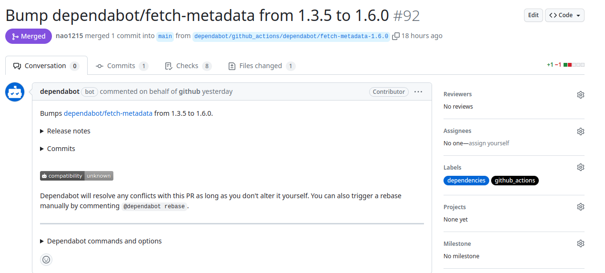

## 前書き：絶滅へ向かうJenkinsオジサン

結論ですが、GitHub公式ドキュメント「[Dependabot でアクションを最新に保つ](https://docs.github.com/ja/code-security/dependabot/working-with-dependabot/keeping-your-actions-up-to-date-with-dependabot)」を読めば、GitHub ActionsのActionを最新に保つ方法が分かります。ちなみに私は、現職のテックリードから教えていただいて「なにこれ便利だ」と思った記憶があります。

（記事に関係のない導入の始まり）

最近、新卒の子が作ったPull RequestのApproveコメントにJenkinsマスコットキャラ（執事） LGTM画像を貼ったのですが、「知らなかった」と言われて世代を感じました。私が新卒の頃（2015年）は、まだJenkinsオジサン（現実世界でJenkinsの設定弄りを頑張っているオジサン）が生き残っていたのですが、最近は絶滅危惧種かもしれません。

2023年現在ではJenkinsの代替として、GitHub ActionsなどのCI／CD（継続的インテグレーション／継続的デリバリー）ツールを使う人たちが多数派だと思われます。

GitHub Actionsは、複数のActionを利用してワークフローを動作させています。Actionは定期的にアップデートされますが、古いActionを使用していてもワークフローが壊れないことが多いです。

そのため、Actionの新しいバージョンが提供されていることに気づかない時があります。私の経験上では、初めて確認するリポジトリにはそれなりの頻度（10〜20%程度の割合）で古いActionが含まれています。

Actionの更新チェックを忘れない便利な方法として、DependabotによるGithub Actionsの定期更新があります。本記事では、定期更新方法を説明しますが、記事冒頭の公式ドキュメントを読む方が正確です。

## 設定方法

\`.github/dependabot.yml\`に以下の設定を追加すると、定期的にActionの更新を促すPRが作成されます。更新頻度（interval）は、daily（日）、weekly（週）、monthly（月）から選べます。

```
version: 2
updates:
  - package-ecosystem: "github-actions"
    directory: "/"
    schedule:
      # 毎週GitHub ActionsのAction更新をチェック
      interval: "weekly"
```

以下が作成されたPRの例です。



## 最後に

短いですが、終わりです。

私はテックリードから本記事の内容を教えていただいたので、「当然（会社の）他の人も把握しているだろう」と考えていました。しかし、複数のリポジトリを覗いた時に「そこまで啓蒙されてないな？」と感じたので、記事を書いて広める形を取りました。

今まで真面目に考えてきませんでしたが、受託開発の文脈だと管理対象リポジトリ数に対してGitHub Actionsメンテナ不足しがちになる傾向があるのではないでしょうか。歴史を繰り返している感があるのですが、深刻なJenkinsオジサン不足ならぬGitHub Actionsオジサン不足が起きているのかな、と感じた次第です。
