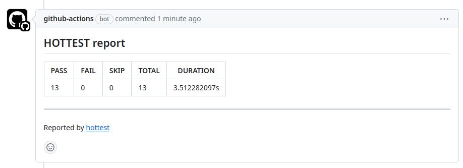

## 前書き 

本記事は、[フラー株式会社 Advent Calender 2023](https://qiita.com/advent-calendar/2023/fuller-inc) の4日目の記事です。3日目は、[@ujikawa1026](https://qiita.com/ujikawa1026)さん の「[マネージャーはなぜ忙しいのか。3年間やって少し分かってきたこと](https://namaninotiteti1026.hatenadiary.jp/entry/2023/12/02/232218)」です。

## 本記事の主題：hottestの紹介／宣伝

本記事では、2023年に私が開発したOSSの中で出来が良い部類の[nao1215/hottest](https://github.com/nao1215/hottest) を紹介します。hottestは、E2Eテスティングフレームワークである[go-spectest/spectest](https://github.com/go-spectest/spectest)の開発中に生まれたサイドプロジェクトです。

以下のデモ（gif画像）が示すように、hottestはテスト結果をドットで表現し、テスト終了後に失敗したテストのエラーメッセージを表示し、最後に成功／失敗／スキップしたテストの情報を標準出力します。非常にシンプルで、実装も単純なツールです。


なお、[go-spectest/spectest](https://github.com/go-spectest/spectest)についても軽く触れると、spectestはE2Eテスト結果からMarkdownドキュメントを生成する機能を持つE2Eテスト用ライブラリです。[steinfletcher/apitest](https://github.com/steinfletcher/apitest)をフォークし、私が下図のようなMarkdownドキュメント生成機能を新規実装しました。もっと新機能を追加する予定でしたが、私が思い描く機能を追加で実装できる設計ではなかったので、spectestの開発を止める予定です（フルスクラッチで作り直します）


## 何故、hottestが必要だったのか

hottestを作った理由は、以下の2つです。

- BDD -- Behavior Driven Development --で見かける「テスト結果をドットで表す」をspectestに導入したかった。しかし、spectestライブラリに組み込むには技術的制約が多かった。
- エラーが起きたテストをユニットテスト結果ログから探すのが大変だった

1つ目の理由ですが、私はテスト実行中にｽｯｺｺｺと緑色のドットが表示されるのが個人的に好きです。そのため、spectestを用いたテストの実行中にｽｯｺｺｺさせようとしましたが、spectestが各テストの標準出力を握りつぶして、その代わりにドットを表示させる方法を思いつきませんでした。

代案として、外部コマンド（= hottest）から 'go test' を起動して、hottestがテスト結果の標準出力を受け取り、標準出力ログをドットに置換してｽｯｺｺｺする案を思いつきました。ｽｯｺｺｺ。

2つ目の理由ですが、テストコードが数千件に達している場合は、テスト失敗した箇所を標準出力から探し出すのが大変だという課題がありました。テストを個別実行した時は直ぐにエラー原因が分かりますが、テスト全体実行時はテストログを目grepする作業が始まります。

テストケースが多くなると、実行時間が長いのでターミナルを眺めていません。そのため、どのパッケージでエラーが発生したかの検討がつかないことや、ターミナルバッファの上限値を超えてしまってエラー部分のログが残っていないことがあります。この場合は、もう一度テストを実行する羽目になります。

## 課題を解決する既存ツールはないのか？

課題を解決するツール（部分的に解決するツールを含む）は、3個ありました。

BDDスタイルのドット出力をするツールには、[gotestyourself/gotestsum](https://github.com/gotestyourself/gotestsum)がありました。1.7k starsと表示されている通り、非常に良く出来ているツールです。テスト結果を複数の形式（例：ドット形式、パッケージ形式など）で標準出力でき、テスト結果のサマリを出力します。

多くの人には、gotestsumがベストなツールだと思われます。しかし、私はテスト実行中にターミナルが派手に暴れて表示崩れを起こすのを見て、目に悪そうだなと思ってしまいました。

残りの2つのツールは、[rakyll/gotest](https://github.com/rakyll/gotest) と [kyoh86/richgo](https://github.com/kyoh86/richgo) であり、これらはテスト結果の標準出力に色を付けるものです。残念ながら、エラーが発生したテストを探す手間がそこまで減りませんでした。あと、ｽｯｺｺｺしないので、not for me でした。

## hottestを開発開始（処理シーケンス概要）

自分の欲しい物を探すのが手間なので、自分で作ることにしました。悪い癖です。

rakyll/gotest の設計が単純であったため、コードの50%程度を参考にしました（フォークしました）。機能的には「gotestより一歩だけ進んでいる（'g' --> 'h'）」と考え、コマンド名としてhotestが頭に浮かびました（今思えば、どこが一歩なのかサッパリ分かりませんが）

その後、脳内でゴリラが「hotestは、綴りが違う！hottest！」と怒ってきたので、一般的な単語である "hottest" という名称にしました。ユニットテストで最もhottestな部分（エラーメッセージ）を取り扱うので、丁度いいと思いました。ググラビリティは低いけど。

hottestの処理シーケンスを簡単に説明します。

なお、hottestは'go test'のラッパーコマンドであるため、オプションは'go test'と同等です。

1. hottestの起動時引数（os.Args）を'go test'コマンドに渡して、テスト実行開始
2. 'go test'の標準出力／標準エラーをgoroutine内でパース
3. 全テスト完了後に、エラーが発生したテストのメッセージを抽出し表示
4. テスト統計情報の表示

パース中に実行する事は、「テスト結果に応じたドット（緑、赤、青）の出力」、「テスト結果の統計情報を集計（例：何件成功したかなど）」、「'go test'の標準出力／標準エラーを全文保存」です。

'go test'は、テスト結果に"=== RUN", "--- PASS", "--- FAIL", "--- SKIP"などのプレフィックスを付与してくれるため、標準出力／標準エラーを一行ずつ確認して、どのドットを出すべきか判断してます。パースと言うとカッコいいですが、力技です。

エラーが発生している場合は、エラーが起きたテストメソッド開始地点〜終了地点のログをチェックし、その内容を標準出力します。ここはロジックが甘いので、稀にログを取りこぼしてます。

## GitHub Actions と組み合わせて使い勝手を向上

全テストを実行する環境は、基本的にはGitHub Actionsです。

そのため、hottest用Actionsとして [nao1215/actions-hottest](https://github.com/nao1215/actions-hottest) を開発しました。人生で始めてActionsを作りましたが、まだActions自体を自動テストする方法が分からず。

以下のようにGitHub Actionsを作ると、hottest経由でユニットテストを実行します。

```
name: SampleTest

on:
  push:

jobs:
  sample_test:
    name: sample test

    strategy:
      matrix:
        platform: [ubuntu-latest]

    runs-on: ${{ matrix.platform }}

    steps:
      - uses: actions/checkout@v4

      - uses: actions/setup-go@v4
        with:
          go-version: "1"
          check-latest: true
      - name: Download dependencies        run: go mod download
      # ここがhottest関連の記述
      - uses: nao1215/actions-hottest@v1
        with:
          # This argument is same as `go test` command.
          args: '-cover -coverpkg=./... -coverprofile=coverage.out ./...'
```

以下がGitHub Actions workflow上での出力例です。

**テスト成功時**


**テスト失敗時**


## Pull Requestにテスト結果コメント出力

PRにコメントを残す機能は、[k1LoW/octocov](https://github.com/k1LoW/octocov)から強い影響を受けて導入しました。

Advent Calender 2023 の1日目の記事「[カバレッジ計測ツール octocov に関するTips](https://furusax0621.hatenablog.com/entry/2023/12/01/000000)」に書かれている通り、最近の弊社では [k1LoW/octocov](https://github.com/k1LoW/octocov) がブームです。

octocov は、テストカバレッジ集計結果をPRコメントとして残す機能があります。感動的に便利です。PRページを見れば、カバレッジ情報がサッと分かります。この機能に強い影響を受け、hottestでも同様の機能（PRへのコメント）を導入しようと考えました。

具体的なコメント例は、以下の通りです。hottestが新しくPRコメントを残す場合は、古いコメントを削除します（参考元のoctocovは、削除ではなく、最小化します）

**全テスト成功時**



**1件でもテストが失敗している時**


PRコメント機能の実装は、少し手抜きをしています。Advent Calendar（= 本記事）にPRコメント機能の話を書きたいと思った時（2023.12.01）には、まだ影も形もありませんでした。

GolangでGitHub APIクライアント機能を実装するのは、やや時間がかかります。Advent Calendarの準備も時間がかかります。息子と嫁が風邪を引きました。嫁は2023.12.03に試験なので、私はその日にワンオペ確定です。＼(^o^)／ｵﾜﾀ

( ﾟдﾟ)_ﾊｯ_!

hottestがMarkdown（PRコメント本文）を作って、GitHub Actions内でcurlコマンドがGitHub APIを叩いてMarkdownを送信すればええんや！

という流れで、サッと実装できました。将来、書き換えます。

ちなみに、Markdown生成はspectestのサイドプロジェクトに [go-spectest/markdown](https://github.com/go-spectest/markdown) ライブラリがあり、Builderパターンを用いてMarkdownを組み立ててます。こちらも気に入っているので、興味がある方はREADMEを眺めてみてください。

## 最後に

[nao1215/hottest](https://github.com/nao1215/hottest)は、ユニットテスト結果ログからエラーメッセージを抽出するツールです。ローカル／GitHub Actionsで動作し、オプション体系が'go test'と同じなので学習コストは低いです。

興味がある方は、是非インストールしてドッグフーディングしてみてください。

```
go install github.com/nao1215/hottest@latest　　

```

明日は、[@m-coder](https://qiita.com/m-coder)さんの[「AWS 初心者は AWS Cloud Quest だけで Cloud Practitioner に合格できるか」](https://nanaten.github.io/blog/aws-cloud-quest-practitioner/)です。お楽しみに。
