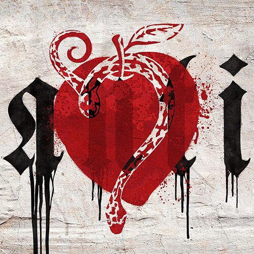
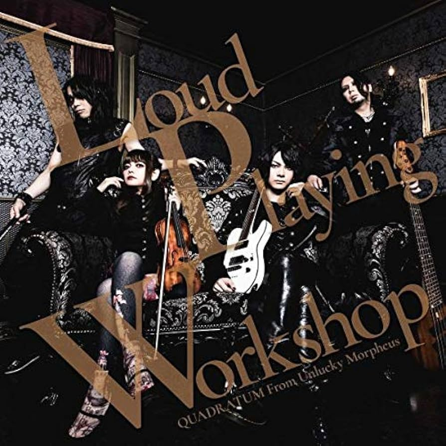
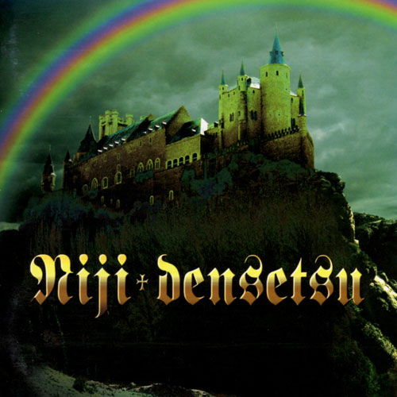
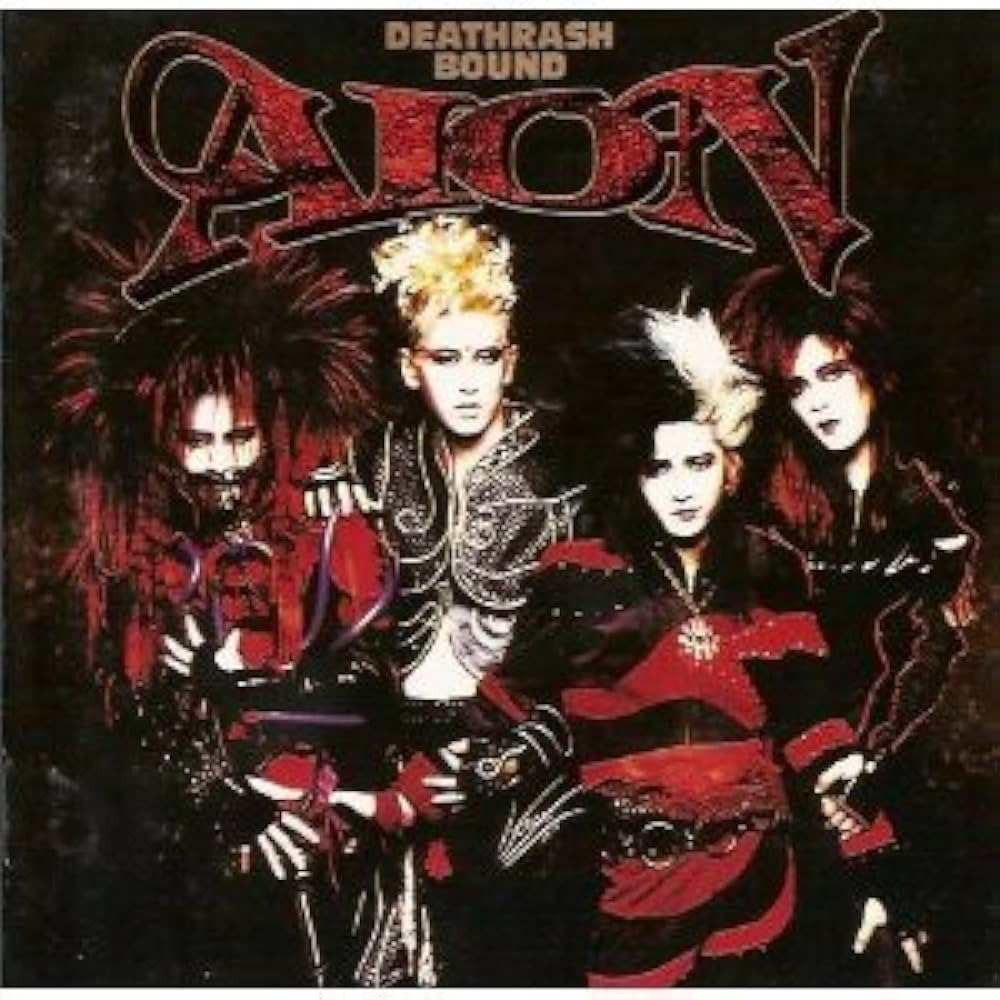
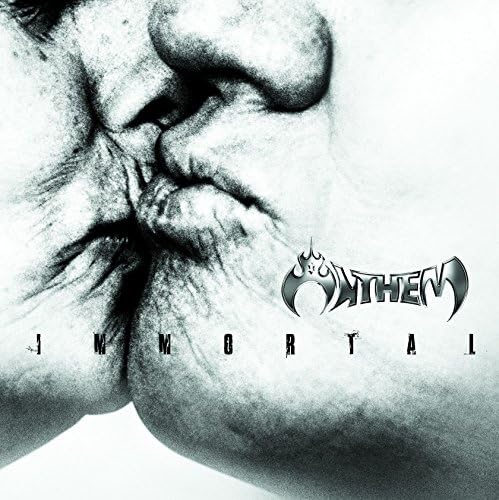
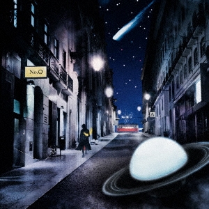
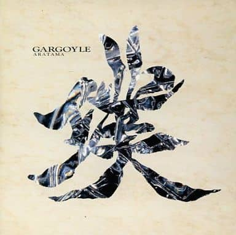
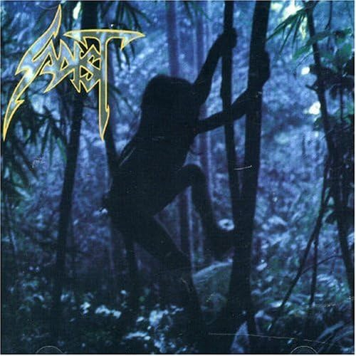
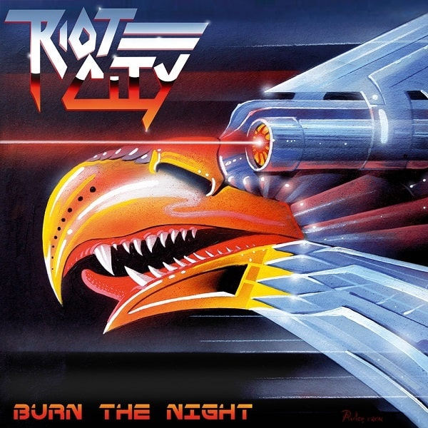
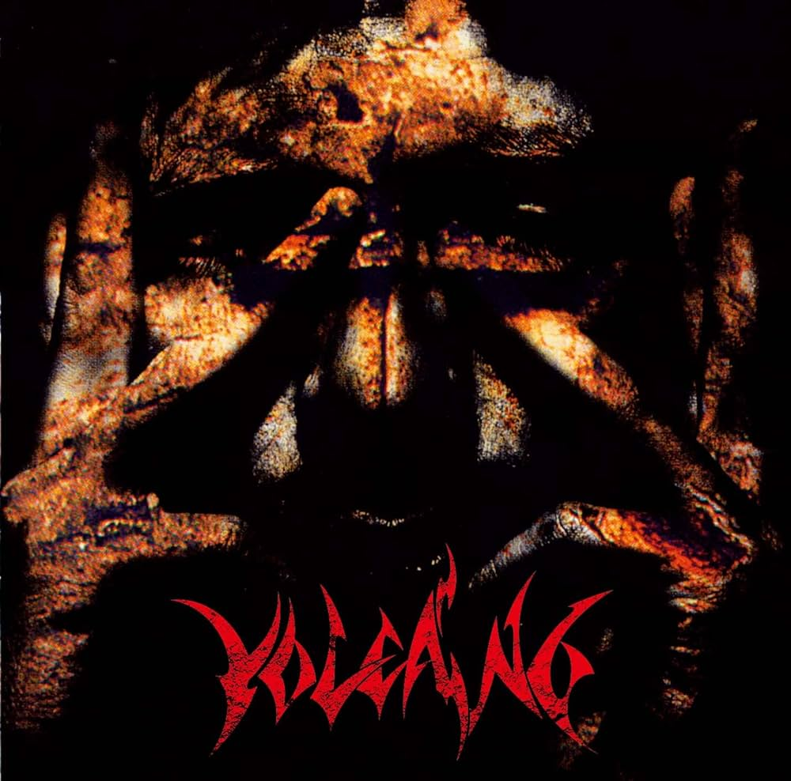

## 前書き

私は昔、ネットに書かれたアルバム批評を読むのが好きだった。書き手の思い出と一緒に綴られたアルバム評が好きだった。「最近見かけなくなったな、自分で書くか」と寝る前にふと思ったので、眠くなるまで書き殴ろうと思う。

なお、ミュージックアプリの上から順に「そうそう、このアルバムは語りたい」というピックアップの仕方をするため、思い入れでソートした訳ではない。また、本当のお気に入りアルバムが語られない可能性もある。

## Anti（HYDE）

Antiを聴いた時は、驚きと喜びがあった。

私は、L'Arc~en~Cielが最も好きなバンドである。人生で最も聴き込んだボーカリストは、間違いなくHYDEである。小学生の頃にNew Worldで痺れ、同じような曲を探して見つからなかったことが今では懐かしい。見つからなかった理由は簡単で、New Worldはアジカンからインスパイアされているからだ。暫く後で、TVで流れたwinter fallの美しいメロディにノックアウトされた。ココで完璧にハマった（HYDEがスノボをしている最中のBGMとして使われていた記憶がある）

話を戻そう。

L'Arc～en～Cielは、次第に新しいアルバムをリリースしなくなり、その音楽性も変化が少なくなっていた。それは、HYDE（Vamps）の個人的な活動も同様であった。私の中でL'Arc～en～Cielは特別な存在で有り続けたが、新鮮さを提供するバンドで無くなりつつあった。

しかし、しかしだ。

Antiは、一聴しただけでサウンドが若返ったことが分かる。明らかにサウンドがメタル化しているのだ。HYDEは「良いものは良い」というスタンスで活動を続けていたが、ここまで流行のサウンド（≒ 80'sの洋楽以外からの影響）を取り入れたことは今まで無かった。

最早50代となったHYDEが新しい領域に踏み込んだ驚きと、まだ私を楽しませてくれる事実に喜びが隠せなかった。が、その喜びを理解してくれる人が回りにいなかった。オタクは、面倒くさい感情の受けてを見つけるのが難しい。

ちなみに本記事で辿り着くか分からないので今のうちに書くと、DUNEとROENTGENがL'Arc～en～Ciel関係のマイベストアルバム。

## Loud Playing Workshop（Unlucky Morpheus）

こんなんズルいよ、メタル好きは皆好きだよコレ（主語がデカい）

Yngwie Malmsteenが大好きな自分は、一曲目のFar Beyond The Sunで心を掴まれた。あの繊細なYngwieサウンドをバイオリンで再現するなんて、しかも演奏が申し分に上手いなんて、もうこの１曲だけで元が取れている（私はCDで買った）

Into the Arena（MSG）やFor the Love of God（Steve Vai）あたりの「ド直球」な選曲も好感が持てる。この手のカバーアルバムは、選曲がマニアックになりがちだが、聴きやすい曲が並んでいるので原曲を知らない方でも楽しめるだろう。思い入れのある曲の場合はなおさらだ。

真面目なレビューは過去に書いていた。言ってることがほぼ同じで吹いた（Antiも似たようなことを書いてあった）

- [【HR/HM】2021年に聴いてハマったアルバム9選+2【プログレ】](https://debimate.jp/post/2022-01-08-hr-hm2021%E5%B9%B4%E3%81%AB%E8%81%B4%E3%81%84%E3%81%A6%E3%83%8F%E3%83%9E%E3%81%A3%E3%81%9F%E3%82%A2%E3%83%AB%E3%83%90%E3%83%A09%E9%81%B82%E3%83%97%E3%83%AD%E3%82%B0/)

## Let there Be Blood（Exodus）

85年リリースの1stアルバム「Bonded by Blood」を再録した作品。純粋に出来が良い1stを忠実に再録し、ブルータリティや激しさを加味したサウンドに仕上がっている。

私はスラッシュメタルを好むので、かなりヘビーローテーションしていた時期があった。A Lesson In Violenceのような単純な刻みを聴かす曲がシンプルで好み。

白状するとExodusのアルバムは、実は本作しか聴いたことがなく、深堀すべきだと常日頃から感じている。

## 虹を継ぐ覇者（虹伝説）

私は、2つの虹が好きである。

L'Arc～en～Ciel と **Ritchie Blackmore's Rainbow** だ。

本作は、Rainbowの楽曲を日本人がカバーしたものであり、原曲とライブ演奏を忠実に再現した作品となっている。演奏者が、Rainbowのファンであることを耳で感じ取れるのだ。

Rainbowはボーカリストが複数参加したが、本作は各ボーカリストの楽曲が広く選曲されている（Doogie White時代とRonnie Romero時代は対象外）

原曲は70〜80年代に録音されたが、本作は98年リリースなので音質が良い。また、楽曲の速度がライブ準拠なので、私のような若造には聴きやすい。「所詮カバーバンド」のようなレビューを見かけるが、キチンと過去のライブを踏まえて楽曲を解釈し直しており、本作のほうが原曲を上回っていると感じるケースもある。

また、Graham Bonnetに近い声質でJoe Lynn Turner時代の楽曲が聴けるのもポイントが高い（Joe Lynn Turner本人も参加してるし）

## 愛音（AION）

「90年代にこんな実力派のメタルバンド（V系）がいたのか〜！」と気づいた時には活動停止していて、悲しみに暮れた。その出会いは、2022年。

X JAPANと同格のように評価されているが、現代まで生き残っては居なかったのが気にかかり、愛音から聴き始めた。最初はメロディアス成分の少ないX JAPANと認識していたが、NOV（ボーカル）のハスキーボイスが癖になり、聴き込むうちにメロディアスなスラッシュメタルともいえるギターサウンドの虜になっていた。

メロスピ（パワー・メタル）とX JAPANのサウンドが似て非なるように、AIONは洋楽のスラッシュメタルとは一線を画したメロディアスさを聴かせてくれる。激しさやポップさを売りにした曲が別のアルバムに収録されているが、アルバムトータルの完成度は本作が最も高い。

このアルバムは、今まで聴いた全アルバムの中でも上位に入る出来栄え。

## Immortal（ANTHEM）

ジャパメタ枠の中では最も好きなANTHEM。

本作は正統派なHeavy Metalで、スッと聴けるアルバム。このアルバムをリリースした段階で結成20年が経過していたが、若々しくパワー溢れるサウンド。テンポが落ちてない。

本作が名作扱いされる理由は、ボーカルの坂本英三の歌唱が冴え渡っているからではないかと考えている。声の抜けも良く、Road to Nowhereで魅せるハイトーンとシャウトは大音量で聴きたい。なんなら一緒に歌いたい。

坂本英三の魅力は不安定さだと思っており、調子悪い日もあるけど、本人の限界まで力を出し切った120%の出来栄えを披露してくれるところが魅力。

## No.0（BUCK-TICK）

BUCK-TICKとの出会いは、15年前に遡る。

HIDE Tribute Spiritsと蜉蝣のPV（オッサンなのでMVと言わない）で存在に気づき、殺シノ調べ This is NOT Greatest Hitsを聴いてから買い漁るようになった。リアルタイムのTV出演は目撃したことがないように思う。

BUCK-TICKのアルバムの中で、個人的な二大アルバムは「No.0」と「アトム 未来派 No.9」の2枚である。このどちらを推すかは、その日の体調によって決まる。今日は、No.0の気分だった。

No.0は、「ゲルニカの夜」のストーリー性のある歌詞、「ノスタルジア」のように思わず歌詞全文を確認してしまうような曲があり、一曲あたりの印象の残り方が違う。

ちなみに、体調によっては以下のツイートの方にアトムを推している日もある。

<blockquote class="twitter-tweet">
アトム 未来派 No.9 と No.0  だと、後者の方が評価高そうだけど、個人的には前者の方が良いアルバムだなと（個人の感想です）  メタラーあるあるの「最初の3曲が勝負」、そして終盤の愛の葬列、New Worldの余韻が良いので未来派だな
— nchika@ぱぷちか (@ARC_AED) <a href="https://twitter.com/ARC_AED/status/1581096780967555072?ref_src=twsrc%5Etfw">October 15, 2022</a></blockquote>

BUCK-TICKの良いところは、サウンドが進化し続けることと、歌詞が単調にならないこと（頻出するワードはあるが）。ただし、ボーカリストの櫻井敦司氏が旅立ったことと、私の家族の健康状態が悪いことが重なって、曲を聴いてて不意に涙が出ることがある。

良く分からないけど「胎内回帰」の「愛してるよ（歌詞）」を聴くと(´；ω；｀)ｳｯ…となる。ゲルニカより目に効く。なので、BABELで再生を止めている（補足：BABEL-->ゲルニカ-->胎内回帰と続く）

## 璞（Gargoyle）

Gargoyleに出会った時は衝撃を受けた。ここまでの完成度／個性を持つメタルバンドが日本に居たとは思わなかった。

スラッシュサウンドだが、哀愁漂うギターソロ、そして文学的な日本語歌詞は類を見ない。唯一無二。ボーカルはややガナリが入っているが、デスメタルと比較すればガナリは無いに等しい。つまり聴きやすい。

本作のサウンドを特徴づけるのはバイオリンの存在であり、ギターソロとバイオリンソロの掛け合いは70年代を彷彿とさせるが、サウンドがメタルなので聴いてて気分が高揚する。フォークメタルに近いが、メロディラインが独特なのでGargoyleは特別な存在。ヴェルタースオリジナル。

デビューアルバムから次作の天論までは、海外でも高く評価されている。一聴の価値がある。中期／後期にも名盤があるが、初期のアルバムにあった個性は薄れ、歌詞も単調になってしまった。しかし、野蛮回路（曲）のストレートな応援ソングもそれはまた良いものだ。

個人的には、本作は人生で聴いてきたアルバムのTop 10に入ると想定している（しっかり順位を付けると微妙に選外になる可能性があるが）

## Tribe（Sadist）

美しきデスメタル。本作を深夜に聴くと少し恐怖でゾクゾクする。

古典的なデスメタルのように不快なブヨブヨサウンドではなく、妖しく神秘的なキーボードで恐怖心が植え付けられる。初めて聴いた時は、再生を思わず止めた。

良く聴き込むと、デスボイスと妖しさを取り除けば、高品質なプログレッシブ・メタルであることに気付かされる。

音選びが独特なので、デスメタルバンドと比較すれば良いのか、プログレバンドと比較すれば良いのかで迷う。個性が強烈なのは間違いなく、タイトル曲のTribeは繰り返し聴きたくなる魅力を放っている。毎日聴きたいアルバムではないが、結構な頻度で思い出したように聴いている。ただし、前述したように恐怖心を感じるので、深夜は聴きたくない。

## Burn the Night（Riot City）

NWOTHMバンドの一つで、80'sに流行ったNWOBHMの現代版（Tは、Traditional）

RiotとJudas Priestの間の子とも言えるサウンドで、鋼鉄な声質が心地よい。かなりキンキンなシャウトを乱発しており、「あっ、そこもシャウトするんですか？」と初めて聴いた時は思った。驚きなのは、綺麗なハイトーンシャウトをかましているのがギタリストである事実だ。

どんな曲調かと質問されれば「RiotのThundersteelを知ってる？あんな感じ」と答えるかもしれない。次作では専任ボーカルが加入したが、個人的には本作のボーカルが好みだった。本作を聴いてから、NWOTHMバンドを聴き漁る時期があったが、最も出来が良かったのは本作だった。

## Violent（VOLCANO）

オタクは、すぐドリームチームを妄想する。本作は、そんな妄想が具現化している。「Gargoyleギタリストの屍忌蛇」と「AIONボーカリストのNOV」がタッグを組んでいるのだ。

叙情的なギターソロと強靭なハイトーンシャウトが一緒になるなんて神バンドに違いない！という安直な予想が現実のものとなっている稀有な作品。

サウンド自体はメロデスに近いが、ボーカルはクリーンボイス。スラッシュメタルに近いリフに、泣きのギターソロ、ドラマティックな展開が合わさると、日本的なメタルで実に安心します。

## 最後に

タイムアップでございます。読み返してみると、ストレートな曲が収録されているアルバムが多い。
