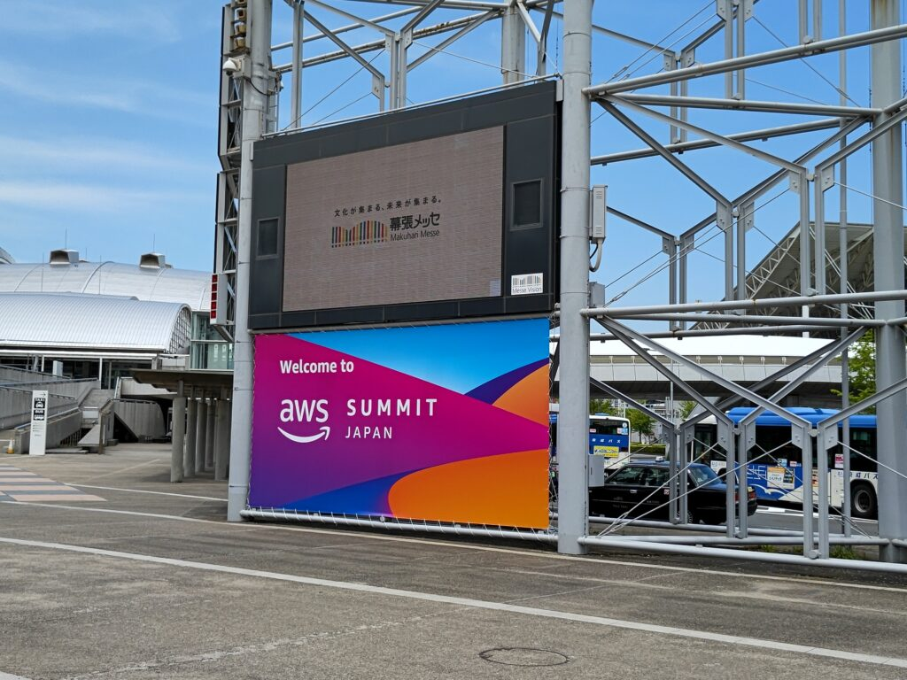
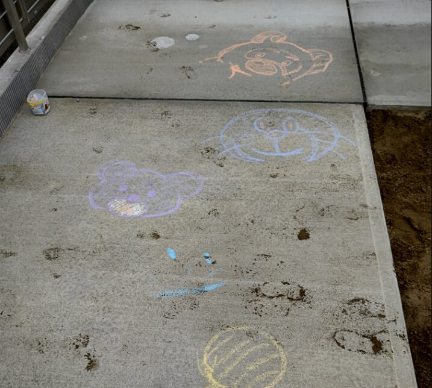
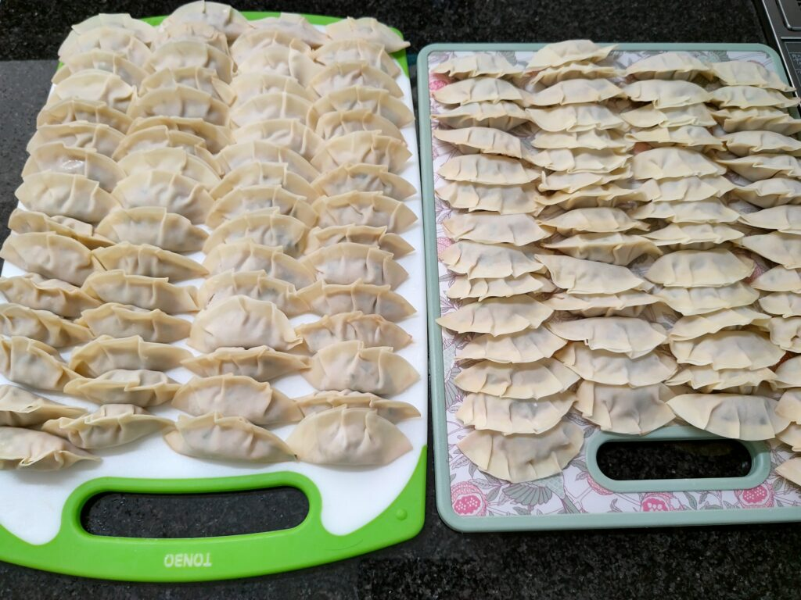
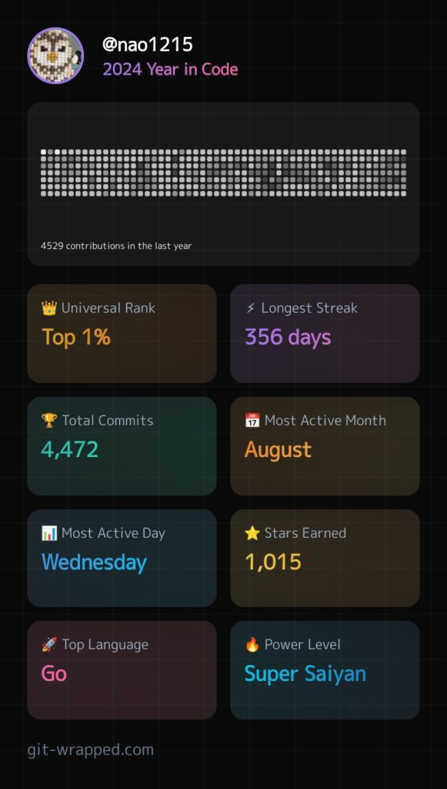
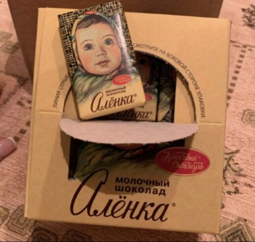
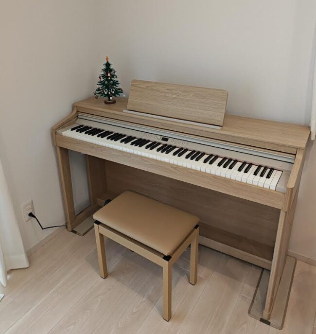
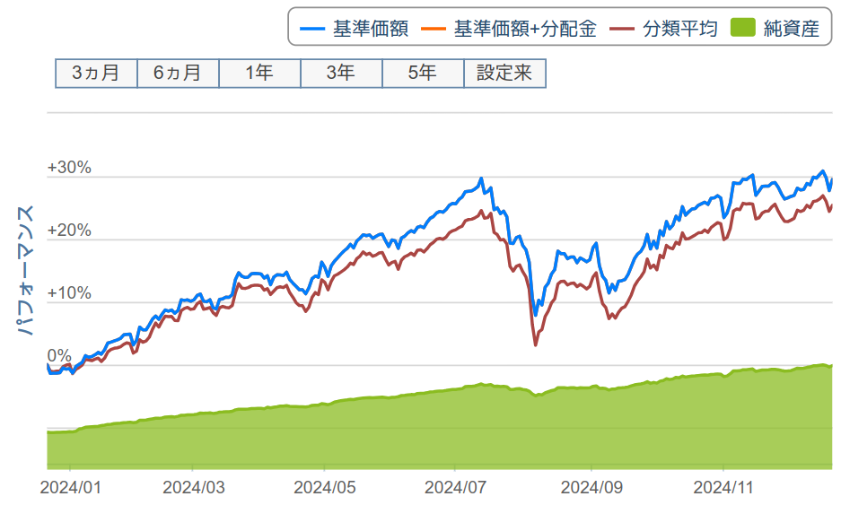
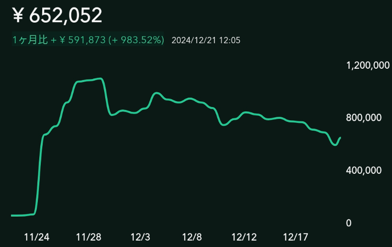
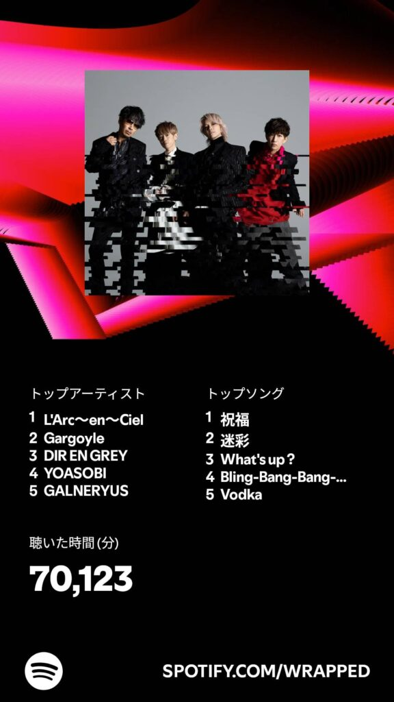

### 前書き

[2023年に引き続き](https://debimate.jp/post/2023-12-27-2023%E5%B9%B4%E3%81%AE%E6%8C%AF%E3%82%8A%E8%BF%94%E3%82%8A-2024%E5%B9%B4%E3%81%AE%E6%8A%B1%E8%B2%A0/)、2024年の振り返りと来年の抱負をまとめます。

2024年は元旦に能登半島地震があり、息子を抱えながら坂を駆け上るところからスタートでした。新潟は、狭い範囲でも場所によって被害状況が異なり、私が当時住んでいた地区はそれなりに被害がありました。地震が発生した直後、まずはTVが倒れないように押さえていました。目の前で本棚が二つ倒れ（本棚が壁に穴を開け）、食器が盛大な音を立てながら一斉に割れたのを見て、「あっ、人生で一番大きい地震だ」と察しました。玄関を出たら、温水器タンクが倒れ、目の前の道路は割れ、水道管が破裂した影響で道路の一部が水浸しになっていました。2011年の津波が脳裏をよぎりました。最終的には無事でした。住まいの周辺は液状化や地盤沈下が見られ、電柱の押しボタンが足元まで沈んでました。断水が1週間程度続いたため、実家に避難していました。

と、暗い話から始まりましたが、2024年はトータルで良い年でした。2023年に引き続き、人生を前に進めていました。「社外での活動を増やす」という目標を意識して、AWS Summitに参加するなど、普段とは違う行動を意識的にしていました。AWS Summitに会社のお金で参加できて、感謝の気持で一杯です。正直な感想を述べると、大規模なセッションよりも、AWSが話すマニアックな小規模セッションの方が楽しかったです。某セッションでは古巣で作ったシステムの話が出てきて、「あれ、AWSと繋がったんかい！」と驚きました。

### 新居へ引っ越し

一軒家は、最高です。

先に最高だった点を書いておくと、子供が楽しそうなこと、生活便利家電が整ったこと、ベッドで寝れることです。我が家は平屋かつ角地なのですが、端から端まで子供が走ったり、楽しそうに歌ったり、庭で落書きできる環境で、伸び伸び遊べているなと感じます。この買い物に、後悔はないです。

生活便利家電は、可処分時間を大幅に増やしました。口数の多いコンロ、魚焼きグリル、食洗機による手洗いからの解放、乾燥機能付きドラム式洗濯機……これらのチリツモで、数時間は捻出できている気がします。睡眠時間が増え、脳がクリアになった気がします。

ベッドで寝れるは、文字通りですね。息子が産まれてから、複合的な理由でTVの下にクッションをおいて寝てました。2年以上、床で寝てました。辛くはなかったですが、新居に来てから「やっぱりベッドは違うな」と思いました。

 

家の設計から支払いまでの流れは、2023年の振り返りで書いたので、省略します。2023年の記事に対する補足を書くと、家を購入するキッカケとなった騒音問題ですが、直接相手に謝罪したりしていました。隣からの苦情だと想定していたら、実際は真上でした。防音シートを壁に貼った意味がありませんでした。

相手が分かった理由は、深夜のチャイムです。鳴りました。ピンポーン。嫁がロシア帰省から戻った時、時差ボケで息子が深夜に騒ぎ周り、疲労困憊の嫁が叫んだ時に直接苦情が来ました。謝罪した後にドアを締め、「いや、いい年した大人が夜中に叫ぶなよ」という気持ちと共に少し泣きました。久しぶりに涙が出ました。ただ、悪いのは100％私達なので、菓子折りを持っていったりしました。新居に引っ越すまでは、精神的なストレスが高かったです。崖から突き落とされた経験のあるエンジニアだから、耐えられました。

新居への引っ越しでは、引越し業者を使いませんでした。旧居と新居の距離感が近いので、節約しました。1ヶ月半程度で荷造りして、段階的に輸送する計画でした。心の中でガントチャートを引きました。メンバ（嫁）のスキルと性格を考慮して、引越し日から1週間ほどバッファ期間を設けました。案の定、荷造りが遅延したので、バッファ期間で私が最後の仕上げを3日程度で行いました。炎上を止めるのは得意なので、旧居の引き渡しは前倒しで行いました。息子が残した床の傷が心配でしたが、基本的には敷金が戻ってきました。

新居に来てから、カーテンを追加購入したり、庭に木を植えたりぶどう棚を立てたりで、予定になかった出費が多いなと思いました。その一方で、終の棲家に投資をするのはテンションを上がるので、楽しんで散財しています。自分が果樹を真剣に選ぶ日が来るとは思いませんでした。喉から手が出るほど欲しいのはリクガメですが、まだ買えていません。置き場で迷ってます。

 

両親に手料理を振る舞うというイベントも実現できたので、大変満足しております。ハンバーグ用の粉を餃子のタネに混ぜたら、「洋風な味がする」と言われました。手料理を振る舞った理由は、父親が何度も心臓発作を起こし、救急車で運ばれ、先が長くない可能性があったからです。昨年、両親を旅行に連れて行ったので、今年は料理を振る舞おうと考えました。なお、二度手術をした結果、父親の容態は良くなりました（その一方で、祖母の体調が悪化したのですが……）

\[caption id="attachment\_8811" align="aligncenter" width="592"\] 3時間ぐらいで包んだ餃子\[/caption\] 

### エンジニアとしての活動

2024年は人生を進めていた影響で、控えめな活動でした（当社比）。

今年は嫁が唐突にロシアへの帰省を申し出た関係で、1ヶ月半ほど疑似独身生活になりました。この期間中に、AWS資格の勉強を進めました。簡単な資格ばかりですが、SAA、DVA、SOA、CLFの4個を取得しました。実務と関連性のある領域がテスト範囲であったため、どの試験も1週間勉強すれば取得できる難易度でした。「ここから高難易度資格を取得するぞ！」というタイミングで、「嫁と子供が居ないゴールデンウィークは、久しぶりに遊びて〜」と、弱い自分が出てきてしまいました。100万近くの旅費で買った自由時間を大事にしたかった。ただし、中身がつまらない人間なので、ゴールデンウイークにお寿司を食べてたぐらいしか記憶がありません。

 

OSSを何個か作りましたが、出来がいいぞコレ！というのはありません。ある一定規模のあるOSSは、途中でモチベが下がって作りきれないことが多かったです。そんな中で、[markdownパッケージ](https://github.com/nao1215/markdown)がヒットしました。markdownパッケージは、昨年作った[spectest](https://github.com/nao1215/spectest)のサブプロジェクトです。E2Eテスト結果からドキュメントを自動生成するために作りました。mermaidも出力できるように対応したら、Starが増え始めました。

残りのトピックとしては、Software Design（雑誌）に記事を寄稿しました。ありがたいことに3回目です。[寄稿の感想](https://debimate.jp/post/2024-12-07-%E5%AF%84%E7%A8%BFsoftware-design-2024%E5%B9%B412%E6%9C%88%E5%8F%B7-%E7%AC%AC1%E7%89%B9%E9%9B%86-%E7%AC%AC4%E7%AB%A0-%E8%90%BD%E3%81%97%E7%A9%B4%E3%81%AB%E8%90%BD%E3%81%A1%E3%81%AA/)を別記事でまとめています。日々の生活のインプットとしては、ビットコイン／イーサリアム、DDD、アーキテクチャ系の書籍を斜め読みしました。知識が血肉になった感じはしていません。

仕事に関しては、レビューが多かったです（[別記事](https://debimate.jp/post/2024-12-07-%E5%AE%9F%E8%A3%85%E3%81%A7%E3%81%AF%E3%81%AA%E3%81%8Fpull-request%E3%83%AC%E3%83%93%E3%83%A5%E3%83%BC%E3%81%8B%E3%82%89%E7%B5%8C%E9%A8%93%E5%80%A4%E3%82%92%E5%BE%97%E3%82%8B%E3%82%88/)を参照）。多いときは、5案件のレビューを担当しました。効果的なレビューができていたかは不明です。現段階では明言できませんが、地元に関係するアプリの実装ができて嬉しかったです。リリースされたら速攻インストールします。

### 息子

2歳になりました。サイズ感は4歳児です。駆け込み七五三も終わりました。

一大イベントは、トイレトレーニングでしょうか。新居に引っ越す前から（息子が1歳のときから）、オマルでトレーニングしていました。最初は座らせても何も起きませんでしたが、徐々に排泄がみられました。新居に引っ越したタイミング（2歳4カ月）で完全にトレパンへ移行し、保育園もトレパンで行きました。「保育園で漏らすだろうな」と思い、保育園に先行謝罪しました。

その後1ヶ月で、自発的にトイレに行くようになりました。そのタイミングで布パンになり、オムツが我が家から消えました（家計改善）。とはいえ、遊びに夢中になっていると「息子よ、漏れとるぞ」ということが多々ありました。最近は寝ているとき以外はあまり漏らしません。「オシッコ！」と言いながら、トイレに走っていきます。油断していると、息子はズボン脱げなくて「もらしちゃったの…」とトイレの前で悲しい顔しています。風呂場では、したり顔で粗相することもあります。その一方で、ウォッシュレットを使いこなしていて、子供の成長って早いなと感じるばかりです。

その他の話題と言えば、息子が使うオモチャの変化でしょうか。1歳児の頃はマリオカードWiiのハンドル（ハードオフで800円）を肌身離さず、ずっと運転を続けていました。今では、トミカ、プラレール、恐竜に興味が移りました。これらのオモチャもどこかのタイミングでサヨナラする日が来るのでしょう。それにしても、トミカは耐久性が高く、安価で、ビルドクオリティが高い……つい買い与えてしまいます（注：私自身は車全く興味ないです）。

あとは、YouTubeで「マーシャとくま」を見始めたり、ピアノがリビングにデプロイされたぐらいです。息子が「ピアノすきなの」と言ってきたので、ブラックフライデーで電子ピアノをポチりました。現職の人に「CASIOが良い」とおススメされたのですが、嫁が「Rolandの方が良い」とキレ散らかしてきたので、Rolandに路線変更しました。当初は、安価なピアノを買い与え、息子がハマったら高価なものに切り替える想定でした。しかし、嫁と自分との間で意見のズレが出たため、考えることを放棄して10万位の価格帯（[RP701](https://www.roland.com/jp/products/rp701/)）としました。息子が使わなければ、私がSilent Jealousyのイントロだけ弾いて遊びます。

 

### 投資

2024年は、投資の勉強になる年でした。資金の投入タイミングが悪く、成績は+8〜9%ぐらいです。

新NISAが始まったので、多くの方がオルカンやS&Pを買い漁っていた印象です。周りの人も、インデックス投資をする人がチラホラいました。その一方で、元手が少なくてもリターンを得やすいiDeCoの話をしている人は少なかった気がします。[iDeCoは来年に掛け金の上限額が拡大](https://www.yomiuri.co.jp/economy/20241213-OYT1T50016/)される可能性が高いので、所得控除額が大きくなって節税が捗ります。その一方で、[退職所得控除の改悪](https://www.itmedia.co.jp/news/articles/2412/25/news174.html)がセットで始まっていて、「数十年先の政府を信頼できるのか」で掛け金が変わりそう。とはいえ、退職金のないエンジニアにとっては、改悪されてないようなものです（政府は信用できないが）

私が本格的に資金投入したのは、今年からです。家を買って、資産形成を真面目に考え始めたからです。株価や基準価額を毎日見ていました。上半期は右肩に上がり続けるチャート（下記の画像はオルカン）。そこから、8月に過去最大の下落幅で暴落。日銀が利上げを匂わすと、円キャリートレードの巻き戻しで、日本／アメリカの株が下落する流れを肌で体感しました。投資の世界は、要人の発言一つで大きく株価が変動するところまでは理解できました。しかし、株価／基準価額が上がるか下がるかは、予想通りにいかないものでした。好決算で株価下がるとか、もう何も分からん。

 

思い返してみると、複利が好きすぎてRustで複利を計算する [compound interest calculatorコマンド](https://github.com/nao1215/cic)を実装してたりしました。Rustで実装した理由は、[Ocamlでシェルを実装](https://github.com/nao1215/selfish)している最中に「関数型言語、辛いわ」と絶望したので、関数型言語の要素を持つRustに最入門していました。6年ぶりぐらいにRustを書いた気がします。

プログラミングから投資に話を戻します。投資の方針に関しては、インデックス投資をしつつ、高配当株投資も行うこととしました。理由は、私が将来インデックス投資を計画的に切り崩せる自信が無かったため、配当金を強制的に受け取った方が好ましいと判断したからです。高配当株投資のパフォーマンスが悪いことは理解しています。

細かい方針でブレがありました。最初は、日本国内の高配当株をせっせと買っていましたが、株価が下がると心が乱れました。各企業に関して入念に下調べをしても、日本株をガチホできません。途中で、含み益がでている株だけ残し、楽天SCHD（米国高配当株式ファンド）に乗り換えました。この乗り換えのおかげで、複数の株を検討する時間的なコストが減り、ドルコスト平均法を適用できている実感が得られました。何も考えずに積み立てるのは、圧倒的に楽。米国株を買うと為替リスクがありますが、日本株を買うより謎の安心感があります。

息子が中学に上がるまでの10年間は投資で遊びます。高校以降は、お金を投資に回す余裕がない気がしています。

### 仮想通貨（暗号資産）

お試しで購入しました。宝くじ的なポジションです。振り返ってみると、コードも書いてました。

トランプ再選により、米国でビットコインの戦略的備蓄が始まる可能性が高まりました。そのタイミングで買い増しを行ったのですが、行動が少し遅かったので含み損になってます。含み益が出ている時に「確定申告が必要になるから、来年までホールドしよう」と考えたら、直ぐに含み損になりました。数年ホールドしていれば、どこかのタイミングで含み益状態になるだろうと考えてます。

私が持つ仮想通貨は、最高額110万から最低額60万まで一気に下がりました。3週間ぐらいの出来事です。ボラティリティの大きさを感じました。株と違います。「1コイン1円の草コインを10万ぐらい買って、ゼロが2つ増えれば大儲けじゃん」みたいな思考は駄目ですね。新コイン登場時に速攻で買って、速攻で売るのが確実です。新規上場（IPO）と同じです。

仮想通貨に興味を持った理由は、Nostr（SNSプロトコル）がキッカケです。

今年はX（旧Twitter）がNot For Meな存在になったので、移住先となるSNSを探していました（今は[mixi2](https://mixi.social/@nchika)にいます）。Nostrは技術的に面白く、Nostrクライアントの[honeycomb](https://github.com/nao1215/honeycomb)を作ったりしていました。Nostrはビットコインを投げ銭する仕組みがあり、この仕組みを体験した時に「バックエンドエンジニアがOSSで収益を得る仕組みを作れるのでは？」と考えました。

その流れでビットコインやイーサリアムのオライリー本を読んだり、[coincheck APIのgoクライアントライブラリ](https://github.com/nao1215/coincheck)を書いたりしていました。仮想通貨のユーザー体験してみようと考え、ポチポチ購入を始めました。購入してからずっと下落してたので、資金投入はトランプ再選まで停止していました。

今、購入している仮想通貨は、IOSTとBATです（ビットコインは、ほーーんの少し持ってます）。IOSTは「ゼロ増えれば一儲けできるぞ」と考えて買いました。スケベ根性丸出しですね。BATは、応援する気持ちで買いました。BATは[Braveブラウザ](https://brave.com/ja/)のエコシステムに組み込まれています。Braveは、広告を取り除く機能がデフォルトで有効化されており、広告閲覧報酬でBATを配布しています。ユーザー視点／開発者視点で、応援したいブラウザだったのでBATを購入対象に選びました。

仮想通貨を購入してから学びになったのは、以下の3つです。

- Coincheck以外の選択肢（取引所）を調査すべきだった
- 「コイン価格×発行上限枚数 = 時価総額」をビットコインと比較すべきだった
- 取引履歴から確定申告に必要な情報を集めるツールがある（例：cryptact）

Coincheckは、今年[NASDAQへ上場](https://info.monex.co.jp/news/2024/20241212_03.html)しました。悪い会社ではないと思いますが、[2018年にハッキング被害](https://coincheck.com/ja/info/faq_nem)を受けています。お金の預け先ですから、魂をこめて取引所を選ぶべきだったと後悔しています。あと、手数料が高い。最初、「アプリの計算式がバグっているのか？」と思ったぐらいには、手数料が高かったです。

「コイン価格×発行上限枚数 = 時価総額」は、コイン価格が現実的な値かどうかを判断するために使います。例えば、草コインが100倍の値段になった時に時価総額がビットコインを超えていたら、その値段になる可能性が現実的ではないと判断できます。この考え方はどこかの記事で読んだのですが、勉強になりました。

確定申告ツールに関しては、当初は「自分でAPI叩いて集計するか」ぐらいのノリでしたが、きちんとツールがありました。ただ、個人的な意見では、取引所のアプリが確定申告に必要な情報を算出してほしいですね（そこまで対応しているアプリがある気もしています）

### 政治

普段であれば政治ネタは書きませんが、今年は人生で最も政治が面白かったです。

国民民主党の政策（手取りを増やす）が子育て世帯に刺さる内容であり、かつ国民民主党は実行力がありました。国民民主党は話を聞いてて、納得感のあるロジックを展開します。「ようやく、まともな野党が出てきたな」と思いながら眺めていました。そんな中で、自民党と財務省が露骨に恒久的な減税を拒否しているのを見て、「税は良くても据え置き」と感じました。また、玉木雄一郎代表の不倫問題が出てくるスピード感と露骨さに、何故か日本らしさを感じました。

暫くは、国民民主党に頑張っていただきたいですね。私の理想は、子供が3人ぐらい持てる経済状況が実現されることです。しかし、私の適齢期に間に合わないでしょう。まずは、2人目を持てるのかという現実問題がありますが。

### 音楽

今年は、L'Arc～en～Cielがトップに来たので、懐メロばかりを追い求めていたようです。DIR EN GREYが90年代の楽曲を再録しましたしね！

 

復活したSadie（迷彩の再録）を聞いた流れで、DIRのVULGAR、Withering to death.を聞き直していました。メタルとは異なる独自性溢れるサウンドが新鮮でした。リリース当時と、多くの音楽を聞いた今では、曲の捉え方がかなり変わりました。この頃のDIRサウンドを引き継いだバンド、もっと居ませんかね？

新たなV系を探した期間もありました。アイリフドーパ（V系ではないかも）とDIMLIMが好みでしたね。DIMLIMは既に解散していて、残念でなりません。どちらもバンドも、ストレートなサウンドではないので、プログレチックなメタルが私の好みなのかもしれません。

<iframe width="560" height="315" src="https://www.youtube.com/embed/S8eU-HIHFWo?si=9Ddgn3Sto5Jy3UkB" title="YouTube video player" frameborder="0" allow="accelerometer; autoplay; clipboard-write; encrypted-media; gyroscope; picture-in-picture; web-share" referrerpolicy="strict-origin-when-cross-origin" allowfullscreen="allowfullscreen"></iframe>

<iframe width="560" height="315" src="https://www.youtube.com/embed/UmMhmem-JPE?si=kdez66Zzby0X2FsS" title="YouTube video player" frameborder="0" allow="accelerometer; autoplay; clipboard-write; encrypted-media; gyroscope; picture-in-picture; web-share" referrerpolicy="strict-origin-when-cross-origin" allowfullscreen="allowfullscreen"></iframe>

### 転職ドラフト

転職ドラフトを試しました。

私は[人生のやりたいこと（Bucket List）](https://github.com/nao1215/my-life)をGitHubで管理しており、その中の一つを実現するために転職ドラフトを使いました。以下、バックエンドエンジニア視点で書きます。

2024年10〜12月の開催に参加しました。10月は指名8件、11月は指名4件、12月は指名0件。提示年収は下限が750万、上限が1000万、平均が858万でした。ボリュームゾーンは、800万円台な印象でした。ラブコールした会社から指名が来なくて、切ない片思いと知りました。2社、最終面接まで行きました。

ユーザー目線での感想としては、他のサイトよりも転職活動が楽です。企業側の採用意欲が高いことが伝わってきますし、指名された時点で年収提示されているので報酬に関するミスマッチがありません。私は企業側の作文コストが高いことを認識していたので、「本当に興味を持った上で指名してくれているんだな」と感じました。

また、提示年収が高いと感じました。私は、他ユーザーの経歴や提示年収を可能な限り眺めたのですが、肌感覚よりも提示年収が高い傾向にある気がしました。私自身へのオファー含めて、一回り高い印象でした。他の採用媒体から選考に進み、同じ年収で転職できるかが気になるところです。

今回転職ドラフトに参加したことで、市場価値の高め方も感じ取れました。やはり、フルスタックが強いです（あと、役職経験者）。TypeScript、Ruby、Python、Go、Swift、Kotlin、Dartが主要な言語で、提示年収が高いユーザーはこれらの言語を複数使え、フロントもバックも対応できる印象がありました。私、遊びレベルではPythonとRubyを使えますが、転職ドラフトではGo、C、Java、Shell Scriptが使えるとレジュメを書きました。うーん、古めかしい。

ちなみに、私が指名を獲得できた理由は、「外注管理／案件管理などのマネージメント経験」「OSS開発、ブログ、Software Design寄稿などのアウトプット」がメイン。ここ数年、頑張ってアウトプットし続けた意味があったと感じました。ここから市場価値を高めるには、バックエンド技術を深化させるよりも、フロント／モバイル側の知識をつけた方が好ましそうです。食いっぱぐれないという観点では、「Ruby on RailsやPHPからGoへ移行できるスキル」や「AWS、Google Cloudなどを併用したマルチクラウドに対応できるスキル」ではないかと。まー、数年は市場を無視して、好きにやらせていただきます。

「○○社に入りたいんだ！」という方は転職ドラフトのアカウントを作り、当該企業がどのようなユーザーを指名しているかをチェックすると、今後の転職活動を有利に進められるかもしれません。例えば、私がラブコールを送った会社は、Go、PHP、Java、マイクロアーキテクチャ、Amazon EKSを経験したことがある方にオファーを送っていました。

### 2025年の抱負

2025年は、現実的な目標を掲げたいと考えています。

- ブログのアウトプット量を増やす。隔週1本程度（SHOULD）
- 技術同人誌を1冊書く（MUST）　

ブログのアウトプット量を増やす理由は、学習内容を血肉にするためです。Software Designの原稿を執筆した際に感じたことですが、文章を書くことで脳内が整理されます。曖昧な情報を再調査したり、自分の言葉で作文する作業を通して、知識が自らの血肉に変わります。あと、ブログは「最強の自分用メモ」です。会社のNotionなどに書くと、参照できないタイミングがあります。自分が管理するブログであれば、いつでも参照できます。

技術同人誌を執筆したいと考えた理由は、「自分の得意分野はコレである」と示せるような著作物が欲しいからです。執筆を通して得意分野を作りたい、という気持ちもあります。OSS開発で有名になりたい気持ちもありますが、一旦離れます。実は、Shell Scriptの書籍を執筆する予定が2年前にあったのですが、私が育児に忙殺されてお断りしました。まずは今の自分が書けるボリューム感（つまり同人誌）で、一冊書ききってみたいと考えています。テーマは、「GolangにおけるDDD」を考えています。このテーマを書くために、今年はDDDやアーキテクチャの書籍を読み漁っていました。

### 最後に

私の身近な方は、本記事を読んで気になった部分があると思います。

その内容は、前回のようにブログ記事にしないので、直接聞いてください。
