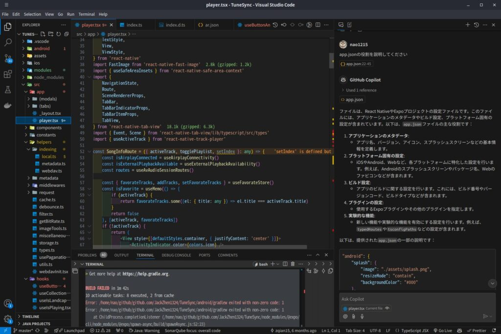

## 前書き：AIが当たり前の時代に

OpenAIが2022年11月にChatGPTをリリースしてから、AIを利用した様々なツールが登場しました。AWS Summitに行けば、[Amazon Bedrock](https://aws.amazon.com/jp/bedrock/)を用いて業務生産を向上させた事例がメイントピックでした。直近の技術系の話題（例：ブロックチェーン、web3.0）と比較すると、AIの普及速度が早く感じました。

私個人としては、2023年〜2024年は[ChatGPT](https://chatgpt.com/)、[GitHub Copilot](https://github.com/features/copilot)、[CodeRabbit](https://www.coderabbit.ai/)、Bedrockを試しました。趣味で画像や動画を生成するAIを使って、遊んだりもしてました。

<blockquote class="twitter-tweet" data-lang="ja">
AWS Summitで感じたのは、生成AIを使う流れからは逃げられそうにないこと  大規模データを持つユーザーが「生成AIを使って生産性を上げたい」と望んだ場合、その要望に答える必要がある。事例も集まってきたので「出来ません」とは言えない  まずは、お遊びレベルでBedrockを触るところから始めたい
— nchika@ぱぷちか (@ARC_AED) <a href="https://twitter.com/ARC_AED/status/1804104974957449698?ref_src=twsrc%5Etfw">2024年6月21日</a></blockquote>

X（旧Twitter）を漁ると、私がGitHub Copilotに感動してそうなポストを見つけました。そりゃ感動しますよね。

<blockquote class="twitter-tweet" data-lang="ja">
&nbsp;GitHub Copilot（Chat含む）を使った開発のUXは、Golangの文脈では強烈。もう手放せない  生産性と学習効率が数倍変わる。特に、テスト作成と新規コード理解が速くなった  Copilotの提案コードを書いて、詳細を公式ドキュメントで補い、他の人にできない程度の低い質問をする。理解度がガンッと上がる
— nchika@ぱぷちか (@ARC_AED) <a href="https://twitter.com/ARC_AED/status/1690345134385418240?ref_src=twsrc%5Etfw">2023年8月12日</a></blockquote>

## AIを活用しないメンバが可視化され始めた

2024年頃から、PRレビュー中に「ん？」と違和感を覚えるタイミングがありました。

具体的には、「○○○をしたいので、☓☓☓の方針を採用したが、この方針で問題ないのか自信がない」や「このコードの意図が分からない（注：ドメイン知識というよりは、利用しているライブラリやツールの基礎知識に関する質問）」という趣旨のコメントを読んだ時に、違和感を覚えました。

2023年以前であれば、このようなコメントを頻繁に目にしており、違和感がありませんでした。しかし、AIを活用するようになった現在の視点では、「AIに質問して（AIと壁打ちして）、思考を整理したのかな」と感じます。例えば、方針に関しては、AIが利点／欠点を考えてくれます。AIの意見を聞きながら、方針を変更しているメンバもいます。そのようなメンバが書く文章は、方針の利点と欠点がコメントに表れることが多いです。

Nが一桁なので私が勘違いしている可能性を否定できないのですが、「GitHub Copilotやその他のAIを活用しているメンバ」と「そうでないメンバ」をそこそこの精度で当てられるようになりました。AIを活用している人は、コードやコメントがこなれてます。不思議とスッキリしてます。

「コードやコメントから判断？それあなたの主観でAI活用しているかどうかを判定してますよね？」という声が聞こえたので、補足します。画面共有とSlackでも答え合わせをしています。

AI活用しているメンバは、GitHub Copilotチャットがウィンドウ横に出ていたりします。また、Slack上でAIを使っている旨を発言しているので、そこからも答え合わせできます（書いててアレですが、ストーカーみたいで気持ち悪いな）。AI活用していないメンバには、直接「AI使ってますか？」と聞いてます。

## GitHub Copilot（or 他のAI）を壁打ちとして使って欲しい

生成AIは、「思考の整理」と「理解度の向上」に役立ちます。活用しない手はないです。生成AIは、怒らない壁です。無限に質問攻めでき、自分よりも賢いかべさんです。

生成AIの利点は[t-wada氏](https://x.com/t_wada)が言語化しており、私もそのとおりだと感じています。

<blockquote class="twitter-tweet" data-lang="ja">
1. 何回同じことを聞いても怒られず即時フィードバックを得られる 2. フワッとした曖昧な質問から専門用語（≒検索キーワード）に辿り着ける  この2点は（特に初心者の）ソフトウェアエンジニアの教育あるいは独学においてChatGPT等の対話型生成AIが果たした画期的な進化だと考えています。
— Takuto Wada (@t_wada) <a href="https://twitter.com/t_wada/status/1880037737392402496?ref_src=twsrc%5Etfw">2025年1月16日</a></blockquote>

ChatGPTを使い始めた時、私は「穏やかに返答してくれる人（AI）の価値」をありがたく感じました。お金払わないと返事してくれなくなりますが、些細な問題です。話を戻すと、質問して怒られないのはメンタルに優しいです。例えば、忙しそうに仕事している人に話しかけたら怒られたり、初歩的な質問をして嫌がられた経験はありませんか？私はあります。生成AIは、質問する人のメンタルに負荷を与えません。素晴らしい（余談かつ真逆の意見ですが、30代半ばに迫ったことで注意される機会が減りました。たまには注意されたい）

また、生成AIは、技術に対する理解度を上げるのに役立ちます。例えば、2023年の私はDomain Driven Designに関する理解が曖昧だったので、生成AIに様々な視点の質問を繰り返しました。その後、書籍と生成AIを組み合わせて学習することで、かなり理解度が上がりました。2024年は[Software Designに寄稿する記事](https://debimate.jp/2024/12/07/%e3%80%90%e5%af%84%e7%a8%bf%e3%80%91software-design-2024%e5%b9%b412%e6%9c%88%e5%8f%b7-%e7%ac%ac1%e7%89%b9%e9%9b%86-%e7%ac%ac4%e7%ab%a0-%e8%90%bd%e3%81%97%e7%a9%b4%e3%81%ab%e8%90%bd%e3%81%a1%e3%81%aa/)に対する技術的な指摘をChatGPTに任せましたし、2025年現在もReact NativeプロジェクトをVS Codeで開きながら、GitHub Copilotに学習補助してもらっています。

理解度向上に便利な一方で、生成AIの嘘を嘘と見抜けていない可能性もありますが……

生成AIと壁打ちした際の副次的な効果として、言語化が上手くなります。曖昧な質問では、AIは人間が期待する回答をしないときがあります。質問文を推敲することで、よりよい回答が得られます。私は推敲を繰り返す内に、自分が如何に曖昧な質問を他の人にしていたのかと反省しました（反省したが、行動が変わったとは言っていない）

## 最後に

完全に余談ですが、2025年はもっと気軽にアウトプットできるように、今回のような1時間程度で書ける薄い記事を量産しようと考えています。その第一弾が生成AIについてです。

今までは、情報量のない記事を書くことは避けていました。オフィシャルドキュメントを読み、実際に経験した内容を書くように努めていました。言い換えると、技術の深い部分にフォーカスしていました。しかし、[Konifar's ZATSU](https://konifar-zatsu.hatenadiary.jp/)（[こにふぁー氏](https://x.com/konifar)のブログ）を読み続けて、人の行動に着目した記事も一定の需要があるだろうと考えを改めました。

今回は、生成AIを崇めたような文章を書きましたが、技術レイヤーによっては精度がイマイチなケースがあります。特に、学習量が少ないコンテンツに関しては、低精度です。[Cursor（AIコードエディタ）](https://www.cursor.com/)のように、後発で評判の良いツールもありますが、試せてないです。

完全な主観ですが、生成AIは「Androidアプリ（Kotlin） < 関数型言語（Haskell, OCaml） < GolangやTypeScript」の順番で精度が上がっていくと感じました。正直なところ、生成AIとAndroidアプリを組み合わせた勉強は、挫折しました。関数型言語も挫折しました。挫折してばっかりですね。
