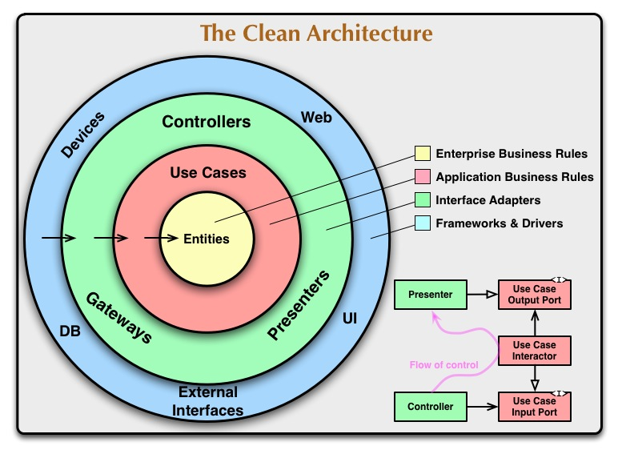

## 前書き：ドキュメンテーションコメントの書き方が分からん

本記事は、[「【GitHub Actions】 github/issue-metrics でPRマージにかかる時間を分析](https://debimate.jp/2024/12/31/%e3%80%90github-actions%e3%80%91-github-issue-metrics-%e3%81%a7pr%e3%83%9e%e3%83%bc%e3%82%b8%e3%81%ab%e3%81%8b%e3%81%8b%e3%82%8b%e6%99%82%e9%96%93%e3%82%92%e5%88%86%e6%9e%90/)」に関連する記事です。2024年は、Pull Request（以降PR）をマージするまでにかかる時間を如何に短縮するかに、課題感がありました。

ここでのマージ条件は、「有識者から1 approveを得る」「合計2 approve以上を得る」です。課題感はそこまで深刻なものではなく、「一昔前より、残存するPR量が増えたな」「自分のPRが溜まると、コンフリクト解消が面倒だから開発の手を止めちゃうな」ぐらいのお困り感でした。[Four Keys](https://book.impress.co.jp/books/1118101029)（ソフトウェア開発チームのパフォーマンスを測る指標）を改善していこう、という意識高い系のモチベーションではありません。

この課題の解決策の一つとして、「ドキュメンテーションコメントを書く（正確にはGo Docコメント）」という対応を行いました。私がこの対応を行う傍らで、メンバにも「GitHub上でコメントを残すなら、ソースコードにコメントを残して欲しい」「ソースコードにコメントを残すなら、ドキュメンテーションコメントとして残して欲しい」と伝えてきました。しかし、なかなか広がりを見せませんでした。理由は、説明不足だからです（私は同じ説明を複数回繰り返すと、段々と説明が粗雑になる悪癖があります）。

読者の皆さんもここまでの文章を読んで、「ドキュメンテーションコメントを書くと、PRマージにかかる時間が減るの？本当に？」と感じた人がいると思います。今振り返ると、メンバも同じ気持ちだったのでしょう。

「○○という理由で、この方法が良い」と説明する資料の必要性を感じましたし、どのようなコメントをどこに書くべきかという基準が不明確でした。私の意見を整理するために、本記事を作成しようと考えました。「こんな情報を書くべきだ！」みたいな強い意志をお持ちの方は、教えていただけると嬉しいです！

## 前提条件

前提条件を以下にまとめます。API仕様やDBドキュメントは不足がない前提とします（ケースバイケースで容易に不足するのですが、話を単純化したいのでキレイな世界観で進めます）

- Golangを用いたサーバーサイド開発
- API仕様（インプットバリデーション仕様、レスポンス仕様）は、[shogo82148/goa-v1](https://github.com/shogo82148/goa-v1)が自動生成するswaggerに記載
- DBテーブルの仕様は、[k1LoW/tbls](https://github.com/k1LoW/tbls)のviewpointsに記載
- GitHub の PR Descriptionに、仕様の背景や各種資料のリンクを記載
- クリーンアーキテクチャを採用

\[caption id="attachment\_9054" align="aligncenter" width="729"\] The Clean Architecture (https://blog.cleancoder.com/uncle-bob/2012/08/13/the-clean-architecture.html) から引用\[/caption\] 

## コメントは、PRレビュワーの疑問を解消する手段

PRをマージするまでの時間がかかる原因の一つとして、「GitHub 上で、質問／回答のラリーが続くこと」だと思っています。ラリーの結果、修正が発生しないケースもあります。このケースを少なくする役割を持つのが、コメントです。

例えば、レビュワーがコードを読んだ時に以下のような観点についてコメントした場合を考えましょう。

- 多重ループで実装されており、処理速度が遅そう
- 複数のユーザーが同時に利用すると、片方のユーザーが処理を継続できなさそう
- タイムアウト値が妥当か分からない

しかし、レビューイが以下のようにコメントを返してきたら、「ああ、そうなのね」と納得します（2番目の内容は、納得するか怪しいラインですが……）

- 多重ループしていますが、データ数が多くて100件ぐらいです。頑張ってキレイに実装するメリットが薄いです。
- 管理画面は同時に一人しかアクセスしない前提です。不具合が出た場合は、運用でカバーすると合意が取れています。
- タイムアウト値は計算済みであり、妥当です。計算式は、〜（以下省略）

上記は、一往復の会話で済んでいますが、現実だと「どういう意図の質問ですか？」と返答されたり、的はずれな回答が返ってくることがあります。丁寧にやり取りすると、時間がかかってしまうものです。また、レビュワーは多忙なことが多いので、この会話のやり取り中に感情が発露するかもしれません（== ギスギスしちゃう）

このような会話を減らすために「自分はこのように考えました！」と最初に意思表示してもらえると、レビュー時間の削減になります。レビュワーにも優しいです。

## 何故、GitHub PR上にコメントを残さない方が良いのか

コードの理解をソースコードリーディング（エディタだけ）で完結したいから。

影響範囲調査をしている時、「何故こんな実装をしているんだ……?（背景分からん）」と疑問に思うことがあります。その調査をする時、まずはコードを調べ、その後は関連PRを探し、コメントをざっと眺めるようになります。ここでのコメント確認は、かなり時間を使います。

PR上でのコメントは、会話が完了すると折りたたまれていることが多いです。その折りたたみを広げて、一つ一つ探すのは忍耐のいる作業です。また、背景情報がどこにも書かれていないケースでは、延々とコメントチェックする羽目になります。コメントが見つかるまで、背景情報探しが完了しませんからね！（どこかのタイミングで「これは情報が無さそうだ」と諦めます）

ソースコード上にコメントが残っている場合は、話が変わります。コメントに書かれていなければ、GitHub PRのコメントを探す必要はありません。「ああ、背景分からんな」で終わります。

## 何故、ドキュメンテーションコメントで残すのか

関数やメソッド名をマウスホバーすると、ドキュメンテーションコメントが表示されるから（以下の画像が参考例）。また、golangではドキュメンテーションコメント（Go Docコメント）からドキュメントを生成できるから。と書きましたが、プロダクト開発でGo Docが役立ったことが今のところないです。OSSライブラリ開発では、役立っています。

前提ですが、コードリーディングには、以下の2つの方法があります。ドキュメンテーションコメントは、幅優先のコードリーディングを楽にします。

- 幅優先：一つの関数／メソッドを読み、呼び出している関数／メソッドの処理は読まない
- 深さ優先：一つの関数／メソッドを読み、呼び出している関数／メソッドの処理も読む

幅優先でコードリーディングする時は、分かりやすいメソッド名が付けられていたり、ドキュメンテーションコメントが書かれていると、呼び出し先の処理を読む必要がなくなります。ドキュメンテーションコメントが書かれていないと、どうしても深さ優先の探索になりがちで、調査に時間がかかります。

## ドキュメンテーションコメントが不要な場所

ケースバイケースで対応が変わるのですが、ドキュメンテーションコメントの重要性が低いレイヤーは以下のとおりです。

- コントローラレイヤー（プレゼンテーションレイヤー）
- DBや外部サービスにアクセスするレイヤー

コントローラレイヤーは、APIエントリーポイントであり、その仕様はswaggerに書かれていることが多いです。このレイヤーにドキュメンテーションコメントを書くと、swaggerとの二重管理が始まり、辛いだけです。

DBや外部サービスにアクセスするレイヤーは、プリミティブに実装するように心がけていることが多いので、殆どのケースで補足したい事柄がありません。とは言え、外部サービスの仕様に引っ張られて、上位レイヤーでカバーして欲しいことがあります。そのような場合はドキュメンテーションコメントを残します。

（例：外部サービスが仕様書通りに実装していない場合は、このエラーを返すから所定のエラーハンドリングしてね！みたいなコメントを残すときがあります。枯れていない外部サービスを使う時とかね）

## ドキュメンテーションコメントが必要な場所

以下の箇所は、ビジネスロジック（ドメインロジック）が集まるため、必須でドキュメンテーションコメントを書くべきです。

- ユースケースレイヤー
- Domain Driven Designにおける集約（Aggregation）

ユースケースレイヤーは、事業領域に関する情報が詰まっています。このレイヤーは、ドメイン自体が複雑だと、ロジックも複雑になります。プログラミングの知識だけでは、読み解けないことが多いです。提供する機能がどのような業務（もしくはUI）に関わるのかを理解していないと、設計意図を読み解けません。コードレビュワーは、「コードを理解したが、よく分からん。なんかモヤモヤする」となりがちです。可能な限り、ドキュメンテーションコメントで補足すべきです。

集約（Aggregation）されたモデルには、ビジネスロジックがメソッドとして体現されています。このモデルにドキュメンテーションコメントがない場合、コードレビュワーは「どのようなコンテキスト向けのモデルだろう」「なんか複雑なことやってんな？」と、疑問が絶えないことでしょう。

## ドキュメンテーションコメントとして何を書くべきか

以下の項目が適宜書いてあると、好ましいです。頑張って書きすぎると、コメントの修正が大変になるので、臨機応変に書く必要があります。

- 概要
- 何故、このような実装をしているのか（Why）
- 何故、他の実装をしなかったのか（Why not）
- 複雑な処理の説明（処理順を具体的に説明）
- 利用時の注意事項
- 採用してはいけない修正方法
- 参考文献／社内で検討した時の会話／過去発生したバグ情報へのリンク

私は、実装時の判断根拠として、Why／Why notを残すべきだと考えています。派閥によっては、コミットログにWhyを書きますが、コミットログを読まない文化圏の人もいます。Whyをドキュメンテーションコメントで残した方が親切かなと。

複雑な処理がある時、処理の始まり（関数やメソッドの近く）にコメントを書く人がいます。この方法でも悪くはありませんが、処理の全体像を把握するには関数やメソッドが呼び出されている部分を全て読む必要があります。ドキュメンテーションコメントに簡単に箇条書きしてあると、コードを読む前に処理の雰囲気が分かってベターです。

利用時の注意事項は、「副作用のあるケース（例：短時間に連続して呼び出せない）」や「事前に他のメソッド呼び出しを行う必要があるケース」などが該当します。注意事項を知らないと、バグらせるパターンです。

採用してはいけない修正方法は、えいやっで直して、速攻でバグらせないようにコメントで残します。世の中には「ここ書き換えるだけで修正できるじゃ〜ん」と誤判断し、バグらせる愚か者がいます（私だ）。ただ、このケースはユニットテストでカバーして欲しいのが本音です。変な修正したら、テストが落ちて欲しいですね。

参考文献／社内で検討したときの会話／過去バグ情報は、影響範囲調査時などに役立ちます。

## コメントとして書いた方が好ましいケース

以下のように、実装とコメントが近い方が好ましいケースは、無理にドキュメンテーションコメントにする必要はないと考えています。

- TODOやFIXMEなどのメモ
- パッと見で理解しづらい処理に対する補足コメント（例：変な位置にあるフラッシュのためのClose()）

## 最後に：ドキュメンテーションコメントが根付かない理由は他にもある

ドキュメンテーションコメントが根付かない理由を探した時、私は以下のような意見を見つけました。

- 文章を書くのが得意でない人は、文章を書く作業を避ける（== コメント書かない）
- 影響範囲調査やPRレビューしない人は、コメントのありがたみが分からないのでコメントを書かない
- 費用対効果が悪い

特に1つ目の意見が、私にとっては目からウロコでした。実際に、そんな行動パターンするのでしょうか？
