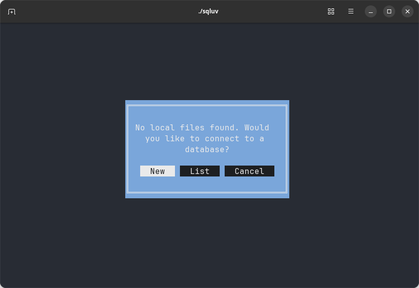
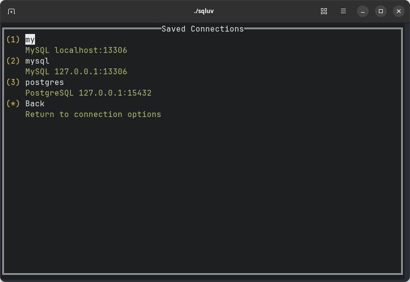

## sqluvとは

[nao1215/sqluv](https://github.com/nao1215/sqluv) は、DBMS（例：MySQLやPostgreSQL）クライアントの一種であり、Text User Interfaceを提供します。

sqluvは、ローカルのCSV／TSV／LTSVファイルをインポートし、それらのファイルに対してSQLを実行する機能も持ちます。この機能は、私が以前開発した[nao1215/sqlyコマンド](https://github.com/nao1215/sqly)から移植しています。

関連記事：[【Golang】CSV／TSV／LTSV／JSONにSQLを実行するsqlyコマンドを作った話【開発背景／設計／使い方】](https://debimate.jp/2022/12/03/%E3%80%90golang%E3%80%91csv%EF%BC%8Ftsv%EF%BC%8Fltsv%EF%BC%8Fjson%E3%81%ABsql%E3%82%92%E5%AE%9F%E8%A1%8C%E3%81%99%E3%82%8Bsqly%E3%82%B3%E3%83%9E%E3%83%B3%E3%83%89%E3%82%92%E4%BD%9C%E3%81%A3%E3%81%9F/)

ちなみに、名前の由来は、SQL + LOVE（短縮形はLUV）であり、SQLと仲良くなりたい気持ちをコマンド名に込めました。

## sqluvを開発した経緯

開発のキッカケは、転職です。

私は2025年3月に、[株式会社カンム](https://kanmu.co.jp/)へ転職しました。カンムの一次面接で、DBに関する議論がありました。一連の議論を通して、「DBやSQLに関するスキルを鍛えるべきだ」と、私の中で課題ができました。

「DBの論理設計スキルは書籍から学べる」とすぐに結論づけました。その一方で、SQLスキルをどのように鍛えるかが問題でした。SQLは書かなければ、スキルとして定着しません。

SQLを書くと考えた時、「前職のフラーではMySQLを利用していたけど、カンムではPostgreSQLだな。MySQL WorkBench（GUIクライアント）が使えないな」と、利用するツールを変更しなければならないことに気づきました。

気づいたタイミングで、複数のDBMSに対応する TUIクライアントを開発しようと思い立ちました。なお、2週間もあれば実装できると考えましたが、コロナに罹患したせいで3週間かかりました。

## CSV／TSV／LTSVにSQLを実行する機能は必要？

「CSVにSQLを実行する機能は要らないのでは？」「sqluvとsqly、カニバリゼーションしていない？」と考える方がいらっしゃると思います。

sqluvがローカルファイルに対してSQLを実行できるようにした理由は、3つあります。

- **実装都合**：TUIを早期にデバッグするために、sqlyの機能（CSV／TSV／LTSVに対してSQLを実行する機能）を移植して、sqluv内部に表データを保存できた方が開発しやすかった
- **競合対策**：TUIを備えるDBMSクライアントは複数存在するため、sqluv特有の機能を追加したかった
- **sqlyは開発停止見込み**：sqlyは独自シェルからSQLを実行する機能を持つが、シェルの拡張が面倒だった。また、私個人のユースケースでは、sqluvがあればsqlyは不要。

## 実行例：CSV／TSV／LTSVにSQLを実行する機能

sqluvは起動時引数としてファイルパス（複数可能）を受け取ると、自動的にファイルを読み込み、それらのファイルデータをSQLite3（in-memory）に保存します。テーブル名は、ファイル名から拡張子を取り除いたものです（例：sample.csvの場合、テーブル名はsample）。

SQLite3にデータを書き込む仕様上、SQLでUPDATEを行ってもローカルファイルに反映されません。移植元のsqlyでは、UPDATE結果をローカルファイルに反映する機能が実装されているので、折を見て移植します。

## DB接続機能

sqluvは、起動時にファイルパスが指定されていない場合、DBMSモードに入ります。

- New：新規に接続先情報を入力した後、DBに接続
- List：過去に入力した接続先情報リストから一つ選択肢した後、DBに接続

Newボタン押下後に表示されるNew Database Connection画面は、以下のとおりです。入力した情報でDB接続に成功した場合は、\`~/.config/sqluv/dbms.yml\`に接続先情報が記録されます。パスワードをファイルに平文で書くかどうかを一瞬迷ったのですが、暗号化しました。

Listボタン押下後に表示されるSaved Connections画面は、以下のとおりです。前述のNew Database Connection画面で入力したConnection Nameがリスト表示されます。矢印キーで接続先を選び、Enterで接続開始します。

任意のリスト項目を削除する機能は、未実装です。その代わり、接続に失敗した場合は接続先情報を消すかどうかを尋ねるモーダルが出ます。

## HOME画面

HOME画面のサイドバーにはテーブル一覧、右上にはSQL入力エリア、右下にはSQL実行結果表示エリアがあります。Ctrl-DかESCでアプリ終了し、TABやShift-TABでフォーカスを変更します。

SQLを入力し、Execute Queryボタンを押下すると、テーブルが表示されます。テーブルは、矢印キーやマウス操作でフォーカス位置変更やスクロールできます。

当初予定では、Ctrl-EnterでSQLを実行するつもりでした。しかし、Ctrl-EnterがただのEnterと判定されてしまうため、泣く泣くExecute Queryボタンを設けました。

## GitHub CopilotがTUIを実装

今回、GitHub Copilot（Claude 3.7 Sonnet）を利用してTUIを実装しました。

GitHub Copilotに対して、参考にすべきファイルを指定し、実装したい機能や気をつけるべきことをプロンプトしました。なお、私はそこまで厳密なプロンプトを書いていません。GitHub Copilotがコード例を示すまでは、YouTubeを眺めてました。

TUIを作り始めた初期段階は、生成されるコードの精度が低かったです。しかし、私がある程度の方針を示したあたりで（参考になるコードが増えたあたりで）、生成結果が安定するようになりました。

このような実装方針に切り替えたのは今回が初めてでしたが、圧倒的な生産性でした（テストを書いていないが……）。sqluvの開発は、「実装した！」ではなく、「作文した！」という感覚です。

余談ですが、GitHub Copilotや生成AI、LLMは、自分が今まで作れなかった機能（私の場合はUI）を代わりに作ってくれます。よりユーザーフレンドリーで大規模なシステムを一人で開発し切ることが可能になりました。何かWebサービスでも立ち上げようかなと考えています。

## 最後に

まずは使い込んで、使い勝手が悪い部分を改善していこうと考えています。現状は、トランザクション周りがまともに機能しないだろうなと考えていますが、バグレポが書かれるまではTUIの修正を優先します。

追記：[2週間で怒涛の機能追加をしたので改めて記事を書きました。](https://debimate.jp/2025/03/22/%e3%80%90%e6%a9%9f%e8%83%bd%e5%bc%b7%e5%8c%96%e3%80%91rdbms%ef%bc%8fcsv%ef%bc%8ftsv%ef%bc%8fltsv%e3%82%af%e3%83%a9%e3%82%a4%e3%82%a2%e3%83%b3%e3%83%88%e3%81%a7%e3%81%82%e3%82%8bsqluv%e3%82%92https/)
