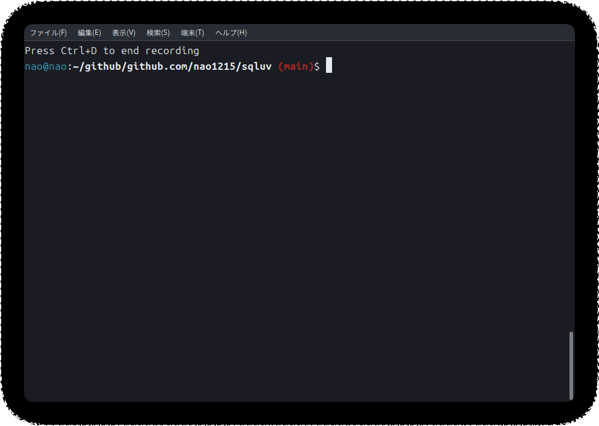

## 前書き：大幅に機能追加

[nao1215/sqluv](https://github.com/nao1215/sqluv)は、2週間前に「[【Go】sqluvコマンド：DBMS用のTUI + CSV／TSV／LTSVにSQLを実行可能【開発背景や使い方、生成AIの活用】](https://debimate.jp/2025/03/08/%e3%80%90go%e3%80%91sqluv%e3%82%b3%e3%83%9e%e3%83%b3%e3%83%89%ef%bc%9adbms%e7%94%a8%e3%81%aetui-csv%ef%bc%8ftsv%ef%bc%8fltsv%e3%81%absql%e3%82%92%e5%ae%9f%e8%a1%8c%e5%8f%af%e8%83%bd%e3%80%90/)」に記事で紹介しました。この記事に対する反応がそこそこあったので、「これはチャンスだ」と考えて、大幅に機能追加／バグ修正をしました。

普段であれば機能追加時に記事を書きませんが、今回は利便性がかなり上がったので、もう一度記事を書くことにしました。

## 前提：sqluvが提供する機能

v0.3.0（2025.03.22）時点で以下の機能があります。

- RDBMS（MySQL／PostgreSQL／SQLite3／SQL Server）、CSV／TSV／LTSVのTUIクライアント
- RDBMS／CSV／TSV／LTSVに対して、SQLを実行する機能
- 10種類以上のカラースキーム
- 実行したSQLクエリを履歴管理
- CSV／TSV／LTSVをローカル、http／https、Amazon S3からインポート
- 圧縮ファイル（\`.gz\`、\`.xz\`、\`.bz2\`、\`.zst\`）を読み込む機能（例：\`test.csv.xz\`をインポート可能）

前回の記事段階では基本的な機能を実装しただけでした。しかし、現在は他のツールが備えている機能にインスパイアされて、より多くの機能を備えるようになりました。


## 新機能：UI改善／カラースキームの追加

前回の記事段階では、ドギツイ色（デフォルト色）が使われており、「出来悪そうだな……」という見た目でした。現在はカラースキームを内部定義してあり、ユーザーは好きな配色でsqluvを使用できます。カラースキームを確認したい方は、[README内のスクリーンショット](https://github.com/nao1215/sqluv?tab=readme-ov-file#color-theme)をご確認ください。

また、今までは、以下の課題がありました。

- 全カラムを一つの画面に表示していた（カラム数が多いと、何も読めなくなる）
- テーブルのカラム情報がUI上に表示されていなかった（カラムを知るには、SQLを書く必要があった）

現在は、SQLクエリ結果（テーブル）表示エリアを横スクロールできるようになり、サイドバーのテーブル名を選択するとカラム情報が表示されるようになりました。



## 実行したSQLの履歴管理

SQLクエリの実行が成功した場合、sqluvはSQLite3内にクエリ情報を保存します。Historyボタンから履歴を参照でき、選択した履歴をSQLクエリを書くテキストエリアに反映（コピー）できます。


## https、S3からCSV／TSV／LTSVをインポート

前提として、sqluvは起動時引数にパスを指定すると、CSV／TSV／LTSVを読み込むモードになります。前回の記事段階では、ローカルに存在するCSV／TSV／LTSVが読み込めるだけでした。

そんな中で、現職でsqluvを作った旨を話した時、[DuckDB](https://duckdb.org/)の話がでてきました。DuckDBは、httpsやAmazon S3に対してSQLを実行できます。私はhttpsやS3からファイルを取得する処理を実装した経験があったので、DuckDBリスペクトの機能を追加するのは簡単だなと考え、1時間ぐらいで実装しました。

以下が実行例です。

なお、sqluvは複数ファイルを同時に読み込め、別プロトコルや異なるファイルフォーマットを同時に指定できます。

```
※ https の場合
sqluv https://raw.githubusercontent.com/nao1215/sqluv/refs/heads/main/testdata/actor.csv

※ s3の場合
sqluv s3://not-exist-s3-bucket/user.csv

※ 複数プロトコル／複数フォーマットの同時利用
sqluv https://raw.githubusercontent.com/nao1215/sqluv/refs/heads/main/testdata/actor.csv s3://not-exist-s3-bucket/user.tsv testdata/sample.ltsv

```

sqluvは、パス情報にURIスキームが存在しない場合、\`file://\`（ローカルファイル）として扱います。URIスキームに`https://`や`s3://`が付与されている場合は、まずファイルをダウンロードしてから、インポートを始めます。

制限事項としては、sqluvはパス情報末尾をファイル名として扱い、拡張子情報からファイルフォーマットを判定しています。そのため、「リダイレクト先にCSV／TSV／LTSVファイルがある（URLからファイル名が取得できない）」ような状況下では、sqluvは「サポートしていないファイル形式です」とエラーを出します。

技術的にはファイル内容からファイル種別を判定できますが、現在の実装から大幅な修正が必要になります。「必要になるまで実装しないぞ！」と心に決めて、様子見してます。

## 圧縮ファイル（\`.gz\`、\`.xz\`、\`.bz2\`、\`.zst\`）を読み込む機能

Amazon S3と連携できるようにした時、「ログファイルは、基本的に圧縮されているよな」と考えました。S3と連携可能にしたのに、圧縮ファイルが扱えない状態は片手落ちです。

そこで、

- .gz
- .xz
- .bz2
- .zst

をsqluv内部で展開できるようにしました。上記の圧縮形式を選んだ理由は、特に強い理由はなく、「この辺があれば十分だろ」ぐらいのノリで実装しました。

例えば、ユーザーが `sqluv sample.csv.gz`と実行すると、そのまま`sample`テーブルとして読み込まれます。当然、https:／s3:にも対応しています。

## 細かな改善

上記の記載内容に重複するところがありますが、以下が改善点です。

- WITH句を利用可能
- SQLクエリの切り取り、貼り付けをサポート（クリップボード機能）
- TABキーで各ウィジェットに移動できるように（エラー発生しない限り、キーボードで作業が完結）
- サイドバーでテーブルのカラム情報を表示
- カラム数が多いテーブルの場合、横スクロールをON

ちなみに、オラクルのDBサポートも実装したのですが、利用ライブラリ（SQLドライバ）がCGOを使っていたのでマージしませんでした。CGOは、CやC++の資産を利用しており、純粋なGo言語ではないので利用を避けました。

また、何も考えずにhttps／S3をサポートした影響で、「CSV／TSV／LTSVに対してUPDATE／DELETEしても、オリジナルファイルに反映されない」という仕様を修正しづらくなりました。ローカルファイル／S3のみ更新可能にして、httpsは更新不可が現実的ですが、必要に迫られるまで対応しない予定です。

## 最後に

現職では、SQLを書く機会が多いので、[nao1215/sqluv](https://github.com/nao1215/sqluv?tab=readme-ov-file#color-theme)を仕事で使う機会が少しだけあります。今後も少しずつ改良していきます。

皆さんのGitHubスターでモチベーションが上がるので、スターをいただけると励みになります！実際、今回はスターが多かったので、一気に機能追加してます。
