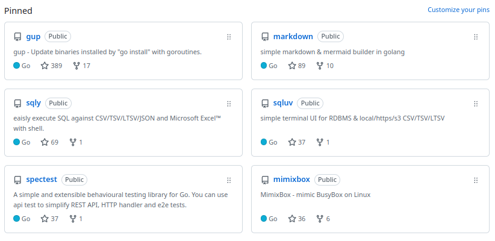

## 前書き：リアル人生ゲームに対する結論のないポエム

まず前提を書くと、そこまでお金に困っていない。

しかし、私の脳内は以下のように漠然とパニパニしていた。

> 私は一馬力家庭の単一障害点。34歳。これから脳が衰えてパフォーマンスがでなくなる。もはや政治も信用できない。この状況で子供増やすのか？何にせよ、稼げるうちに稼ぎたい。凄腕のエンジニアは、自分の1.5倍ぐらい稼いでる。周囲の人は副業してるし、自分もすべきではないか。遊ぶお金も欲しい（自作PCを組みたい）。

このような、一言で表現できない複雑な感情の上で、「もっと稼ぐか」と結論づけたが、一体どうすれば良いのかが分からず今に至る。X（旧Twitter）で取り留めもなく感情を発露すると面倒なオッサン感が溢れ出てしまうので、自分のブログでポエムろうと思い立った。他記事と文体が違うのは、ポエムだから。

## エンジニアの副業、拘束時間が長すぎ問題（本業やん）

一先ず、エンジニア向けの副業を紹介してくれるサービスに登録した。そこで、2つの事実に気づいた。

- 労働時間が30h／週以上
- TypeScriptやRubyを扱う案件が多く、Goが少なめ

後者の事実は、Goしか使えない私が悪いだけであり、そもそもGo案件が全く無いわけではない。フロントの方が副業が多いのかと一瞬考えたが、検証していない。

問題は、前者だ。労働時間が長い。1日の稼働として5〜6時間を要求してくる。これが副業だったら、本業は一体、何時間働かなければならないのだ。この稼働時間は、フリーランスにならないと対応できない。私は「平日の稼働が1〜2時間で、休日に4時間（1週間に10〜20時間程度）」を想定していたが、ゆるふわ条件過ぎて検索結果が0件になる。

とは言え、雇用する側の視点で考えれば、5〜6時間／日の稼働は当然な要求に見える。まず、平日稼働が少ない人にはタスクが渡しづらい。他タスクと依存関係がなく、緩く開発できるタスクを探すのはなかなか面倒である。また、平日にコミュニケーションが取りづらいエンジニアは他のメンバと情報格差が出がち。質問したくても他メンバが退勤しているケースもある（つまり、回答を得るのに一日近くのラグが出る）。昼間に数時間、同じタイミングで働くのは、重要。

しかし、副業したい側の視点では、「いや、昼間に副業したら、本業できんやん」が正直なところである。裁量労働制になるしかない。

## 単発案件は「AIでよくね？」と思ってしまう

個人間で依頼を受けるサービスをチェックすると、以下のような案件を引き受ける方々がいらっしゃった。

- 簡易な環境構築
- 簡単なスクリプト／コードを実装
- バグ修正やレビュー
- コーチング

私は、今後これらの案件をお試しする可能性がある。単価は1案件で3000円〜数万円レベル。悪くはないのだが、「私に払うお金でAIに課金すれば、直ぐに結果が得られるのではないか」と心の中で思ってしまう。同じことを発注者側が気づいたら、案件が無くなるのではないかと考えている。

もう一つの懸念は、規模と品質の認識が発注者側と合ってなかった場合、単価に見合わない働きをすることになる。

## エンジニアリングから離れた副業

生成AIで大人の塗り絵（性的な意味ではない）を作ると売れると聞いた。試そうとも思っていない。

## OSS開発からGitHubスポンサーを得る難易度の高さ

私にとって、OSS開発は趣味であり、この趣味が転職時に有利に働いている。企業側は「アウトプットしてますね！」と好意的に受け止めてくれる。私は、経歴からマネージメントスキルをアピールし、ブログやOSSからコードが書けそうな匂いを醸し出し、転職を有利に進める戦略を取っている。

OSS開発は楽しくて疲れないのだが、明確なデメリットがある。OSS開発は時間がかかる作業なので、技術的なインプットが疎かになる。私はここ数年、思いついたら即座にOSSを実装していたが、最近は実装を止めた。その理由として、新卒時に抱えていた「コードが書けない」というコンプレックスが払拭されたこと、インプット（特に読書）に時間を割きたい気持ちが強くなったこと、お金にならないことが挙げられる。

「OSSはお金にならない」は、多くのエンジニアが記事を書いている通り、事実である。GitHub スポンサー制度が登場し、一見すると金銭的な報酬を得やすくなったように見える。しかし、実態としては1000スター超えのプロジェクトを開発したり、有名なOSSに継続的なコントリビュートをしたり、開発者向けの有益なツールを量産しなければ、スポンサーは得られない。

私のように「OSS活動は、自分の課題を解決するCLIを作る場」と捉えている人は、1000スターを超えるようなプロジェクトを立ち上げにくい。ユースケースがニッチすぎるのだ。積極的に他プロジェクトにコントリビュートする気持ちも薄い（たまにしているが…）。やはり、開発者に刺さるOSSを開発している人を見ると、技術的なセンスが良い。一発屋ではないのだ。複数個のOSSをヒットさせている。

何故、自分の技術的なセンスが悪いのか。非情報系の地方大学出身で、周りにソフトウェアエンジニアが居なかったからか……関東出身ならば……と他責思考をしても切りがないので、読書をしてセンスを磨く。これからオッサン度が加速していくのに、モダンなセンスを維持できるのかと不安はある。

（ちなみに、[nao1215/sqluv](https://github.com/nao1215/sqluv) はヒットするんじゃないかと期待しているが、どうなるか……）

## お前のGitHubスポンサー画面どこよ

ご興味をお持ちいただきありがとうございます！[こちらでございます。](https://github.com/sponsors/nao1215)

## で、副業どうするの？

宝くじ、はじめました。

（ゆるふわ副業をご紹介いただける方は、[X（旧Twitter）](https://x.com/ARC_AED)で連絡お待ちしております）

