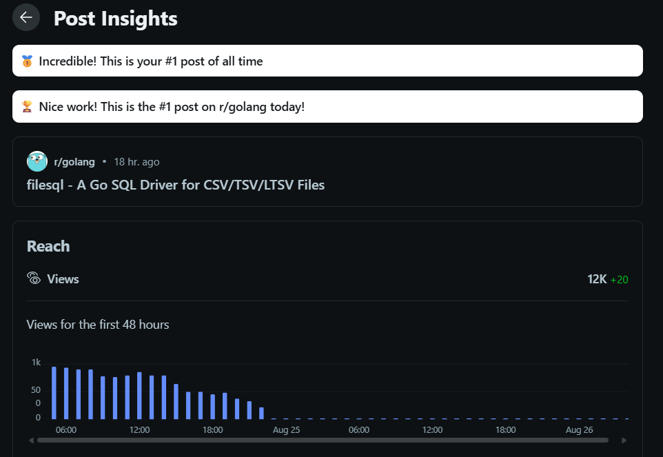
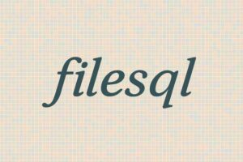

## 前書き：同じ機能を持つコマンドのメンテが面倒だった

[filesql](https://github.com/nao1215/filesql) パッケージは、SQL ドライバーであり、SQLite3 のSQL 構文を使用してCSV、TSV、LTSV ファイルにクエリを実行できます。リリースして1週間経っていませんが、過去2番目の勢いで GitHub Star を獲得できています。嬉しいことですね。


filesql は、2つの CLI ツール - [sqly](https://github.com/nao1215/sqly) と [sqluv](https://github.com/nao1215/sqluv)のメンテナンス経験から生まれました。各コマンドの機能は、以下の記事で説明しています。興味がある方はご一読ください。

- [【Golang】CSV／TSV／LTSV／JSONにSQLを実行するsqlyコマンドを作った話【開発背景／設計／使い方】](https://debimate.jp/2022/12/03/%e3%80%90golang%e3%80%91csv%ef%bc%8ftsv%ef%bc%8fltsv%ef%bc%8fjson%e3%81%absql%e3%82%92%e5%ae%9f%e8%a1%8c%e3%81%99%e3%82%8bsqly%e3%82%b3%e3%83%9e%e3%83%b3%e3%83%89%e3%82%92%e4%bd%9c%e3%81%a3%e3%81%9f/)
- [【機能強化】RDBMS／CSV／TSV／LTSVクライアントであるsqluvをhttps／s3／圧縮フォーマットに対応させ、カラースキームを追加](https://debimate.jp/2025/03/22/%e3%80%90%e6%a9%9f%e8%83%bd%e5%bc%b7%e5%8c%96%e3%80%91rdbms%ef%bc%8fcsv%ef%bc%8ftsv%ef%bc%8fltsv%e3%82%af%e3%83%a9%e3%82%a4%e3%82%a2%e3%83%b3%e3%83%88%e3%81%a7%e3%81%82%e3%82%8bsqluv%e3%82%92https/)

sqly と sqluv コマンドには、「CSV、TSV、その他のファイル形式に対してSQLクエリを実行する」という共通の機能がありました。しかし、実装は共通化されていません。片方を直すと、他方も類似の修正が必要です。しかも、実装が微妙に違います。何故このような作りになっているかといえば、何も考えずに勢いで二つ目（sqluv）を作ったからです。設計行為をしていません。

最近、買い物をしている最中にふと、「sqlyとsqluvは利用者がいるみたいだから、機能をライブラリ化した方が喜ばれるのではないか」「MySQLやPostgreSQLのように、[sql.DB](https://pkg.go.dev/database/sql#DB)で操作できればユーザーが新しく覚えることがほぼ無くて便利だろう」とfilesqlの原型（コンセプト）を思いつきました。

## filesqlの基本機能

READMEからコピペですが、以下の機能を持ちます。

- SQLite3 SQL インターフェース：内部的にSQLite3を利用しているため、SQLite3 の SQL 方言を採用
- 複数のファイル形式サポート：CSV、TSV、LTSV をサポート
- 圧縮形式サポート： .gz、.bz2、.xz、.zst 圧縮ファイルを自動的に処理
- ストリーム処理： 設定可能なチャンクサイズでストリーミングし、ファイルを効率的に処理
- 柔軟な入力ソースサポート：ファイルパス、ディレクトリ、io.Reader、embed.FSをサポート
- ゼロセットアップ：データベースサーバーは不要で、すべてインメモリで実行
- クロスプラットフォーム：Linux、macOS、Windows でシームレスに動作
- 自動保存：コミット時もしくは DB クローズ時にファイルへ保存（保存しないことも可能）
- 自動型判定：各カラムの型を自動で判定

基本的には、sqly と sqluvの実装を踏襲しています。各種ファイルをSQLite3インメモリデータベースに保存して、SQLite3 に対してクエリを実行します。ゼロセットアップかつクロスプラットフォーム対応であることも、既存機能を踏襲しています。

サポートファイル形式は、sqly が対応していた JSON や Excel が未サポートです。この辺りは実装しやすい単純なファイル形式を先行実装しただけです。将来的には様々なファイル形式をサポートする予定です。https や S3 のようなリモートからのファイル取得機能が sqluv にありますが、この仕様を filesql に持ち込むかは検討中です。リモートからのフェッチが絡むとデバッグが大変なのと、自動保存機能の仕様が複雑になることを恐れています。

※2025年8月30日追記：Parquet、Excel（.xlsx）サポート。JSONはサポートしないことに決定。

ストリーム処理と複数の入力ソースについては、filesql リリース後に機能提案を受け取り、急いで実装しました。具体的には、io.Reader と embed.FS（fs.FS）を利用できるようにしました。io.Reader に関する実装を始めたタイミングで、大規模データを扱う可能性が脳裏をよぎったので、データをチャンク単位で SQLite3 に取り込む処理（ストリーム処理）を追加しました。io.Reader に対応したことによって、filesql が https や s3 に対応しなくても、ユーザーがリモートからフェッチしたファイル（io.Reader）をそのまま渡すというユースケースをサポートできるようになってます。フェッチの責務を filesql に持ち込ませたくないです（二度目の主張） 。

自動保存と自動型判定は、sqly と sqluv の機能として弱かった部分です、filesql では、ファイル読み込み時に、適切な型で SQLite3 インメモリにレコードを挿入する処理を追加しています。愚直にカラムのデータをチェックしているので、遅いと思われます。また、コミット時か DB クローズ時に SQLite3 インメモリの内容をローカルファイルにダンプする機能を追加してあります。妥協して開発したため、「DELETE したのにローカルのファイルが消えてない！」とか「embed.FS 内のファイルは更新されない！」みたいな、ドキュメントに書かれていない挙動があります。妥協した理由は、自動保存の実装によって、コードを大幅に書き直す必要が出たからです。やる気が尽きました。

## 使い方サンプル（シンプルケース）

以下のコードが、私が sqly と sqluv を使う上で予想していた簡易なユースケースです。つまり、filesql もこの程度の使われ方だろうと考えていた頃のユースケースです。数ファイル 確認するだけの牧歌的な使い方ですね。

```
package main

import (
    "context"
    "fmt"
    "log"
    "time"
    
    "github.com/nao1215/filesql"
)

func main() {
    // CSVファイルをコンテキスト付きでデータベースとして開きます
    ctx, cancel := context.WithTimeout(context.Background(), 30*time.Second)
    defer cancel()
    
    db, err := filesql.OpenContext(ctx, "data.csv")
    if err != nil {
        log.Fatal(err)
    }
    defer db.Close()
    
    // SQLクエリを実行します（テーブル名は拡張子なしのファイル名から派生します）
    rows, err := db.QueryContext(ctx, "SELECT * FROM data WHERE age > 25 ORDER BY name")
    if err != nil {
        log.Fatal(err)
    }
    defer rows.Close()
    
    // 結果を処理します
    for rows.Next() {
        var name string
        var age int
        if err := rows.Scan(&name, &age); err != nil {
            log.Fatal(err)
        }
        fmt.Printf("Name: %s, Age: %d\n", name, age)
    }
    // エラーハンドリング省略
}
```

## 使い方サンプル（複雑なケース）

以下はローカルファイルと FS を読み込むケースです。初期化方法が前述の OpenContext 関数ではありません。OpenContext 関数はローカルファイルのみを扱う予定だったので、FS や io.Reader を受け付けるインターフェースではありませんでした。そんな要望が来るとは考えていませんでした。

OpenContext 関数を拡張する案は早々に諦めて、DBBuilder 構造体を用意しました。DBBuilder 構造体が持つ初期化メソッドをメソッドチェーンして、入力ソースを複数設定したり、保存設定などを変更できます。DBBuilder.Build() でバリデーションを行い、DBBuilder.Open() で \*sql.DB を取得します。典型的なBuilder パターンですね。もっと詳細に知りたい方は、[サンプルコード](https://github.com/nao1215/filesql/blob/main/example_test.go)をご確認ください。

```
　package main

import (
	"context"
	"fmt"
	"log"
	"os"
	"path/filepath"
	"testing/fstest"

	"github.com/nao1215/filesql"
)

func main() {
	// Create temporary files
	tempDir, _ := os.MkdirTemp("", "filesql-example")
	defer os.RemoveAll(tempDir)

	csvFile := filepath.Join(tempDir, "data1.csv")
	content1 := "id,name\n1,Alice\n2,Bob\n"
	os.WriteFile(csvFile, []byte(content1), 0644)

	tsvFile := filepath.Join(tempDir, "data2.tsv")
	content2 := "id\tproduct\n1\tLaptop\n2\tPhone\n"
	os.WriteFile(tsvFile, []byte(content2), 0644)

	// Create mock filesystem
	mockFS := fstest.MapFS{
		"logs.ltsv": &fstest.MapFile{Data: []byte("time:2024-01-01T00:00:00Z\tlevel:info\n")},
	}

	// Demonstrate method chaining
	ctx := context.Background()
	db, err := filesql.NewBuilder().
		AddPath(csvFile).
		AddPaths(tsvFile).
		AddFS(mockFS).
		Build(ctx)
	if err != nil {
		log.Fatal(err)
	}

	connection, err := db.Open(ctx)
	if err != nil {
		log.Fatal(err)
	}
	defer connection.Close()

	// Count tables from different sources
	rows, err := connection.Query("SELECT name FROM sqlite_master WHERE type='table' ORDER BY name")
	if err != nil {
		log.Fatal(err)
	}
	defer rows.Close()

	var tableCount int
	for rows.Next() {
		var tableName string
		rows.Scan(&tableName)
		tableCount++
	}

	fmt.Printf("Successfully loaded %d tables from mixed sources\n", tableCount)
}

```

## Reddit で宣伝をして、r/golangで一位を取った

OSS は利用者を増やさないと、バグ出しや機能強化がなかなか進みません。ドッグフーディングだけでは限界があります。さらに言えば、利用者がいない OSS の開発はモチベが維持できません。開発直後のタイミングは脳にアドレナリン出ているので、ガッと実装しきれます。しかし、OSS メンテはモチベの維持が難しく、利用者がいない OSS はメンテが滞りがちになります（私の場合）。例えば、利用者がそれなりにいる[gupコマンド](https://github.com/nao1215/gup)でも、私は最近メンテが面倒だなと感じています。

利用者を増やすために、私は OSS がある程度完成すると、Reddit（海外の2ch/4ch）に宣伝記事を書くようにしています。今回書いた記事のリンクは以下の通りです。

[filesql - A Go SQL Driver for CSV/TSV/LTSV Files](https://www.reddit.com/r/golang/comments/1mymsl1/filesql_a_go_sql_driver_for_csvtsvltsv_files/)

なんと！今回は r/golang（Golang の話題を話すチャンネル）で1位の投稿になりました！やったぜ。



2025年8月28日時点で、以下の反応がありました。コメントも沢山いただき、提案された機能を一気に実装しました。久しぶりに日付が変わる時間ぐらいまで開発を続けてました。

- Reddit：19000 View
- GitHub の [filesql](https://github.com/nao1215/filesql)リポジトリ：273 Unique View
- GitHub Star数：68件

予想外だったのは、複数人から[DuckDB](https://duckdb.org/)と比較されたことです。Reddit でのコメントを読んで、「あー、自分はローカルでの作業を想定していたけど、皆の視点はクラウドやデータ分析なんだな」と気づきました。データ分析の前処理で filesql を使えると面白いですが、現実的には前処理を Python で実行する気もしています。

## 最後に：READMEを多言語対応した

[filesql](https://github.com/nao1215/filesql) は、LLM の力で README が小綺麗になっています。さらに七か国語に対応しています（日本語と英語以外は、生成された README を全く読んでいませんが）

あと、LLM が CONTRIBUTING.md や CHANGELOG.md を生成してくれるので、今までサボりがちだったOSSのドキュメント作成が捗ります。ただし、正直「表現がクドイな」と思っている部分もあります。しかし、気軽にOSS開発を続けたいので、妥協しています。

皆さんも filesql を使ってみてください。バグ報告、お待ちしております！

※2025年8月30日追記：ロゴを作りました。同じ路線で、もう少し小洒落た感じにしたい。


