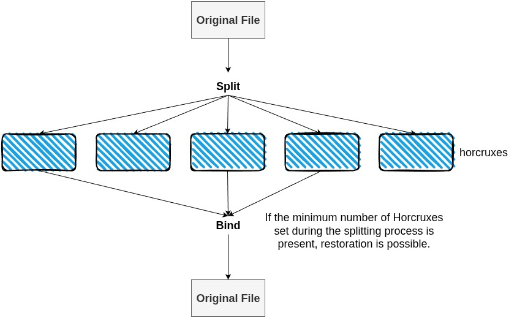

## 前書き： jesseduffield/horcrux を参考にした

「Yet Another Horcrux を作ったよ」というお話をします。

[Horcrux](https://harrypotter.fandom.com/wiki/Horcrux) は、ハリーポッターに登場する用語で、日本語では分霊箱と訳されています。闇の魔法使いが不死になるために自らの魂を分割して、自らの魂を隠した物体を指します。この物体が存在する限り、現世に留まれることができます。予め断っておきますが、私はハリーポッターがそこまで好きではありません。ネタとしては好き。「フォフォイのフォイさ」や「ハリー< 二次会は嫌だ、二次会は嫌だ……　　組分け防止 < フィリピンパァアアアアアアアブ!!! 」とか。

話を戻して、この魔法（？）からインスパイアを受けた CLI コマンドが既に存在し、 [jesseduffield/horcrux](https://github.com/jesseduffield/horcrux) として公開されています。horcrux コマンドは、ファイルをN個に分割し、M個のファイルがあれば元のファイルに復元できる機能を持ちます。作者は、[lazygit](https://github.com/jesseduffield/lazygit) の開発者です。余談ですが、私は horcrux コマンドからインスパイアを受け、「[分割したファイルを結合すると、Capture The Flag (CTF) の答えが見つかる](https://tech.kanmu.co.jp/entry/2025/09/28/171734)」というアイデアを会社で採用しました。

私は、「ファイルを復元しない限り、中身を確認できない」「分割ファイルを一箇所に置かず、ローカルやクラウドなど、様々な場所に隠せる」という仕様が何らかのアプリに転用できるのではないかと考えました。例えば、ネットスラングで「俺が死んだらHDD（SSD）を壊してくれ」というネタがありますが、それに対するアンサーとして「horcrux でファイル分割してあるから、復元手順を知らなければ中身を見られることもないが？（壊す必要ないが？）」といった対策ができます。

最近、React Native の勉強をしていることも踏まえて、TypeScript ライブラリとして Yet Another Horcrux を作ろうと考えました。Node と React Native の両方で動くことを念頭に置いて、開発を始めました。

で、完成品がこちらです。

- [https://github.com/nao1215/horcrux](https://github.com/nao1215/horcrux)
- [https://www.npmjs.com/package/@nao1215/horcrux](https://www.npmjs.com/package/@nao1215/horcrux)

## N 分割ファイルのうち、M 個があれば復元可能

README から説明画像を引用しますが、以下のように5分割したファイルのうち、3個のファイルがあれば元ファイルに復元できます。実装前は、「なにこれ、RAID（Redundant Arrays of Independent Disks）？どうやって実現しているのだろうか」と不思議でした。



この疑問への回答は、 [hocrux コマンドの作者がキチンと README に書いていました](https://github.com/jesseduffield/horcrux?tab=readme-ov-file#faq)。

> This uses the [Shamir Secret Sharing Scheme](https://en.wikipedia.org/wiki/Shamir%27s_Secret_Sharing) to break an encryption key into parts that can be recombined to create the original key, but only requiring a certain threshold to do so. 
> 
> これはシャミアの秘密分散方式を用いて暗号鍵を分割し、元の鍵を再構築できる複数の部分に分けますが、再構築には特定の閾値を満たす必要があります。

シャミアの秘密分散は、ある秘密情報を複数の断片に分割し、任意の t 個を集めれば秘密情報を復元できます。しかし、t-1 個以下では復元できない暗号手法とのことです。完全に horcrux 向けの暗号手法です。マグルも、頭が良い（魔法使い目線）。

シャミアの秘密分散で作る断片ファイルは、元データを均等に切った断片ではなく、「暗号化データ」と「多項式の評価値」を組み合わせたデータ構造になっています。多項式は、未知の係数（例：鍵）を持ち、異なる x 座標で評価した値が断片ファイルとして保存されます。それぞれの断片ファイルは、独立した復号キーの一部を含むイメージです。

閾値 t （復元に必要な数）と総数 n （断片ファイルの総数）を設定し、n > t にしておけば、断片ファイルに多めの情報をもたせることで、総数 n のうち任意の t 個が揃えば復元できます。具体的には、多項式の次数が t-1 なので、t 点揃えばラグランジュ補完で唯一の多項式が決まり、定数項（秘密）の値が復元できます。

シャミアの秘密分散は、秘密をバラす仕組みでしかないので、断片ファイル自体を暗号化しません。そこで、最初にファイルを暗号化し、その暗号鍵をシャミアの秘密分散で分割しています。

## 使い方

ファイルを作る場合

```
import { split, bind, nodeAdapter } from '@nao1215/horcrux';
import { saveHorcruxes } from '@nao1215/horcrux/core/split';

// Split a file into 5 pieces, need 3 to restore
const result = await split('secret.pdf', 5, 3);

// Save horcruxes (creates secret_1_of_5.horcrux, etc.)
const files = await saveHorcruxes(result.horcruxes, './output', nodeAdapter);

// Later: Restore from any 3 horcruxes
await bind(files.slice(0, 3), 'restored_secret.pdf');
```

バッファで操作する場合

```
import { splitBuffer } from '@nao1215/horcrux';
import { bindHorcruxes } from '@nao1215/horcrux/core/bind';

// Split in-memory data
const data = Buffer.from('Secret message');
const result = await splitBuffer(data, 'message.txt', {
  total: 4,
  threshold: 2
});

// Restore from horcruxes
const restored = await bindHorcruxes(result.horcruxes.slice(0, 2));
console.log(restored.data.toString()); // 'Secret message'
```

## お気に入りのロゴ

このロゴは、中二病っぽくて気に入ってます。


## 最後に：ハリーポッターで誰が好きか

今回、ハリーポッターに関連する OSS を作ったので、ハリーポッターに少し思いを馳せました。

最後に作品に触れたのは約20年前なのですが、思い返せば思い返すほど、キャラのクズ率が高かったなと。暴言と暴力が多い作品のイメージ。

README に「（最後を考慮すると）スネイプ先生が好きです」と書くつもりでしたが、「いや、作品の殆どの場面でスネイプ先生は、厭味ったらしくて癇に障るやつだった気がする」と我に返り、書くのを止めました。

最終的な結論として、「私はハリーポッターよりダレン・シャンが好き」と再認識しました。中二病を患ったものとしては、魔法より吸血鬼に惹かれてしまう。
