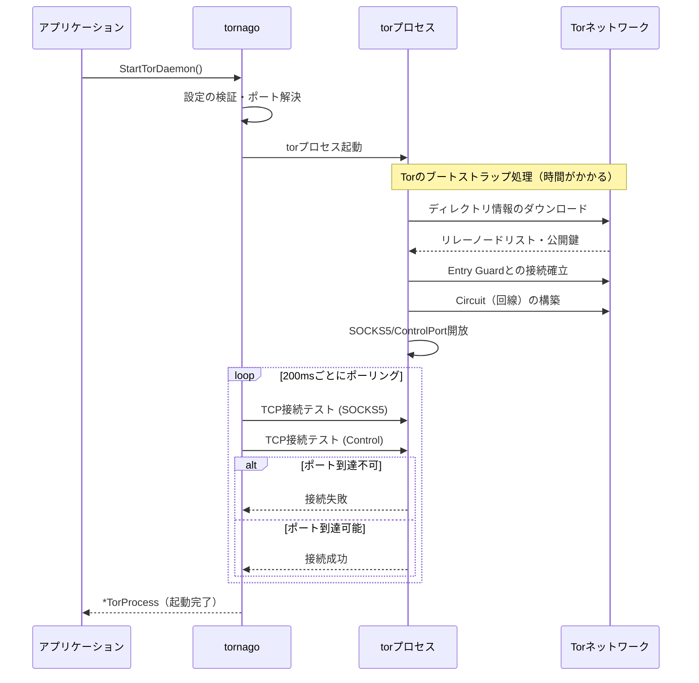

### 悪用厳禁

本記事で紹介する [nao1215/tornago](https://github.com/nao1215/tornago) は、Tor（The Onion Router）に関するライブラリです。Tor は、通信を暗号化して IP アドレスを隠蔽できるため、悪用されるケースが多々あります。

Tor 用いて不法／違法な行為をする方が現れないように、本記事はダークウェブへのアクセス方法は意図的にボカして記載します。その理由は、不法／違法な行為のヒントを与えてしまうリスクがあるからです。Tor を利用する際は、一般的な Web サイト（サーフェスウェブ）にアクセスする程度に留めてください。最近の SNS も充分ダークだと思います。

### ダークウェブ監視の需要

ここでのダークウェブとは、一般的な検索エンジンでは辿り着けない Web サイトであり、本記事では Tor（The Onion Router）を利用してアクセスできる Web サイトと定義します。ネットワークのトップレベルドメインの末尾が「.onion」であり、Google 等の検索エンジンでは殆どヒットしません。ヒットしても、Google Chrome のようなブラウザでは閲覧できません。
  
ダークウェブはある程度匿名性が担保されるので、ユーザー情報が売買されることがあります。最近ではこの事実が一般的になりすぎたせいか、非エンジニアが読むような記事で「ダークウェブに個人情報が漏洩していないかを監視しよう（意訳）」と書かれていることもあります。時代の流れを感じました。確かに、自分のメールアドレスやクレカカード番号が漏洩している事実に気づければ、何らかの対策は打てます。

とは言え、非エンジニアにはダークウェブを覗くことの心理的な抵抗感、監視難易度の高さがある筈です。現実的には、どこかのセキュリティ会社が代理で監視する建付けとなるでしょう。

### ダークウェブ監視に用いるライブラリの選択肢

Tor を用いた監視では、[torproject/stem](https://gitlab.torproject.org/tpo/network-health/stem)（Python）を利用する例が多いようです。Tor 公式が stem を提供しており、API ドキュメントが豊富です。stem の実行環境である Python は、スクレイピングライブラリのエコシステムに強みがあります。

このような状況を踏まえると、ライブラリ選定の第一候補に stem が挙げられても不思議ではありません。その一方で、「[Stem is mostly unmaintained.](https://stem.torproject.org/)」と公式サイトに書かれており、開発が活発ではないようです。さらに私個人の好みを言えば、互換性に関して安定感のある Go の方が好みです。

ライブラリ選択肢が多い方が健全なので、Go 向けライブラリの [nao1215/tornago](https://github.com/nao1215/tornago) を作りました。tornago は、台風を意味する Tornado が由来です。台風に関連付けたかったわけではなく、Tor と Go を繋げられれば何でも良かったです。

### [nao1215/tornago](https://github.com/nao1215/tornago) は薄い Tor ラッパー

[nao1215/tornago](https://github.com/nao1215/tornago) は、Tor のロジックを実装したライブラリではありません。言い換えると、tor コマンド（デーモン）を再実装したわけではありません。tor コマンドを利用しているだけです。この戦略は、前述の stem も同様です。楽しいという理由以外で、再実装するメリットありませんしね。

[nao1215/tornago](https://github.com/nao1215/tornago) は、以下の3つの機能しか持ちません。

- Tor Daemon Management: Tor プロセスをプログラムから起動・管理
- Tor Client: HTTP/TCP トラフィックを Tor の SOCKS5 経由でルーティング
- Tor Server: Tor の ControlPort を介して Hidden Service を作成・管理

Tor を起動する際に管理者権限が必要ないので、OS 側で事前に Tor を立ち上げることなく、Tor Client/Server を利用できます。

### Tor Client の例： 通常のサイトへのアクセス

`https://example.com`に Tor を介してアクセスするサンプルコードは、以下のとおりです。`tornago.StartTorDaemon()`で tor コマンドを起動した後は、HTTP クライアントを使ってリクエストを送る場合と同じような処理を行います。

```go
package main

import (
	"context"
	"fmt"
	"io"
	"log"
	"net/http"
	"time"

	"github.com/nao1215/tornago"
)

func main() {
	// Step 1: Launch Tor daemon
	fmt.Println("Starting Tor daemon...")
	launchCfg, err := tornago.NewTorLaunchConfig(
		tornago.WithTorSocksAddr(":0"),     // Use random available port
		tornago.WithTorControlAddr(":0"),   // Use random available port
		tornago.WithTorStartupTimeout(60*time.Second),
	)
	if err != nil {
		log.Fatalf("Failed to create launch config: %v", err)
	}

	torProcess, err := tornago.StartTorDaemon(launchCfg)
	if err != nil {
		log.Fatalf("Failed to start Tor daemon: %v", err)
	}
	defer torProcess.Stop()

	fmt.Printf("Tor daemon started successfully!\n")
	fmt.Printf("  SOCKS address: %s\n", torProcess.SocksAddr())
	fmt.Printf("  Control address: %s\n", torProcess.ControlAddr())

	// Step 2: Create Tor client
	clientCfg, err := tornago.NewClientConfig(
		tornago.WithClientSocksAddr(torProcess.SocksAddr()),
		tornago.WithClientRequestTimeout(60*time.Second),
	)
	if err != nil {
		log.Fatalf("Failed to create client config: %v", err)
	}

	client, err := tornago.NewClient(clientCfg)
	if err != nil {
		log.Fatalf("Failed to create client: %v", err)
	}
	defer client.Close()

	// Step 3: Make HTTP request through Tor
	fmt.Println("\nFetching https://example.com through Tor...")
	req, err := http.NewRequestWithContext(context.Background(), http.MethodGet, "https://example.com", http.NoBody)
	if err != nil {
		log.Fatalf("Failed to create request: %v", err)
	}

	resp, err := client.Do(req)
	if err != nil {
		log.Fatalf("Request failed: %v", err)
	}
	defer resp.Body.Close()

	fmt.Printf("Status: %s\n", resp.Status)

	body, err := io.ReadAll(io.LimitReader(resp.Body, 500))
	if err != nil {
		log.Fatalf("Failed to read response: %v", err)
	}

	fmt.Printf("\nResponse preview (first 500 bytes):\n%s\n", string(body))
}
```

以下、上記のコードを実行した時のログです。
```shell
Starting Tor daemon...
Tor daemon started successfully!
  SOCKS address: 127.0.0.1:42715
  Control address: 127.0.0.1:35199

Fetching https://example.com through Tor...
Status: 200 OK

Response preview (first 500 bytes):
<!doctype html><html lang="en"><head><title>Example Domain</title>...
```


###  Tor Server の例： .onion（Hidden Service）の立ち上げ

.onion（Hidden Service）を立ち上げるには、以下の4つのステップを順番に実行します。

1. Tor デーモンの起動: Tor プロセスを起動。この時点で SOCKS5 プロキシと ControlPort が利用可能になります。SOCKS5 プロキシはアプリと Tor ネットワークの橋渡し役であり、ControlPort は Tor デーモンに命令を送るための通信経路です。
2. ローカル HTTP サーバーの起動: .onion アドレスでアクセスされた時に応答する Web サーバー（HTTP サーバー）をローカルで起動します。今回は127.0.0.1:8080で待ち受けます。
3. ControlPort への認証: Tor の ControlPort に接続し、Cookie 認証を行います。これにより、Tor デーモンに対して Hidden Service 作成などの命令を送れるようになります。
4. Hidden Service の作成: ControlPort 経由で ADD_ONION コマンドを発行し、.onion アドレスを生成します。この時、「onion の80番ポートへのアクセスを、ローカルの8080番ポートに転送する」というポートマッピングを設定します。Tor ネットワークが .onion アドレスへのリクエストを受け取ると、自動的にローカルサーバーへ中継します。

以下、サンプルコードです。

```go
package main

import (
	"context"
	"fmt"
	"log"
	"net"
	"net/http"
	"os"
	"os/signal"
	"syscall"
	"time"

	"github.com/nao1215/tornago"
)

func main() {
	// Step 1: Launch Tor daemon
	fmt.Println("Starting Tor daemon...")
	launchCfg, err := tornago.NewTorLaunchConfig(
		tornago.WithTorSocksAddr(":0"),   // Use random available port
		tornago.WithTorControlAddr(":0"), // Use random available port
		tornago.WithTorStartupTimeout(60*time.Second),
	)
	if err != nil {
		log.Fatalf("Failed to create launch config: %v", err)
	}

	torProcess, err := tornago.StartTorDaemon(launchCfg)
	if err != nil {
		log.Fatalf("Failed to start Tor daemon: %v", err)
	}
	defer torProcess.Stop()

	fmt.Printf("Tor daemon started successfully!\n")
	fmt.Printf("  SOCKS address: %s\n", torProcess.SocksAddr())
	fmt.Printf("  Control address: %s\n", torProcess.ControlAddr())

	// Step 2: Start local HTTP server
	localAddr := "127.0.0.1:8080"
	mux := http.NewServeMux()
	mux.HandleFunc("/", func(w http.ResponseWriter, r *http.Request) {
		html := `<!DOCTYPE html>
<html>
<head>
    <title>Tornago Hidden Service</title>
    <style>
        body {
            font-family: Arial, sans-serif;
            max-width: 800px;
            margin: 50px auto;
            padding: 20px;
            background-color: #f5f5f5;
        }
        .container {
            background-color: white;
            padding: 30px;
            border-radius: 10px;
            box-shadow: 0 2px 10px rgba(0,0,0,0.1);
        }
        h1 {
            color: #7d4698;
        }
        .info {
            background-color: #f0e6f6;
            padding: 15px;
            border-radius: 5px;
            margin: 20px 0;
        }
        code {
            background-color: #e0e0e0;
            padding: 2px 6px;
            border-radius: 3px;
            font-family: monospace;
        }
    </style>
</head>
<body>
    <div class="container">
        <h1>🧅 Welcome to Tornago Hidden Service!</h1>
        <p>This is a simple web page hosted as a Tor Hidden Service (.onion) using the <strong>tornago</strong> library.</p>

        <div class="info">
            <h3>Connection Info:</h3>
            <p><strong>Your IP:</strong> <code>` + r.RemoteAddr + `</code></p>
            <p><strong>Request Path:</strong> <code>` + r.URL.Path + `</code></p>
            <p><strong>User Agent:</strong> <code>` + r.UserAgent() + `</code></p>
        </div>

        <h3>About Tornago:</h3>
        <p>Tornago is a lightweight Go wrapper around the Tor command-line tool, providing:</p>
        <ul>
            <li>Tor Daemon Management</li>
            <li>Tor Client (SOCKS5 proxy)</li>
            <li>Tor Server (Hidden Services)</li>
        </ul>

        <p style="margin-top: 30px; text-align: center; color: #666;">
            Powered by <strong>tornago</strong> 🚀
        </p>
    </div>
</body>
</html>`
		w.Header().Set("Content-Type", "text/html; charset=utf-8")
		fmt.Fprint(w, html)
	})

	server := &http.Server{
		Addr:              localAddr,
		Handler:           mux,
		ReadHeaderTimeout: 5 * time.Second,
	}

	lc := net.ListenConfig{}
	listener, err := lc.Listen(context.Background(), "tcp", localAddr)
	if err != nil {
		log.Fatalf("Failed to start HTTP server: %v", err)
	}

	go func() {
		if err := server.Serve(listener); err != nil && err != http.ErrServerClosed {
			log.Fatalf("HTTP server error: %v", err)
		}
	}()

	fmt.Printf("\nLocal HTTP server started on http://%s\n", localAddr)

	// Step 3: Get control authentication and create ControlClient directly
	fmt.Println("\nObtaining Tor control authentication...")
	auth, _, err := tornago.ControlAuthFromTor(torProcess.ControlAddr(), 30*time.Second)
	if err != nil {
		log.Fatalf("Failed to get control auth: %v", err)
	}

	// Step 4: Create ControlClient directly (instead of via tornago.Client)
	controlClient, err := tornago.NewControlClient(
		torProcess.ControlAddr(),
		auth,
		30*time.Second,
	)
	if err != nil {
		log.Fatalf("Failed to create control client: %v", err)
	}
	defer controlClient.Close()

	if err := controlClient.Authenticate(); err != nil {
		log.Fatalf("Failed to authenticate with Tor: %v", err)
	}

	// Step 5: Create Hidden Service
	hsCfg, err := tornago.NewHiddenServiceConfig(
		tornago.WithHiddenServicePort(80, 8080), // Map onion port 80 to local port 8080
	)
	if err != nil {
		log.Fatalf("Failed to create hidden service config: %v", err)
	}

	fmt.Println("\nCreating Hidden Service...")
	hs, err := controlClient.CreateHiddenService(context.Background(), hsCfg)
	if err != nil {
		log.Fatalf("Failed to create hidden service: %v", err)
	}
	defer func() {
		if err := hs.Remove(context.Background()); err != nil {
			log.Printf("Failed to delete hidden service: %v", err)
		}
	}()

	fmt.Printf("\n✅ Hidden Service created successfully!\n")
	fmt.Printf("   Onion Address: http://%s\n", hs.OnionAddress())
	fmt.Printf("   Local Address: http://%s\n", localAddr)
	fmt.Println("\nYou can access this hidden service through Tor using the onion address above.")
	fmt.Println("Press Ctrl+C to stop the server...")

	// Wait for interrupt signal
	sigChan := make(chan os.Signal, 1)
	signal.Notify(sigChan, os.Interrupt, syscall.SIGTERM)
	<-sigChan

	fmt.Println("\n\nShutting down...")
	ctx, cancel := context.WithTimeout(context.Background(), 5*time.Second)
	defer cancel()
	if err := server.Shutdown(ctx); err != nil {
		log.Printf("Server shutdown error: %v", err)
	}
}
```

上記のコードを実行した後、Tor に対応したブラウザで .onion にアクセスすると、以下の画面が表示されます。


### Tor デーモンを立ち上げる`tornago.StartTorDaemon()`が長い

`tornago.StartTorDaemon()`は、実行完了に数分かかります。Tor デーモンが起動時に以下の処理を行うためです。

1. Tor ネットワークへの接続: Tor は起動時にディレクトリサーバーから最新のネットワーク情報（リレーノードのリスト、公開鍵など）をダウンロードします。
2. 回線（Circuit）の構築: 通信経路となる3つのリレーノード（Entry Guard → Middle → Exit）を選択し、暗号化された回線を確立します。
3. ブートストラップ完了: 上記の処理が完了し、SOCKS5 プロキシと ControlPort が利用可能になるまで待機します。

tornago 側では、Tor プロセスを起動した後、SOCKS5 ポートと ControlPort に TCP 接続できるようになるまで200ミリ秒間隔でポーリングを行います。タイムアウト（デフォルト60秒）以内にポートが到達可能にならない場合は、エラーを返して Tor プロセスを終了します。ネットワーク環境や初回起動かどうかによって、ブートストラップにかかる時間は変動します。初回起動時はディレクトリ情報のキャッシュがないため、より時間がかかる傾向があります。

以下に、Tor 初期化シーケンスを示します。なお、余談ですが、このシーケンスのデバッグに大変時間がかかりました。Tor へのアクセスが早すぎて Tor プロセスが落ちたり、Tor コミュニケーションの方法を実装ミスしていたり......合計5時間ぐらいデバッグしていました。



### デバッグが甘いが、一応実装した機能

- NewIdentity（IPローテーション）：Torでは、同じ出口ノードを使い続けるとブロックされるリスクがあるため、定期的にCircuitを切り替える機能があります。
- Hidden Serviceの永続化：`WithHiddenServicePrivateKey()`で秘密鍵を指定すれば、同じアドレスを維持できます。

### 最後に

もう少し理解度が上がったら、Tor に関する技術同人誌を書く予定です。

内容は、Tor の仕組み、個人が特定されるユースケースの例、Tor を用いた犯罪および逮捕までの流れ、あたりを盛り込む予定です。技術的な要素が半分、技術者倫理が半分ぐらいの割合になると予想しています。

ただし、この手のセキュリティ情報を頒布する場合、頒布する私にも一定のリスクがあります（あるよね？）。無事に書き切ったらどなたかに査読を依頼しようかなと考えています。ただし、査読を頼める知り合いがいないのですがね……
