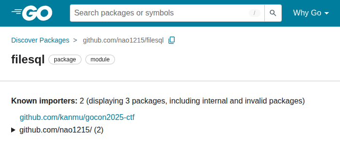
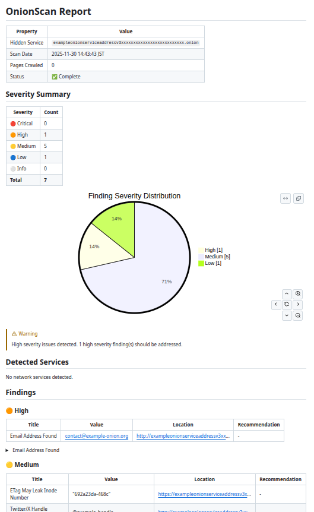

### OSS 開発を始めてから4年経った

本記事は、私の日記に近いポエムです。5年後に見返すために書いてます。なお、OSS 開発を初めて5年経過しているつもりで記事を書き始めたら、計算したところ4年でした。

私が OSS 開発を本格的に始めたのは、2021年11月です。正確に書くと、もう少し前からコード公開はしていました。例えば、「Linux Kernel の Device Driver」や「プラグラミング言語（例：Go や Vala）の勉強用に書いた OSS」を公開していました。しかし、第三者に使ってもらうことを念頭に置いた OSS は、[mimixbox](https://github.com/nao1215/mimixbox) が初めてでした。"2021-11-14T11:15:35Z" に作成したようです。

この4年間で、公私ともに大きな変化がありました。まず、会社が変わっています。キヤノングループ（2021年12月退職） -> フラー（2025年2月退職） -> カンムと移り変わっています。次に、息子が産まれて、生活スタイルが変わりました。最後に、プログラミングのゲームチェンジャーである LLM（例：Claud Code） が登場しました。

このような変化を受けながら継続してきた OSS 開発で、どんな事柄があったのかを備忘録として本記事に残します。思いついたままに書くので、まとまりがないです。

### 誰にも使われない OSS を作っている

GitHub Star が100個ついた OSS を作っても、利用者が0名ということはあります。例えば、私が2025年に作った [nao1215/filesql（ライブラリ）](https://github.com/nao1215/filesql)は、2025年11月30日時点で230個の Star が付いています。しかし、利用者はなんと0名です！

以下の画像は、どの程度利用されているかを [pkg.go.dev](https://pkg.go.dev/github.com/nao1215/filesql?tab=importedby) が計測したものです。"Known importers: 2"と書かれていますが、これは全て自己利用です。つまり、他の人は誰も使っていません。

私が作った OSS で利用者が確認できているのは、[nao1215/gup](https://github.com/nao1215/gup)、[nao1215/markdown](https://github.com/nao1215/markdown)、[nao1215/sqly](https://github.com/nao1215/sqly) だけです。殆ど利用されていないので、致命的なバグがあってもクレームが飛んできません。「このバグ、誰も文句言わないのか」と何度思ったことか。

今までは Star を追い求める傾向が非常に強かったので、Reddit で宣伝してアピールしていました。Star が多ければ利用者が増える想定でしたが、見込みが甘かったです。使われない OSS は本番投入しづらいので、今後は開発者が OSS を利用しやすい環境（例：example を増やす）を整えていきます。

### OSS 開発で技術を学べたが......

私は、会社で技術的な挑戦を求めないタイプです。仕事の内容は、会社都合で梯子を外されてコロコロ変わります。梯子を外された度に転職するわけにはいきません。会社で技術を突き詰めるかわりに、OSS 開発を通して技術を学びます。学ぶというよりは、偶然血肉になるイメージです。副産物ですね。

ほんの一例ですが、以下の内容を OSS 開発で学びました。

- Go や GitHub Actions の書き方
- SQLite の使い方
- クロスプラットフォーム対応方法（Linux, macOS, Windows, BSD ファミリー向け）
- deb, rpm, brew パッケージの配布方法
- Tor の仕組み
- 国際化対応（i18n）

現在では、LLM　のおかげで、質問すれば方法論がすぐに分かる時代になりました。GitHub Actions ぐらいなら、LLM がサクッと作ってくれます。OSS 開発を通して学ぶのは、もはや泥臭い手法でしょう。LLM と壁打ちすれば、高速に学べると思います。

### 転職活動が若干有利になった

OSS 開発をしていると、転職活動が若干有利になります。

ただし、有名な OSS を作っていない限りは、OSS で全てが決まるわけではありません。転職活動で最重要なのは、経験だと思われます。OSS 開発は、オマケです。

転職活動における OSS 開発のメリットは、「採用者の目に留まりやすくなる」「コードを書けそうな雰囲気をまとえる」「アウトプットに積極的と受け取られる」ぐらいです。デメリットは、特にない筈です。コード品質が低い OSS も公開していますが、特にその点を指摘されたことはないです。

私は、マネージメントの経験が一定あり、かつ OSS 開発が活発な方なので、プレイングマネージャーとして働けそうだとみなされることが多いです。OSS 開発をしていなければ、実装力があるのかないのか分からないオッサンでしかないでしょう。2025年の転職ドラフトハイクラス回で指名を数件貰えているので、この方向性（仕事は管理寄り、OSS で実務）で暫くは進めようと考えています。

### アウトプットの基本は桜井政博氏に教わった

桜井政博氏とは、どのような人物か。カービィとスマブラの生みの親です。この方は、アウトプットの鬼です。化け物です。「桜井政博のゲーム作るには」という YouTube チャンネルで仕事の姿勢について説明されているのですが、私は特に以下の3つに影響を受けました（+ エアロバイク漕ぎも）

- [インプットを太く､アウトプットも太く 【仕事の姿勢】](https://youtu.be/ckXWpIC0Xzg?si=yOqynR9Pq1Iv6R-W)
- [内圧をカンカンに高める 【仕事の姿勢】](https://youtu.be/GzBdISmhqmc?si=-H3hC5GcmB9wLN3n)
- [とにかくやれ!! 【仕事の姿勢】](https://youtu.be/JV3KOJ_Z4Vs?si=XK21RsSbFdBZOHpG)

雑にまとめると、OSS 開発をする前は、インプットが大事。インプットから発想が生まれます。X（旧 Twitter）で「こんなもの作りたい」とポストして内圧を下げるのは、駄目です。ポストして満足してしまいます。そして何よりも、手を動かし始めるのが大切です。スマホで動画をボーッと眺めるのは良い習慣ではありません。

最重要視しているのは、「とにかくやれ!! 」です。OSS 開発以外でも影響を受けました。例えば、面倒だけど、やれば終わる作業にすぐ着手するようになりました。年末調整とかね。

LLM 登場前は、夜泣きする息子の対応しつつ、深夜に吐きそうになりながら OSS を実装していましたが、現在は LLM があるので作業負荷が減った気がします。息子も夜泣きしなくなったし（この間、ぬいぐるみが無くなった夢を見て、夜泣きしてたが）。

### OSS を量産できたが、メンテナンスできない

私が2021年11月から2025年11月までに完成させた OSS は、47個です。月イチで OSS を1個書くようなイメージです。世間に同じ OSS が存在するかを調べずに作り始めてしまうので、ガラクタみたいな小物 OSS ばかりを量産しています。しかし、個人的な知見を深められているので、悪いことではないでしょう。

反省すべきは、メンテナンスできていないことです。Dependabot を使ってライブラリの自動アップデートを導入していますが、Merge ボタンを押す気力が湧きません。理由は、自分で使っていない OSS をメンテナンスするモチベがないからです。ボタンをポチポチするだけの作業も、結構負担があります。最近は、積極的に OSS を Public Archive しています。

量より質を重視し、きちんとメンテナンスしようと考えています。

### コントリビュートは殆どしない。するつもりもない

私はコミュ症なので、人様の OSS に Pull Request を飛ばしません。この4年間で、5件ぐらいしかコントリビュートしていないと思われます。

コミュ症以外にも、理由はいくつかあります。

- 他の人のコードを読むのは、時間がかかる
- 他プロジェクトの開発作法を理解するのが大変
- 自分が使っている OSS で、バグに遭遇しない

心理的な抵抗ももちろんあるのですが、フットワーク軽く他人のコードを修正する気力が湧きません。「これを直してもらわないと困る」という状況にならない限り、Pull Request を作りません。

とは言え、お世話になっていて恩返しできないのは申し訳ないので、GitHub Sponsors で少額投げ銭をしています。

### Pull Request をどのように受け入れるか

ありがたいことに、Pull Request をいただくことがあります。

しかし、コードの書き方で気になってしまうことがあります。会社では「ここを直してほしい」とハッキリ指摘しますが、OSS 開発では「Thank you !!」で受け入れてしまうことが多いです。英語でやり取りするパワーが私になく、相手から返事が直ぐに来るかどうか分からないので、感謝して受け入れるムーブをしがちです。受け入れた後にコードを書き直せば良いのですが、相手に失礼かなと思い、そのままで放置することがあります。

そのあおりを受けているのが [nao1215/gup](https://github.com/nao1215/gup) であり、開発者の私がコードを読んでも「このグチャグチャのコードは何なんだ……」と思ってしまいます。

<blockquote class="twitter-tweet" data-media-max-width="560" data-lang="ja">
年に一回程度の機能追加要望がくるgupコマンドは、Go不慣れな時に作ったからコードが汚い。フルスクラッチでリファクタすることも可能だが、それをすべきかどうか迷う。汚いまま突き進んでも、正直困らない。リファクタするには気合がいる
&mdash; nchika (@ARC_AED) <a href="https://twitter.com/ARC_AED/status/1901980309266321434?ref_src=twsrc%5Etfw">2025年3月18日</a></blockquote> 

元々、綺麗でなかったコードベースに無秩序な修正が加わると、メンテナンスがしづらくなります。今後は開発方針や Pull Request 受け入れ方針を明確に示して、コードが汚れないように努めます。Linter でガチガチに縛るだけでは、コードを綺麗に保てないんですよ……

### OSS 開発でイラッときたことがある

私は、BSD サポートを切った時、ユーザーから「対応を続けてよ！（意訳）」と言われて、怒って反論したことがあります。

GitHub Actions で BSD 環境を整えると、セットアップが遅い問題があります（環境の作り方は[別記事](https://debimate.jp/post/2023-09-16-github-actions%E3%81%A7bsdfreebsdopenbsdnetbsddragonfly-bsd%E3%81%AE%E3%83%A6%E3%83%8B%E3%83%83%E3%83%88%E3%83%86%E3%82%B9%E3%83%88%E7%92%B0%E5%A2%83/)を参照してください）。さらに、私は BSD 環境を持っていないので、BSD 固有のエラーが出ると対応に多くの時間を取られます。

当時、家事と育児でストレスフルでした。その状況下で BSD 環境のサポートを要望された時、感情に任せて反論してしまいました。「一方的に使っていないで、手伝ってほしい」旨の返信を書いた記憶があります。ついでに、GitHub で初めてブロック機能を使いました。

過剰反応でしたが、同じタイミングで別の BSD でユーザーから不快な対応をされたことがあり、「またか！」と思って爆発してしまいました。BSD ユーザーは一切悪くなくて、私が精神的に未熟なのが問題でした。

余談ですが、OSS 開発ではイラッとするだけでなく、人の優しさに触れるときがあります。「便利なソフト作ってくれてありがとう」「君のペースで開発すれば良いんだ」等と応援してくれる人がおり、そんなコメントを読むとモチベが上がります。

### OSS 開発より、人生が大事

若い人と話すと、「そんなにアウトプットできない」と勝手にプレッシャーを受けているケースがあります。私は、存在するだけで人にプレッシャーを与えるようです。そんな人達への回答としては、「OSS 作ってなくても、立派なエンジニアになれる（多分）」と伝えたいです。日常の業務で、一歩ずつ成長していけば、何も心配する必要はないです。実際に、私が尊敬している同年代のエンジニアの中には、OSS 開発をしていない人もいます。

そもそも論で言えば、仕事、家事、育児をした後に、可処分時間を使って OSS 開発する人生が正しいとは思えません。例えば、夏休みに嫁と息子だけ旅行に行かせて、その間にコンパイラを作る人生は正しくないでしょう（私はそれをしたけど）。私は単に、OSS 開発が楽しいから作り続けているだけです。有給を使ってでも OSS を開発したくなる瞬間がある人間です。そんな変人枠（私）と自分（若手）を比較する必要はないのです。

OSS は、義務感にかられて開発するものではないです。エンジニアリング以外の趣味を持ったり、家庭を優先したり、余暇を楽しむ方が人生有意義だと考えています。OSS 開発ばかりしていると、ふとした瞬間に「人生このままで良いのだろうか」と虚しくなる瞬間ありますし。

最近は、虚しくなった反動で、ブラックフライデーで葬送のフリーレン（漫画）を全巻集めたのですが、久しぶりに漫画を楽しめました。フェルンの面倒くささよ。衝動買いするだけではなくて、飛行機で旅行いくプランを考えたり、ギターの練習を始めたり、普段入らない店で食事したりして、人生を楽しめるように立ち回り始めています。

### 最後に

人生が大事とか言いながら、新しい OSS をリリースしたよ！  
Dark Web を調査するツールで、[s-rah/onionscan](https://github.com/s-rah/onionscan) インスパイアです。

[nao1215/onionscan](https://github.com/nao1215/onionscan)

レポート結果は、[nao1215/markdown](https://github.com/nao1215/markdown) を使って、markdwon として出力しています。json でも出力できます。

