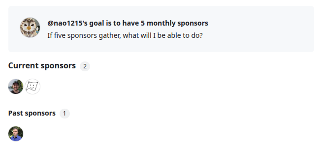
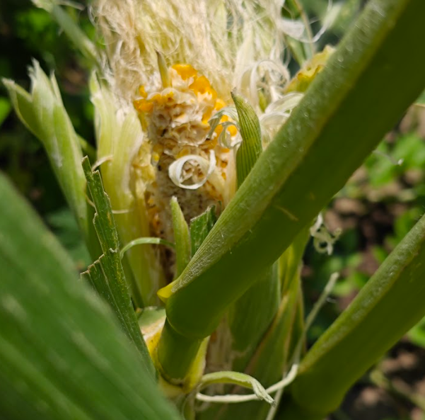
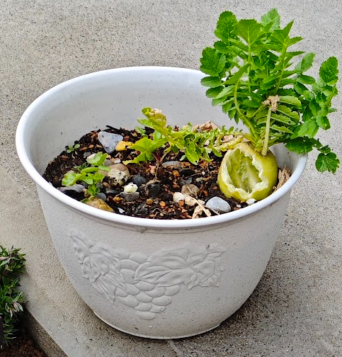
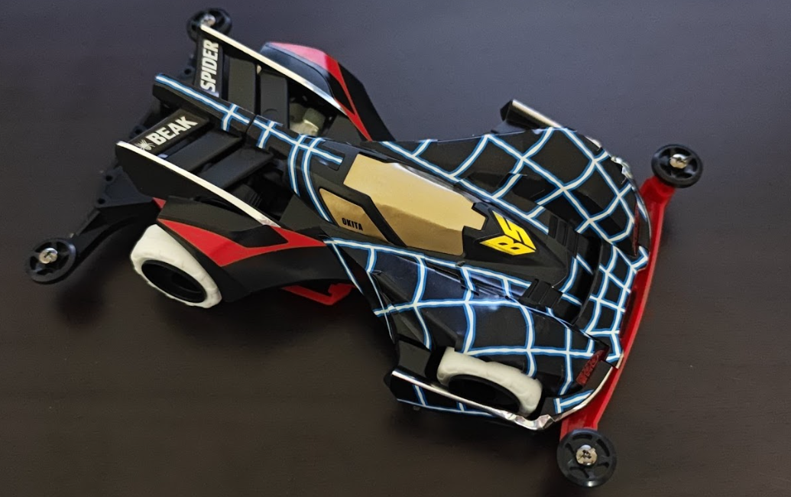
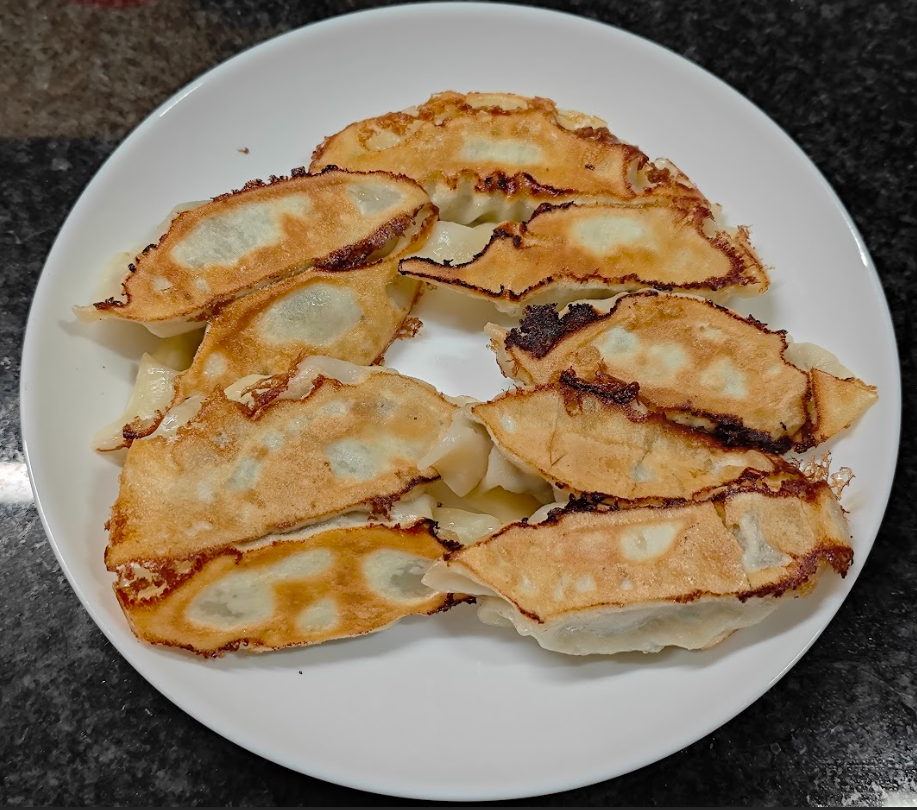

### 前書き

[2024年に引き続き](https://debimate.jp/post/2024-12-27-2024%E5%B9%B4%E3%81%AE%E6%8C%AF%E3%82%8A%E8%BF%94%E3%82%8A-2025%E5%B9%B4%E3%81%AE%E6%8A%B1%E8%B2%A0/)、2025年の振り返りと来年の抱負をまとめます。

トップ画像は、25年以上ぶりに訪れた[サントピアワールド](https://www.suntopi.com/)です。サントピアワールドは1976年に開園しており、新潟県民にとって馴染み深い場所でしょう（上越住まいにとっては、馴染みないかもしれない）。入口付近に辿り着いた時、幼少期の記憶が蘇りました。祖母と車で訪れて、途中のコンビニで買ったチョコレートが車のダッシュボードで溶けたことを不意に思い出しました。最近、息子と一緒にいると30年ぐらい前の色褪せた記憶が蘇ります。

サントピアワールドは、総括すれば面白かったです。全ての乗り物が待ち時間ゼロでした。売店にトミカ売り場があり、「こんなところにトラップが！」と思いました。案の定、息子は吸い寄せられてました。息子は、何度も[弁慶号](https://www.suntopi.com/attraction/563)に乗っていて、スタッフさんが「また乗るの？」と苦笑していました。スピードの早い[ワイルドジェット](https://www.suntopi.com/attraction/567)に息子を乗せてみたら、無反応でした。しかし、2回目は猛烈に嫌がってました。怖かったのでしょう。[スカイジェット](https://www.suntopi.com/attraction/570)に乗った時は、私がデブすぎて車体が大幅に傾き、「これ、落ちるのでは？」と心臓がバクバクでした。

再来訪して、[恐竜ジェットコースター](https://www.suntopi.com/attraction/558)に息子と一緒に乗るのが次の楽しみです。乗れるのは、5年後ぐらいかな。

----

### 2025年の抱負は達成できたのか

**抱負**
- ブログのアウトプット量を増やす。隔週1本程度（SHOULD）
- 技術同人誌を1冊書く（MUST）　

~正直なところ抱負を忘れていたのですが、~ ブログのアウトプットは、24本でした。1ヶ月に2本ペースが期待値なので、ギリギリクリアできました。特に意識せずに達成できたので、隔週ペースであればブログ更新ができるのでしょう。一昔前と違って、細かい調査結果を記事にしていないので、記事の質が落ちている認識はあります。最近は、人に読ませるというよりかは、自分向けのメモとして公開している側面が強いです。

技術同人誌を書くのは、達成できませんでした。MUST なのに。当初は、アーキテクチャ関係の本を書く想定でした。しかし、アーキテクチャに対する興味が薄れたので、執筆のモチベーションがありませんでした。そもそも論を書くと、書籍で取り扱うトピックは、その人が最も深く理解している内容を採用すべきです。しかし、現状の私は「そんなものはない！」という状況です。書籍としてアウトプットするほど、良いインプットをしていないです。私が技術同人誌を完成させられないのは、当然ですね。

----

### 転職

2025年3月に[フラー株式会社](https://www.fuller-inc.com/)から[株式会社カンム](https://kanmu.co.jp/)へ転職しました。

[退職エントリ](https://debimate.jp/post/2025-02-08-%E9%80%80%E8%81%B7%E3%82%A8%E3%83%B3%E3%83%88%E3%83%AA%E4%BB%A3%E3%82%8F%E3%82%8A%E3%83%90%E3%82%B1%E3%83%83%E3%83%88%E3%83%AA%E3%82%B9%E3%83%88%E6%AD%BB%E3%81%AC%E3%81%BE/)にも書きましたが、フラーは非常に良い会社でした。フラーが2025年7月24日に上場した時、上場パーティーにフラッと参加させていただきました。それ以降も、元上司からマネージメントの書籍を教えてもらったり、フラー退職メンバと東京で飲み会を数回したりと、繋がりが維持できています。ありがたい限りです。

株式会社カンムへ入社後は、不正対策に軸足を置きながら、小規模なチームのリーダーを務めるようになりました。開発だけでなく、ジュニアメンバの教育（[メンバが書いたアドベントカレンダーへのリンク](https://note.com/hsm_hx/n/nb459f93ada33)）や1on1、採用面接を行っています。エンジニアとしての対外的な成果は、「[クリック決済](https://kanmu.co.jp/news/20251015-vandle-clicktopay/)」を導入したことです。詳細に調べていませんが、クリック決済を日本で初導入している……はず…（間違えていたら、申し訳ありません）

カンムで初体験したのは、　1on1（メンター側）、採用面接、億単位の DB レコードの取り扱い、そこそこの頻度でのオンコール対応でしょうか。これらのタスクは、私にとってラーニングゾーンに属していますが、コンフォートゾーンに近い負荷感です。ラーニングという観点では、来年はフルスタックエンジニアに近づかなければなりません。理由は、チームに求められるスキルがフルスタックになったからです。会社の求める姿に合わせて、私は Go、AWS をメインで取り扱いつつも、React Native でモバイルアプリを開発できるように成長する予定です。さらに、不正対策向けに機械学習の基礎知識を習得します。

2026年は、挑戦の年になりそうです。

---

### インプット

2025年は色々なことにチャレンジしましたが、血肉になってない印象があります。

- OCaml, Haskell などの関数型言語を学習（成果物の例：[stringx](https://github.com/nao1215/stringx)、[clockwork-base32](https://github.com/nao1215/clockwork-base32)）
- セキュリティ系・Capture The Flag（成果物：[Go Conference 2025 Capture The Flag 模範解答](https://tech.kanmu.co.jp/entry/2025/09/28/171734)）
- 機械学習（書籍を読んでいる段階）
- React Native 製アプリのコード読み（課題アプリ：[Bluesky](https://github.com/nao1215/social-app)）
- 読書19冊（[ブクログ](https://booklog.jp/users/nchika)）

関数型言語は、今のところ Not for me です。公式エコシステムに改善の余地がある印象があり、私の好きな領域（システムプログラミング）で Go の代わりに OCaml や Haskell を選択する理由が薄いです。本気で学ぶなら、関数型言語的な要素がある Rust か、最近登場した [OxCaml（OCaml + Rust な言語）](https://oxcaml.org/) が候補でしょう。たまに、オファーをいただいた時に「あなたなら Scala をキャッチアップできます」と言われますが、私には Scala が合わない気がしています。

セキュリティ・機械学習・React Native は、現職で取り扱うテーマなので、引き続き学習を継続します。

----

###  アウトプット：OSS開発

今年は、15個のリポジトリを新規で作りました。分類は以下の通りです。

- データ操作系
- 関数型言語系・コンパイラ系
- Tor（ダークウェブ系）

データ操作系は、幅広い OSS が産まれました。具体的には、RDBMS や CSV などをターミナルで確認できる [sqluv](https://github.com/nao1215/sqluv)、CSV 等に前処理やバリデーションを行う [fileprep](https://github.com/nao1215/fileprep)、CSV 等に SQL 実行できる [filesql](https://github.com/nao1215/filesql) 、Python の pandas を真似た [fileframe](https://github.com/nao1215/fileframe) を作りました。sqluv は UI の出来が悪いので、近日中にパブリックアーカイブします。

fileprep、filesql、fileframe は三部作ライブラリであり、ETL（Extract, Transform, Load）を意識しています。ETL に絡めたのは後付けです。当初は、sqluv と [sqly](https://github.com/nao1215/sqly) が同一のコア機能を有していたので、DRY（Don't Repeat Yourself）に従って、コア機能を抽出した filesql を作りました。その後に、機械学習を学んだことで前処理に対する需要に気づいて fileprep を作り、CSV をシュッとチェックする需要を Go で満たすために fileframe を作りました。

三部作として緩く結びつきを持たせるために、標準ライブラリのインターフェースである [io.Reader](https://pkg.go.dev/io#Reader) を入出力に採用しました。ちなみに、私はライブラリを作るのが苦手です。そんな私が最低限意識しているのは、「標準ライブラリのインターフェースを採用する」と「[Deep Module](https://speakerdeck.com/iwashi86/understand-roughly-philosophy-of-software-design-in-30-minutes?slide=21) を採用する」です。つまり、利用者を混乱させないシンプルな API を提供したいと考えています。内部実装は後から修正できますが、インタフェースは不変でなければなりません。開発前に、インタフェースを深く考えてます。

---

Tor 系の OSS は、不正対策の文脈でダークウェブと関わる可能性があるので、念のために開発しておきました。開発したものは、Tor を用いたサーバー・クライアントを作成するための [tornago](https://github.com/nao1215/tornago)、ダークウェブのセキュリティ監査ツール [onionscan](https://github.com/nao1215/onionscan) です。

不正対策文脈で最も欲しいツールは、「ダークウェブのインデックス（検索エンジン）」および「定期監視」でしょう。つまり、個人情報やクレジットカード番号（PAN）が公開されたら、それを検知するようなツールに一定の需要があると考えています。しかし、これらのツールを個人が開発することにリスクがあります。個人での利用用途もなかったため、開発まで進めませんでした（勉強がてら、設計はしました）。

---

OSS 開発についてまとめると、今年は filesql の年でした。filesql は非常に多くの人から宣伝していただき、[Golang Weekly](https://golangweekly.com/issues/582) でも紹介していただきました。私が作った OSS の中では、[gup](https://github.com/nao1215/gup) が最も Star を集めていましたが、それを追い抜きそうな雰囲気があります。

<blockquote class="twitter-tweet" data-dnt="true">
Golang Weekly で初めて紹介された ビビった<a href="https://t.co/vSezrzjB63">https://t.co/vSezrzjB63</a>  紹介されたのは、filesql<a href="https://t.co/wgsjnBwXhB">https://t.co/wgsjnBwXhB</a> <a href="https://t.co/IQeKQAZgu5">pic.twitter.com/IQeKQAZgu5</a>
&mdash; nchika (@ARC_AED) <a href="https://twitter.com/ARC_AED/status/1998888877919187116?ref_src=twsrc%5Etfw">December 10, 2025</a></blockquote> 

---

filesql の偉大な功績としては、GitHub Sponsors を2名もたらしました。1名は、filesql を試した同僚。もう1名は、決済を扱う [moov](https://moov.io/) に所属する方です。後者の方は、Issue で機能追加要望をいただき、実装したらスポンサーになっていただきました。追加機能は、アメリカの送金で用いる Automated Clearing House フォーマットに対して SQL を実行できるようにするものです。完全にアメリカ向けの機能です。

GitHub Star や GitHub Sponsors が増えるのは嬉しいのですが、結局は宣伝力や運の要素が大きいと感じています。ある一定の水準の OSS を作り、大衆受けしやすいテーマを取り扱っていれば、後はインフルエンサーの目にとまるかの勝負です。技術力と関係ないスキルが重要です。

---

### LLM（Large Language Model）

間違いなく、ゲームチェンジャーでした。

2025年6月に Claude Code を触り、その問題解決能力に驚きました。従来（GitHub Copilot、君のことだ）は、質の悪いコードを書いたり、生成するコード規模が少なかったです。Claude Code は、大規模なコードを一度に生成できます。上手く行かない場合は、自分で解決策を考え始めます。Copilot から乗り換えた直後は、衝撃的でした。

生産性が上がりすぎて、前職のような受託開発（クライアントワーク）で3〜4名体制で開発していたシステムを1人で開発しきれるな、という印象を持っています。品質担保の観点でレビュワーが欲しいですが、設計と実装は1人で充分です。「長いプロンプトを書くのが面倒」という意見を見聞きしますが、ジュニアメンバにタスクを渡す時に同程度の文章量を今まで書いてきたので、私はプロンプト量で不満を感じたことはありません。

ちなみに、LLM を上手く使いこなせる人は、以下の特徴がある人ではないでしょうか。
- プロジェクト管理経験：大きいタスクを小さいタスクに分割した経験がある
- 設計力：システム全体を想像でき、それを言語化するスキルがある
- レビュー力：LLM の暴走や設計不備を見抜くスキルがある

マネージメント経験があるシニアにとって、LLM は便利な手足だと思います。私が最も助かっているのは、設計です。現職では、Design Doc を書いてから実装に移るので、既存システムに対する理解度を上げるのに Claude Code が役立ってます。概要を聞いてからコードを読むのと、漠然とコードを眺めるのでは、効率が違います。

しかしながら、LLM が開発体験を改善した一方で、実装という楽しみを奪っていきました。仕事中にドーパミンが私を支配する瞬間がなくなりました。気持ちよくなれないのに、ただひたすら疲れます。Claude Code を複数立ち上げ、実装と設計を同時に行う日常は、脳を疲弊させます。5案件を同時に掛け持ちしてレビューし続ける生活をした時もコンテキストスイッチで疲弊しましたが、Claude Code の同時起動は同程度の負荷を脳に与えます。

他に LLM に関して考えていることは、プログラマという職への影響です。プログラムを書くだけの仕事がいつまで残っているかな、と心配になってます。例えば、LLM を使えば生産性を上げられるので、中途の採用を絞り始めた日本企業の例を見聞きしました。それだけでなく、[藤井聡太名人がバイブコーディングしている記事](https://www.itmedia.co.jp/aiplus/articles/2512/15/news121.html)を読んで、「非エンジニアすらコーディングするのであれば、近い将来にコーディングだけでは食べていけなくなるだろう」と感じました。少なくとも、高給取りではなくなりそう。

---

### 家庭菜園

趣味ではないけども、一定のコストを払っているのが家庭菜園です。家庭菜園は、無味乾燥な日々に変化をもたらしてくれます。仕事終わりに庭を眺めるのが好きです（夏限定）。

我が家は、2024年に建築したばかりのため、庭の大部分が地面むき出しでした。~外構の予算オーバーで芝生を諦めた背景があります。~ 庭の地面を覆い隠すには、グラウンドカバーとなる植物を植える必要があります。独断と偏見で、芝桜を選びました。コメリで1個120円程度の芝桜を60〜70個ほど仕入れました。2〜3日に一回、芝桜を12個買っていく嫌な客ムーブをしました。

芝桜は横方向に広がるので、最初スカスカの状態（地面が見える状態）でも3ヶ月ほど経てば、地面を覆い隠してくれます。綺麗な花が咲きますが、散るのが早いです。冬に葉っぱの見た目が悪くなり、3〜5年で花が咲かなくなるらしいので、ベストなグランウンドカバーではないかもしれません。

夏は息子の課外学習をかねて、苺、トマト、スイカ、トウモロコシ、メロンを育てました。あと、冬から春にかけて大根。

苺とトマトは、生命力が強すぎる作物でした。地植えすると想像を超えたサイズ感になります。イチゴは、ランナーを伸ばして増えていきますが、芝桜が不要なぐらい一面を覆いました。トマトは、2m を超える高さまで成長しました。

苺は、鳥に食べられることが多く、殆ど収穫できませんでした。最初は「ネズミが食べているのかな」と推測しましたが、庭を監視していたらヒヨドリが食べてました。ちなみに、ヒヨドリは我が家のブルーベリーも食べていくため、嫁が怒っていました。

収穫量トップクラスは、トマトです。 沢山実りました。最近トマトが高いので、苗代をペイできました。土と肥料を考慮すると、ペイできてない気がしますが。

スイカは、収穫しましたが、美味しくなかったです。1個目は、日照量が不足しており、中身が白かったです。食べてみましたが、モッサリきゅうり味で不味かったです。2個目は、赤かったけど、熟れ過ぎなのに青臭くて、味も薄かったです。

トウモロコシとメロン、大根は、収穫できませんでした。メロンは収穫するのをサボっていたら、ナメクジが付いてて腐ってました（画像なし）。トウモロコシは収穫前に、誰かに食べられてました。苺もそうですが、面白いことに丁度食べ頃のタイミングで齧られます。トウモロコシの黄色い実が見えていたわけでもないのに、動物がどうやって食べ頃と判断しているのかが不思議でした。大根も齧られたのですが、齧られた大根を見て息子が号泣してました。急に泣き声が聞こえたので、怪我でもしたのかと驚いた記憶があります。

なお、我が家では、果樹も育てています。

育て始めてから1年経過し、新潟の気候に適した果樹が少ないことに気づきました。新潟は夏に40度近くまで気温が上がり、冬は雪がつもります。この両方に耐えられる果樹が少ないです。この気候に耐えられず、我が家では元気のない果樹がありました。例えば、ラズベリーを育てましたが、夏の暑さに負けてお辞儀し始めました。12月現在もお辞儀しているので、あのラズベリーは駄目かもしれません。新潟の気候に耐えきれるのは、ブドウ、ブルーベリーあたりで、他のベリー系は夏の気候に勝てないようです。

----

### 音楽

今年は、メタラーではありませんでした。来年は、MEGADETH のラストアルバムがリリースされるので、メタラーに舞い戻る予定です。

激しい曲調は lynch. を聴いた程度で、他は YOASOBI、米津玄師、DECO*27、SOUL'd OUT を聴いていました。2025年に、SOUL'd OUT を今更聴き始めるとは思ってもいませんでした。転調してる曲を聴きすぎて、古い曲を聞くと「シンプルすぎるな」と違和感を覚えました。転調しない違和感。

<iframe width="560" height="315" src="https://www.youtube.com/embed/SO51jyCs3PA?si=iHuJvKUxfTb9zQM_" title="YouTube video player" frameborder="0" allow="accelerometer; autoplay; clipboard-write; encrypted-media; gyroscope; picture-in-picture; web-share" referrerpolicy="strict-origin-when-cross-origin" allowfullscreen></iframe>

古い曲という枠では、Maniac（Michael Sembello、1983年リリース）が非常に刺さりました。THE 80'sといった曲調なんですが、a-ha の Take on Me と同じで独特な音色が耳に馴染みます。柔らかいボーカルは好みではないですが、名曲だと思います。

<iframe width="560" height="315" src="https://www.youtube.com/embed/qvYQ1TNbf2g?si=1Py2Xk1dEPGoscyY" title="YouTube video player" frameborder="0" allow="accelerometer; autoplay; clipboard-write; encrypted-media; gyroscope; picture-in-picture; web-share" referrerpolicy="strict-origin-when-cross-origin" allowfullscreen></iframe>

懐メロ枠では、ボクの背中には羽根がある（KinKi Kids）と月のしずく（柴咲コウ）が、涙腺を直撃してきました。普段聴かない90年代〜00年代の曲が耳に入ると、懐かしさで目がやられます。ちなみに、硝子の少年（KinKi Kids、1997年リリース）は全く懐かしくない世代です。月のしずくは、黄泉がえり（映画）のテーマ曲ですが、もうオッサンになると生死を扱うテーマ自体も目にきます。

2025年、最も評価したいアルバムは、2枚あります。1枚は、Jazztick がリリースした Super Jazztikong Countory（スーパードンキーコングのジャズアレンジ）、もう1枚はピノキオのオリジナルサウンドトラックです。Jazztick は、ゲーム音楽をジャズアレンジするグループであり、90年代のゲーム音楽を取り扱っているので親しみやすさがあります。ピノキオは、息子と何度も繰り返して見た影響で、音楽の素晴らしさに気づきました。映像の雰囲気にあう音楽を何となく採用しているのではなく、アニメーションと音楽が同期しています。アニメのための音楽です。聴きながら目を閉じると、映像が目に浮かんできます。

<iframe width="560" height="315" src="https://www.youtube.com/embed/Be5BcWSC1Fs?si=ND7Lc0jr7_MnkOJ7" title="YouTube video player" frameborder="0" allow="accelerometer; autoplay; clipboard-write; encrypted-media; gyroscope; picture-in-picture; web-share" referrerpolicy="strict-origin-when-cross-origin" allowfullscreen></iframe>

余談ですが、古いディズニー映画を一通り見ると、「ピノキオだけ、予算がダントツに違う」と感じられるはずです。魂がこもってます。

----

### 人生

35歳になり、ミドルエイジクライシスのような気分になりました（誤用かもしれない）。

若干、憂鬱な気分になることが多かったです。2025年は、メンタルヘルスの設問で「わけもなく悲しくなる」的な項目にチェックをつけました。パッと思いつくだけでも、家族の状況（主に親や祖母）が微妙、仕事で得意ではない領域（主に教育）を担当、嫁の学習サポート、自分の勉強が捗らない、幼稚園トラブル、家計一馬力問題、税金が高いなど、色々とメンタルを削られるイベントが多い気がしました。

メンタルが不調だったので、2025年の秋ぐらいに自分や家族のために使う時間を増やそうと思い立ちました。今でも息子と出かけたり、家事育児をキチンとしていますが、家族イベントを大事にしたいなと。自分の余暇が欲しいなと。このような考えに至る背景には、それ相応のイベントがありました。最たる例としては、「夏休みに嫁と息子だけ旅行に出かけ（言い方を変えると、家から追い出し）、自分は家に籠もって OCaml で自作プログラミング言語のコンパイラを書いた」が挙げられます。結局、このコンパイラは書き捨てて放棄したので、自分も旅行に行けば良かったなと後から後悔しました。息子が小さい時の貴重な旅行を大切にすべきでした。もっと言えば、エンジニアリングばかりに人生を浪費したくないですね。今年は「コードを書くのに飽きたから、養蜂やウィスキー酒造してぇな」と、ボンヤリと考えてました（注：ご存知のとおり、養蜂と酒造は気軽に出来ません）。

---

さてさて、メンタル向上の重要な施策の一つとして、お金の使い方のルールを新設しました。

そのルールとは、「株式投資の配当金は、自由に使って OK」です。資産形成において、インデックス投資は最も効率が良いです。しかし、資産の数値が変わるだけで、普段の生活が変わらないデメリットがあります。そこで、高配当株投資（長期投資）を利用して、配当金は自由に罪悪感なく使えるルールを作りました。資産形成の視点では、全く合理的ではありません。しかし、長期戦をする上では私にマッチしていると思います。元本を増やさなくても、増配で年々配当が増える可能性があるのも嬉しいポイントです（その逆もあります）。余談ですが、今年の配当金では私の旅費が捻出できなかったので、嫁と子供だけ旅行に行かせました。

今年は少しルールを破りまして、配当金以外でも散財をしました（「何故、そのお金を旅行に使わなかった」という声が聞こえた気がしました）。例えば、YAMAHA FS820 RR アコースティックギターを買いました。このギターは安価ですが、色味が良く、音色も悪くありません。楽譜を入手できていないので、あまり弾けていません。息子が興味を持ったら、同じギターの青色を買い与えたいです。

また、童心に返るために、ミニ四駆を買いました。発端は、トミカです。息子と一緒にトミカを買いに行った時に、[トミカとミニ四駆のコラボ](https://www.takaratomy.co.jp/products/tomica/sp/tamiya/)を見かけました。その流れで Amazon でミニ四駆の値段をチェックしたら、安価なんですよね。1000円以下です。

「安いからどれか買うか」と思い、真っ先に選んだのはビークスパイダーでした。組み立てたら、シール貼りが下手くそすぎてフロントが事故車みたいに歪みました。子供の頃はそこまで好きではありませんでしたが、大人の目線で見ると最もフォルムが美しく、格好良い（小並感）。腰から後ろがふつくしい。ネーミングも好みです。語感が良い。ビークスパイダー（くちばしを持つ蜘蛛）。連呼したい。ビークスパイダー。風で切り裂くイメージが Beak なんでしょうね多分。~スクレイピングアプリを作ったら、名前をパクりたい。~

---

### 料理

餃子とピザを作る頻度が高かったです。Go Conference 2025 の Capture The Flag 向けレシピアプリで公開した料理の写真は、私が作ったものと居酒屋でパシャリしたものです。餃子は、タネから作るのですが、皮は市販品です。いつか、皮から作りたいなと思ってます。なお、息子は餃子を食べてくれません。

---

### ゲーム

ユミアのアトリエ、マリオオデッセイを買いました。

ユミアは、会社のメンバがアトリエシリーズ好きなので、話のネタとして買いました。カメラアングルに違和感があったり、広大なフィールドに投げ出されて、序盤で断念してしまいました。マリオオデッセイは、12月20日に買ったばかりです。マリカを買うつもりでしたが、何故かオデッセイを買ってました。第一印象は、「めっちゃテンポ良いな」です。全体的に親切な作りです。2D マリオの要素があったり、マリオが恐竜になったりと、面白いアイデアが豊富。

今年クリアした唯一のゲームは、スーパードンキーコング2。ドンキーシリーズのどれかを毎年1回クリアしている気がします。

---

### 2026年の抱負

1. React Native、機械学習で一定の成果を出す（例：アプリリースなど）
2. 事業となるソフトに関する成果を出す（例：設計やリリース）

1つ目の抱負は、現職に紐づくものであり、意図的にボヤッとした抱負にしています。定量的な目標を立てるよりも、継続的にインプットして、自身の血肉とすることを重要視します。

2つ目の抱負は、私のバケットリストから引用したものです。今後の5年間（40歳になるまでの間）で、収益性のあるソフト開発にチャレンジします。年間100万程度の利益を出し、インフラコストが低く、Android か バックエンド向けのツールを想定しています。今までは、「1,000 Star を超える OSS を産み出すこと（バケットリストの一つ）」を目標としていましたが、この目標は gup か filesql が達成すると楽観的に予想しています。そうなると次の目標は、収益性を意識したソフト開発です。

収益性を求める理由は、ソフトウェアエンジニアとして生き残りやすくするためです。お金のなる木が欲しい側面もありますが、転職時の武器を増やした気持ちの方が強いです。私は、大企業に所属している40代の人材が大量にリストラされたのを目の当たりにした世代です。今後、65歳、70歳まで働かないと生き残れない世界で、40代で職を失うのは恐怖です。

生涯、エンジニアとして生き残るには（職を得やすくするには）、武器が必要です。その武器こそが、収益性のあるソフトであり、以下をもたらしてくれると考えています。
- 収益を上げるまでの過程で得た経験
- ビジネス観点での思慮
- インフラ・サーバー・アプリを開発するスキルの証明（注：開発するソフトによる）

転職市場を見ていると、CTO や VPoE の肩書を持った経験がある人は、生存率が高そうです。しかし、私はその肩書を持つことはないでしょう。さらに、私が力を入れている OSS 開発はそこまで転職に有利に働かないでしょう。となれば、地道に仕事を頑張りつつ、収益性のあるソフトを作り、転職でのアピールポイントを増やすしかありません。なお、生存戦略的には「書籍を書く」も有効だと考えてます。

（コミュニケーションスキルが高い、ビジネス側と連携できる、圧倒的な人柄の良さ等のスキルもウェイトが高いのですが、伸ばしづらいスキルなので割愛）

---

### 最後に

良いお年をお迎えください。
