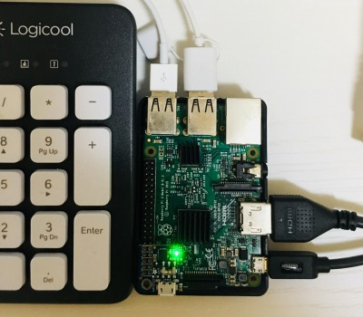

### 前書き

本記事は、[Install Android on his Raspberry Pi](https://howtoraspberrypi.com/install-android-raspberry-pi/)を実践した結果を示します。具体的には、Raspberry Pi3に対して、Android7.1.1とGoogle Play Storeをインストールします。Androidの最新バージョンは、2018年にリリースされた9.x系ですので、やや古いバージョン(2016年時点の最新版)のインストール方法になります。

[](https://developer.android.com/?hl=ja)

余談ですが、最近iPhoneとAndroid機の両刀をしていますが、もうAndroidもOSの出来が成熟していますね。iOSから乗り換えようか、本格的に思案中です。

---


### 開発環境

| **項目** | **機器/Version** | **用途・備考** |
| --- | --- | --- |
| Linux PC | Intel NUC(BOXNUC613SYK、Cortex i3、メモリ32GB) | Debian9.4(stretch)を使用。 |
| ターゲット環境 | Raspberry Pi3 Model B | Androidが動作する環境 |
| ストレージ | MicroSDカード(Silicon Power、16GB、Class10) | Class4以上かつ16GB以上の容量が必要 |
| モニタ | ASUS VZ249H | Linux環境とAndroid環境で共有 |
| MicroSDカードリーダ | マルチカードリーダ(ELECOM) | ー |
| 電源(ターゲット) | microUSB - USBケーブル、iPad mini2用のUSB充電器 | ー |
| 映像/音声 | HDMIケーブル(PS4付属品) | ー |
| 入出力装置 | キーボード、マウス | USB接続タイプ |

---


### Androidイメージ・Google Play Storeインストーラの準備

以下のURLより、ファイルがダウンロードできます。

- [Androidイメージ(and7\_1-tablet-23012017.zip)](https://raspbian-france.fr/download/and7_1-tablet-23012017.zip)
- [Google Play Storeインストーラ(gapps.sh)](http://raspbian-france.fr/download/gapps.sh)

---


### AndroidイメージをSDカードにコピー

CLI(CUI)でSDカードにAndroidイメージをコピーできますが、今回は[Etcher](https://etcher.io/)(SDカードにイメージを書き込むツール)を使用します。ちなみに、Etcherの利点は以下の通りです。

利点

- OSS
- GUI操作(簡単)
- 自動的にイメージの書き込み先(MicroSDカード)を判別
- Linux/Mac/Windowsに対応 


[Etcher](https://etcher.io/)の"Download for Linux x64"よりZIPファイルをダウンロードした後、以下の手順でEtcherをインストールおよび実行します。

```
$ cp ~/Downloads/etcher-1.3.1-linux-x86_64.zip ~/.
$ unzip etcher-1.3.1-linux-x86_64.zip  
   Archive:  etcher-1.3.1-linux-x86_64.zip
   inflating: etcher-1.3.1-x86_64.AppImage  
$./etcher-1.3.1-x86_64.AppImage 
```

以下の実行画面において、\[Select image\]ボタンより"and7\_1-tablet-23012017.zip"を選択した後、\[Flash\]ボタンを押下します。なお、実行者が一般ユーザの場合、rootパスワードの入力が必須です。


\[the\_ad id="598"\]

---


### Android端末を無線接続(Raspberry Pi3のIPアドレス調査)

有線接続時のIPアドレス確認方法が分からなかったため、無線接続での方法を記載します。まず、Raspberry Pi3に以下のデバイスを接続後、電源を投入します。

- MicroSDカード
- HDMIケーブル
- USBキーボード
- USBマウス
- microUSB



無線接続するには、起動画面から\[Setting\]/\[Wifi\]まで移動し、WifiをONにします。その後、WiFi Network(SSID)に対応するパスワードを入力すれば、接続が確立します。接続の確立後、\[Setting\]/\[Wifi\]の歯車マークを押すと、IPアドレスが表示されます。なお、このIPアドレスはGoogle Play Storeのインストール時に使用します。

---


### Google Play StoreをRaspberry Pi3にインストール

ここでの作業は、LinuxからRaspberry Pi3に対して、前手順で調査したIPアドレスで接続し、インストーラであるgapps.sh経由でGoogle Play Storeをインストールします。まず、Google Play Storeインストールに必要な依存パッケージをインストールします。

```
$ sudo apt install android-tools-adb lzip
```

次に、gapps.shのIP接続設定を変更します。

```
$ pwd
/home/nao
$ mkdir android
$ cp ~/Downloads/gapps.sh ~/android/. 
$ cd android
$ vi gapps.sh    (注釈)：テキストエディタはvi以外でも問題ありません。
```

```
#(前略)

SHOW_HELP=false                                                                                                
ADB_ADDRESS="192.168.1.19"  # このIPアドレスを前手順で調べたRapberry Pi3のIPアドレスに変更                                                                                     
ARCHITECTURE="arm"                                                                                             
PACKAGE_NAME="pico"                                                                                            
INIT_FILE="/etc/init.d/gapps"

#(後略)  
```

最後に、gapps.shを実行すれば、Google Play Storeがインストールされます。gapps.shの役割は、Androidの/systemディレクトリ以下に配置するファイルを収集した後に、それらを[adb(Android Debug Bridge)コマンド](https://developer.android.com/studio/command-line/adb.html?hl=ja)を用いてAndroidにコピーします。

なお、以下の手順の実行前に、Rapberry Pi3の電源はON状態にして下さい。gapps.shの実行が終了した後、Raspberry Pi3が再起動すれば成功です。

```
$ chmod a+x ./gapps.sh  
$ sudo ./gapps.sh      (注釈)：スクリプト内部でRaspberry Pi3に自動接続する
```

---


### Google Play Storeの認証(アカウント登録)

再起動したRaspberry Pi3から、Google Play Storeを実行すれば、よくあるアカウント登録手順が表示されます。以降の手順は、不要と思うので説明しません。


---


### ハマった箇所

gapps.shが三回ほど、以下のエラーでコケました。現象としては、rsyncコマンドが何度かエラーを起こした後に、"CANNOT LINK EXECUTABLE "getprop": library "libm.so.6" not found"が延々と出力される状態でした。

```
$ sudo ./gapps.sh
(前略)

 extracting: gapps/pkg/Optional/swypelibs-lib-arm.tar.lz  
 extracting: gapps/pkg/app_densities.txt  
 extracting: gapps/pkg/app_sizes.txt  
 extracting: gapps/pkg/bkup_tail.sh  
 extracting: gapps/pkg/busybox-arm   
 extracting: gapps/pkg/g.prop        
 extracting: gapps/pkg/gapps-remove.txt  
 extracting: gapps/pkg/installer.sh  
 extracting: gapps/pkg/tar-arm       
 extracting: gapps/pkg/unzip-arm     
 extracting: gapps/pkg/zip-arm       
  inflating: gapps/pkg/META-INF/com/android/otacert  
  inflating: gapps/pkg/META-INF/MANIFEST.MF  
  inflating: gapps/pkg/META-INF/CERT.SF  
  inflating: gapps/pkg/META-INF/CERT.RSA  

 * Extracting supplied packages...
 * Creating local system partition...
  - including gapps/tmp/calsync-all/nodpi
  - including gapps/tmp/cnijfilter2-5.20-1-deb/install.sh
rsync: change_dir "/home/nao//gapps/tmp/cnijfilter2-5.20-1-deb/install.sh" failed: Not a directory (20)
rsync error: some files/attrs were not transferred (see previous errors) (code 23) at main.c(1196) [sender=3.1.2]
  - including gapps/tmp/configupdater-all/nodpi
  - including gapps/tmp/defaultetc-common/common
  - including gapps/tmp/defaultframework-common/common
  - including gapps/tmp/devtool-test-subdir/testfile
rsync: change_dir "/home/nao//gapps/tmp/devtool-test-subdir/testfile" failed: Not a directory (20)
rsync error: some files/attrs were not transferred (see previous errors) (code 23) at main.c(1196) [sender=3.1.2]
  - including gapps/tmp/dialerframework-common/common
  - including gapps/tmp/eclipse-installer/artifacts.xml
rsync: change_dir "/home/nao//gapps/tmp/eclipse-installer/artifacts.xml" failed: Not a directory (20)
rsync error: some files/attrs were not transferred (see previous errors) (code 23) at main.c(1196) [sender=3.1.2]
  - including gapps/tmp/extservicesgoogle-all/nodpi
  - including gapps/tmp/extsharedgoogle-all/nodpi
  - including gapps/tmp/gcc-linaro-6.3.1-2017.05-x86_64_arm-linux-gnueabi/arm-linux-gnueabi
  - including gapps/tmp/global-6.5.7/AUTHORS
rsync: change_dir "/home/nao//gapps/tmp/global-6.5.7/AUTHORS" failed: Not a directory (20)
rsync error: some files/attrs were not transferred (see previous errors) (code 23) at main.c(1196) [sender=3.1.2]
  - including gapps/tmp/gmscore-arm/240
  - including gapps/tmp/gmssetup-all/nodpi
  - including gapps/tmp/googlebackuptransport-all/nodpi
  - including gapps/tmp/googlecontactssync-all/nodpi
  - including gapps/tmp/googlefeedback-all/nodpi
  - including gapps/tmp/googleonetimeinitializer-all/nodpi
  - including gapps/tmp/googlepartnersetup-all/nodpi
  - including gapps/tmp/googletts-arm/nodpi
  - including gapps/tmp/gsfcore-all/nodpi
  - including gapps/tmp/gsflogin-all/nodpi
  - including gapps/tmp/home/lnpb
  - including gapps/tmp/linux-4.13.5/COPYING
rsync: change_dir "/home/nao//gapps/tmp/linux-4.13.5/COPYING" failed: Not a directory (20)
rsync error: some files/attrs were not transferred (see previous errors) (code 23) at main.c(1196) [sender=3.1.2]
  - including gapps/tmp/linux-4.14-rc4/COPYING
rsync: change_dir "/home/nao//gapps/tmp/linux-4.14-rc4/COPYING" failed: Not a directory (20)
rsync error: some files/attrs were not transferred (see previous errors) (code 23) at main.c(1196) [sender=3.1.2]
  - including gapps/tmp/linux-4.15.7/COPYING
rsync: change_dir "/home/nao//gapps/tmp/linux-4.15.7/COPYING" failed: Not a directory (20)
rsync error: some files/attrs were not transferred (see previous errors) (code 23) at main.c(1196) [sender=3.1.2]
  - including gapps/tmp/linux-4.9.1/COPYING
rsync: change_dir "/home/nao//gapps/tmp/linux-4.9.1/COPYING" failed: Not a directory (20)
rsync error: some files/attrs were not transferred (see previous errors) (code 23) at main.c(1196) [sender=3.1.2]
  - including gapps/tmp/setupwizarddefault-all/nodpi
  - including gapps/tmp/setupwizardtablet-all/nodpi
  - including gapps/tmp/swypelibs-lib-arm/common
  - including gapps/tmp/vending-arm/240-320-480
  - including gapps/tmp/wqy-microhei/AUTHORS.txt
rsync: change_dir "/home/nao//gapps/tmp/wqy-microhei/AUTHORS.txt" failed: Not a directory (20)
rsync error: some files/attrs were not transferred (see previous errors) (code 23) at main.c(1196) [sender=3.1.2]
 * Waiting for ADB...
 * Pushing system files...
adb: warning: skipping empty directory 'gapps/sys/./testCA/SubCA/certs/'
adb: warning: skipping empty directory 'gapps/sys/./testCA/SubCA/crl/'
adb: warning: skipping empty directory 'gapps/sys/./testCA/crl/'
/system/././: 3199 files pushed. 3 ... MB/s (494798468 bytes in 232.944s)
 * Setting up the package installer...
CANNOT LINK EXECUTABLE "ls": library "libm.so.6" not found
  - 0 package installers found, something is very wrong!
 * Waiting for ADB...
CANNOT LINK EXECUTABLE "getprop": library "libm.so.6" not found
CANNOT LINK EXECUTABLE "getprop": library "libm.so.6" not found
CANNOT LINK EXECUTABLE "getprop": library "libm.so.6" not found

(以下、処理が進まない)
```

この現象の解決策は、  
**「gapps.shが存在するディレクトリ階層に、拡張子がtar.\[g|l|x\]zを置かない事」**

gapps.shがAndroidの/systemディレクトリにコピーするためのファイルを集める流れは、  
　1. カレントディレクトリにgappsディレクトリを作成  
　2. /systemディレクトリに配置したいPackageをtar形式でgapps/pkgディレクトリ以下に収集  
　3. 収集したtarファイルをgapps/tmpディレクトリに展開(★問題箇所)  
　4. gapps/tmpディレクトリの内容からgapps/sys("/system"にコピーする内容)を作成

前述の3番(★)で、gapps/pkgディレクトリ以下のtarballを収集する事が正しいです。しかし、実際はgappsディレクトリの一つ上の階層からtarballを収集し、gapps/tmpディレクトリに展開します。そして、私の環境でToolchainやLinux Kernelなどのtarballがその階層に存在したため、gapps/sysの内容が期待値通りにならなかった事により、エラーとなりました。(根本的には「Toolchainが悪さしたんだろうな」と想像しましたが、時間の無駄なので調査せず)

---


### 後書き

素朴な疑問：AndroidをRaspberry Pi3で動かして、使い物になる？  
答え　　　：**ならない。**

Raspberry Pi3のCPUでは、動作がモッサリもっさりしてて、アプリも頻繁に落ちます。キビキビ動く[Dragonboard410c](http://sp.chip1stop.com/dragonboard410c/)と比較すると、無理して用途を考えないと厳しい印象。なお、起動直後のメモリ使用量は314MB/729MB、ストレージ使用量は9.37GB/14.43GBでした。

直撮り画像で申し訳ありませんが、初期アプリはこんな感じです。Raspberry Pi3でGoogle Play Storeがインストールできる事自体は素晴らしいけど、ダウンロードした他アプリが動作するかどうかは、また別の問題といった感じでした。


