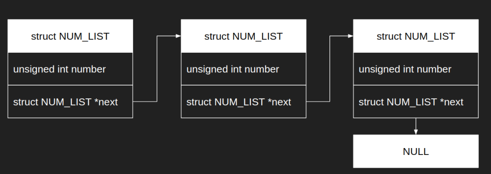
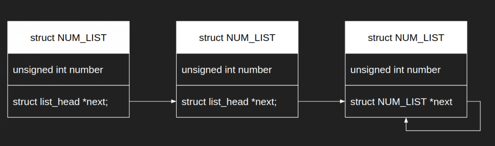

### 前書き

C言語は、言語としてList構造およびList操作APIをサポートしていません。ここでのList構造とは、「次のデータ(前のデータ)へのポインタ」を意味します。本記事では、データとList構造(nextポインタ、prevポインタ)をセットにした状態をノードと呼びます。

List操作APIが無い状態では、大規模なデータ管理が困難になりやすいです。そのため、Linux Kernelは独自のLinked Lists APIを持ちます。Kernel開発を行う上で、List操作の知識は最低限必要な知識です。本記事では、Kernel内部のLinked Lists APIの使い方を以下の順番で説明します。

Linux Kernel Linked Listsの説明順

- 一般的なList構造とその欠点
- Linux KernelのList構造
- List構造の初期化(動的)
- List構造の初期化(静的)
- List構造に要素を追加
- List構造から要素を削除
- List構造からデータを参照
- List構造のシーケンシャル探索(for文)

---


### 一般的なList構造とその欠点

KernelのList構造に触れる前に、一般的なList構造について説明します。C言語の参考書では、List構造は「データ」と密結合の場合が多いです。以下にコード例として、NUM\_LIST構造体を示します。NUM\_LIST構造体は、List構造(nextポインタ)として、NUM\_LIST構造体のポインタを持ちます。

```
struct NUM_LIST{
  unsigned int number;
  struct NUM_LIST *next;
};

```

NUM\_LIST構造体をLinkさせた図は、以下の通りです。3個のノードが結ばれた状態です。



このような密結合のList構造における欠点は、「データ毎(構造体毎)にList操作用のAPIを実装しなければならない」という事です。例えば、NUM\_LIST構造体に対して、要素を追加する関数add\_num\_list(以下)を作成したとします。list\_add\_num()がNUM\_LIST構造体にしか使用できない事は、C言語経験者であれば容易に想像できると思います。

```
struct NUM_LIST * list_add_num(struct NUM_LIST *head, unsigned int num) {
    struct NUM_LIST *new_list = NULL;

    /* 要素を追加する対象のListに対して、NULL確認 */
    if(NULL == head) {
        return NULL;
    }

    /* 新しいList要素用のメモリ確保 */
    new_list = (struct NUM_LIST *)malloc(sizeof(struct NUM_LIST));
    if(NULL == new_list) {
        return NULL;
    }

    /* 追加するList要素にデータをセット */
    new_list->number = num;
    new_list->next   = NULL;

    /* 通常であれば、Listの末尾に要素を挿入しますが、
        今回は引数で渡されたListにそのまま挿入します */
    head->next = new_list;

    return head;
}

```

例えば、"char data\[256\];"を持つCHAR\_LIST構造体を実装した場合、API(上記の例では、list\_add\_num)の再実装が必要です。この点が、密結合のLink構造の欠点(面倒臭さ)と言えます。

---


### Linux KernelのList構造

Linux KernelのList構造は、データと分離されており、粗結合の状態です。定義は、$(Linux Kernel Top Directory)/include/linux/types.hに存在し、以下のような実装です。List構造(list\_head構造体)へのnextポインタ、prevポインタを持つだけのシンプルな内容です。

```
struct list_head {                
    struct list_head *next, *prev;
};                                
```

「一般的なList構造とその欠点」で説明したNUM\_LIST構造体をKernel方式に実装し直すと、以下のような形式になります。基本的には、**データ構造(構造体)の中に、List構造(list\_head構造体)を追加する形**となります。

```
struct NUM_LIST{
  unsigned int number;
  struct list_head list; /* Kernelでは、List化したいデータ構造に、List構造を追加します。*/
};

```

Linux Kernel形式でNUM\_LIST構造体をLinkさせた図(単方向のみLinkさせた図)は、以下の通りです。



Linux Kenel形式のList構造の利点は、データ構造(構造体)に応じて、List操作APIを再実装する必要性が無い事です。この利点は、データ構造とList構造が互いに影響しない事(粗結合である事)によって、実現されています。

勘の良い方は、「List構造をnext->next->...と辿れるけど、肝心のデータにアクセスできないのではないか」と考えたかもしれません。Linux Kernelは、「List構造のポインタ」から「List構造を含むデータ構造体の先頭ポインタ」を得るマクロが用意されています(後述)。そのため、List構造ポインタからデータにアクセス可能です。

---


### List構造の初期化(動的)

Linux Kernel内で、動的にList構造を初期化する場合、INIT\_LIST\_HEADマクロを使用します。初期化例は、以下の通りです。

```
struct list_head list;
INIT_LIST_HEAD(&list);                                                                                  

```

INIT\_LIST\_HEADの定義は、$(Linux Kernel Top Directory)/include/linux/list.hにあり、以下の通りです。list\_head構造体のnextポインタ、prevポインタの指すアドレスを初期化対象のlist\_head構造体自身にします。

```
static inline void INIT_LIST_HEAD(struct list_head *list) 
{                                                         
    WRITE_ONCE(list->next, list);                         
    list->prev = list;                                    
}                                                                                    

```

実装中のWRITE\_ONCEマクロは、GCC最適化によってコードが意図せぬ結果にならないよう、実装段階で防止するAPIです。[Stack overflow](https://stackoverflow.com/questions/34988277/write-once-in-linux-kernel-lists)に、この点に関する回答があります。以下に引用・和訳します。

> Read/write "tearing" : replacing a single memory access with many smaller ones. GCC may (and does!) in certain situations replace something like `p = 0x01020304;` with two 16-bit store-immediate instructions -instead of presumably placing the constant in a register and then a memory access, and so forth. `WRITE_ONCE` would allow us to say to GCC, "don't do that", like so: `WRITE_ONCE(p, 0x01020304);`
> 
> (和訳)
> 
> Read/write処理が"引き裂かれる(分割される)"： 単一のメモリアクセスを多数の小さなメモリアクセスに置き換えます。p=0x01020304のような値を置き換える状況下で、GCCはレジスタの中に定数を格納した後にメモリアクセスする等の代わりに、2つの16bit store immediate命令に置き換える事ができます(そして、そうします！)。WRITE\_ONCEマクロは、私達がGCCに"余計な事をするな！"と言う事ができます。例えば、WRITE\_ONCE(p, 0x01020304);と書く事によって。

\[the\_ad id="598"\]

---


### List構造の初期化(静的)

Linux Kernel内で、静的にList構造を初期化する場合、LIST\_HEADマクロを使用します。ここでの静的とは、List構造(list\_head構造体)の変数宣言時という意味です。LIST\_HEADマクロをコールすると、新しいlist\_head構造体(list)が作成され、初期化済みの状態になります。初期化例は、以下の通りです。

```
LIST_HEAD(list);                                                                                  

```

LIST\_HEADマクロの定義は、$(Linux Kernel Top Directory)/include/linux/list.hにあり、以下の通りです。list\_head構造体の2つの変数(nextポインタ、prevポインタ)に対して、初期化対象のlist\_head構造体アドレスを渡しています。

```
#define LIST_HEAD(name) \                        
    struct list_head name = LIST_HEAD_INIT(name) 

#define LIST_HEAD_INIT(name) { &(name), &(name) }

/* 補足：今回の例では、以下のように読み替えて下さい */
struct list_head name = LIST_HEAD_INIT(name);
　↓
struct list_head list = LIST_HEAD_INIT(name);
　↓
struct list_head list = { &(list), &(list) }  /* List構造を初期化しただけ */

```

---


### List構造に要素を追加

List構造に要素を追加する場合、list\_add()か、list\_add\_tail()を使用します。まず、関数list\_add()の使用例を以下に示します。

```
LIST_HEAD(head);     /* 要素の挿入先 */                                                                                  
LIST_HEAD(new_list); /* 新たに追加したいList構造 */

list_add(&new_list, &head); /* headの後ろにnew_listを連結 */

```

list\_add()には、第一引数に追加対象の要素(list\_head構造体)、第二引数にList構造(list\_head構造体)を指定します。要素の追加先は、第二引数で指定したList構造の次になります。

list\_add()の実装は、$(Linux Kernel Top Directory)/include/linux/list.hに存在します。list\_add()自体はラッパーであり、次に呼ぶ\_\_list\_add()の中でポインタ操作をします。

```
/**                                                                       
 * list_add - add a new entry                                             
 * @new: new entry to be added                                            
 * @head: list head to add it after                                       
 *                                                                        
 * Insert a new entry after the specified head.                           
 * This is good for implementing stacks.                                  
 */                                                                       
static inline void list_add(struct list_head *new, struct list_head *head)
{                                                                         
    __list_add(new, head, head->next);                                    
}

static inline void __list_add(struct list_head *new,
                  struct list_head *prev,           
                  struct list_head *next)           
{                                                   
    next->prev = new;                               
    new->next = next;                               
    new->prev = prev;                               
    WRITE_ONCE(prev->next, new);                    
}                                               

```

list\_add\_tail()には、list\_add()と同じように、第一引数に追加対象の要素(list\_head構造体)、第二引数にList構造(list\_head構造体)を指定します。要素の追加先は、第二引数で指定したList構造の前(=Listの最後尾)になります。使用例は、以下の通りです。

```
LIST_HEAD(head);       /* 要素の挿入先*/                                                                                  
LIST_HEAD(new_list);   /* 新たに追加したいList構造 */
LIST_HEAD(last_list);  /* 最後尾に追加したいList構造 */

list_add_tail(&new_list, &head);  /* headの後ろにnew_listを連結    */
list_add_tail(&last_list, &head); /* headの最後尾にlast_listを連結 */

```

list\_add\_tail()の実装は、以下の通りです。list\_add()と渡しているポインタが異なるだけで、内部的な作りは、殆ど同じです。

```
/**                                                                            
 * list_add_tail - add a new entry                                             
 * @new: new entry to be added                                                 
 * @head: list head to add it before                                           
 *                                                                             
 * Insert a new entry before the specified head.                               
 * This is useful for implementing queues.                                     
 */                                                                            
static inline void list_add_tail(struct list_head *new, struct list_head *head)
{                                                                              
    __list_add(new, head->prev, head);                                         
}                                                                              

static inline void __list_add(struct list_head *new,
                  struct list_head *prev,           
                  struct list_head *next)           
{                                                   
    next->prev = new;                               
    new->next = next;                               
    new->prev = prev;                               
    WRITE_ONCE(prev->next, new);                    
}                                               

```

---


### List構造から要素を削除

List構造から要素を削除する場合、list\_del()を使用します。使用方法は、削除対象のList構造(list\_head構造体)を引数として渡すだけです。しかし、削除と言いつつ、ポインタの連結を変更しているだけなので、データ構造が確保していたメモリは解放されません。そのため、list\_del()を呼ぶ前に、データ構造が使用したメモリを解放しなければいけません。

以下、list\_del()の使用例です。

```
LIST_HEAD(head);       /* 要素の挿入先*/                                                                                  
LIST_HEAD(new_list);   /* 新たに追加したいList構造 */
LIST_HEAD(last_list);  /* 最後尾に追加したいList構造 */

list_add_tail(&new_list, &head);  /* headの後ろにnew_listを連結    */
list_add_tail(&last_list, &head); /* headの最後尾にlast_listを連結 */

list_del(&last_list);     /* 削除したいList構造のポインタを渡す */

```

list\_del()の実装は、$(Linux Kernel Top Directory)/include/linux/list.hに存在します。list\_add()と同じく、list\_del()自体はラッパーであり、次に呼ぶ\_\_list\_del()の中でポインタ操作をします。実装中のLIST\_POISON1/LIST\_POISON2は、誤って削除済みのList構造にアクセスした際に気づく事ができるよう、削除済みのList構造が持つポインタにNULL以外のアドレスを代入しています。

```
static inline void list_del(struct list_head *entry)
{                                                   
    __list_del(entry->prev, entry->next);           
    entry->next = LIST_POISON1;                     
    entry->prev = LIST_POISON2;                     
}                                                   

/*                                                                             
 * Delete a list entry by making the prev/next entries                         
 * point to each other.                                                        
 *                                                                             
 * This is only for internal list manipulation where we know                   
 * the prev/next entries already!                                              
 */                                                                            
static inline void __list_del(struct list_head * prev, struct list_head * next)
{                                                                              
    next->prev = prev;                                                         
    WRITE_ONCE(prev->next, next);                                              
}                                                                                                        

```

---


### List構造からデータを参照

List構造からデータを参照するには、list\_entry()を使用します。list\_entry()は、「List構造(list\_head構造体)のポインタ」から「List構造を含むデータ構造体の先頭ポインタ(例：前述のNUM\_LIST構造体の先頭ポインタ)」を得る事ができます。

以下に、使用例(疑似コードチック)を示します。

```
struct NUM_LIST{
  unsigned int number;
  struct list_head list;
};

struct NUM_LIST *head;
struct NUM_LIST *get_list;

/* NULLチェック省略 */
head = kmalloc(sizeof(struct NUM_LIST), GFP_KERNEL);
head->number = 1;

/* 変数get_listに、変数head(NUM_LIST構造体の先頭ポインタ)が代入されます。
   変数headと変数get_listが、それぞれ別関数で宣言されていても、同じ挙動になります。*/
get_list = list_entry(head->list, struct NUM_LIST, list);

get_list->number = 3; /* head->numberのデータ書き換えと同じ */
 

```

list\_entry()の実装は、$(Linux Kernel Top Directory)/include/linux/list.hに存在します。以下に示す通り、list\_entryはcontainer\_ofマクロを呼ぶためのラッパーです。第一引数ptrには構造体のメンバポインタ、第二引数typeには第一引数ptrが指す構造体メンバを含む構造体名、第三引数memberには第一引数ptrが指す構造体メンバの名称を渡します。

```
/**                                                      
 * list_entry - get the struct for this entry            
 * @ptr:    the &struct list_head pointer.               
 * @type:   the type of the struct this is embedded in.  
 * @member: the name of the list_head within the struct. 
 */                                                      
#define list_entry(ptr, type, member) \                  
    container_of(ptr, type, member)                                                                                                                          

```

container\_ofマクロの仕様に関しては、別記事で詳細に記載しています。

- [Linux Kernel: 構造体メンバポインタから構造体の先頭ポインタを得るcontainer_ofマクロ](https://debimate.jp/post/2019-04-06-linux-kernel-%E6%A7%8B%E9%80%A0%E4%BD%93%E3%83%A1%E3%83%B3%E3%83%90%E3%83%9D%E3%82%A4%E3%83%B3%E3%82%BF%E3%81%8B%E3%82%89%E6%A7%8B%E9%80%A0%E4%BD%93%E3%81%AE%E5%85%88%E9%A0%AD%E3%83%9D%E3%82%A4/)

---


### List構造のシーケンシャル探索(for文)

List構造のシーケンシャル探索(for文)には、list\_for\_each\_entry()を使用します。List構造用のfor文は複数個ありますが、今回は一つだけの紹介とします。

以下に使用例(疑似コードチック)を示します。

```
struct NUM_LIST{
  unsigned int number;
  struct list_head list;
};

struct NUM_LIST *head;
struct NUM_LIST *itr;

/* NULLチェック省略 */
head = kmalloc(sizeof(struct NUM_LIST), GFP_KERNEL);
head->number = 1;

list_for_each_entry(itr, &head->list, list) {
    printk(KERN_WARNING "Number=%d\n", itr->number);
} 

```

list\_for\_each\_entry()の実装は、$(Linux Kernel Top Directory)/include/linux/list.hに存在します。以下に示す通り、第一引数posにはループカーソル(iterator)となるデータ構造体ポインタ、第二引数にはList構造のhead(先頭)、第三引数にはデータ構造体に含まれるList構造(list\_head構造体)の名称を渡します。

```
/**                                                              
 * list_for_each_entry  - iterate over list of given type      
 * @pos:    the type * to use as a loop cursor.                  
 * @head:   the head for your list.                              
 * @member: the name of the list_head within the struct.         
 */                                                              
#define list_for_each_entry(pos, head, member)              \    
    for (pos = list_first_entry(head, typeof(*pos), member);    \
         &pos->member != (head);                    \            
         pos = list_next_entry(pos, member))                     

/**                                                                            
 * Retrieve the first list entry for the given list pointer.                   
 *                                                                             
 * Example:                                                                    
 * struct foo *first;                                                          
 * first = list_first_entry(&bar->list_of_foos, struct foo, list_of_foos);     
 *                                                                             
 * @param ptr The list head                                                    
 * @param type Data type of the list element to retrieve                       
 * @param member Member name of the struct list_head field in the list element.
 * @return A pointer to the first list element.                                
 */                                                                            
#define list_first_entry(ptr, type, member) \                                  
    list_entry((ptr)->next, type, member)                                      

#define list_entry(ptr, type, member) \
    container_of(ptr, type, member)    

/**                                                       
 * list_next_entry - get the next element in list         
 * @pos:    the type * to cursor                          
 * @member: the name of the list_head within the struct.  
 */                                                       
#define list_next_entry(pos, member) \                    
    list_entry((pos)->member.next, typeof(*(pos)), member)

```

list\_for\_each\_entry()は、for文を作成しているだけです。前提として、C言語のfor文は、"for (初期化; 条件式; 変化式)"で表されます。

まず、for文の初期化部分は、list\_first\_entry()でList構造(list\_head構造体)の先頭ポインタ(iterator)を取得しています。次に、条件式は「データ構造が持つList構造が指すポインタ」!=「List構造体の先頭ポインタ」です。最後に、変化式はlist\_next\_entry()で、iteratorを次のList構造ポインタに変更しています。

---


### 最後に

本記事で説明した内容で、Linked Listを用いたDevice Driverを作成しています。Listの使い方をより具体的に知りたい場合は、以下の記事を確認して下さい。

- [Linux Kernelの簡単なCharacter Deviceを作成する方法(Linked List APIの使用方法サンプル)](https://debimate.jp/post/2019-06-23-linux-kernel%E3%81%AE%E7%B0%A1%E5%8D%98%E3%81%AAcharacter-device%E3%82%92%E4%BD%9C%E6%88%90%E3%81%99%E3%82%8B%E6%96%B9%E6%B3%95linked-list-api%E3%81%AE%E4%BD%BF%E7%94%A8%E6%96%B9%E6%B3%95%E3%82%B5/)

本記事が説明しているLinux KernelのList操作APIは、必要最低限な内容のみです。他にも、Linux Kernelには、List操作用のAPIが定義されています。今後、List操作APIの第二弾として、別記事を作成予定です。
