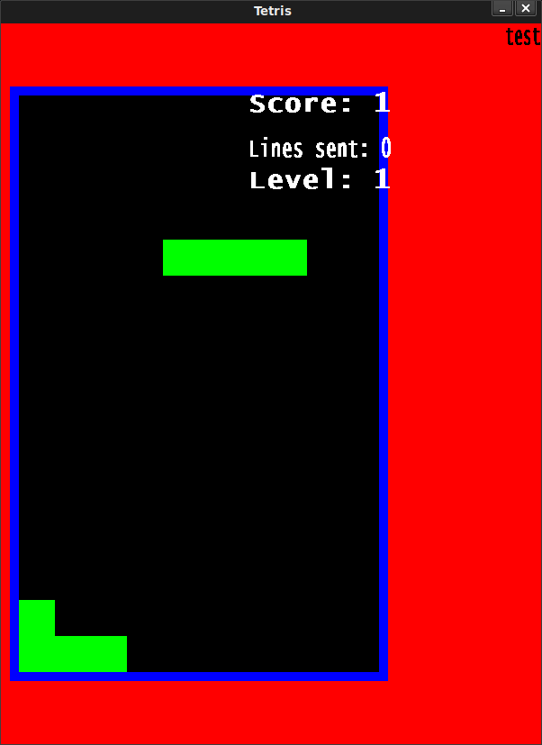

### Rustアプリを写経できる数少ない書籍の一つ

私は、2018年に"OSS + オライリー本(下画像のカニ本)"によるRust独学で、学習を断念しました。Rustは学習曲線が急勾配で、最初の100時間はつまづきやすいです。コンパイラが引くほどエラーを出します。残業後に勉強する私は、そのエラーと向き合う体力がありませんでした。

[Rustはネット上に小規模なサンプルコード](https://doc.rust-jp.rs/rust-by-example-ja/index.html)が存在します。この内容を見て、勉強できる人は居るかもしれません。私は、コードが小規模すぎて、難所である変数のライフタイムを身につけられませんでした。このような経験を踏まえて、**「Rustは写経から始めよう！」**と心に誓っていました。

<iframe style="width:120px;height:240px;" marginwidth="0" marginheight="0" scrolling="no" frameborder="0" src="//rcm-fe.amazon-adsystem.com/e/cm?lt1=_blank&amp;bc1=000000&amp;IS2=1&amp;bg1=FFFFFF&amp;fc1=000000&amp;lc1=0000FF&amp;t=debimate07-22&amp;language=ja_JP&amp;o=9&amp;p=8&amp;l=as4&amp;m=amazon&amp;f=ifr&amp;ref=as_ss_li_til&amp;asins=4873118557&amp;linkId=bf1975d5a4cd7ee245afee61dd18b8ea"></iframe>

しかし、Rustは2015年に安定版がリリースされたばかりで、書籍の絶対数が少ないです。そんな中で、私の希望を満たしてくれた書籍は、"Rust Programming By Example(洋書)"でした。本書籍は、3種類のアプリ作成を通して、Rustにおける「ファイル入出力」や「GUI([SDL2](https://ja.wikipedia.org/wiki/SDL)と[GTK+3](https://ja.wikipedia.org/wiki/GTK%2B))の使い方」などの基本を説明します。当然、ライフタイムなどのRust固有文法に関しても説明があります。

作成するアプリ(それぞれ約500Step)

- テトリス
- MP3プレイヤー
- FTPアプリ

本書は、コンソールに閉じ困らず、最初からGUIアプリを作成するため、アプリを動かした時の達成感が大きいです。私はMP3プレイヤー、FTPアプリを作成した経験がなかったので、それらの仕組みを知る上でも良い書籍でした。巻末には、RustのBest Practiceも記載されています。洋書に抵抗がなくて、Rustで写経したい方にはオススメです。ただし、誤記(後述)が多いので、購入する場合はその点を把握しておいた方が良いです。

<iframe style="width:120px;height:240px;" marginwidth="0" marginheight="0" scrolling="no" frameborder="0" src="//rcm-fe.amazon-adsystem.com/e/cm?lt1=_blank&amp;bc1=000000&amp;IS2=1&amp;bg1=FFFFFF&amp;fc1=000000&amp;lc1=0000FF&amp;t=debimate07-22&amp;language=ja_JP&amp;o=9&amp;p=8&amp;l=as4&amp;m=amazon&amp;f=ifr&amp;ref=as_ss_li_til&amp;asins=B075V9B2JH&amp;linkId=1db5e8901c3c214d62c89fb0b09dbdda"></iframe>

---

### 本書の欠点：ビルドが通らないか、バグがある

本書を読み進めていく内に、致命的な欠点に気づくと思います。そう、コードがビルドエラーを起こします。書籍中のコードとGitHub上のコードを見比べて、自分の力でコードを修正しなければいけません。やっとの事でビルドを通すと、バグに気づきます。

本書のコードに関するミス

- 書籍中のコードに抜けがあり、[GitHub上のコード](https://github.com/PacktPublishing/Rust-Programming-By-Example)を見ないと、ビルドエラー
- 書籍とGitHubで、関数仕様が違う
- GitHub上のテトリスは修正しないと、ビルドが通らない
- GitHub上のテトリスはバグがあり、アプリが落ちるか、ブロックが正しく置けない
- MP3プレイヤーは、GitHubにコードがない(Chapter5, 6, 7, 10のコードがない)

\[the\_ad id="598"\]

テトリスに関しては、下画像を見れば、スコアの配置がおかしい事に気づくと思います。さらに、最も右側にブロックが置けません。ブロックも正しく重なりません。これらの不具合は写経ミスではなく、GitHub上のコードで同じ現象が発生します。

初心者向けの書籍で、ビルドエラーが起きてしまう状態は残念です。編集や共著者とのクロスチェックを真面目にやれば、防げたミスだと思います。
