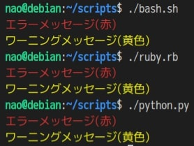

### 前書き

自動化Script作成時に、Bash (Shell Script)ではなく、RubyやPython3を用いた方がScriptのメンテナンス負荷が低くなります。自動化Scriptに使用するプログラミング言語変更を目的として、各言語の実装を比較します。

本記事では、ANSIエスケープシーケンスを用いた出力文字色の変更方法を比較します。比較では、実装例および実行例をそれぞれ示します。

Bashではなく、RubyやPython3を使った方が好ましい理由は、以下の記事に記載しています。この記事には、各プログラミング言語の様々な実装（ディレクトリ操作やファイル操作など）を比較した他記事へのリンクを一覧にまとめています。

- [Bash(Shell Script)からRubyやPythonに乗り換え！頻繁に使う処理を各言語で比較](https://debimate.jp/post/2020-04-05-bashshell-script%E3%81%8B%E3%82%89ruby%E3%82%84python%E3%81%AB%E4%B9%97%E3%82%8A%E6%8F%9B%E3%81%88%E9%A0%BB%E7%B9%81%E3%81%AB%E4%BD%BF%E3%81%86%E5%87%A6%E7%90%86%E3%82%92%E5%90%84%E8%A8%80/)

---


### 各言語のVersion

- Bash：GNU bash, バージョン 5.0.3(1)-release
- Ruby：ruby 2.5.5p157 (2019-03-15 revision 67260)
- Python：Python 3.7.3

---


### ANSIエスケープシーケンスの一覧

ANSIエスケープシーケンスでは、ターミナルに表示される文字色や背景色の変更、文字の強調などができます。以下に、文字色設定の一例を示します。

| **No.** | **文字色** | **ANSIエスケープシーケンス** |
| :-- | :-- | :-- |
| 1 | 黒 | "\\033\[30m" |
| 2 | 赤 | "\\033\[31m" |
| 3 | 緑 | "\\033\[32m" |
| 4 | 黄 | "\\033\[33m" |
| 5 | 青 | "\\033\[34m" |
| 6 | マジェンタ | "\\033\[35m" |
| 7 | シアン | "\\033\[36m" |
| 8 | 白 | "\\033\[37m" |
| 9 | 元の文字色に戻す | "\\033\[0m" |

出力例は、以下の通りです。


---


### 比較：出力文字色の変更方法

自動化Scriptでは、ユーザに分かりやすくするために、警告メッセージやエラーメッセージの文字色をデフォルト色から変更する事があります。

以下に、各言語の実装例および実行例を示します。

**Bashの場合**

```
#!/bin/bash

# 第一引数の文字列を赤字で出力する。
function errMsg() {
    local message="$1"
    # -nオプション：改行なし
    # -eオプション：バックスラッシュによるエスケープシーケンスを解釈する。
    # \033[31m　　：文字色を赤に変更
    echo -n -e "\033[31m"

    echo "${message}"

    # \033[31m：文字色を元に戻す。
    echo -n -e "\033[m"
}

function warnMsg() {
    local message="$1"

    # \033[33m：文字色を黄色に変更
    echo -n -e "\033[33m"

    echo "${message}"

    # \033[31m：文字色を元に戻す。
    echo -n -e "\033[m"
}

errMsg "エラーメッセージ(赤)"
warnMsg "ワーニングメッセージ(黄色)"
```

**Rubyの場合**

```
#!/usr/bin/env ruby

# Rubyは、color_echo(※)というGemで文字色を変更できる。
# ※ http://colorecho.github.io/ja/
# 本記事ではcoloe_echoを用いず、Bashと同じ方法で文字色を変更する。
def err_msg(message)
  print("\033[31m") # \033[31m：文字色を赤に変更
  puts(message)
  print("\033[31m") # \033[31m：文字色を元に戻す。
end

def warn_msg(message)
  print("\033[33m") # \033[33m：文字色を赤に変更
  puts(message)
  print("\033[31m") # \033[31m：文字色を元に戻す。
end

err_msg("エラーメッセージ(赤)")
warn_msg("ワーニングメッセージ(黄色)")

```

**Python3の場合**

```
#!/usr/bin/env python3

def err_message(message):
    # \033[31m：文字色を赤に変更
    # \033[31m：文字色を元に戻す。
    print("\033[31m%s\033[0m" % message)

def warn_message(message):
    # \033[33m：文字色を黄色に変更
    # \033[31m：文字色を元に戻す。
    print("\033[33m%s\033[0m" % message)

err_message("エラーメッセージ(赤)")
warn_message("ワーニングメッセージ(黄色)")

```

\[the\_ad id="598"\]

**Bash、Ruby、Python3の実行例**


