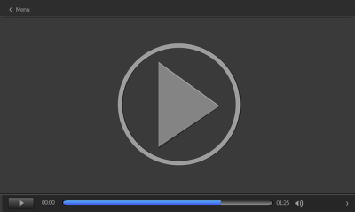

### 前書き

本記事では、メインPCをLinuxに変えて良かった事／不便だった事を紹介します。

前提情報ですが、私のPC使用歴はWindowsが18年（Win2000〜Win10）、Macが8年（OS X 10.8〜macOS 10.15）、Linuxが4年（Debian8〜10）です。WindowsとLinuxは仕事で使用しており、ターミナルでのコマンド操作（CLI）に苦手意識はありません。むしろ、CLIが好きです。

そんな私がメインPCをLinuxに置き換えた3年間で感じた事をジャンル毎にコメントしていきます。各ジャンルの先頭（見出し）に「◯：快適、△：少しだけ不満あり、☓：不便」とザックリ評価を付けています。　　　　　　　　

---

### △音楽

音楽は作曲／鑑賞という2つの観点がありますが、私は作曲ができないので、鑑賞に関してのみコメントします。

音楽鑑賞に関しては、オールマイティなミュージックアプリが無い点が不満です。iTunesやMedia Go相当のアプリがないと言えば分かりやすいでしょうか。

例えば、

- 音楽CDの取り込み
- Flacやmp3のタグ管理（アルバムジャケットや曲情報の付与）
- アルバム情報の自動取得
- 歌詞情報の表示
- 楽曲再生

のような機能を単一のアプリで完結できません。

私は、音楽CDの取り込みとアルバム情報の取得には[Asunder CD Ripper](http://littlesvr.ca/asunder/)、タグ管理には[EasyTAG](https://wiki.gnome.org/Apps/EasyTAG)、歌詞情報の表示や楽曲再生は[Lollypop](https://wiki.gnome.org/Apps/Lollypop)（上の画像）もしくは[Clementine](https://www.clementine-player.org/ja/)をLinuxで使っています。これらが一つに集約され、かつ機能面が優れているアプリがあれば文句なしです。

ただし、上記のような音楽との向き合い方は、やや古いスタイルです。ストリーミングやデジタル配信で生活している人は、あまり音楽面で不満が出ないかも知れません。

---

### △動画（☓編集、◯再生）

動画も音楽同様、編集／鑑賞という2つの観点があります。

動画編集面では、LinuxはAdobeアプリが動作しないデメリットがあります。このデメリットを乗り越えるために、[WINE](https://www.winehq.org/)（WinアプリをLinux上で動作させるアプリ）を駆使しても、その努力は報われません。

最終的に、仮想化ソフト（[Virtual Box](https://www.virtualbox.org/)など）でWindowsを動かし、Windows上でAdobeアプリを動かす羽目になります。補助ツールであるWacomペンタブレットも性能を完全に引き出せるドライバが少ないので、Linuxではデザイン関係の作業は厳しいと認識しておいた方が良いです。

その一方で、動画再生面では一般的な拡張子の動画やストリーミングサービスは問題なく再生できます。日常生活では、ほぼ困らないと思います。例えば、

- AVI、MP4、MKV、MPEG、MOV、DivX、H.264などの動画ファイル
- YouTube
- Amazon Prime
- FANZA

などの動画はLinuxで再生できます。

私は気にしていませんが、Linuxにおける動画再生での唯一のデメリットは、利用可能なBlu-rayプレイヤーアプリが存在しない事です。Blu-rayを沢山お持ちの方は、この点に注意してください。

---

### ◯ネットサーフィン／ブラウザ

ブラウザはOSによる差が少ないため、Linuxでも非常に快適です。Linuxだから見れないサイトは、今まで遭遇した事がありません。

Google Chrome、Fire Foxを普段使いしている方であれば、Linuxに移行しても困る事はないでしょう。その一方で、WindowsのIE／Edge、MacのSafariはLinuxに存在しないので、これらのブラウザユーザはLinuxに移行すると各種データの移行作業が発生して辛いかも知れません。

\[the\_ad id="598"\]

---

### ☓Office

Linuxには、様々なOfficeアプリがあります。

- [LibreOffice](https://ja.libreoffice.org/)
- [Google Docs](https://www.google.com/intl/ja_jp/docs/about/)
- [WPS Office for Linux](https://www.wps.com/linux)

上記のアプリは全て完成度が高いですが、細かい挙動が気になります。「文字化けする」「マクロがない」「配置変更が思ったようにできない」など、色々不満がでてきます。

最大の不満は、慣れ親しんだMicrosoft Officeとの差異全てです。大学・仕事で慣れ親しんだMicrosoft Officeと挙動が異なるというのは、私にとってかなり苦痛です。生産性がかなり落ちます。

「私は気にならない」もしくは「家でOfficeを使わない」という方がいらっしゃるとは思いますが、LinuxのOfficeに関する個人的な評価は☓とさせていただきました。

---

### ◯プログラミング

Win／Mac／Linuxの中で、Linuxがダントツで最高。

パッケージマネージャが優秀なので、環境構築をCLIで完結できるのがLinuxの強み。MacもUNIX系ですが、環境構築手順からMacが省かれている事も多々あり、Linuxの方がより好ましいと言えます。

開発機とみなした場合のLinuxは、かなり優秀です。Linuxには各種エディタ、統合開発環境、作図ツール、Docker、DBなどの様々な開発ツールがあり、開発で何かが足りないと感じた事はありません。C#やSwiftが（ほぼ）使えないぐらいですが、これらの言語を使う人はLinuxをメインPCにしようと考えないでしょう。

Linuxばかりを持ち上げていますが、最近のWindowsも好印象です。[WSL2](https://docs.microsoft.com/ja-jp/windows/wsl/)、[Docker](https://www.docker.com/)、[Windows Package Manager](https://github.com/microsoft/winget-cli)、[Windows Terminal](https://github.com/microsoft/terminal)など、開発に役立つツールが続々と公開されているので、近い将来にメインPCをWindowsに戻す可能性があるかも知れません（およそ10年ぶり）。

---

### ☓ゲーム

LinuxはAAAタイトルゲームがない。

90年代からゲーム資産を築き上げてきたWindowsと比較して、Mac／Linuxはゲームの絶対数が少ないです。FPSからエロゲまで幅広くカバーしているWindows。有名タイトルのクローンやエミュしか期待できないMac／Linux。ユーザの絶対数が少ないOSには、有名タイトルがリリースされない悲しい現実。

そんな中で唯一の希望は、2012年からLinuxに公式対応している[Steam](https://store.steampowered.com/?l=japanese)です！Steamでは、[Linux上でWindows向けPCゲームを動かす活動が報告されており、2018年時点で6500タイトルがLinux上で動いた](https://gigazine.net/news/20200421-proton-brought-6000-games-linux/)ようです。

なお、Steamをインストールしたい方がいらっしゃれば、以下の記事で手順を紹介しています。

- [【環境構築】Debian 10にSteamをインストールする方法：glXChooseVisual failedエラー回避](https://debimate.jp/post/2020-08-28-%E7%92%B0%E5%A2%83%E6%A7%8B%E7%AF%89debian-10%E3%81%ABsteam%E3%82%92%E3%82%A4%E3%83%B3%E3%82%B9%E3%83%88%E3%83%BC%E3%83%AB%E3%81%99%E3%82%8B%E6%96%B9%E6%B3%95glxchoosevisual/)

---

### △システム／デスクトップ環境

Windowsのような半強制Windows Updateが存在しないだけでも、Linuxは素晴らしいです。

ただ、やっぱりGUI周りが弱い（不親切）かな、という気がします。

デスクトップ環境をWindows風、Mac風など色々カスタマイズできるのは強みかも知れませんが、どの環境も基本的なGUI機能が押さえられていない印象が拭えません。種類が多いのは良いですが、「開発リソースを集約して、より良いデスクトップ環境を一つ作った方がエンドユーザは幸せではないか」と考えてしまいます。

ちなみに、システムやGUI機能での不満の例は、

- サスペンド後に、一部アプリが動かない
- サスペンド後に、Bluetoothペアリングができない
- 画面のクラッシュ（2015〜2016年ごろのUbuntuに見られた現象）

でしょうか。そこまで深刻な不満は少ないですが、些細な不満が多々あります。

---

### 最後に

それぞれのOSの利点は、Windowsはエロゲ、Macはデザイン、Linuxはプログラミング。

初めてLinux PCを作る時、自作PCは止めましょう。何らかのWindows PCをLinuxで潰す方が簡単です。自作PCをLinuxにすると、以下の記事のようにハマって大変です（大変だった）。

- [Debian10をRyzen 3800X環境で動かそうとしてハマった内容(グラボ必須、BIOS設定、Kernel設定)](https://debimate.jp/post/2019-09-29-debian10%E3%82%92ryzen-3800x%E7%92%B0%E5%A2%83%E3%81%A7%E5%8B%95%E3%81%8B%E3%81%9D%E3%81%86%E3%81%A8%E3%81%97%E3%81%A6%E3%83%8F%E3%83%9E%E3%81%A3%E3%81%9F%E5%86%85%E5%AE%B9%E3%82%B0%E3%83%A9%E3%83%9C/)
