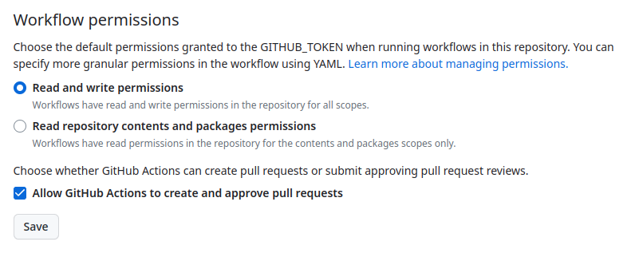
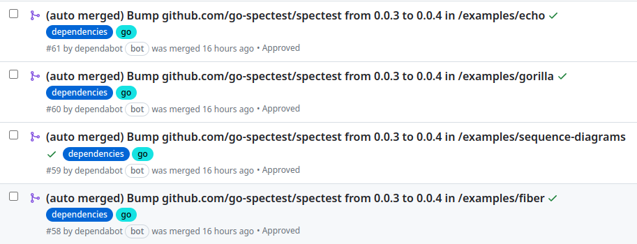

### 前書き

今どきは、zero dependency（依存なし）で開発を進めるよりも、便利なOSS（ライブラリ）を利用してサクッと開発する方が多いのではないでしょうか。他の人が開発したライブラリは日々改良されていくので、ライブラリ更新をサボっていると「自分のOSSが知らない間に動かなくなってしまった！」という状況になるかもしれません。

このような問題を防ぐために、Dependabotでライブラリ更新を監視する対応策があります。私は、趣味のOSS開発でDependabotを採用しており、Dependabotが定期的に「Bump〜」から始まるPRを作り、ライブラリの更新を教えてくれます。便利ですね。


……が、OSSを何十個も作っていると、Bump地獄に見舞われます。無心でPRをポチポチマージして回る羽目になります。気合をいれて開発中のOSSならまだしも、「もう自分も使ってないんだよな、このOSS」という温度感の場合でもライブラリ更新PRを手動マージしなければいけません。

この課題を解決する案として、「GitHub Actionsが全て成功している」かつ「パッチ／マイナーアップデート」の場合は、Dependabotが作成したPRを自動マージする方法があります。本記事では、この方法を説明します。

---


### 自動PRマージ用のGitHub Actionsを作成

まず、[GitHub公式手順のリンク](https://docs.github.com/en/code-security/dependabot/working-with-dependabot/automating-dependabot-with-github-actions#enable-auto-merge-on-a-pull-request)を貼るので、こちらを合わせてご確認ください。

今回の方法では、GitHub ActionsがPRをマージする権限を持っている必要があります。この権限を確認するには、GitHubのリポジトリページを開き、\[Setting\] > \[Actions\] > \[General\] > \[Workflow Permission\]を確認してください。

以下の画像のように、"Allow GitHub Actions to create and approve pull requests"がONになっている必要があります。



また、GitHub Actionsのテストが通ったときのみ、マージできる設定を有効化します。\[Setting\] > \[Branch protection rule\] > \[Require status checks to pass before merging\] を有効化し、任意のGitHub Actionsを指定します。今回はユニットテストを指定しています。


続いて、Dependabotが作成したPRを自動マージするGitHub Actionsワークフローを作成します。今回は、\`.github/workflows/auto-merged.yml\`に以下の設定を書きます。

```
name: Dependabot automation

# https://docs.github.com/en/code-security/dependabot/working-with-dependabot/automating-dependabot-with-github-actions#enable-auto-merge-on-a-pull-request
on:
  pull_request:
    types:
      - opened

permissions:
  pull-requests: write # need to approve/merge
  contents: write # need to merge
  issues: write # need to append label
  repository-projects: write # need to change pull request title

jobs:
  dependabot-automation:
    runs-on: ubuntu-latest
    if: ${{ github.actor == 'dependabot[bot]' }}
    timeout-minutes: 15
    steps:
      - name: Dependabot metadata
        id: metadata
        uses: dependabot/fetch-metadata@v1.6.0
        with:
          GITHUB_TOKEN: ${{ secrets.GITHUB_TOKEN }}
      - name: Approve & enable auto-merge for Dependabot PR
        if: |
          steps.metadata.outputs.update-type == 'version-update:semver-patch' ||
          steps.metadata.outputs.update-type == 'version-update:semver-minor'
        run: |
          gh pr review --approve "$PR_URL"
          gh pr edit "$PR_URL" -t "(auto merged) $PR_TITLE"
          gh pr merge --auto --merge "$PR_URL"
        env:
          PR_URL: ${{ github.event.pull_request.html_url }}
          PR_TITLE: ${{ github.event.pull_request.title }}
          GITHUB_TOKEN: ${{ secrets.GITHUB_TOKEN }}
```

---


### GitHub Actions ワークフローの詳細

最初の設定は、PR作成時にワークフローが開始されることを意味します。

```
name: Dependabot automation

# https://docs.github.com/en/code-security/dependabot/working-with-dependabot/automating-dependabot-with-github-actions#enable-auto-merge-on-a-pull-request
on:
  pull_request:
    types:
      - opened

```

次の権限設定は、主にPRのapprovalとmerge、PRタイトル変更に必要な権限です。

```
permissions:
  pull-requests: write # need to approve/merge
  contents: write # need to merge
  issues: write # need to append label
  repository-projects: write # need to change pull request title

```

今回の自動PRマージが正常に動作すると、下図のように"(auto merged)"というプレフィックスがPR名に付きます。このようなPR名変更に必要な権限設定も、上記の設定に含まれています。



次は、ジョブの設定です。Ubuntu最新版を使用し、DependabotがPR作成者の場合にのみ実行します。なお、タイムアウト値に特に意味はありません。

```
jobs:
  dependabot-automation:
    runs-on: ubuntu-latest
    if: ${{ github.actor == 'dependabot[bot]' }}
    timeout-minutes: 15
```

最後は、Dependabotのメタデータを取得し、パッチもしくはマイナーアップデートの場合はPRをapprovalし、PR名を変更した後にマージを行います。

```
    steps:
      - name: Dependabot metadata
        id: metadata
        uses: dependabot/fetch-metadata@v1.6.0
        with:
          GITHUB_TOKEN: ${{ secrets.GITHUB_TOKEN }}
      - name: Approve & enable auto-merge for Dependabot PR
        if: |
          steps.metadata.outputs.update-type == 'version-update:semver-patch' ||
          steps.metadata.outputs.update-type == 'version-update:semver-minor'
        run: |
          gh pr review --approve "$PR_URL"
          gh pr edit "$PR_URL" -t "(auto merged) $PR_TITLE"
          gh pr merge --auto --merge "$PR_URL"
        env:
          PR_URL: ${{ github.event.pull_request.html_url }}
          PR_TITLE: ${{ github.event.pull_request.title }}
          GITHUB_TOKEN: ${{ secrets.GITHUB_TOKEN }}
```

---


### ライブラリを自動マージすると危険ではないか？

ライブラリを自動マージするリスクは、当然あります。ケースバイケースなので、各自で判断基準を設けてください。

前提として、[セマンティックバージョニング](https://semver.org/lang/ja/)ではパッチ／マイナーアップデートの場合は破壊的な変更が含まれていない筈です。しかし、一部の開発者はセマンティックバージョンのルールに従わず適当にバージョンを切ることもあります。私です。

また、メジャー番号が0の場合（例：v0.0.1の場合）、破壊的な変更がバージョンアップで含まれることがあります。このようなケースでも、ユニットテスト（GitHub Actions）が通れば自動マージされてしまいます。

とは言え、ユニットテスト（GitHub Actions）が通っていれば安心して軽率マージしてしまう人も居るでしょうし、ChangeLogを真面目に読んでも好ましくない変更をマージすることもあるでしょう。結局、自動マージと変わらない対応をすることもある筈です。

大事なのは、リリース前にQAをすることだと考えています。GitHubでタグを切ったり、リリースバージョンを公開する前に、QA（主にリグレッション）結果に問題がなければ良いかなと割り切って考えてます。

あとは、仕事と趣味で対応方針を変えるべきです。私の場合、趣味のOSSは利用者が少ないので楽ができる方針にガンガン倒します。でないと管理できないので……仕事の場合は、厳密にチェックします。怪しいパッケージとか信用していない開発者のライブラリ更新は、要チェックします。

---


### 最後に

何も考えずにマージしたいなら、ユニットテストでガンガン虐めるべきです。
