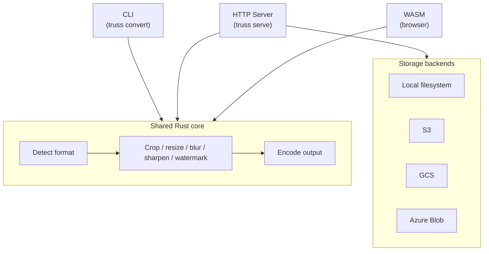
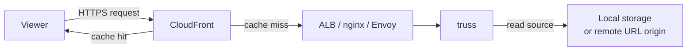

### 前書き

画像処理ツール [nao1215/truss](https://github.com/nao1215/truss) を開発したので、紹介します。読みは、「トラス」です。

truss は、画像の変換（拡張子変更）、リサイズ、ぼかし、透かし、切り抜き等ができるツールであり、JPEG、PNG、WebP、AVIF、BMP、SVG に対応しています。クロスプラットフォーム対応（Linux, macOS, Windows）であり、CLI・サーバー・Wasm で動作します。

下図が示す通り、CLI・サーバー・Wasm はコアとなるライブラリを共有しており、サーバーはローカルストレージか、クラウドストレージ（AWS、Azure、Google Cloud）を利用できます。ただし、クラウドストレージはモックを使ったテストしかしておらず、実環境での動作はまだ未確認です。Wasmは、[GitHub Pages でデモ](https://nao1215.github.io/truss/)が動いています。

---

### truss がサポートする画像変換・フォーマット

基本的な機能をふんわりと理解していただくために、入出力に関してサンプルを列挙します。

#### サポートするフォーマット変換

| Input \ Output | JPEG | PNG | WebP | AVIF | BMP | TIFF | SVG |
|-------------|:----:|:---:|:----:|:----:|:---:|:----:|:---:|
| JPEG        | Yes  | Yes | Yes  | Yes  | Yes | Yes  | -   |
| PNG         | Yes  | Yes | Yes  | Yes  | Yes | Yes  | -   |
| WebP        | Yes  | Yes | Yes  | Yes  | Yes | Yes  | -   |
| AVIF        | Yes  | Yes | Yes  | Yes  | Yes | Yes  | -   |
| BMP         | Yes  | Yes | Yes  | Yes  | Yes | Yes  | -   |
| TIFF        | Yes  | Yes | Yes  | Yes  | Yes | Yes  | -   |
| SVG         | Yes  | Yes | Yes  | Yes  | Yes | Yes  | Yes |

#### 切り抜き・回転・背景色指定

| Original | Crop | Rotate | Background  |
|---|---|---|---|
|  |  |  |  |

#### フィッティング

| Original (640 × 427) | contain 300 × 300 | cover 300 × 300 | fill 300 × 300 | inside 300 × 300 |
|---|---|---|---|---|
|  |  |  |  |  |

#### ぼかし・シャープネス・透かし

| Original | Gaussian Blur | Sharpen | Watermark |
|---|---|---|---|
|  |  |  |  |

#### 配置変更

| `--position top-left` | `--position center` | `--position bottom-right` |
|---|---|---|
|  |  |  |

#### 最適化

| Quality 90 (95 KB) | Original (80 KB) | Quality 30 (27 KB) |
|---|---|---|
|  |  |  |

---

### サーバーとしての特徴

下図が示すように、truss の前段に CDN を配置する構成を想定して実装してあります。

CDN 無しで truss を前面に出すには、一部の機能が足りていません。具体的には、キャッシュ機構、TLS終端処理、API レートリミットが実装されていません。CDN のメリットは地理的分散だと認識しており、truss が地理的分散を実現する手段がないので CDN ありきで設計してあります。

ただし、「安価にインフラを構築したい（CDN すら導入したくない）」という要望に答えるために、CDN なし構成を前提とした機能を追加する可能性はあります（とはいえ、個人サービスで CDN コストが気になるケースはない筈）。

---

truss が提供する API の詳細は、[OpenAPI（swagger）ドキュメント](https://nao1215.github.io/truss/swagger/)をご参照ください。以下に代表的なものを示します。

#### Public Endpoints (Signed URL)

| Endpoint | Description |
|----------|-------------|
| `GET /images/by-path` | 署名付きURLで認証し、ストレージからパス指定で画像を取得・変換する |
| `GET /images/by-url` | 署名付きURLで認証し、リモートURLから画像を取得・変換する |

#### Private Endpoints (Bearer Token)

| Endpoint | Description |
|----------|-------------|
| `POST /images:transform` | ストレージまたはリモートURLの画像を変換する |
| `POST /images` | マルチパートフォームで画像をアップロードし変換する |

#### Infrastructure Endpoints

| Endpoint | Description |
|----------|-------------|
| `GET /health/live` | Livenessプローブ（常に200を返す） |
| `GET /health/ready` | Readinessプローブ（ドレイン中、ディスク満杯、メモリ制限超過時は503を返す） |
| `GET /metrics` | Prometheusメトリクス（テキスト形式） |

---

### 開発を思い立った理由

turss の開発を思い立った理由は、前職の人から連絡を受けたのがキッカケです。

※ ここに色々裏話を書きましたが、前職に関する非公開情報なので公開前に削除しました。前職から「作ってください」と言われたワケではありません。何らかの連想ゲームがありました。

---

### 名前の由来

truss の名前の由来は、建築で用いられるトラス構造です。

トラス構造は、三角形をひとつの単位として組合わせた構造のことで、東京タワーや鉄道の鉄橋で用いられています。「画像を多様な形に作り直せるイメージがトラス構造と似ている」と、こじつけな着想を得ました。

truss の構想は、前職時代からありました。[前職の社名の由来はフラーレン](https://www.fuller-inc.com/corporate/company-name)であり、フラーレンは安定していながらも化学反応に富む性質を持ちます。前職の旧ロゴがトラス構造っぽかったので、そのロゴともリンクさせました。余談ですが、私の中では「ツールやライブラリの名前を真剣に考えた場合は、完成しない」というジンクスがあります。テキトーな名前の方が完成します。

---

### Rust を採用した理由

画像配信・画像処理という要件を考えた時、Go はベストな選択ではなく、Rust が最適と判断しました（注：私は Go ユーザーであり、Rust は素人）。画像処理では、低レイテンシ・メモリ制御・SIMDが大事なポイントであり、GCが発生したりSIMDがほぼ使えないGoを積極的に採用する理由がありません。

Rust を採用するのであれば、Wasm 対応でデモを公開しやすいと考え、現在の CLI・サーバー・Wasm 構成にたどり着きました。

---

### LLM の利用

設計と実装では Claude Code、レビューでは Codex および Code Rabbit を利用しました。

Claude Code の利用では、[Anthropic 公式のベストプラクティス](https://code.claude.com/docs/ja/best-practices)および [逆瀬川氏（@gyakuse）](https://x.com/gyakuse)の[逆瀬川ちゃんのブログ](https://nyosegawa.github.io/)を参考に、環境を整えました。

基本的には、Anthropic 公式の [anthropics/skills](https://github.com/anthropics/skills) で公開されている skill-creator を用いて、スキルを増やしながら開発を行いました。例えば、調査・設計・実装・レビューの各工程で、異なるサブエージェントを立ち上げ、それぞれに批判的なレビューをさせながら開発を進めさせました。Pull Request を作れる状態になった後は、Rust、インフラ、QA、画像処理のエキスパートエージェントが総合的なレビューを行い、そのレビューをクリアしたら Codex、Code Rabbit にレビューをさせていました。

なにか問題があれば、GitHub Issueに記録を書き出してもらい、作業が途切れないようにほぼ自立して開発してもらいました。私の存在意義は……トークンを購入する ATM でしょうかね……

---

### 高速な実装を耐え抜く

最近は、LLM のおかげで実装速度が異常な速さです。

その弊害で、README や Design Doc、その他の各種ドキュメントの陳腐化が早いです。truss の例で言えば、OpenAPI（swagger）の定義ファイルは高頻度で実装と乖離しました。コードの挙動も、いつの間にか壊れがちです。対策としては、コード自体から何かを生成したり、テストコードで動作保証しなければなりません。

truss におけるガードレールの例として E2Eテストがあります。
- CLI E2E テスト：[shellspec/shellspec](https://github.com/shellspec/shellspec) を利用
- API E2E テスト：[k1LoW/runn](https://github.com/k1LoW/runn) を利用
- クラウドストレージ（AWS、Azure、Google Cloud）に関する動作をモックで検証

ここでの問題点は、Docker を利用したり、テスト数が増えたりするので、GitHub Actions の実行時間が10分を超え始めたことです。個人的には、5分以上かかる CI は開発体験が悪いです。明確な待ち時間が発生するので、遅いと感じます。解決策としては、ワークフローの見直す方法、GitHub-hosted runners を高性能にする方法があります。前者は限界があり、後者はマネーが必要です。私は前者で頑張ってます。

話を脱線すると、ドマイナー言語である Vala 言語のコアライブラリ [nao1215/libvalacore](https://github.com/nao1215/libvalacore) を開発していた際、カバレッジ計測に40分かかって「この言語は駄目だ」と思いました。

---

### 信頼と実績はお金で買えない

truss には、実績がありません。

実績がない truss をサーバーとして利用する人は、まず居ないでしょう。しかし、開発者としては、せっかく作ったのだから、第三者に利用していただきたいです。そうなると、自分で実績を作るしかありません。今年中に、truss を使ったアプリをリリースします。

---

### 最後に

LLM 時代は、「引き算」と「発想のセンス」が大事だなと感じています。

今回の truss は、完全に LLM のパワーで足し算しているだけのツールであり、誰でも作れる印象です。実際、truss は何も課題を解決していません。「既存の [cshum/imagor](https://github.com/cshum/imagor) や [imgproxy/imgproxy](https://github.com/imgproxy/imgproxy) の代わりに、truss を使う理由は？」と問われれば、答えに窮するでしょう。ユーザーの課題を意識してから、開発したいものです（私は、思いつくと直ぐに手が動いてしまうタイプ）。

また、LLM のおかげで開発が一瞬なので、要求やニーズの発想が大事な時代になりました。私が最近「発想がいいな」と感動したツールは、以下です。単純に便利だったり面白かったりで、普段使いできるツールなんですよね。
- GitHub スタイルで diff を閲覧できる [yoshiko-pg/difit](https://github.com/yoshiko-pg/difit)
- Markdown Viewer の [k1LoW/mo](https://github.com/k1LoW/mo)
- 過去のプロンプトから技術理解度・プロンプティングパターン・AI依存度を推定する [tokoroten/prompt-review](https://github.com/tokoroten/prompt-review)
