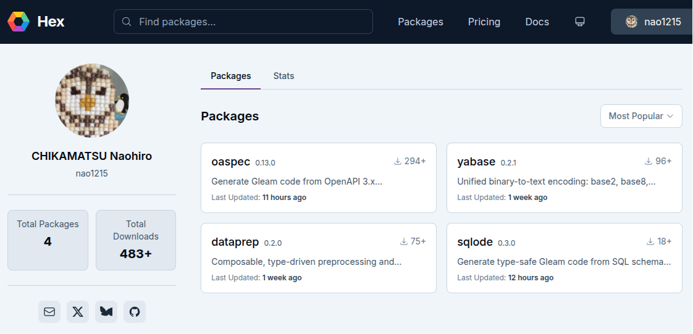

### 前書き：Gleamとは

最近、[関数型言語 Gleam](https://gleam.run/) で遊んでいます。	

Gleam は、[Louis Pilfold 氏](https://github.com/lpil)が開発した静的型付けの関数型言語であり、[Erlang](https://www.erlang.org/) や [JavaScript](https://developer.mozilla.org/ja/docs/Web/JavaScript) にコンパイルされます。2016年6月13日に登場したので、10年選手ぐらいです。

JavaScript と比較すると、Erlang はややマイナーなのでざっくり説明します。ちなみに私は Erlang を書いたことは一度もないので、見聞きした知識を物知り顔で書いているだけです。Erlang は、[Erlang VM（BEAM）](https://blog.stenmans.org/theBeamBook/)上で動作し、並行処理に強みを持ちます。並行処理と書くと、「Go と何が違うのか」と考える方もいらっしゃるでしょう。

Go では goroutine が同一プロセス内で動作し、必要に応じてメモリ共有や channel による通信を行います。その一方で、Erlang の軽量プロセスは基本的に状態を共有せず、メッセージパッシングによって連携します。大きな違いのひとつは、障害への向き合い方です。Go では goroutine 内の異常終了をアプリケーション側で適切に扱う設計が求められますが、Erlang では Supervisor がプロセスの終了を監視し、設定された方針に従って再起動できます。

Erlang は、何百万の接続状態を壊れにくく捌く基盤に向いています。単純な CRUD API も作れますが、それよりも接続管理や配信基盤で強みを発揮します。具体例としては、["Erlang/OTP と ejabberd を活用した Nintendo Switch(TM)向け プッシュ通知システム 「NPNS」の 開発事例"](https://speakerdeck.com/elixirfest/otp-to-ejabberd-wohuo-yong-sita-nintendo-switch-tm-xiang-ke-hutusiyutong-zhi-sisutemu-npns-false-kai-fa-shi-li?slide=2)をご参照ください。

さて、話を Gleam に戻します。Gleam の説明文を読んだ時に「なぜ、Erlang と JavaScript をターゲットにしているのか」と不思議に思いました。この点に関しては、Gleam 開発者が[「Erlang 仮想マシンは、サーバー上で実行される長時間実行サービスには比類のないものですが、それ以外の分野では必ずしも最適なツールとは限りません。JavaScript にコンパイルすることで Gleam は、より幅広い問題領域とドメインで使用でき、より幅広い人々がアクセスできるようになります」（一部省略）](https://www.infoq.com/news/2021/09/gleam-erlang-compile-javascript/?utm_source=chatgpt.com)とコメントしていたので、Gleam が解決できる領域を増やしたかった意図が読み取れます。

Gleam ではフロントとサーバーをモノレポで作りやすく、複数言語にコンパイルできる特徴は LLM と相性が良さそうです。システム全体のコードを一つのリポジトリで把握できるので、LLM の出力精度が上がりそうです。ただし、私はまだサーバー側でしか開発していないので、モノレポ開発時の辛さを理解していません。

---

### Gleam に惹かれた理由

「シンプルな仕様」と「パッケージ配布が楽」という点で惹かれました（詳細は書きませんが、テスト実行が速いのも最高）。

プログラミング経験者であれば、Gleam 言語仕様を把握するのに数日もあれば十分でしょう。言語仕様のコンパクトさは、まるで Go です。Gleam 開発者が ["Gleam is Go ideas but from perspective of a FP nerd instead of a C nerd（Gleam は、Cオタクではなく、関数型プログラミングオタクの視点から生まれた Go 的な発想の言語だ）"](https://crowdhailer.me/2024-10-04/6-years-with-gleam/) とコメントしているので、言語仕様のコンパクトさは意図的かもしれません。私には抽象度が高すぎる言語設計より、制約が明確な言語のほうが向いています。私は、業務の泥臭さに向き合うタイミングで、実装の理想を追い求めてしまいたくなりがちです。言語機能を使いこなせると気持ち良いのですが、そこに偏重しがち性格なので、意図的に避けてます。

私が Gleam に最も惹かれたのは、エコシステムがモダンだったことです。私は以前、[「GoユーザーがHaskell／OCamlのライブラリ配布で面食らった話」](https://debimate.jp/post/ja/2025-06-28-go%E3%83%A6%E3%83%BC%E3%82%B6%E3%83%BC%E3%81%8Chaskellocaml%E3%81%AE%E3%83%A9%E3%82%A4%E3%83%96%E3%83%A9%E3%83%AA%E9%85%8D%E5%B8%83%E3%81%A7%E9%9D%A2%E9%A3%9F%E3%82%89%E3%81%A3%E3%81%9F/)という記事の中で、Haskell と OCaml のパッケージの配布方法が面倒だと言及していました。特に、パッケージの作成・更新で第三者へ連絡を取らなければいけない部分が Not for me でした。私は深夜にテンションが上がって、即座にリリースしたくなるタイプなので、第三者への連絡を挟むと熱が冷めます。その一方で、Gleam は [Hex.pm](https://hex.pm/users/nao1215) にアカウントを作成すれば、気軽に GitHub Actions でリリース作業ができます。[npm（TypeScript）](https://www.npmjs.com/~nao1215)や [crates.io（Rust）](https://crates.io/users/nao1215)と同じ仕組みです。現代的で楽です。OSS を沢山作りたい私にピッタリでした。唯一の不満点は、パッケージ名の取得が早いもの勝ちな点ですが、これは他言語でもよくあることなので我慢しています。

---

### Gleam で何を作ったか

まずは、開発サイクルを学ぶために、サーバー側で利用しそうなライブラリを4個ほど作りました。フロント側は、まだ一度も作ったことがありません。


- [nao1215/dataprep](https://github.com/nao1215/dataprep): Composable, type-driven preprocessing and validation combinator library for Gleam
- [nao1215/yabase](https://github.com/nao1215/yabase): Yet Another Base -- a unified, type-safe interface for multiple binary-to-text encodings in Gleam.
- [nao1215/oaspec](https://github.com/nao1215/oaspec): Generate strongly typed Gleam server stubs and client SDK from OpenAPI 3.x specifications
- [nao1215/sqlode](https://github.com/nao1215/sqlode): Generate type-safe Gleam code from SQL schemas and queries. sqlc-style workflow with PostgreSQL, MySQL, and SQLite support.

dataprep はバリデーション・前処理ライブラリ、yabase は base32/base64などのエンコーダー・デコーダー集、oaspec は OpenAPI 3.x からサーバー／クライアントのコードを生成、sqlode は SQL から DB アクセスコードを生成します。

「えっ、Gleam はそんな基本的なライブラリすらないの？」と思われるかもしれませんが、似たライブラリは既にあります。例えば、[crowdhailer/oas_generator](https://github.com/crowdhailer/oas_generator) はOpenAPIからクライアントコードを生成しますし、[daniellionel01/parrot](https://github.com/daniellionel01/parrot) や [giacomocavalieri/squirrel](https://github.com/giacomocavalieri/squirrel) は SQL からコードを自動生成します。

ただし、既存ライブラリは個人的に気になる部分がありました。例えば、oas_generator はサーバーコードを生成せず、サポート予定がないと明言されていました。parrot は [sqlc-dev/sqlc](https://github.com/sqlc-dev/sqlc) のインフラに相乗りしてて純粋な Gleam ではなく、squirrel は PostgreSQL しかサポートしていません。最大の気になりは、テストの薄さでした。今回取り上げた既存ライブラリの全てに当てはまる特徴であり、もっとテストが書けるのではないかと感じました。

現在は LLM で OSS を簡単に作れる時代なので、今回は自作することにしました。完全に余談ですが、Gleam ではパッケージ名に "gleam" プレフィックスを付けられるのが公式ツールだけであり、私の作った "gleam-oas" は リリース直前に "oaspec" へ改名する羽目になりました。

---

### 最後に：Gleam に望む機能

`go install`相当のツール配布文化が提供されると、個人的に Gleam は完璧な言語です。
 
Gleam は、以下のようにプロジェクト単位で依存を追加する方針です。「ああ、フロントの文化圏だな」と思いながら OSS を作ってます。

```shell
gleam add package_name
gleam run
```
