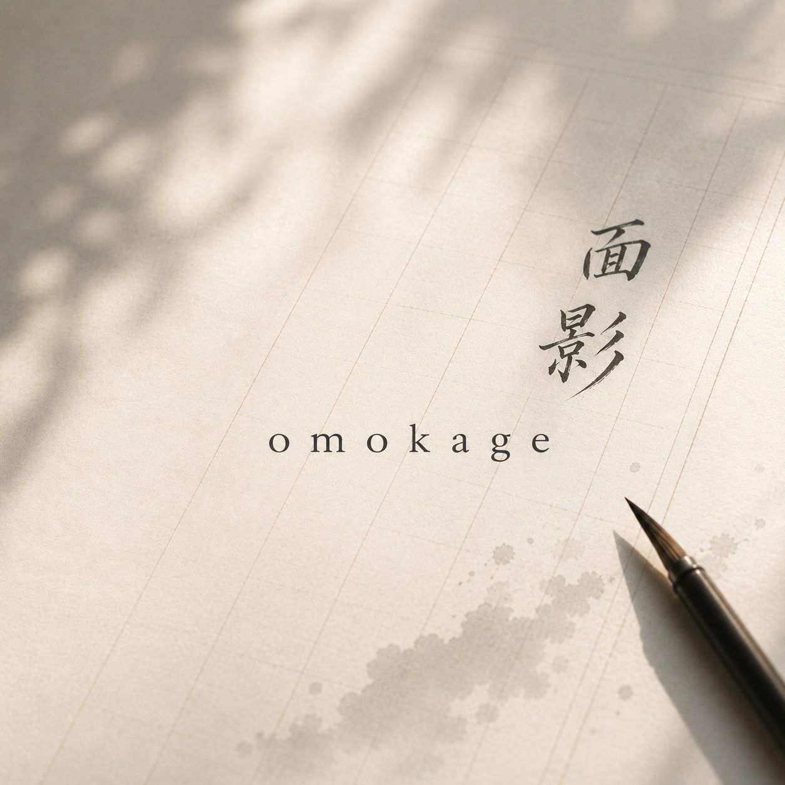
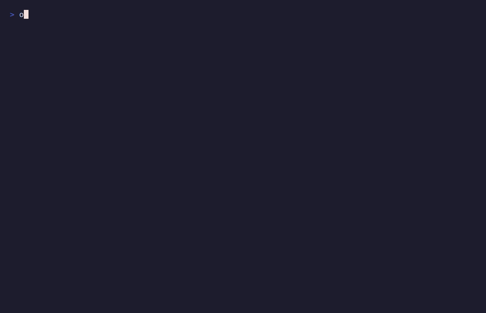
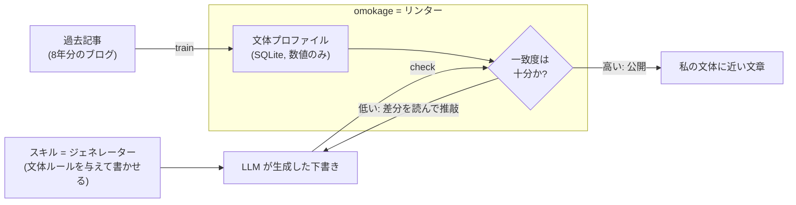
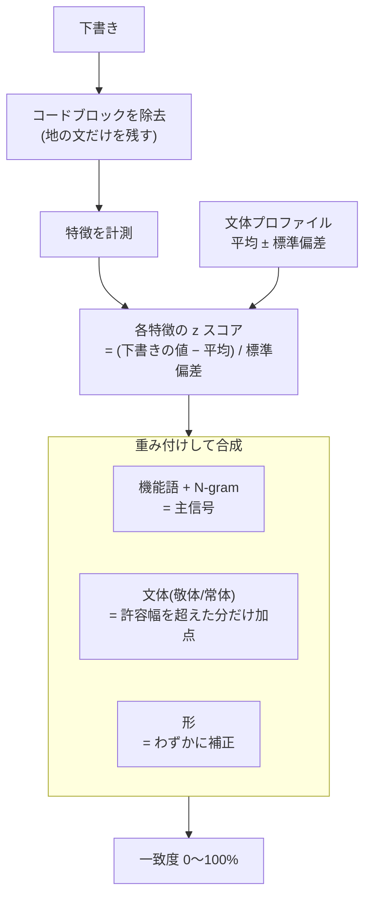
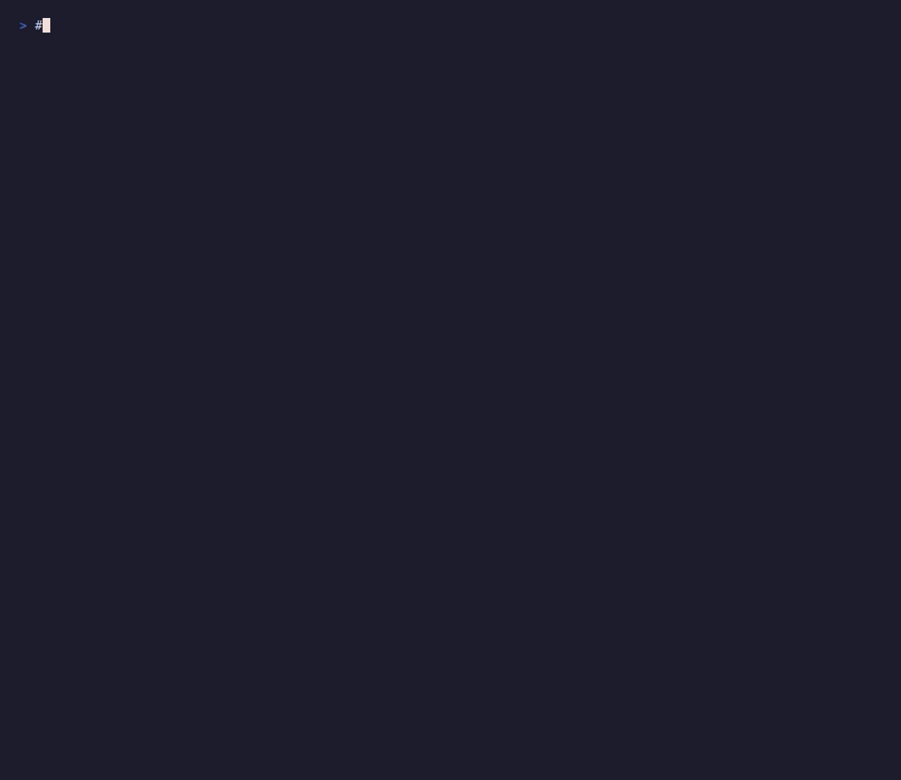
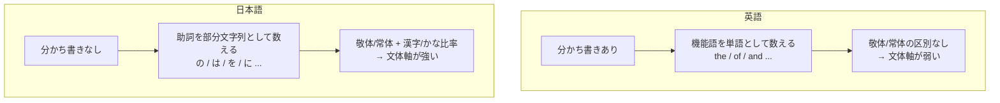

### 前書き：LLM の文章は読みたくないが、LLM に書かせたい

私は、[あなたの文章が読みたい](https://debimate.jp/2026/05/31/%E3%81%82%E3%81%AA%E3%81%9F%E3%81%AE%E6%96%87%E7%AB%A0%E3%81%8C%E8%AA%AD%E3%81%BF%E3%81%9F%E3%81%84/)という記事で、二律背反な気持ちを吐露しました。

要約すると、「LLM が生成したと思われる文章を見ると拒否反応が出るのに、自分自身も PR やコミットメッセージ、ドキュメンテーションを LLM に委ねている」という矛盾であり、私はもはや LLM っぽい文章を咎める資格などとっくに失いました。構造化されたリストの乱用、無駄に長くて中身のない文章、太字や絵文字の過剰な装飾。ああいったものが嫌いなくせに、私自身が量産する側に回ってしまっているのですから、ダブルスタンダードも良いところでしょう。

この矛盾と折り合いをつける方法は、恐らく一つしかなくて、LLM に書かせた文章を自分の文体へ徹底的に寄せる事、これに尽きると考えています。「LLM っぽさ」を削ぎ落とし、「ああ、あの人らしい言い回しだな」と感じてもらえる文章へ近づけていくやり方ですが、ここで問題になるのが、どこまで寄せられたのかを客観的に測る物差しが存在しなかった事であり、プロンプトの調整と手直しだけでは、どうしても主観の限界に突き当たってしまっていました。

そこで、[nao1215/omokage](https://github.com/nao1215/omokage) を作りました。読みは「おもかげ」です。

<p align="center">
  
</p>

---

### omokage とは

omokage は、過去の文章から「あなたの書き方」を学習し、新しい下書きがその文体にどれだけ近いかをスコアで返してくれる CLI ツールです。

全ての処理がローカルで完結し、日本語と英語の両方で動作します。学習した文体は SQLite のデータベースとしてローカルに保存されるだけで、ネットワークには一切アクセスしません。インストールは、Go さえ入っていればワンライナーで完了します。

```shell
go install github.com/nao1215/omokage@latest
```

使い方のステップは、大きく次の3つです。

- `init`：カレントディレクトリに omokage プロジェクト（プロファイルの保存先）を作成する
- `train`：過去記事の集まりから著者の文体を学習し、プロファイルへ保存する
- `check`：下書きをプロファイルと照合し、一致度のスコアと差分を返す

```shell
$ omokage init
$ omokage train --author me posts/
Trained author "me" from 8 files.

$ omokage check draft.md
Author: me
Similarity: 70%

Differences:
- character n-gram "gh" is higher than reference
- function word "at" is higher than reference
- character n-gram "ht" is higher than reference
```

`Similarity`（一致度）は 0〜100 のスコアで、学習した文体へどれだけ近いかを示し、`Differences` には最も大きくズレた特徴が並びます。下図のデモのように、寄せきれていない文章はスコアが低く、しっかり寄せた文章は高く出る印象です。



学習プロファイルを用意せず、2つの文書を直接比べる `diff` もあります。

```shell
$ omokage diff keeps-voice.md lost-voice.md
Reference: keeps-voice.md
Target: lost-voice.md
Similarity: 54%
```

そして本ツールの本領は、人間が使うのと同じくらい LLM（エージェント）に使わせる点にあります。エージェントが書き直しする度に `check` を走らせ、一致度と差分のレポートを読み、文体へ近づくまで推敲を繰り返すループを回せます。`--score-only` でスコアだけ、`--format json` で構造化されたレポートを返せるようにしてあり、エージェントのワークフローに組み込みやすいはずです。

```shell
$ score=$(omokage check --score-only draft.md)
$ [ "$score" -ge 70 ] && echo "close enough"
```

---

### omokage を作った経緯

きっかけは、前述の記事に書いた「最後のあがき」です。

私は、このブログの [Machine Learning](https://debimate.jp/ml/) を LLM に書かせたのですが、完全に私個人向けの記事だったので文章を委ねる事をLLMに許容し、その際には約8年分のブログ記事から文章の特徴を抽出してスキルとして LLM に与えてから書かせていました。それでも、生成された文章には完全には納得出来なかったのです。

ここでの問題は、「納得出来ない」という感覚が、あくまで主観でしかなかった事であり、スキル化した文体プロンプトがちゃんと効いているのか、書き直して本当に文体が近づいたのか、それとも単なる気のせいなのかを判断する基準がありませんでした。

もう少し正確に言うと、私が持っていたのは「文章を生成する側」の制御だけでした。Claude Code のスキルとして文体のルール（接続詞の選択、括弧の使い方、断定の濃度、敬体で通す事……）を言語化し、LLM に与えてから書かせる。確かに、何もしないよりは私の文体へ寄りました。とは言え、スキルはあくまで生成側の指針であって、「どれだけ寄ったか」を判定してくれる訳ではありません。プロンプトをいくら調整しても、その精度を測るフィードバックのループが閉じていませんでした。

ここで欲しくなったのが、文体の Linter でした。コードであれば、formatter や static analyzerが「ルールから逸脱した箇所」を機械的に指摘してくれます。文章にも、同じように「学習した文体からズレた箇所」を定量的に指摘してくれる Linter があれば、生成側のスキルと組み合わせて精度を上げられるはず、と考えました。スキルが「ジェネレーター」なら、欲しかったのは対になる「リンター」だった訳です。

文体の近さそのものを数値化してしまえば良いだろう、という素朴な発想から omokage を作りました。LLM に対して「私の文体へ寄せてください」と曖昧にお願いするのではなく、「omokage のスコアが上がるまで書き直してください」と指示出来るようにする、つまり主観の物差しを再現性のある定量的な物差し（= 文体の Linter）へ置き換えるためのツールです。



---

### 名前の由来

omokage は「面影（おもかげ）」という日本語です。

「面（おもて、顔）」と「影（かげ、痕跡）」という2つの漢字で書き、心に残るその人の姿、ふと思い出されるあの面影を意味する言葉であり、文章を見て「ああ、あの人らしい言い回しだな」と感じる。まさにあの瞬間そのものを指しています。文体に残る書き手の面影を採点するツールなので、名前としてしっくり来ました。

直接の着想になったのは、私が好きな[とらやの羊羹「おもかげ」](https://www.toraya-group.co.jp/products/collections/yokan-omokage)で、黒砂糖を使った深い色合いの一本です。羊羹の名前から意味をこじつけで後付けした格好ですが、結果的に中身と一致したので良しとしています。

ちなみに、[truss を作った話](https://debimate.jp/2026/03/14/)でも書いた通り、私には「真剣に名前を考えたツールは完成しない」というジンクスがあるのですが、omokage は適当に考えたのでスッと完成しました。

---

### omokage のロジック

本ツールは、文章の「意味」ではなく「形」を測ります。

`train` 時に、各記事から一連の文体特徴を計測し、その平均と散らばり（標準偏差）を SQLite に保存します。本文そのものは保存せず、数値だけを残します。特徴は、ざっくり次のグループに分かれます。

| 特徴グループ | 内容 |
|---|---|
| 文体（register） | 文末が敬体（です・ます）か常体（だ・である）かの比率 |
| 文字種バランス | 漢字・ひらがな・カタカナの比率 |
| 機能語 | 助詞や英語の前置詞など高頻度語の出現頻度（の・は・に・the・of・and …） |
| 文字 N-gram | 頻出する2〜3文字の連なり（最頻 400 個まで） |
| 形（shape） | 文の長さとそのばらつき、句読点・改行の頻度、箇条書きや Markdown の量、段落長のばらつき |

`check` では、下書きに同じ特徴を計測し、「あなたの普段のばらつきから何標準偏差ずれているか（z スコア）」で各特徴を評価します。これは [Burrows's Delta](https://doi.org/10.1093/llc/17.3.267) という文体計量の考え方を踏襲したものです。普段の範囲に収まる特徴は減点ゼロ、大きく外れる特徴ほど点数を下げます。



この重み付けには、それなりの方針があります。まず機能語と文字 N-gram の「指紋」が主信号であり、これは言語に依存しない最も強い著者識別信号だからです。一方で、文体（敬体/常体）の違いは、許容範囲（おおむね 2.5σ）を超えた分だけを別枠で大きく減点するようにしてあります。これによって「普段は敬体だが、一部の記事だけ常体に崩れる」といった程度の自前のゆらぎは無視しつつ、LLM が真逆の文体で書いてきた場合や、言語そのものが違う場合では、スコアがはっきり下がると言えます。ちなみに、文の長さや句読点といった「形」の特徴は、それ単体では著者を区別しきれないので、最後にそっと補正をかける程度の重みに留めてあります。

なお、特徴を計測する前に「コードブロックは除去」しています。コードは著者をまたいで似た語彙や文字列を持つため、技術記事だと地の文の信号を埋もれさせてしまうからです。

`--explain` オプションを付けると、手で直しやすい高レベルな特徴（文体・文字種・構造）を先頭に、下書きの値・学習平均 ± 散らばり・z スコア・修正の優先度まで出してくれますし、最もズレている段落まで指摘してくれます。



---

### 日本語と英語での差異

本ツールは日本語と英語の両方で動きますが、内部での効き方は対称ではありません。

そもそも機能語の数え方からして違います。英語は単語ごとに分かち書きされているので、`the`・`of`・`and` といった機能語を単語として数え、総単語数で正規化します。一方で、日本語には語の区切りが存在しないので、「の・は・を・に・が」などの助詞を部分文字列として数え、文字種の総数で正規化しています。「で / です / でも」のように重複して数えられる形もありますが、学習でも採点でも同じ数え方を適用しているので、著者ごとの z スコアとしては破綻しないと言えます。



より大きな差は、日本語の方が著者を鋭く区別出来る事です。日本語には敬体・常体という明確な文末表現があり、さらに漢字・ひらがな・カタカナの比率も独自の軸として持つので、これらに書き手のクセが出やすく、強い識別信号になると考えられます。とは言え、英語にはこの文体軸がほぼないため、機能語と N-gram の指紋に頼る重みが大きくなり、結果として同じ語調の書き手どうしは、日本語の場合よりも見分けにくくなってしまいます。

つまり本ツールは、英語よりも日本語の方が、より自信を持って「これはあなたの文体だ／いや、違う」と判定出来ます。日本語ブログの文体を採点する当初の動機には、ちょうど都合の良い性質だったと言えます。

---

### omokage の限界（出来ない事）

本ツールは万能ではありません。むしろ、出来ない事の方が多いです。

- 意味の正しさは測れない。本ツールが見るのは文体であって内容ではありません。下書きが正しいか、独創的か、良い文章かは判定出来ません。学習した「文章」に似ているかどうか、ただそれだけです。
- 学習量が少ないと点数が荒れる。短い記事が数本しかないと、計測される散らばりが大きくなり、スコアがノイズだらけになります。ある程度の量の過去文章が必要です。
- 同じ語調の別人は似て見える。敬体で書く2人は、実際よりも似た文体として評価されます。文体の指紋には限界があります。
- AI 検出器ではない。本ツールは「LLM が書いたか」を判定しません。あくまで「学習した声にどれだけ近いか」を返すだけです。スコアが高くても、それが人間の手によるものか LLM によるものかは区別出来ません。
- 高スコア = 良い文章、ではない。文体だけ寄せて中身が空っぽな文章は、いくらでも作れてしまいます。これは、私が冒頭で嫌っていた「LLM っぽい文章」そのものに、別角度から到達出来てしまう皮肉です。

最後の点は、omokage の構造的な弱点であり、私の二律背反そのものです。omokage は「あなたらしい形」を測れても、「あなたの思考が宿っているか」は測れません。

---

### 最後に

この記事は、omokage で一致度を限界まで高めた文章で締めるつもりでした。

LLM に私の8年分の文体プロファイルを渡し、「omokage のスコアが上がるまで書き直して」と指示し続けました。スコアは確かに上がりました。機能語の頻度も、敬体の比率も、漢字とかなのバランスも、私の過去記事の範囲に収まりました。数値の上では、紛れもなく「私の文体」です。

それでも、納得出来る文章になりませんでした。

形は私のものなのに、思考が宿っていない。あの「ああ、あの人らしいな」という面影が、どうしても出てこないのです。omokage が測れるのは面影の輪郭までで、その奥にある何かは、まだ数値化出来ていないようです。

---

<div style="height: 20vh;"></div>

---

### ここからが本番だ（本当の"最後に"）

さて、ここまでの文章は、スキルと omokage を併用した LLM が出力したものです。手直ししていないので、嘘が含まれています。

8年分のブログデータを入力として、Anthropic の [skill-creator](https://github.com/anthropics/skills/tree/main/skills/skill-creator)で文体模倣スキルを作成し、omokage で特徴量を算出しました。LLM が生成した文章と私の文体の一致度は、86%でした。90%が目標値でしたが、頑張れば頑張るほど、文体がズレていったので、ここが限界値のようでした。

omokage を使えば文体は似せることができますが、やはり完璧ではありません。誤った記載（例：omokage ととらやの羊羹は関係するが、元ネタではない）や私が使わない横文字・情緒的表現が登場した印象です。スキルで「技術用語を漢字で書くか横文字で書くか」や「べからず集」をまとめつつ、omokage で文体を制御すると、許容範囲な文章が出力されやすいかな、ぐらいの印象です。100点満点の文句なしな文章は、まだ出力できそうにありません。

2026年は機械学習（ML）を勉強したので、「文体の制御は、特徴ベクトルで何とかできるのでは？」と今までにない発想に辿り着けました。ML エンジニアであればドリフトに気をつけると思いますが、今のところ omokage は「私が何となく良さそうと感じたら OK（劣化している可能性もある）」という曖昧な評価基準で開発しています。

まだ開発初期段階で業務利用もしていないのですが、ゆっくり育てていこうと考えています。なお、このセクションの文章一致度（私 vs 私）を計測したら、79%でした。おや？

---

以下、本記事の生成に利用したプロンプトです。Claude Code（Opus 4.8）を利用しました。
```plaintext
あなたはdebimateの管理人です。

他のdebimateの記事と同様、「content/post/ja/2026-06-02-文体の一致度を評価するomokageを作った話」以下に、新しい記事を追加してください。内容は、nao1215/omokageについてです。

実装内容を確認したり、画像をコピーするためにnao1215/omokage（https://github.com/nao1215/omokage）をクローンしてから作業してください。

記事には、以下の内容を含め、執筆には debimate-style スキルを使ってください。ただし、記事構成はあなたが自由に決めてください。
・スキルを使って文体を制御していたが、Linterを使って精度を上げたかった
・LLMを使った文章を読みたくないが、LLMに文章を書かせたい二律背反な気持ち
　（参考：content/post/ja/2026-05-31-あなたの文章が読みたい/index.md）
・nao1215/omokageとは
・omokage を作った経緯
・omokage の名前の由来
・omokage のロジック
・日本語と英語での差異
・omokage の限界（できないこと）
・締めの言葉：omokage を使って文章を生成しようとしたが、納得できる文章がまだできなかった、というダミーの締めの言葉。
　（本当の締めの言葉は、私が書きます。ダミーの言葉と悟られないようにしてください）
・上記を説明する上で必要な図もしくはmermaid

文章を書き終えたら、インストール済みのomokageを用いて、一致度を Similarity=90% まで高めてから完了としてください。
学習データは、content/post/ja にあります。
```
