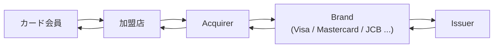
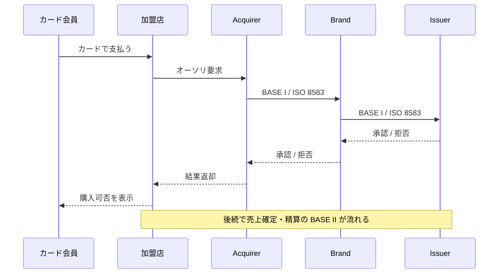
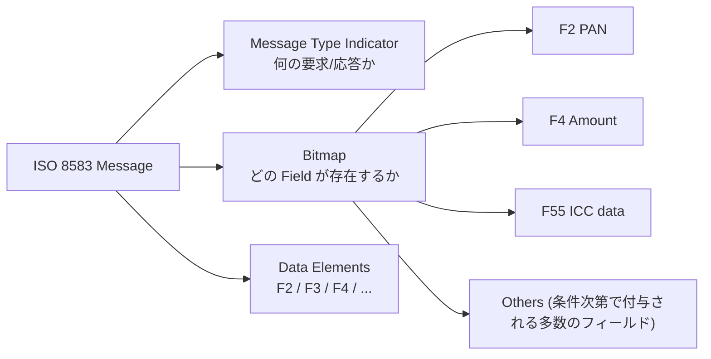
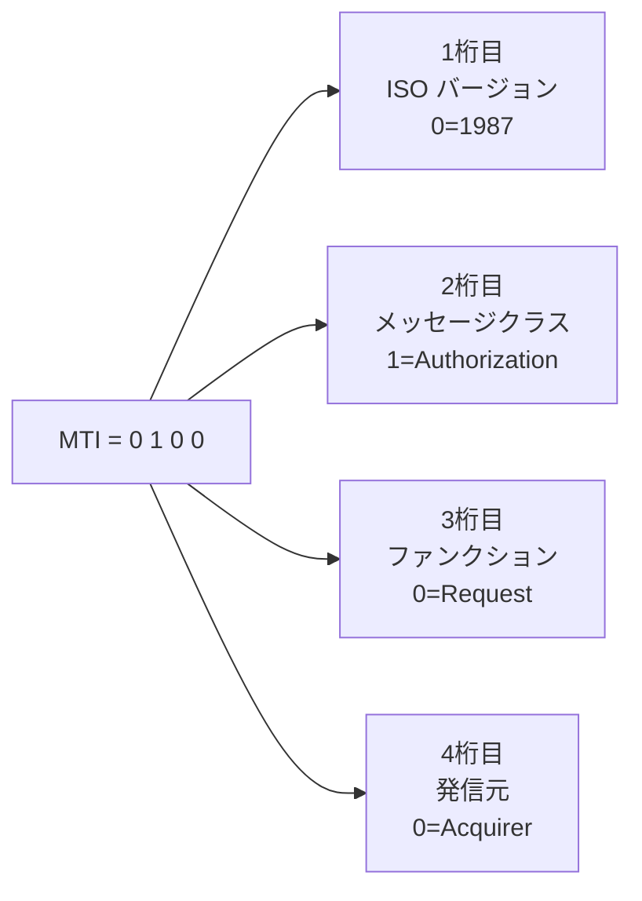
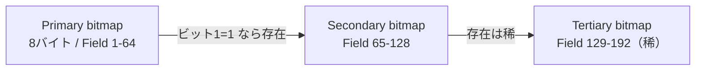
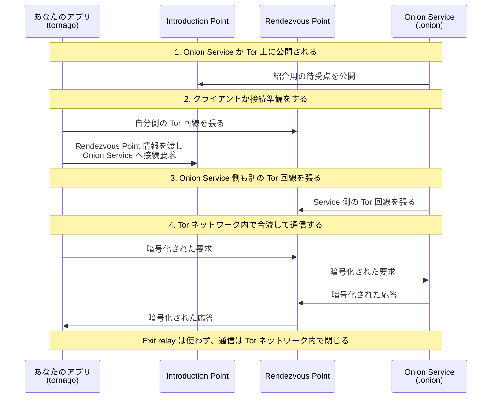
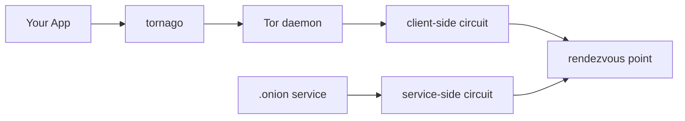

### 前書き：Fintech らしい記事を書く

2025年3月に Fintech へ転職し、2026年6月時点で1年3ヶ月ほど経ちました。知見が溜まり、Fintech らしい記事を書けそうな状態になりました。

そこで、本記事ではクレジットカード決済で頻出する通信規格 ISO 8583 を中心に、決済システム周辺の話を書きます。ついでに、自作 OSS を宣伝します。

---

### クレカ決済の登場人物

まず、登場人物を揃えます。

| 登場人物 | 役割 |
|---|---|
| カード会員 | クレジットカードの利用者 |
| 加盟店 | カードを受け付けるお店や EC サイト |
| Acquirer | 加盟店を束ね、加盟店側の決済を取り扱う事業者 |
| Brand | Visa / Mastercard / JCB などの国際ブランド |
| Issuer | カードを発行している会社（私の2026年時点の所属はココ） |

カード会員が加盟店でカードを使うと、次のような流れで情報が流れます。



上記の図を見て分かる通り、加盟店とカード会員だけでは決済が閉じません。加盟店の裏には Acquirer が存在し、その先に Brand、Issuer がいます。Issuer は決済を受け付けるかどうかを返し、Brand〜加盟店まで伝わります。例えば、利用上限に引っかかった場合は、Issuer は 決済を拒否します。

---

### 仮売上と実売上

クレカ決済には、仮売上と実売上の2段階があります。ここでは Visa の呼び方に寄せて、仮売上を BASE I（オーソリゼーション）、売上確定を BASE II（クリアリング）と書きます。

| 段階 | 概要 | 別表現 |
|---|---|---|
| 仮売上 | 当該カードで、指定金額を使ってよいかを確認する | オーソリ、Authorization、BASE I |
| 実売上 | 取引が確定したため精算依頼を流す | 売上確定、Clearing、BASE II |

以下が BASE I シーケンスの一例です。



決済のシステムでは、BASE I をリアルタイムで扱い、BASE II は決済が発生してから遅延してデータが届きます。具体例としては、EC サイトで購入ボタンを押した直後に「カードの有効期限が切れていないか」「限度額を超えないか」「怪しい取引ではないか」を BASE I で確認しています。Issuer からの BASE I レスポンスが遅いと、Brand が代理応答することがあり、代理応答後に Brand から Issuer にその旨を通知することがあります。

より厳密には、決済の取消や返金などがありますが、本記事内では BASE I/Ⅱ の存在が理解できていれば問題ありません。

---

### ISO 8583 とは何か

ISO 8583 は、カード起点の金融取引メッセージを表現する国際標準であり、オーソリゼーションなどで利用されます。以下のような特徴があります。

- 16進数、BCD（Binary-Coded Decimal、2進化10進数。例：「27」→ 0010 0111）やバイナリが並ぶ
- `Message Type`、`Bitmap`、`Data Element` で構成（詳細は後述）
- エンコーディングが1種類ではない（詳細は後述）
- Brand ごとの独自拡張があり、その内容は非公開

国際標準であり、世界中でクレカが利用されているため、 パーサーの OSS はあります。以下は、一例です。

- Go 製：[`moov-io/iso8583`](https://github.com/moov-io/iso8583)
- Java 製：[`jPOS`](https://github.com/jpos/jPOS), [`j8583`](https://github.com/sylvaingir/j8583)
- Kotlin 製：[`jreactive-8583`](https://github.com/kpavlov/jreactive-8583)
- Python 製：[`pyiso8583`](https://github.com/knovichikhin/pyiso8583)
- JavaScript / TypeScript 製：[`iso_8583`](https://github.com/zemuldo/iso_8583)
- C# 製：[`NetCore8583`](https://github.com/Tochemey/NetCore8583)

Brand ごとの拡張仕様があるため、ISO 8583 の公開仕様だけで全て終わる世界ではない一方で、最低限のパース基盤や学習材料は揃っています。なお、LLM は公開されていないはずの Brand 独自仕様を断片的に知っているように見えます。

私が初めて ISO 8583 を勉強したときは、`moov-io/iso8583` のソースコードと、以下の記事を読んで全体像を捉えてから、Brand の仕様書を熟読しました。

- [Mastering ISO 8583 messages with Golang](https://alovak.com/2024/08/15/mastering-iso-8583-messages-with-golang/)
- [Mastering ISO 8583 Message Networking with Golang](https://alovak.com/2024/08/27/mastering-iso-8583-message-networking-with-golang/)

---

### ISO 8583 の基本構造

ISO 8583 の基本構造は、前述したように `Message Type`、`Bitmap`、`Data Element` の3段です。



---

### Message Type Indicator

Message Type Indicator（MTI）は必ず1つ存在します。電文の先頭に置かれる4桁の数値で、桁ごとに別々の意味を持ちます。



1桁目は規格のバージョンです。`0` が ISO 8583:1987、`1` が 1993、`2` が 2003、`9` が個社利用（private use）を表します。中間の値は ISO 予約や各国利用に割り当てられています。

2桁目はメッセージクラスであり、どのような決済が発生したかを表します。

| 2桁目 | クラス | 意味 |
|---|---|---|
| `1` | Authorization | 与信枠を確認し承認を得る（口座記帳はしない） |
| `2` | Financial | 承認を得た上で口座へ直接記帳する |
| `3` | File Actions | マスタ等のファイル更新 |
| `4` | Reversal / Chargeback | 直前の処理の取消、チャージバック |
| `5` | Reconciliation | 精算・交換 |
| `6` | Administrative | 管理用 |
| `7` | Fee Collection | 手数料徴収 |
| `8` | Network Management | 鍵交換、ログオン、エコーテスト |

3桁目はファンクションで、そのメッセージが要求なのか応答なのかを区別します。`0` が Request（要求）、`1` が Request Response（要求への応答）、`2` が Advice（アドバイス）、`3` が Advice Response、`4` が Notification（通知）、といった具合です。

4桁目は発信元です。`0` が Acquirer 発、`2` が Issuer 発で、`1` や `3` はそれぞれの再送（Repeat）を表します。

この4桁を組み合わせると、よく見る MTI の意味が機械的に読めます。

| MTI | 分解 | 意味 |
|---|---|---|
| `0100` | 1987 / Authorization / Request / Acquirer | オーソリ要求 |
| `0110` | 1987 / Authorization / Request Response / Acquirer | オーソリ応答 |
| `0200` | 1987 / Financial / Request / Acquirer | ファイナンシャル要求 |
| `0210` | 1987 / Financial / Request Response / Acquirer | ファイナンシャル応答 |
| `0420` | 1987 / Reversal / Advice / Acquirer | リバーサルアドバイス |
| `0800` | 1987 / Network Management / Request / Acquirer | ネットワーク管理要求 |

つまり `0100` の Request に対する応答が `0110`、`0200` の応答が `0210` という、3桁目だけが `0 → 1` に変わる関係になっています。まるで全ての数値を覚えているようかの書き方をしていますが、私は高頻度で意味合いを調べています。

---

### Bitmap

Bitmap は、後続の Data Element がどれだけ存在するかを表すビット列です。MTI の直後に置かれる8バイト（64ビット）が Primary bitmap で、各ビットが Field 1〜64 に対応します。n 番目のビットが `1` なら Field n が存在し、`0` なら存在しない、というだけの素朴な仕組みです。例えば、16進数 `0x4210000000000000` の Primary bitmap は、先頭バイト `0100 0010`（=Field 2 と Field 7）、次バイト `0001 0000`（=Field 12）が立っているので「Field 2・7・12 が存在する」と読みます。新機能が追加されると、新しい Field をパースする処理を追加する必要があります。

```text
0x42 = 0100 0010  →  Field 2, Field 7
0x10 = 0001 0000  →  Field 12
0x00 = 0000 0000  →  なし
...（以降も全て 0x00）
```

ビット64個では足りない場合に備えて、bitmap は最大3段あります。Primary の最上位ビット（Field 1 に相当するビット）が立っている場合、「Secondary bitmap が続く」という意味になります。Secondary bitmap は Field 65〜128 を表し、さらに Tertiary bitmap は Field 129〜192 を表します。



なお、bitmap は8バイトのバイナリそのもの、または16桁の16進文字（`0`〜`F`）で表現されます。

---

### Data Element

Data Element は、Field 本体です。Field 番号ごとに「何のデータが、どんな型で、どれくらいの長さで入るか」が規格で決まっています。ISO 8583:1987 の代表的な Field について、データ型と長さの表記も添えて並べると次のようになります。

| Field | データ型／長さ | 意味 |
|---|---|---|
| F2 | n..19 | PAN（Primary Account Number, カード番号） |
| F3 | n 6 | Processing Code（処理区分） |
| F4 | n 12 | Transaction Amount（取引金額） |
| F7 | n 10 | Transmission date & time |
| F11 | n 6 | STAN（System Trace Audit Number） |
| F22 | n 3 | POS Entry Mode |
| F35 | z..37 | Track 2 Data |
| F39 | an 2 | Response Code |
| F41 | ans 8 | 端末ID |
| F42 | ans 15 | 加盟店ID |
| F49 | a または n 3 | Transaction Currency Code |
| F52 | b 64 | PIN データ |
| F55 | ans...999 | ICC / EMV 関連データ |
| F64 | b 64 | MAC（Message Authentication Code） |

ここに出てくる `n` や `ans` という記号が、 Field のデータ型です。ISO 8583 では型を以下のような略号で表します。

| 記号 | 意味 |
|---|---|
| `a` | 英字（空白を含む） |
| `n` | 数字のみ |
| `s` | 特殊文字のみ |
| `an` | 英数字 |
| `ans` | 英数字＋特殊文字 |
| `b` | バイナリデータ |
| `z` | 磁気ストライプの Track 2 / Track 3 コードセット |

長さの表記には2種類あります。`n 6` のように型のあとへ数字を直接書くと固定長で、これは「数字6桁丁度」の意味です。一方 `n..19` のようにドットが付くと可変長で、ドットの数が「長さプレフィックスの桁数」を表します。つまり `n..19` は2桁プレフィックス付き・最大19桁、`ans...999` は3桁プレフィックス付き・最大999桁、という読み方になります。

---

### エンコーディングが1種類ではない

ここからが ISO 8583 の本領で、同じ電文の中でも値の符号化方式（エンコーディング）が複数混在します。以下に一例を箇条書きします。

- ASCII … 英数字 Field 向け。1文字を8ビットで表す素直な方式。
- BCD（Binary-Coded Decimal, バイナリ符号化10進数）… 数字 Field 向け。10進1桁を4ビットで表すため、1バイトに数字2桁が詰まります（packed BCD）。MTI や金額、有効期限などで使われます。
- Binary … bitmap や MAC のような、そもそも印字できないデータ向け。

同じ「数字の列」でも、ASCII なら1桁=1バイト、BCD なら1桁=4ビットと長さが違います。そのため、エンコーディングを取り違えると、桁数も区切り位置も全部ズレて読めなくなります。

---

### 可変長 Field の長さプレフィックス

可変長 Field は、データ本体の前にデータ長を表すプレフィックスが置かれています。プレフィックスの桁数によって名前が付いており、下表で表されます。

| 表記 | プレフィックス桁数 | 最大長 |
|---|---|---|
| LVAR（`L`） | 1桁 | 9 |
| LLVAR（`LL`） | 2桁 | 99 |
| LLLVAR（`LLL`） | 3桁 | 999 |

厄介なのは、この長さプレフィックス自身にもエンコーディングがある点です。例えば「長さ27」を表すとき、BCD（圧縮）なら1バイトで `0x27`、ASCII なら2バイトで `0x32 0x37`（文字 `'2' '7'`）になります。

ISO 8583 の Field は、「固定長なのか可変長なのか」「可変長ならプレフィックスは何桁でどう符号化されているか」「本体は ASCII か BCD かバイナリか」を全部正しく押さえて初めて読めます。「固定長だと思ったら LLVAR」「素直な数字だと思ったら BCD」「ただのバイト列だと思ったら TLV 構造」という勘違いが発生します。ここでの TLV とは、Tag-Length-Value の略で、「タグ・長さ・値」の3つ組を入れ子に並べる形式です。

次から次へと、パースに必要な情報がでてきますね、楽しいですね。

---

### `ISO 8583` 16進数の例

ここまでの説明を踏まえて、BASE I のサンプル電文（16進表記）を読み解きましょう。Authorization Request、つまり `0100` のメッセージです。

```text
303130303732334334373830323843313832303430303030303030303030303030
303030303136343131313131313131313131313131313030303030303030303030
303030303530303030363034313233343536313233343536313233343536303630
343239313235393939303531303031323030303033343431313131313131313131
...
```

上記の電文を見て「先頭が MTI で、その次が bitmap で、ここに PAN と金額が来ていて……」と人力で読み始める方々がいます。私は、当然できません。

軟弱者なので、来たるべき将来に備えて [`nao1215/iso8583tool`](https://github.com/nao1215/iso8583tool) を作り、ISO 8583 をヒューマンリーダブルに変換できるようにしました。`iso8583tool view` で上記の BASE I を読み込ませると、以下のように表示されます。

```text
Summary: 0100 · JPY 5000 · STAN 123456 · TERMID01

F0   Message Type Indicator.................: 0100
F2   Primary Account Number.................: 411111******1111
F3   Processing Code........................: 000000  → Purchase / goods & services
F4   Transaction Amount.....................: 000000005000
F11  Systems Trace Audit Number (STAN)......: 123456
F22  Point of Sale (POS) Entry Mode.........: 051
F35  Track 2 Data...........................: 411111****************************
F49  Transaction Currency Code..............: 392  → JPY (Japanese yen)
F55 ICC System Related Data SUBFIELDS:
55.9F02 Amount, Authorised (Numeric)........: 000000005000
55.9F27 Cryptogram Information Data.........: 80
```

電文の断面を見ると、「カード番号（PAN）」「金額」「通貨」「POS Entry Mode（カード情報をどう読み取ったか。IC・磁気・手入力など）」「EMV 関連タグ」が1本のメッセージに押し込まれている事が分かります。ここでの EMV とは、IC チップ付きカードの国際規格で、Europay・Mastercard・Visa の頭文字を取った呼び名です。

---

### iso8583tool とは

ここで唐突な宣伝なのですが、[`nao1215/iso8583tool`](https://github.com/nao1215/iso8583tool) は名前の通り、ISO 8583 電文を調べるためのツールです。内部では、[`moov-io/iso8583`](https://github.com/moov-io/iso8583) を利用しています。自前でパーサーを書く勇気はありませんでした。

iso8583tool が提供する機能は、以下のとおりです。

| コマンド | 用途 |
|---|---|
| `view` | ISO 8583 電文を unpack して人間が読める形にする |
| `diff` | 2本の電文差分を表示 |
| `redact` | PAN / Track / EMV のセンシティブデータをマスク |
| `convert` | packed message と JSON を相互変換（テストデータ作成用） |
| `send` | TCP 先へ ISO 8583 電文を送信（E2Eテスト用） |
| `validate` | unpack 可否や不正データを検査 |
| `doctor` | どの spec preset が合うかを推定 |
| `sample` | BASE I サンプルを出力 |

以下の GIF は `view` の動作例です。


iso8583tool は、万能ではありません。明確に使いづらい点は、Brand の独自拡張に当たる Field 仕様を利用者が spec ファイルとして定義する必要があることです。例えば、以下の JSON（spec ファイル）が示すように、Field 55 は TLV、Field 127 は nested bitmap、Field 48 は private overlay、といった情報を与えなければなりません。

```json
{
  "spec": "basei-starter",
  "extensions": [
    {
      "id": 48,
      "strategy": "positional"
    },
    {
      "id": 55,
      "strategy": "tlv",
      "preserve_unknown_tlv_tags": true
    },
    {
      "id": 127,
      "strategy": "bitmap"
    }
  ]
}
```

Brand 拡張仕様を含めた spec ファイルを公開できれば、多くの利用者にとって iso8583tool は便利になります。しかし、具体的な拡張仕様は NDA（秘密保持契約）があり、公開できません。とは言え、2026年の今は LLM があるので、 Field 定義の叩き台や spec ファイルの骨組みを簡単に作れるはずです。もちろん、最終的な検証は自分でやる必要がありますが、ゼロから JSON を書くよりは遥かに速いです。

完全に余談ですが、`iso8583tool` が依存している `moov-io/iso8583` の開発会社（moov-io）とは少し縁があります。私は、 ACH（銀行間の電子決済で利用する仕様）を用いた OSS を[`nao1215/filesql`](https://github.com/nao1215/filesql) や [`nao1215/sqly`](https://github.com/nao1215/sqly) として作っていたので、`moov-io` の方から GitHub Sponsors を頂いています。

---

### ISO 8583 の落とし穴

経験上ですが、ISO 8583 は「仕様書を読んだ」「Brand に質問した」「ユニットテストを書いた」だけで、品質を担保できません。以下のようなズレが普通に発生します。

- 業界慣習と仕様書の記載が微妙にズレている
- 同じ Field でも Brand 側の設定値によって解釈が変わる
- 送信元の実装がバグっていて、予想外の電文が飛んでくる

ハマれば一発で原因が分かりますが、ハマるまで気づきにくい面があります。この辺りの辛さは、ネット上でも語られています。例えば、["クレジットカード処理を担う「ISO8583」とは？　Go言語でパーサーを開発したエンジニアが中身と苦労を明かす"](https://atmarkit.itmedia.co.jp/ait/articles/1909/24/news014.html)や、["ISO 8583 と現場の実装の乖離が暗黙知過ぎて初見殺し過ぎる問題"](https://ts0818.hatenablog.com/entry/2024/03/11/184155)で触れられています。

Brand と結合テストすれば過ちに気づけますが、もう少し早いタイミングでバグを検知したい気持ちがあり、iso8583tool では JSON から BASE I を作る機能や、サーバーに対して BASE I を送信する機能を作りました。なお、iso8583tool は、まだ現場レベルでの使い勝手の良し悪しは不透明です。これから使い込みます。

---

### セキュリティ基準の PCI DSS

クレジットカード情報は、PCI DSS（クレジットカード業界の国際セキュリティ基準）準拠された環境で保護されています。

PCI DSSでは、保護すべきカード会員データとして `PAN / Cardholder Name / Expiration Date / Service Code` を挙げ、同様に機密認証データとして `full track data / CVV2(CVC2/CID/CAV2) / PIN/PIN block` を挙げています。具体的な保護方法としては、PAN は平文で DB に保存できず、機密認証データはオーソリゼーション後の保存が禁止されています。

特に、PAN は、日常的に扱うには重い情報です。PCI DSS では、表示時の PAN は原則として `BIN と下4桁` を超えて見せるべきではない、と明記されています（文書化された業務上の必要性がある場合は、例外的に PAN 全文を表示可）。BIN は Bank Identification Number の略で、PAN の先頭6〜8桁を指し、どのカード発行会社（Issuer）かを識別する部分です。したがって、通常の画面表示やログでは BIN と下4桁を除いてマスクすべきです。PAN 全体がログに残ったら、インシデントです。

ログ管理の話を難しくするのは、PAN がどこからでも潜り込むことです。

自由入力のテキストフィールドがあれば、PAN が書かれる可能性があります。このような現実的な問題への対策として、["クレジットカード番号の混入を防ぐ技術"](https://blog.smartbank.co.jp/entry/2026/01/08/100000)では、ログへの混入リスク、正規表現だけでは誤検知だらけになる事、Luhn チェックやブランドチェックで段階的に絞り込む事が書かれていました。Luhn チェックとは、カード番号の最後の1桁に検査用の数字（チェックディジット）を持たせ、簡単な計算で番号の整合性を確かめる仕組みで、PAN らしい数字列かどうかの一次判定に使えます。

推測ですが、多くの Issuer は、ミドルウェアやログ収集のサイドカーコンテナといった通り道でマスキングを挟んでいると思われます。

---

### PAN が漏れる理由

読者の皆さんは、クレカ番号漏洩に関するニュースを目にすることがあると思います。

前述の PCI DSS に準拠している Issuer であれば、PAN が DB に平文でベタ書きされていることはありません。それでも PAN が盗まれるのはなぜか。よくあるケースは、フロント側の改ざんです。EC サイトの JavaScript 改ざんや決済フォームに悪意のあるスクリプト混入などで、入力時点の PAN やセキュリティコードを抜かれ、悪意のあるユーザーが管理するサーバーまで送信されます。


PAN や セキュリティコードが漏洩すると、一般的にはクレカ更新の案内が Issuer から届きます。私も漏洩に伴うクレカ更新の経験があります。妻にプレゼントするイヤリングを小規模サイトで購入した時に、漏洩していました。

EC サイトなどでの PAN 入力に一定のリスクがあるので、Brand はトークンを利用した[クリック決済](https://prtimes.jp/main/html/rd/p/000000339.000006846.html)を提供して、初回登録以降は PAN 入力を不要にしたセキュアな方法を提供しています。

---

### PAN とダークウェブ

漏洩したクレカ情報は、ダークウェブで売買されていることがあります。ここでのダークウェブとは、Tor（The Onion Router）上で動く Onion Service です。`.onion` は通常の Web サイトとは異なり、Tor ネットワークの中だけで到達できる特別なアドレスです。

Tor は、通信を暗号の層で何重にも包み、複数のノードを経由させる事で匿名性を確保します。`.onion` への接続では、通常の Web サイトへ Tor でアクセスするときに使う Exit relay は登場しません。クライアント側と Onion Service 側がそれぞれ Tor 回線を張り、Tor ネットワーク内の Rendezvous Point で合流します。



ダークウェブ（`.onion`）自体には、違法性がありません。実際、ダークウェブにも普通のブログやフォーラムがあって、「ダークウェブ＝即・犯罪」という訳でもありません。しかし、Tor は Tor ネットワーク内で多段中継し、通信相手や接続元の特定を難しくする仕組みであるため、悪用されやすい傾向があります。多段通信のためネット速度が遅い欠点がありますが、テキストで表現できるクレカ情報は Tor と相性が悪くありません。

不正対策の文脈では、自社が発行した PAN が漏洩していないかを把握したいモチベーションがあります。つまり、ダークウェブを定期的にクロールして、サイトの状態変化および PAN 情報が公開されたかを監視したい会社（Issuer）はあるでしょう。

この需要に気づいた時、私は [`nao1215/tornago`](https://github.com/nao1215/tornago) を開発しました。tornago は、Tor クライアント・Tor サーバー・Tor デーモン管理を Go から扱いやすくする薄いラッパーです。



ダークウェブ監視は、`tornago` だけあれば成立する話でもありません。`.onion`（ダークウェブ）は、Google で検索すれば全部出てくる世界ではありません。何らかの検索インデックスが必要になります。Ahmia（下図）のようなダークウェブ検索サイトはありますが、Reddit や Telegram などから継続的に情報を集めて独自のインデックスを作らないと監視の成果が上がりづらいでしょ。


独自のインデックスを構築できたら、定期的にクロール・スクレイピングして、サイトがどのように変化したかの差分検知が必要です。差分検知を仕込むと、法に触れるデータを DB に保存する可能性があります。私は危険な橋を渡りたくないので、監視ツールの開発を断念しました。

---

### 最後に

以上が、私が1年強で学んだことの一部です。

Fintech に属した直後は「Fintech は、OSS で作れるものが何もないな」と感じていましたが、ドメインを理解できてくるとアイデアが湧いてくるものです。
