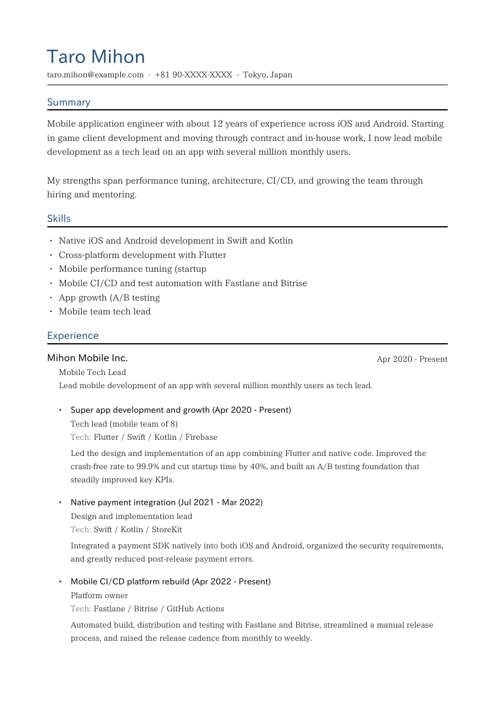
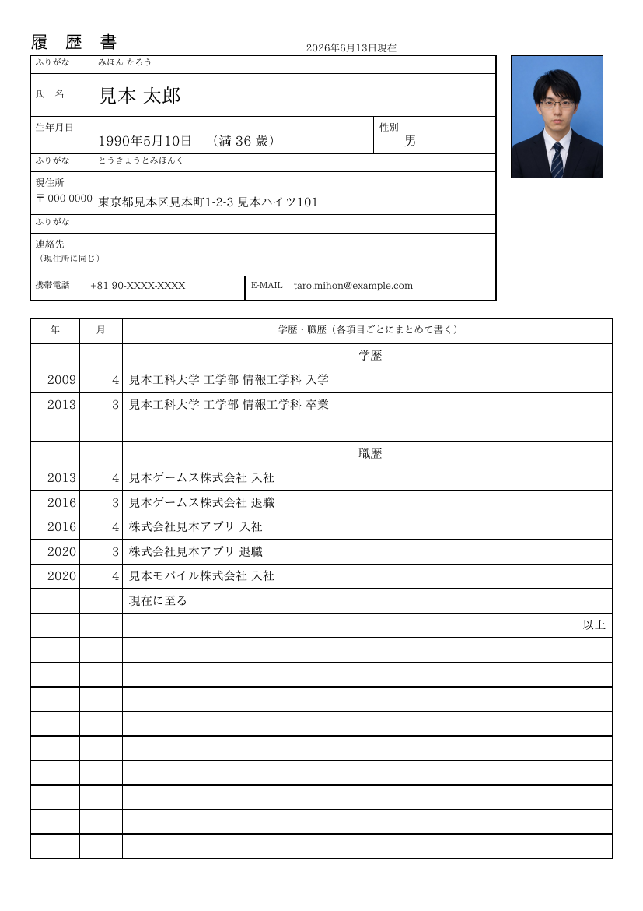
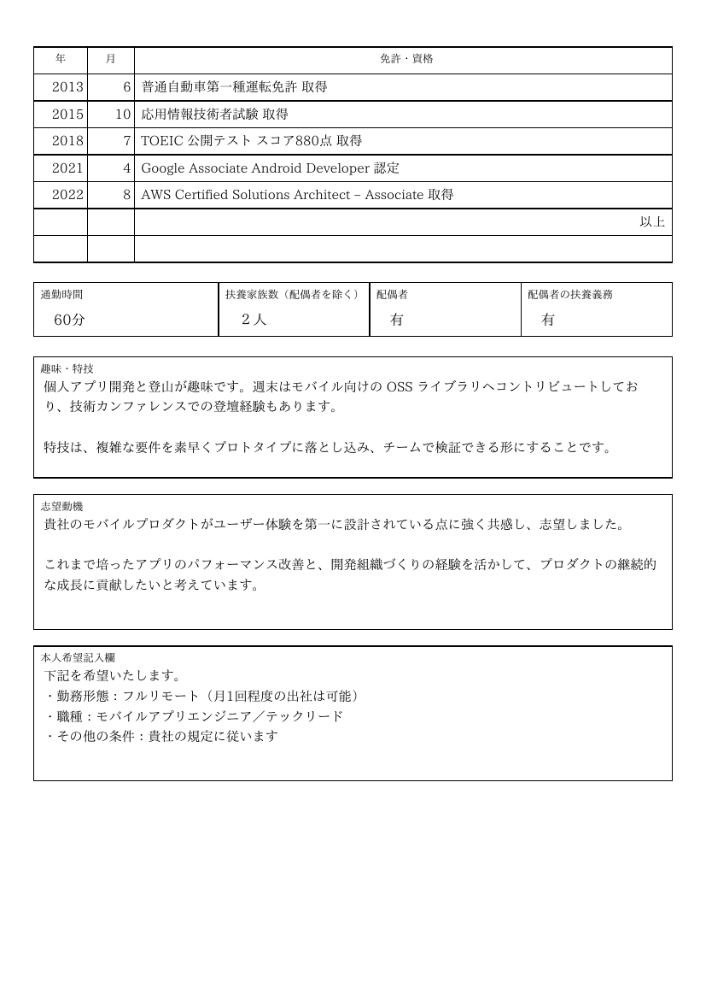
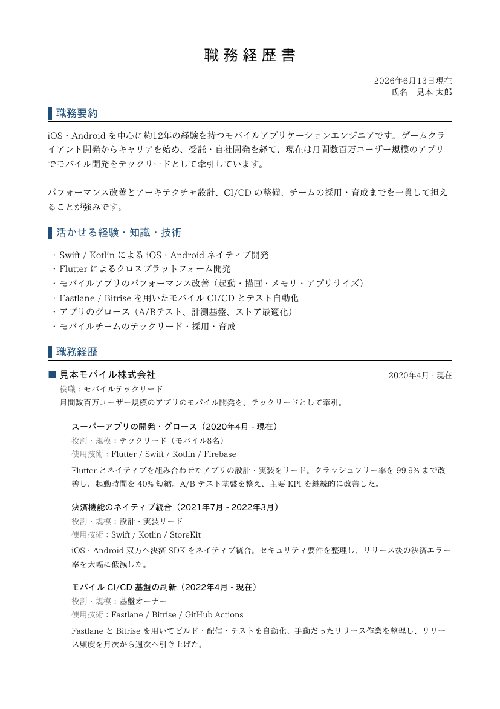

### 前書き：割と面倒な履歴書作成

妻との会話中、「履歴書の書き方」について話題に上がりました。妻はロシア人なので、日本のルールには詳しくありません。妻に説明するとき、私は過去の履歴書を思い出し、それぞれの作成方法に不満があったことを思い出しました。

- バイト応募時（2009年）：手書きで面倒
- 就職活動時（2013年）：手書きで面倒。かつ各社独自フォーマット
- 転職1回目（2021年）：Libre Office を使うが、慣れていないのでキレイに作れない
- 転職2回目（2024年）：[yagish（ヤギッシュ）](https://rirekisho.yagish.jp/) を使うが、個人情報を Web に置きたくない

全ての方法で、何らかの課題がありました。

手書きは、使い回せないので論外です。Libre Office は、Microsoft Office と使い勝手が違い、履歴書が上手く作れませんでした。また、私は Linux をメイン PC として使い始めて10年ぐらい経つので、今更履歴書のためだけに Microsoft Office を利用する選択肢はありません。[yagish（ヤギッシュ）](https://rirekisho.yagish.jp/) は、突然サービス終了する可能性や個人情報漏洩リスクがあります。他にも履歴書作成サイトがありますが、根本的な課題は同じです。

そこで、履歴書・職務経歴書・CV（Curriculum Vitae）を yaml から生成する [nao1215/career](https://github.com/nao1215/career) を作成しました。妻のユースケースでは、履歴書で十分でしたが、自分のユースケース用に職務経歴書を追加し、OSS 公開する前提で海外向けに CV を追加しました。

---

### サンプル画像

以下、生成した履歴書・職務経歴書・CV です。全て PDF として生成されます。

#### CV サンプル


#### 履歴書サンプル




#### 職務経歴書サンプル

下図には書かれていませんが、資格、出版・登壇、自己PR、リンクを書くこともできます。



#### インプットデータである yaml ファイル

```yaml
# One YAML for every document (all data is fictional).
#
#   career generate examples/resume.yaml --template cv               --output cv.pdf
#   career generate examples/resume.yaml --template japanese-resume  --output rirekisho.pdf
#   career generate examples/resume.yaml --template work-history     --output shokureki.pdf
#
# Text fields can be written either as a plain scalar (used for every language)
# or as a { ja:, en: } map. The cv template reads "en", the Japanese templates
# read "ja", and either falls back to whatever is present.
#
# Long fields may be wrapped over several lines for readability; the renderer
# re-flows them. A blank line is a paragraph break, and a line starting with a
# bullet (・ - * •) is kept as its own list item.

# 作成日（履歴書・職務経歴書の右上）。CVでは使われません。
date: 2026年6月13日現在

# 任意。職務経歴書・CVのアクセント色（履歴書は常に黒）。
theme:
  accent: "#1f4e79"

profile:
  name:
    ja: 見本 太郎
    en: Taro Mihon
  name_kana: みほん たろう       # 履歴書のふりがな（日本語のみ）
  birth_date: 1990年5月10日      # 履歴書のみ
  age: 満 36 歳
  gender: 男
  email: taro.mihon@example.com
  phone: "+81 90-XXXX-XXXX"
  photo: ""                      # 証明写真（任意、このYAMLからの相対パス）。例: ../image/sample_japanese_man.jpg
  address:
    zip: 000-0000
    kana: とうきょうとみほんく
    text:
      ja: 東京都見本区見本町1-2-3 見本ハイツ101
      en: Tokyo, Japan

# 学歴（履歴書・CV）。
education:
  - year: 2009
    month: 4
    value:
      ja: 見本工科大学 工学部 情報工学科 入学
      en: "Entered Mihon Institute of Technology, B.Eng. in Information Engineering"
  - year: 2013
    month: 3
    value:
      ja: 見本工科大学 工学部 情報工学科 卒業
      en: "Graduated, Mihon Institute of Technology"

# 職歴（履歴書の学歴・職歴欄）。
work:
  - { year: 2013, month: 4, value: 見本ゲームス株式会社 入社 }
  - { year: 2016, month: 3, value: 見本ゲームス株式会社 退職 }
  - { year: 2016, month: 4, value: 株式会社見本アプリ 入社 }
  - { year: 2020, month: 3, value: 株式会社見本アプリ 退職 }
  - { year: 2020, month: 4, value: 見本モバイル株式会社 入社 }
  - { value: 現在に至る }

# 免許・資格（履歴書）。
licenses:
  - { year: 2013, month: 6,  value: 普通自動車第一種運転免許 取得 }
  - { year: 2015, month: 10, value: 応用情報技術者試験 取得 }
  - { year: 2018, month: 7,  value: TOEIC 公開テスト スコア880点 取得 }
  - { year: 2021, month: 4,  value: Google Associate Android Developer 認定 }
  - { year: 2022, month: 8,  value: AWS Certified Solutions Architect – Associate 取得 }

# 履歴書だけで使う項目（日本語）。複数行や箇条書きも書けます。
rireki:
  commuting_time: 60分
  dependents: ２人
  spouse: 有
  supporting_spouse: 有
  hobby: |
    個人アプリ開発と登山が趣味です。週末はモバイル向けの OSS ライブラリへ
    コントリビュートしており、技術カンファレンスでの登壇経験もあります。

    特技は、複雑な要件を素早くプロトタイプに落とし込み、チームで検証できる形に
    することです。
  motivation: |
    貴社のモバイルプロダクトがユーザー体験を第一に設計されている点に強く共感し、
    志望しました。

    これまで培ったアプリのパフォーマンス改善と、開発組織づくりの経験を活かして、
    プロダクトの継続的な成長に貢献したいと考えています。
  request: |
    下記を希望いたします。
    ・勤務形態：フルリモート（月1回程度の出社は可能）
    ・職種：モバイルアプリエンジニア／テックリード
    ・その他の条件：貴社の規定に従います

# 職務経歴書・CVで使う項目。テキストは ja / en を併記できます。
career:
  summary:
    ja: |
      iOS・Android を中心に約12年の経験を持つモバイルアプリケーションエンジニアです。
      ゲームクライアント開発からキャリアを始め、受託・自社開発を経て、現在は月間数百万
      ユーザー規模のアプリでモバイル開発をテックリードとして牽引しています。

      パフォーマンス改善とアーキテクチャ設計、CI/CD の整備、チームの採用・育成までを
      一貫して担えることが強みです。
    en: |
      Mobile application engineer with about 12 years of experience across iOS and
      Android. Starting in game client development and moving through contract and
      in-house work, I now lead mobile development as a tech lead on an app with
      several million monthly users.

      My strengths span performance tuning, architecture, CI/CD, and growing the
      team through hiring and mentoring.

  skills:
    - { ja: Swift / Kotlin による iOS・Android ネイティブ開発, en: Native iOS and Android development in Swift and Kotlin }
    - { ja: Flutter によるクロスプラットフォーム開発, en: Cross-platform development with Flutter }
    - { ja: モバイルアプリのパフォーマンス改善（起動・描画・メモリ・アプリサイズ）, en: Mobile performance tuning (startup, rendering, memory, app size) }
    - { ja: Fastlane / Bitrise を用いたモバイル CI/CD とテスト自動化, en: Mobile CI/CD and test automation with Fastlane and Bitrise }
    - { ja: アプリのグロース（A/Bテスト、計測基盤、ストア最適化）, en: App growth (A/B testing, analytics, store optimization) }
    - { ja: モバイルチームのテックリード・採用・育成, en: Mobile team tech lead, hiring and mentoring }

  histories:
    - company: { ja: 見本モバイル株式会社, en: Mihon Mobile Inc. }
      period: { ja: 2020年4月 - 現在, en: Apr 2020 - Present }
      role: { ja: モバイルテックリード, en: Mobile Tech Lead }
      summary:
        ja: 月間数百万ユーザー規模のアプリのモバイル開発を、テックリードとして牽引。
        en: Lead mobile development of an app with several million monthly users as tech lead.
      projects:
        - title: { ja: スーパーアプリの開発・グロース, en: Super app development and growth }
          period: { ja: 2020年4月 - 現在, en: Apr 2020 - Present }
          role: { ja: テックリード（モバイル8名）, en: Tech lead (mobile team of 8) }
          description:
            ja: |
              Flutter とネイティブを組み合わせたアプリの設計・実装をリード。クラッシュ
              フリー率を 99.9% まで改善し、起動時間を 40% 短縮。A/B テスト基盤を整え、
              主要 KPI を継続的に改善した。
            en: |
              Led the design and implementation of an app combining Flutter and
              native code. Improved the crash-free rate to 99.9% and cut startup
              time by 40%, and built an A/B testing foundation that steadily
              improved key KPIs.
          tech: [Flutter, Swift, Kotlin, Firebase]
        - title: { ja: 決済機能のネイティブ統合, en: Native payment integration }
          period: { ja: 2021年7月 - 2022年3月, en: Jul 2021 - Mar 2022 }
          role: { ja: 設計・実装リード, en: Design and implementation lead }
          description:
            ja: |
              iOS・Android 双方へ決済 SDK をネイティブ統合。セキュリティ要件を整理し、
              リリース後の決済エラー率を大幅に低減した。
            en: |
              Integrated a payment SDK natively into both iOS and Android, organized
              the security requirements, and greatly reduced post-release payment
              errors.
          tech: [Swift, Kotlin, StoreKit]
        - title: { ja: モバイル CI/CD 基盤の刷新, en: Mobile CI/CD platform rebuild }
          period: { ja: 2022年4月 - 現在, en: Apr 2022 - Present }
          role: { ja: 基盤オーナー, en: Platform owner }
          description:
            ja: |
              Fastlane と Bitrise を用いてビルド・配信・テストを自動化。手動だった
              リリース作業を整理し、リリース頻度を月次から週次へ引き上げた。
            en: |
              Automated build, distribution and testing with Fastlane and Bitrise,
              streamlined a manual release process, and raised the release cadence
              from monthly to weekly.
          tech: [Fastlane, Bitrise, GitHub Actions]

    - company: { ja: 株式会社見本アプリ, en: Mihon App Co., Ltd. }
      period: { ja: 2016年4月 - 2020年3月, en: Apr 2016 - Mar 2020 }
      role: { ja: iOS / Android エンジニア, en: iOS / Android Engineer }
      summary:
        ja: 受託・自社の複数アプリを、設計から運用まで一貫して担当。
        en: Owned several contract and in-house apps from design through operation.
      projects:
        - title: { ja: フリマアプリの新規開発, en: Marketplace app from scratch }
          period: { ja: 2016年4月 - 2018年3月, en: Apr 2016 - Mar 2018 }
          role: { ja: iOS / Android（4名）, en: iOS / Android (team of 4) }
          description:
            ja: |
              フリマアプリを Swift / Kotlin でフルスクラッチ開発。公開後にダウンロード
              数 100 万を突破し、安定運用に貢献した。
            en: |
              Built a marketplace app from scratch in Swift and Kotlin; it passed one
              million downloads after launch and ran reliably in production.
          tech: [Swift, Kotlin, Realm]
        - title: { ja: 動画配信アプリのパフォーマンス改善, en: Video streaming app performance }
          period: { ja: 2018年4月 - 2019年6月, en: Apr 2018 - Jun 2019 }
          role: { ja: パフォーマンス改善担当, en: Performance lead }
          description:
            ja: |
              再生開始までの時間を 50% 短縮し、メモリ使用量を削減。プロファイリングを
              通じてボトルネックを特定し、描画とキャッシュを最適化した。
            en: |
              Cut time-to-first-frame by 50% and reduced memory use, profiling to
              find bottlenecks and optimizing rendering and caching.
          tech: [Swift, AVFoundation, ExoPlayer]
        - title: { ja: 共通 UI コンポーネントライブラリの整備, en: Shared UI component library }
          period: { ja: 2019年7月 - 2020年3月, en: Jul 2019 - Mar 2020 }
          role: { ja: 設計・実装, en: Design and implementation }
          description:
            ja: |
              複数アプリで再利用できる UI コンポーネントライブラリを整備し、新規画面の
              実装速度を向上させた。
            en: |
              Built a reusable UI component library shared across apps, speeding up
              the implementation of new screens.
          tech: [Swift, Kotlin]

    - company: { ja: 見本ゲームス株式会社, en: Mihon Games Inc. }
      period: { ja: 2013年4月 - 2016年3月, en: Apr 2013 - Mar 2016 }
      role: { ja: ゲームクライアントエンジニア, en: Game Client Engineer }
      summary:
        ja: スマートフォン向けゲームのクライアント開発に従事。
        en: Client development for smartphone games.
      projects:
        - title: { ja: スマホ向け RPG のクライアント開発, en: Smartphone RPG client }
          period: { ja: 2013年4月 - 2015年3月, en: Apr 2013 - Mar 2015 }
          role: { ja: クライアント, en: Client }
          description:
            ja: |
              Unity / C# でスマホ向け RPG のクライアントを開発。描画処理を最適化し、
              低スペック端末でも安定して動作するよう改善した。
            en: |
              Developed a smartphone RPG client in Unity / C#, optimizing rendering so
              it ran smoothly even on low-end devices.
          tech: [Unity, "C#"]
        - title: { ja: リアルタイム対戦機能の実装, en: Real-time multiplayer }
          period: { ja: 2015年4月 - 2016年3月, en: Apr 2015 - Mar 2016 }
          role: { ja: クライアント, en: Client }
          description:
            ja: |
              リアルタイム対戦機能をクライアント側で実装。通信の遅延対策を行い、快適な
              対戦体験を実現した。
            en: |
              Implemented real-time multiplayer on the client, mitigating network
              latency to deliver a smooth match experience.
          tech: [Unity, "C#"]

  certifications:
    - { ja: AWS Certified Solutions Architect – Associate, en: AWS Certified Solutions Architect – Associate }
    - { ja: Google Associate Android Developer, en: Google Associate Android Developer }
    - { ja: 応用情報技術者試験, en: Applied Information Technology Engineer (Japan) }
    - { ja: TOEIC 公開テスト 880点, en: TOEIC 880 }

  publications:
    - { ja: モバイルカンファレンスでアプリのパフォーマンス改善について登壇, en: Spoke on mobile app performance at a mobile conference }
    - { ja: 技術ブログでモバイルアーキテクチャの記事を執筆, en: Authored blog posts on mobile architecture }

  links:
    - { ja: "GitHub: https://github.com/mihon-taro", en: "GitHub: https://github.com/mihon-taro" }
    - { ja: "技術ブログ: https://example.com", en: "Blog: https://example.com" }

  self_pr:
    ja: |
      ユーザー体験とパフォーマンスにこだわり、設計から運用までを一人称で完遂することを
      得意としています。

      テックリードとして、技術的な意思決定とメンバーの育成の双方に責任を持ち、チームの
      アウトプットを最大化することを重視しています。継続的な学習を信条としています。
    en: |
      I care deeply about user experience and performance, and I own work from
      design through to operation.

      As a tech lead I take responsibility for both technical decisions and growing
      the team, focused on maximizing the team's output, and I value continuous
      learning.
```

---

### インストール方法 & 使い方

詳細は、[README](https://github.com/nao1215/career/blob/main/README.md) をご確認ください。

インストール方法：
```shell
go install github.com/nao1215/career@latest
```

yaml ファイルのテンプレート生成：
```shell
career init   # resume.yaml を生成
```

履歴書・職務経歴書・CV の生成：
```shell
career generate resume.yaml --template all  # PDF を生成
```

---

### デザイン上で確認済みの部分および制約

履歴書は、JIS を参考にしたので一般的なフォーマットのはずです。その一方で、職務経歴書と CV は好みが分かれると考えています。

以下、意識的にテストした部分です。
- 自動改ページ
- 文字が枠やページをはみ出さないこと
- 自由記入欄（趣味・志望動機・本人希望）は本文量に応じて枠が伸縮
- 文字溢れ対策（文字サイズの段階縮小）
- 言語同士の改行位置を考慮し、行頭禁則（。、）」』ー 小書き仮名など）と行末禁則（（「『 など）を適用
- フォントは埋め込み（[IPA Font License v1.0 ライセンス](https://moji.or.jp/ipafont/license/)）で、環境依存なし
- 証明写真は、JIS 規格の枠（30×40mm＝3:4） を厳守。枠内自動フィット機能があるが、逸脱する場合はエラー
- 職務経歴書と CV は、アクセントカラー変更可能。履歴書は黒オンリー

残念ながら、「職務経歴書は表を多用したいんだよな」「画像を挿入したくて」という要求には答えられません。今後、私にとって必要になったら対応するかもしれません。もしくは、Pull Request をお待ちしております。

---

### 最後に

ローカルで完結するツールが好きだと、最近気づきました。そして、妻にとっては yaml が難しかったようです。

