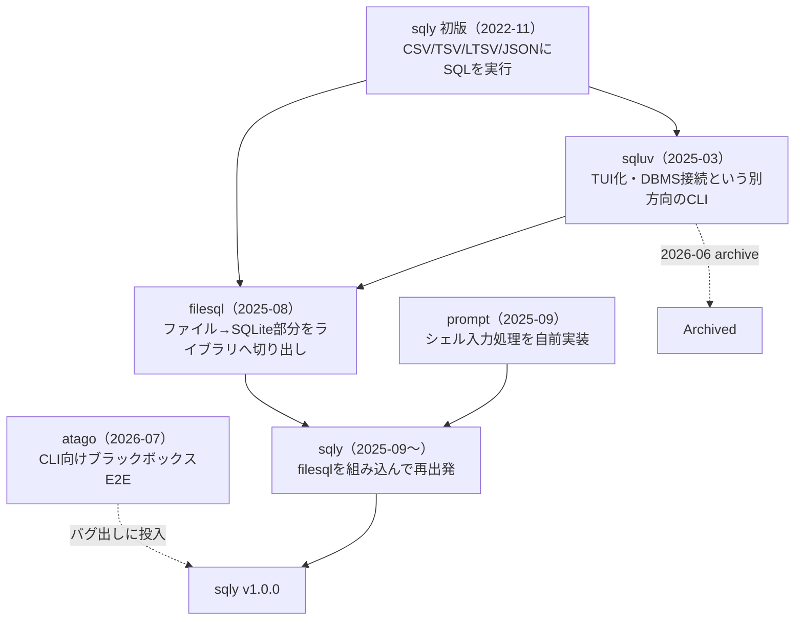

### 前書き：ファイルに SQL を実行する小さな CLI を v1.0.0 に

[sqly](https://github.com/nao1215/sqly) は、CSV／TSV／LTSV／JSON／JSONL／Parquet／Excel／ACH／Fedwire のファイルに SQL を実行する CLI です。ファイルを in-memory の SQLite3 へ読み込む設計のため、JOIN、CTE、Window 関数など、SQLite3 のクエリ機能を幅広く利用できます。gzip 圧縮された CSV と Parquet のように、形式が違うファイル同士を JOIN できます。SQL 方言は、SQLite をデフォルトとし、MySQL、PostgreSQL、GoogleSQL に一部対応しています。

sqly の初版は2022年11月です。開発動機は「巨大なマスターデータ CSV を SQL で検索して楽をしたい」であり、思い立ってから1週間で形にした小さなツールでした（参考：[開発当時の記事](https://debimate.jp/post/ja/2022-12-02-golangcsvtsvltsvjson%E3%81%ABsql%E3%82%92%E5%AE%9F%E8%A1%8C%E3%81%99%E3%82%8Bsqly%E3%82%B3%E3%83%9E%E3%83%B3%E3%83%89%E3%82%92%E4%BD%9C%E3%81%A3%E3%81%9F/)）。それから約4年（正確には3年9ヶ月）が経ち、このたび v1.0.0 をリリースしました。

先に断っておくと、機能が揃ったから v1.0.0 をリリースしたのではありません。機能整理のための v1.0.0 です。LLM 登場時の軽率な判断で、私は sqly に対して雑に機能追加してしまいました。このような反省から、大量のバグ潰しおよび破壊的変更を含む機能整理をしてあります。

本記事では、sqly の基本機能を説明し、sqly が4年間でどう変わったのか、sqly 周りで増えた OSS、リリース前のバグ出しで何が見つかったのかを振り返ります。

---

### sqly の思想

sqly の思想は、以下の3点です。
- ユーザーフレンドリーであること：簡単インストール、RDBMS サーバーの構築不要、シェル機能など
- SQL を自前パースしないこと：基本的な SQL 実行は SQLite3 に任せる
- クロスプラットフォームを重んずる：Windows 環境もキチンとテストする

ファイルに対して SQL を実行するツールは、sqly 開発当時から数多く存在します。初版リリース後は [DuckDB](https://duckdb.org/) が急激に流行った印象があります。そのような環境下で、私が考えた差別化は「ユーザーフレンドリーであること」でした。私は面倒くさがり屋なので MySQL や PostgreSQL のサーバーを準備するのを避けたい気持ちがありました。コマンド一つでインストールできて、SQL 入力補完が付いているシェルが搭載されている CLI。それが私の求めたツールでした。

SQLite3 に全てを任せる考え方は、技術的な楽しさよりも、実用性を優先したからです。SQL パーサー、RDBMS のようなデータ管理ロジックを作ることは、それだけで楽しいでしょう。しかし、私は業務効率を上げることを目的としていたため、手段と目的の逆転は避けました。SQL 処理やトランザクション周りを自前実装するより、十分に実績のある SQLite へ任せました。

クロスプラットフォーム対応は、私が開発する大半の OSS の基本です。どのユーザーも大切にしています。sqly では文字コードの取り扱い、シェル環境が正しく Linux、macOS、Windows で動作することを End to End（E2E）でテストしてあります。

---

### sqly の動作例

sqly は、コマンド実行時に読み込み対象のファイル（単数、複数）を指定し、`--sql` オプションで実行する SQL を指定します。下図が非常にシンプルな動作例です。


ファイルとテーブルの対応関係は、基本的にファイル名（拡張子なし）がテーブル名になります。具体的には、`user.csv`を読み込むと`user`テーブルが生成されます。スキーマ定義もインポート手順も要りません。以下の実行例では、gzip 圧縮された CSV と Parquet ファイルを1つの SQL で JOIN しています。

```shell
$ sqly --sql "SELECT u.user_name, i.position
              FROM user u JOIN identifier i ON u.identifier = i.id" user.csv.gz identifier.parquet
+-----------+-----------+
| user_name | position  |
+-----------+-----------+
| booker12  | developer |
| jenkins46 | manager   |
| smith79   | neet      |
+-----------+-----------+
```

`--sql` オプションを渡さずに起動すると、SQL キーワード・テーブル名・カラム名・ファイルパスの補完と履歴を備えた対話シェルが立ち上がります。シェルの中で `UPDATE` した結果は、書き戻しに対応した形式であれば、`.save --in-place` で元ファイルへ反映できます。


sqly の単純な使い方はファイル閲覧・フィルタリングですが、応用的なユースケースが存在します。以下がユースケースの一例であり、[公式ドキュメントの Cookbook](https://nao1215.github.io/sqly/cookbook) で一覧化してあります。ユースケースが判明次第、Cookbook に追記しています。

- [異なるファイル形式に変換](https://nao1215.github.io/sqly/cookbook/#convert-between-formats)
- [パイプを用いたグルーコマンドとしての利用（jq, awk, sort などとの併用）](https://nao1215.github.io/sqly/cookbook/#pipe-data-in)
- [HTTP(S) 経由のデータ参照](https://nao1215.github.io/sqly/cookbook/#files-over-http)
- [SQL ファイルの実行](https://nao1215.github.io/sqly/cookbook/#run-sql-from-a-file)

---

### 2022年の sqly と現在の sqly の差異

2022年の初版は、CSV／TSV／LTSV／JSON の4形式を読み、シェルで補完付きの SQL を打てるだけのツールでした。当時の記事を読み返すと「テストカバレッジは78%ありますが、バグが潜んでいるはずです」と書いており、実際その通りでした。潜んでいるというレベルではなく、触ればバグが湧き出すレベルでした。

サポートしているファイル形式は4形式から9形式へ増え、8種類の圧縮形式（gz／bz2／xz／zst／z／snappy／s2／lz4）を透過的に読めるようになりました。ACH や Fedwire という米国の銀行間決済フォーマットが混ざっているのは、私が決済の仕事をしている影響です。`--dialect` を使うと、MySQL／PostgreSQL／GoogleSQL の構文を SQLite 構文へ変換してから実行します。エミュレーションではなく変換であるため、期待通りの挙動にならないケースがあります。ドキュメントに制約事項を多数記載してあります。

LLM の登場により、CLI としての契約に対する考え方が変化しました。2022年の sqly は「人間が対話シェルで使う道具」でした。現在は、シェルスクリプト・CI・LLM エージェントから呼ばれる事を前提に、exit code の分類、stdout と stderr の使い分け、`--inspect` の JSON スキーマ出力といった「プログラムから見た振る舞い」を仕様として明文化しています。

外部仕様だけでなく、内部設計も別物になりました。sqly が自前で持っていた「ファイルを読み込み SQLite に入れて書き戻す」部分、「シェルの入力処理（プロンプト処理）」は、それぞれ [filesql](https://github.com/nao1215/filesql) と [prompt](https://github.com/nao1215/prompt) という別の OSS に切り出されています。

---

### sqly 周りで増えた OSS

sqly の4年間は、sqly 単体の歴史ではありません。途中で4つの OSS が登場し、そのうち3つが現在の sqly を支えています。時系列を図にすると以下のとおりです。



#### sqluv（2025-03）：TUI という別方向

[sqluv](https://github.com/nao1215/sqluv) は2025年3月に作った TUI ツールで、「SQL を書く UI を sqly より使いやすくしたい」「ローカルファイルだけでなく DBMS にも接続したい」という方向を試したプロジェクトです。当時の[記事](https://debimate.jp/post/ja/2025-03-08-gosqluv%E3%82%B3%E3%83%9E%E3%83%B3%E3%83%89dbms%E7%94%A8%E3%81%AEtui-csvtsvltsv%E3%81%ABsql%E3%82%92%E5%AE%9F%E8%A1%8C%E5%8F%AF%E8%83%BD/)を読み返すと、「私個人のユースケースでは、sqluv があれば sqly は不要」とまで書いています。この時点では、sqly は開発停止の見込みでした。

結果は逆になりました。sqluv は2026年6月に Public archive にしています。TUI を継続して管理する負担が大きかった事と、私自身が Redash を使い始めて sqluv を積極的に使う理由が減った事が理由です。ここでの流れを失敗と呼ぶつもりはなく、TUI という方向を実際に試したからこそ、sqly は「シェルとパイプで完結する CLI」に集中する判断ができました。

#### filesql（2025-08）：重複コードのライブラリ化

sqly と sqluv には「ファイルを読み込み、SQLite 上で SQL を実行する」という同じ機能があり、実装は共通化されていませんでした。片方を直すともう片方にも似た修正が発生します。この状態を解消するために、2025年8月に共通部分を [filesql](https://github.com/nao1215/filesql) として切り出しました（[経緯の記事](https://debimate.jp/post/ja/2025-08-28-golangcsv-tsv-ltsv%E3%82%92sql-db%E3%81%A7%E6%93%8D%E4%BD%9C%E3%81%99%E3%82%8Bfilesql%E3%83%91%E3%83%83%E3%82%B1%E3%83%BC%E3%82%B8%E3%82%92%E4%BD%9C%E3%81%A3%E3%81%9F%E8%A9%B1/)）。

現在の sqly にとって、filesql はサポートしている全ファイル形式の読み込みと書き戻しを担う `database/sql` ドライバであり、`--dialect` の構文翻訳も filesql 側の実装です。後述するバグ出しで見つかった不具合の多くは filesql 側で修正しています。

#### prompt（2025-09）：シェル入力のオーナーシップ

sqly の対話シェルは、2022年から [c-bata/go-prompt](https://github.com/c-bata/go-prompt) を使っていました。私のユースケースにマッチした素晴らしいライブラリでした。しかし、私が採用した時点でメンテナンスが滞っており、その後3年間ほぼ更新がありませんでした。バグを踏んだら sqly 側でワークアラウンドを書くか、諦めるかの二択です。

有志による Org.管理への移行提案も立ち消えになり、2025年に「メンテナンスと不具合対応を自分でコントロールできる実装が欲しい」と判断して、[prompt](https://github.com/nao1215/prompt) を作りました。fork ではなく作り直しを選んだ理由は[当時の記事](https://debimate.jp/post/ja/2025-09-20-nao1215-prompt%E3%82%B3%E3%83%BC%E3%83%89%E3%82%92%E8%AA%AD%E3%82%80%E3%81%AE%E3%81%8C%E8%BE%9B%E3%81%84%E3%81%8B%E3%82%89%E6%94%BE%E7%BD%AE%E3%81%95%E3%82%8C%E3%81%9Foss/)に書いています。LLM 時代らしい判断です。

当然ですが、自作の判断にはメンテナンスの覚悟が必要です。v1.0.0 のバグ出し期間中、擬似端末（pty）経由の E2E テストが prompt のバグを踏み抜きまくりました。以下がバグの例です。

- 複数行の編集でプロンプトが画面を1行ずつ登っていくバグ
- Escape キーが直後の入力を最大3文字消してしまうバグ（`SELECT 1` と打つと `ECT 1` が実行される）
- 貼り付けた SQL の中の TAB が補完として解釈されるバグ

#### atago（2026-07）：CLI を実行するテスト（E2E）を作るツール

[atago](https://github.com/nao1215/atago) は、CLI 向けのブラックボックス E2E テストランナーです。YAML でシナリオを書き、実バイナリを実行して、stdout／stderr／exit code／生成ファイル／対話操作まで検証します。詳細は [atago の記事](https://debimate.jp/post/ja/2026-07-04-cli%E3%81%AB%E3%83%96%E3%83%A9%E3%83%83%E3%82%AF%E3%83%9C%E3%83%83%E3%82%AF%E3%82%B9%E3%83%86%E3%82%B9%E3%83%88e2e%E3%82%92%E8%A1%8C%E3%81%86atago%E3%82%92%E4%BD%9C%E3%81%A3%E3%81%9F%E8%A9%B1/)に譲ります。

v1.0.0 で仕様として確定した内容は、exit code、シグナル、stdout と stderr の分離、ファイルシステムへの書き込み、対話シェルの挙動などでした。ユニットテストでは確認しづらく、実バイナリで動作確認する必要があります。例えば、「ビルドしたバイナリに SIGTERM を送ったら143で終わるか」「`--output` 先のファイルが書き込み禁止だったらどうなるか」はユニットテストで実現可能ですが、書きづらいですし、並列化すると Flaky テストとなるリスクを孕みます。

atago 導入前は [ShellSpec](https://github.com/shellspec/shellspec) で E2E をしていました。しかし、シェル（TUI）部分のテストや高速な並列テスト実行を実現するために、atago の自作を選択しました。atago が登場して、ゴールデンテストで使っていた [sebdah/goldie](https://github.com/sebdah/goldie) （正確にはフォーク品）の依存も剥がせたので、地味に嬉しかったです。atago は sqly だけでなく、私が開発した CLI 全体を堅牢にしてくれました。2026年に開発した OSS の中で、atago はベストの出来栄えです。

---

### バグ出しの方法

バグ出しは、Claude、Codex に sqly を実行させることで炙り出しました。発見したバグは、atago で E2E テスト化して修正していました。シェル（TUI）周りは、LLM の苦手領域のようだったので、自分で実行してバグを探しました。最終的な E2E テストケース数は、1000件を超えました。

LLM にバグを探させる時、確認観点を一緒に伝えるのが大事です。以下が、私が伝えた観点の一例です。
- 型推論の境界: ゼロ埋め・int64超・小数スケール（1/1.0/1.00）・先頭末尾空白など
- エンコーディング/制御文字：BOM、CRLF、NUL、不正 UTF-8、CJK/絵文字（幅計算）
- 混在型カラム：int→real→text の昇格順序、列ごとに型が途中で変わるなど
- 巨大データを入力した場合
- NULL 伝播・ゼロ除算・型キャストの方言差
- 厳しいファイル権限やシンボリックリンクが含まれる場合
- 同じクエリを異なる方言で書いた場合の結果一致
- 矛盾のあるフラグの組み合わせ
- 破損ファイルを扱った場合

綺麗なファイルや理想的な実行環境であれば、バグ出しは不要です。しかし、現実世界は非情です。ダウンロード途中に壊れたファイル、UTF-8ではないファイル、文字コードが統一されていないファイルなど、様々な状況下を考える必要があります。私は、テストが好きなので、嬉々としてバグ潰ししていました。しかし、リリース候補版を8個作ったタイミングで「終わりないな、コレ」と感じ、割り切りリリースしました。E2E テストが1000件を超えたあたりで、さすがに個人開発としては十分に石橋を叩いたと思うようになりました。今後問題が見つかっても、「あれだけテストして駄目だったなら仕方がない」と諦めがつきます。

個人的な学びとしては、Windows 固有の挙動が多かったことでしょうか。`s3://` のような未対応スキームの URL を渡した時に意味不明なパスエラーになったり、`os.Rename` が開いているファイルを上書きできなかったりして、Windows の気持ちが分かってないなと思わずにいられませんでした。

---

### バグ出しで見つけた致命的なバグ 3選

#### シンボリックリンクの取り扱い不備による上書き

`--output`オプションの出力先に入力ファイルを指すシンボリックリンクを指定すると、別パスに見えてしまいます。パスベースの衝突チェックをすり抜け、入力元を上書きできる状態でした。現在は、リンクを解決した実体のパスで比較し、入力ファイルへの上書きを拒否します。

#### 型情報を捨てるバグ

Parquet の読み込みでは、ファイルが持つ型情報を捨てて全カラムを TEXT として SQLite に格納していました。そのため `MAX(price)` や `ORDER BY price` が文字列として評価され、同じデータでも CSV と Parquet で SQL の結果が変わる状態でした。エラーも警告も出ません。

#### ファイル破壊

ファイル出力では、一時ファイルから出力先へコピーする途中でディスクフルや I/O エラーが発生すると、既存ファイルが途中まで上書きされた状態で残るケースがありました。現在は、一時ファイルへの書き込みが完了してから出力先へ反映し、失敗時に既存ファイルを壊さないようにしています。

---

### sqly の類似ツール（競合）

| やりたいこと | ツール名 |
| :--- | :--- |
| ログや列指向のテキストを手軽に加工したい | [awk](https://www.gnu.org/software/gawk/), [Miller](https://miller.readthedocs.io/) |
| CSV向けに設計された独自SQLエンジンとカーソルを使いたい | [csvq](https://github.com/mithrandie/csvq) |
| CSV / TSV / JSONに対して、複数のバックエンドからSQLエンジンを選んで使いたい | [trdsql](https://github.com/noborus/trdsql) |
| CSVをSQLで扱え、成熟したツールを使いたい | [q](https://github.com/harelba/q), [textql](https://github.com/dinedal/textql) |
| CSV / Parquet / JSONなどのファイルを直接SQLで分析し、本格的な分析処理も行いたい | [DuckDB](https://duckdb.org/) |
| 複数形式のファイルをSQLで扱い、対話シェル、異なる形式間のJOIN、ファイルへの書き戻しまで行いたい | sqly |


「ファイルに SQL を実行する」と聞いて、多くの人が [DuckDB](https://github.com/duckdb/duckdb) を思い浮かべると思います。DuckDB は in-process の分析用 DB で、列指向の実行エンジンを持ち、CSV や Parquet を直接読めて、CLI シェルもあります。大量のデータを集計・分析するワークロードなら、SQLite3 を土台にする sqly より、分析のために設計された DuckDB を選ぶ方が自然です。

sqly と DuckDB は、主目的が違います。DuckDB は分析 DB そのものであり、ファイル読み込みは DB へデータを入れる手段です。sqly は「手元のファイルをサッと SQL で閲覧・編集すること」が主目的で、DB はファイルを触るための手段です。この違いが機能差を生んでいます。sqly には、補完と履歴を持つシェル、`.save` による元ファイルへの書き戻し、文字コードの適切なハンドリング、exit code や stdout の明確な仕様（E2E テストで仕様固定）といった特徴があります。

同じ CLI 寄りのツールも多機能で、sqly の代替に成り得ます。[trdsql](https://github.com/noborus/trdsql) は CSV／LTSV／JSON／YAML などに SQL を実行でき、SQLite3 以外に MySQL や PostgreSQL を実行エンジンとして選べるのが特徴で、現在も活発に開発されています。[csvq](https://github.com/mithrandie/csvq) は、sqly と機能的に近く、独自の SQL エンジンとカーソルまで備えた意欲的な設計です。[q](https://github.com/harelba/q) および [textql](https://github.com/dinedal/textql) は10年選手の定番で、[Miller](https://github.com/johnkerl/miller) や awk は SQL ではなくフィールド指向のテキスト処理という別の答えを持っています。2022年の記事で同じ顔ぶれを比較していて、当時「多機能さでは trdsql がずば抜けていた」と書きました。4年経っても、それぞれの立ち位置は大きく変わっていません。

---

### 謝辞

sqly は、私に2名の GitHub スポンサーとの縁をもたらした記念すべきツールです。

[adamdecaf 氏](https://github.com/adamdecaf) は[決済業界（moov.io）](https://moov.io/)の方であり、sqly が金融フォーマット（ACH／Fedwire）へ対応するきっかけになった方です。[sho-hata 氏](https://github.com/sho-hata) は現職の同僚で、filesql や sqly を積極的に利用してくださっています。実利用者からのフィードバックがあったことで、filesql の高速化や sqly のバグ修正を進めることができました。

スポンサーとして開発を支援してくださったお二人、ならびにコードやドキュメントなどを通じて開発に参加してくださったコントリビューターの方々に、この場を借りて感謝申し上げます。

---

### 最後に

sqly 開発初期を振り返ると、「ファイルを SQLite に読み込み、SQL クエリを実行する」という発想に、当時の自分がどのように辿り着いたのだろうかと不思議に感じています。当時の記事を読み返すと色々と理解度が低そうな記述があり、かつ sqly の開発で SQLite3 を初めて使った記憶があります。SQL パーサーを自作してゴリ押しする案を採用しなかったことが本当に不思議です。

sqly は扱う題材に一定の複雑さがあったため、開発の過程で複数の OSS が生まれた点も大きな収穫でした。[prompt](https://github.com/nao1215/prompt)、[filesql](https://github.com/nao1215/filesql)、[atago](https://github.com/nao1215/atago) は、別 OSS 開発でも大いに活躍することでしょう。

私が開発した中で、v1.0.0 に辿り着いた OSS は [gup](https://github.com/nao1215/gup) に続いて2つ目です。正直、開発者にとって v1.0.0 にアップグレードする強い動機はありません。気軽に外部仕様を変更できなくなりますし、機能追加時に外部仕様を一発で決めきる胆力が必要になります。しかし、v1.0.0 前に肥大化した機能を整理して、仕様を E2E テストで固定し、ドキュメントに明記する活動を通して、OSS の完成度が高まります。リリースして数年経過したら、覚悟を持って v1.0.0 を目指していこうと最近は考えています。
