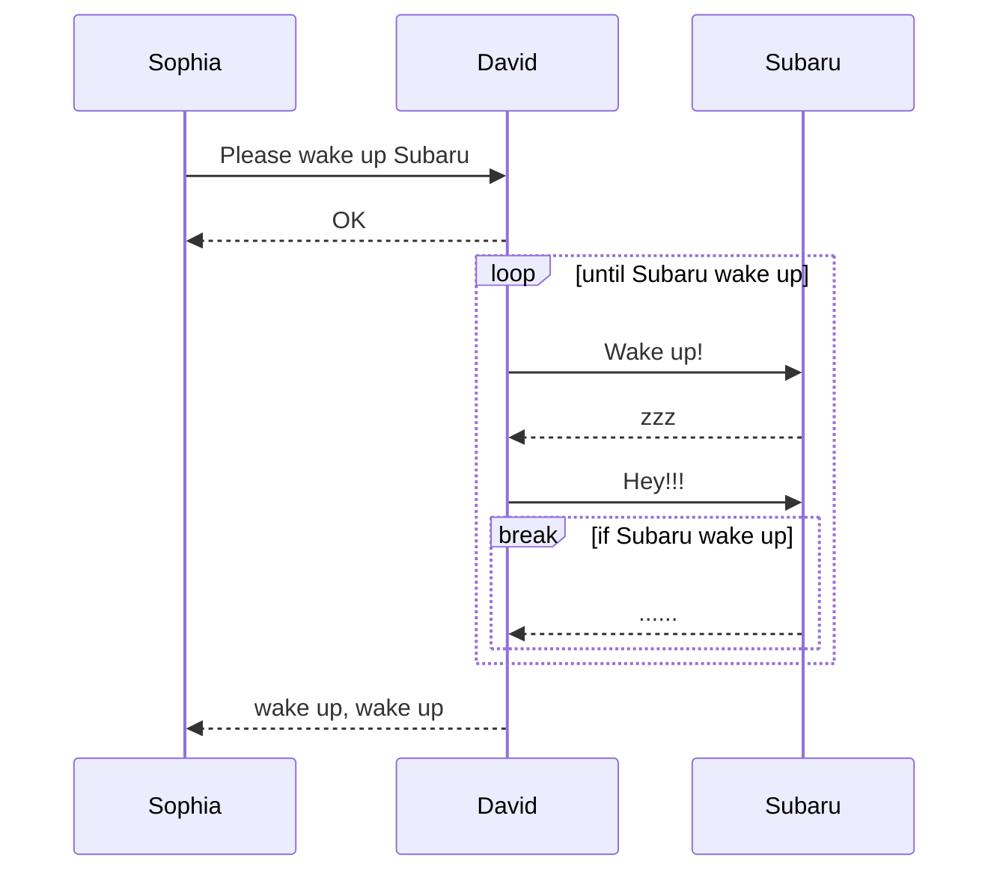
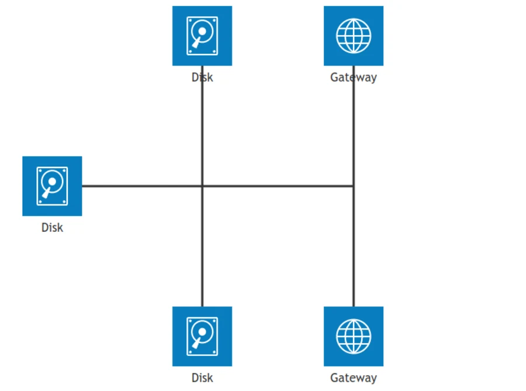
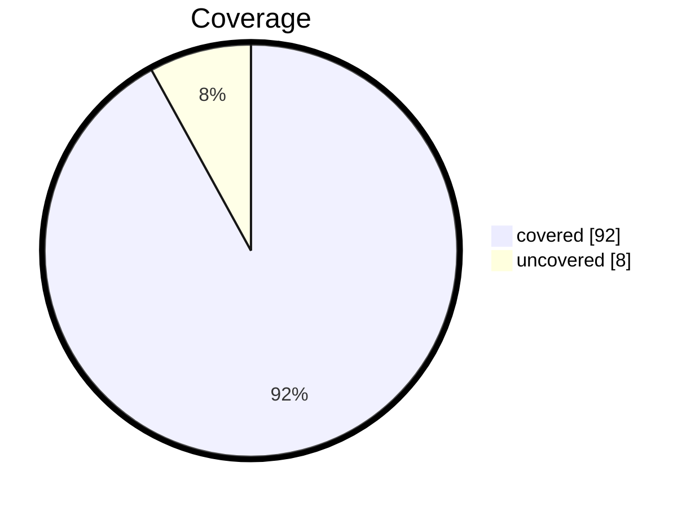
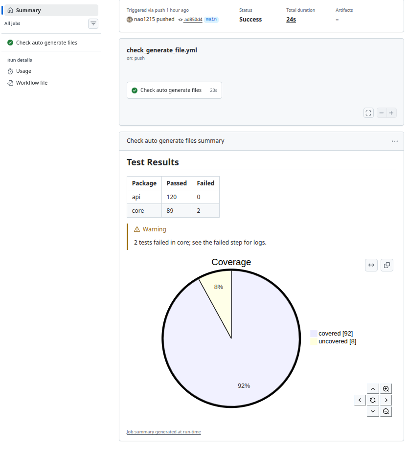
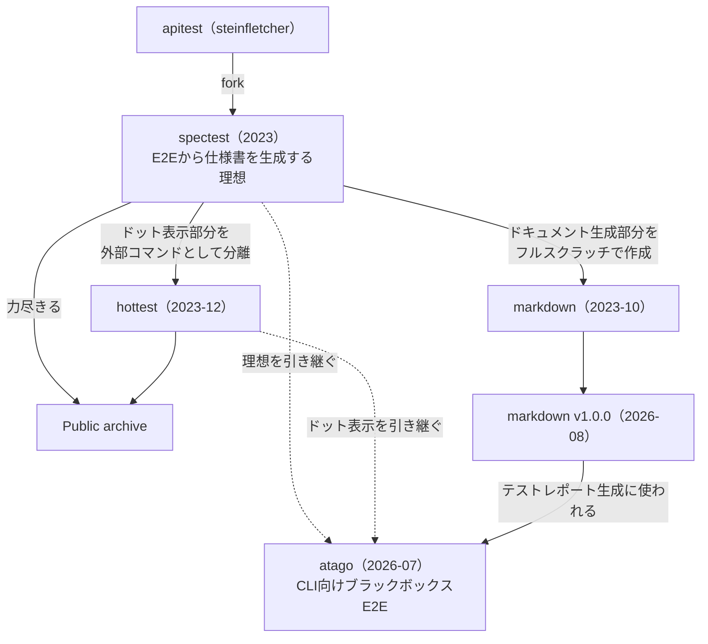

### 前書き：v1.0.0 に達した3本目の OSS

[nao1215/markdown](https://github.com/nao1215/markdown) は、Markdown と mermaid を Builder Pattern で組み立てるライブラリです。2026/8/13に v1.0.0 をリリースしました。[Awesome Go](https://github.com/avelino/awesome-go) の仲間入りをしています。

本記事では、markdown ライブラリの使い方、Builder Pattern を選んだ理由、GitHub Actions との併用例、v1.0.0 までに潰したバグ、markdown ライブラリにまつわる歴史を書きます。

---

### markdown ライブラリとは

markdown ライブラリは、Builder Pattern（メソッドチェーン）で Markdown を組み立てるライブラリです。[html/template](https://pkg.go.dev/html/template) のようなテンプレートエンジンは使いません。生成する記法は、GitHub Markdown に従います。

対応範囲は、見出し、リスト、チェックボックス、テーブル、コードブロック、引用、水平線、文字装飾、リンク、画像、details、脚注、数式、アラートです。加えて、24種類の mermaid ダイアグラムを組み立てられます。Markdown の記法から外れた独自機能としては、ステータスバッジの生成と、Markdown ファイルが詰まったディレクトリのインデックス生成が入っています。対応 OS は Linux、macOS、Windows で、Go 1.23 以降が必要です。

以下に基本的な実装例を示します。

```go
package main

import (
	"os"

	md "github.com/nao1215/markdown"
)

func main() {
	// 第1引数は出力先の io.Writer。WithBlockSpacing() はブロック間に空行を挟むオプション
	md.NewMarkdown(os.Stdout, md.WithBlockSpacing()).
		H1("This is H1").
		PlainText("This is plain text").
		// 末尾に f が付くメソッドは、fmt.Sprintf と同じ書式指定が使える
		H2f("This is %s with text format", "H2").
		PlainTextf("Text formatting, such as %s and %s, %s styles.",
			md.Bold("bold"), md.Italic("italic"), md.Code("code")).
		H2("Code Block").
		CodeBlocks(md.SyntaxHighlightGo,
			`package main
import "fmt"

func main() {
	fmt.Println("Hello, World!")
}`).
		H2("List").
		BulletList("Bullet Item 1", "Bullet Item 2", "Bullet Item 3").
		H2("CheckBox").
		CheckBox([]md.CheckBoxSet{
			{Checked: false, Text: md.Code("sample code")},
			{Checked: true, Text: md.Link("Go", "https://golang.org")},
			{Checked: false, Text: md.Strikethrough("strikethrough")},
		}).
		H2("Table").
		Table(md.TableSet{
			Header: []string{"Name", "Age", "Country"},
			Rows: [][]string{
				{"David", "23", "USA"},
				{"John", "30", "UK"},
			},
		}).
		Build() // ここで初めて io.Writer へ書き込む
}
```

以下に実行例を示します。

````text
# This is H1

This is plain text

## This is H2 with text format

Text formatting, such as **bold** and *italic*, `code` styles.

## Code Block

```go
package main
import "fmt"

func main() {
	fmt.Println("Hello, World!")
}
```

## List

- Bullet Item 1
- Bullet Item 2
- Bullet Item 3

## CheckBox

- [ ] `sample code`
- [x] [Go](https://golang.org)
- [ ] ~~strikethrough~~

## Table

| Name | Age | Country |
|---------|---------|---------|
| David | 23 | USA |
| John | 30 | UK |
````

`Build()` を呼ぶまで書き込みは発生せず、途中で発生したエラーは内部に溜め込んで `Build()` の戻り値で返します。メソッドチェーンの各所で `if err != nil` を書きたくなかったための設計です。Golang らしさよりも、読みやすさを優先しました。

---

### Builder Pattern を選んだ理由

ドキュメント生成の実装を考えた時、最初に浮かぶのは html/template や text/template を使う案でしょう。しかし、私はテンプレートの任意の箇所を置換していくスタイルが好きではありませんでした。理由は、コードとして読みづらさを感じていたからです。以下に、テンプレートを使った場合のイメージを示します。

```go
const tmpl = `# {{ .Title }}

{{ range .Sections }}## {{ .Name }}

{{ .Body }}
{{ end }}
| Name | Age |
|---|---|
{{ range .Users }}| {{ .Name }} | {{ .Age }} |
{{ end }}`
```

このコードを読んだ時、脳内で「テンプレートの構造」と「データ構造」と「両者を結合した結果」の3つを同時に組み立てる必要があります。テンプレートが長くなるほど、最終的に何が出力されるのかが分かりにくくなります。さらに、テンプレート内の改行やスペースが出力に直結するため、`{{- -}}` のような制御を覚える必要も出てきます。

Builder Pattern であれば、上から順に読むだけで、どんな Markdown が生成されるかが雰囲気で理解できます。`H1()` を呼べば H1 が出て、`Table()` を呼べばテーブルが出ます。文書の構造がそのままコードの並び順になります。テンプレートとデータを別々に管理する必要もありません。

当然、Builder Pattern が万能だとは考えていません。文書のレイアウトをコードの外側（テンプレートファイル）に置きたい場合や、非エンジニアが文書の体裁を編集する場合は、テンプレートエンジンの方が適しています。markdown ライブラリが想定しているのは「プログラムが生成したデータを利用して、そのままプログラムが文書化する」ケースです。

なお、ネストしたリストの生成のように、ライブラリの複雑度を上げる機能は追加しない方針にしています。私は、このライブラリをできる限り単純に保ちます。複雑な Markdown を生成するためにライブラリを複雑にするくらいなら、先に文章の構造を疑うべきだと考えています。

---

### mermaid を24種類サポートした

markdown ライブラリは、mermaid のダイアグラムも組み立てられます。v1.0.0 時点で以下の24種類に対応しています。

| 分類 | ダイアグラム |
| :--- | :--- |
| フロー・構造 | flowchart, block, architecture（beta）, c4, packet |
| 振る舞い | sequence, state, class, gitgraph, userjourney |
| データ・分析 | piechart, xychart, radar, treemap, sankey, quadrant, venn |
| 計画・管理 | gantt, timeline, kanban, requirement, mindmap, wardley |
| モデリング | er |

サブパッケージとして分かれており、生成したダイアグラムを文字列として受け取り、`CodeBlocks()` へ渡す形になります。以下に、シーケンス図の実装例を示します。

```go
package main

import (
	"io"
	"os"

	"github.com/nao1215/markdown"
	"github.com/nao1215/markdown/mermaid/sequence"
)

func main() {
	// ファイルではなく文字列として受け取るので、出力先には io.Discard を渡す
	diagram := sequence.NewDiagram(io.Discard).
		Participant("Sophia").
		Participant("David").
		Participant("Subaru").
		LF(). // LF() は空行の挿入。図の可読性のために入れている
		SyncRequest("Sophia", "David", "Please wake up Subaru").
		SyncResponse("David", "Sophia", "OK").
		LF().
		// LoopStart/LoopEnd、BreakStart/BreakEnd は対で呼び、loop と break を囲む
		LoopStart("until Subaru wake up").
		SyncRequest("David", "Subaru", "Wake up!").
		SyncResponse("Subaru", "David", "zzz").
		SyncRequest("David", "Subaru", "Hey!!!").
		BreakStart("if Subaru wake up").
		SyncResponse("Subaru", "David", "......").
		BreakEnd().
		LoopEnd().
		LF().
		SyncResponse("David", "Sophia", "wake up, wake up").
		String() // 組み立てた mermaid を文字列として取り出す

	markdown.NewMarkdown(os.Stdout, markdown.WithBlockSpacing()).
		H2("Sequence Diagram").
		// 言語指定を mermaid にしたコードブロックへ、ダイアグラムを埋め込む
		CodeBlocks(markdown.SyntaxHighlightMermaid, diagram).
		Build()
}
```

以下に実行例を示します。

````text
## Sequence Diagram


````

出力した Markdown を GitHub や本ブログに貼ると、以下のように描画されます。


`architecture-beta` のように GitHub が描画してくれないダイアグラムもあります。以下は、markdown ライブラリが生成したアーキテクチャ図を mermaid のレンダラで描画したものです。



---

### GitHub Actions のジョブサマリを書く

ライブラリの実用例として、私が気に入っている使い方を挙げます。

GitHub Actions のステップ内で `GITHUB_STEP_SUMMARY` が指すファイルへ書き込むと、その内容がワークフロー実行のサマリページに GitHub Flavored Markdown として描画されます。mermaid も描画されます。このファイルを `NewMarkdown()` へ渡すと、CI のレポートをログの羅列ではなく、テーブルとアラートと図で表現できます。

```go
package main

import (
	"io"
	"os"

	"github.com/nao1215/markdown"
	"github.com/nao1215/markdown/mermaid/piechart"
)

func main() {
	// GitHub Actions のステップ内ではサマリファイルへ追記し、
	// ローカル実行時はカレントディレクトリのファイルへ書き出す
	path := os.Getenv("GITHUB_STEP_SUMMARY")
	flags := os.O_APPEND | os.O_CREATE | os.O_WRONLY
	if path == "" {
		path = "generated.md"
		flags = os.O_TRUNC | os.O_CREATE | os.O_WRONLY
	}
	f, err := os.OpenFile(path, flags, 0o600)
	if err != nil {
		panic(err)
	}
	defer func() {
		if err := f.Close(); err != nil {
			panic(err)
		}
	}()

	// カバレッジを円グラフにする。WithShowData(true) で実数値も併記する
	coverage := piechart.NewPieChart(
		io.Discard,
		piechart.WithTitle("Coverage"),
		piechart.WithShowData(true),
	).
		LabelAndIntValue("covered", 92).
		LabelAndIntValue("uncovered", 8).
		String()

	// サマリファイルを出力先にして、テーブル、アラート、円グラフを書き込む
	err = markdown.NewMarkdown(f, markdown.WithBlockSpacing()).
		H2("Test Results").
		Table(markdown.TableSet{
			Header: []string{"Package", "Passed", "Failed"},
			Rows: [][]string{
				{"api", "120", "0"},
				{"core", "89", "2"},
			},
		}).
		Warning("2 tests failed in core; see the failed step for logs."). // GitHub のアラート記法
		CodeBlocks(markdown.SyntaxHighlightMermaid, coverage).
		Build()

	// メソッドチェーン中に発生したエラーは、Build() の戻り値でまとめて返ってくる
	if err != nil {
		panic(err)
	}
}
```

以下に実行例を示します。

````text
## Test Results

| Package | Passed | Failed |
|---------|---------|---------|
| api | 120 | 0 |
| core | 89 | 2 |

> [!WARNING]  
> 2 tests failed in core; see the failed step for logs.


````




---

### 期待していないライブラリに利用者がいた驚き

前述した通り、markdown ライブラリは私が精力的に開発していた OSS ではありません。年に数回、誰かから Issue が届いたら対応する程度の距離感でした。その認識が変わったのが、GitHub の Used by 表示です。今まで気づきませんでしたが、少なからず利用者がいることに気づきました。


驚いたのは、利用者の顔ぶれです。

[argoproj/argo-workflows](https://github.com/argoproj/argo-workflows)、[Azure/alzlib](https://github.com/Azure/alzlib)、[kubevirt/project-infra](https://github.com/kubevirt/project-infra) といった有名どころが並んでいました。Argo に至っては、生成した Markdown を HTML へ変換し、[トレーシングリファレンス](https://argo-workflows.readthedocs.io/en/latest/tracing/)、[コンフィグマップリファレンス](https://argo-workflows.readthedocs.io/en/latest/workflow-controller-configmap/)、[ワークフロー変数カタログ](https://argo-workflows.readthedocs.io/en/latest/variable-flow/variables/)として公開していました。しかも、生成物をゴールデンテストとして CI で検証し、ドキュメントの更新漏れを防いでいます。完全にプロダクトに食い込んでいます。

GitHub Sponsors も運んできてくれました。[EvilBit Labs LLC](https://github.com/EvilBit-Labs) と、そのメンバーである [UncleSp1d3r 氏](https://github.com/unclesp1d3r)のお二人です。EvilBit Labs の [opnDossier](https://github.com/EvilBit-Labs/opnDossier) は、markdown ライブラリを組み込んで OPNsense の設定をドキュメント化するツールです。しかも、README で markdown ライブラリを利用していることを明記してくださっています。優しい世界です。


---

### v1.0.0 までに潰したバグ

markdown ライブラリの利用者がいることを認識したので、API 互換性を意識しながら v1.0.0 リリースを目指しました。具体的には、「パブリック API の数、およびビルダーが生成するバイトを固定するテスト」を作りました。v1.x の間、パブリック API は削除もリネームもシグネチャ変更もせず、各ビルダーは1バイト単位で同じ出力を返し続けます。例外は、出力が客観的に間違っている場合だけです。

この約束をするには、その「客観的に間違っている出力」を先に潰しておく必要がありました。下表が潰したバグを抽象化した一覧です。

| バグの特徴 | 症状 |
| :--- | :--- |
| ラベル中の記号が図を丸ごと消す | 引用符1つでフローチャート、円グラフ、ER 図が描画されなくなる |
| 記号が構文の区切りとして解釈される | コロンが Gantt のタスク名を途中で切り、カンマが1人のアクターを2人に割る |
| ラベル中の生の改行 | 改行を受け付ける全てのダイアグラム種別で、図が消えるか黙って壊れる |
| HTML エンティティの中途半端なデコード | バックスラッシュが `&\`、`&` が `&amp;` という文字列そのものとして描画される |
| レンダラのサニタイザに食われる | タイトル中の `<` が、以降の文字列ごと消える |
| YAML にタイトルを食われる | front matter のタイトルが引用符で囲われておらず、`~` や `#` を含むタイトルが別物になる |
| OS 依存の出力 | Windows で改行コードが混ざり、インデックスのリンクがパス区切りのまま出力される |
| 文書末尾の改行が無い | markdownlint の MD047 に違反し、同じ writer へ2つ目の文書を書くと行が繋がる |
| 引数の異常系 | nil の writer、テーブルのアライメント指定、目次のインデントが期待通りに扱われない |

眺めると分かる通り、大半が「記号のエスケープ」に関するバグです。mermaid の文法は、ダイアグラム種別ごとに使える記号と、その逃し方が違います。この差分を知らないまま、素朴に文字列を連結していたのがバグの原因でした。

Golang のユニットテストでは、検知できないバグもありました。生成された文字列は正しく、mermaid のパーサーも通るが、それでも期待通りに描画されないケースがありました。対策として、CI で mermaid レンダラにダイアグラムを描かせ、描画された SVG を検証するようにしました。

テストを書きつつ、ドキュメントも整備しました。パブリック公開したシンボル705個の全てに、godoc の Example を付けてあります。ゴールデンファイルで各ビルダーの出力を固定し、生成した Markdown を GFM パーサーで読み戻し、エスケープの境界をファジングし、API の非互換な変更は CI で弾くようにしています。ライブラリの v1.0.0 公開は初めてだったので、気合を入れて過剰品質気味に対応しました。

---

### 最後に：markdown を取り巻く OSS の栄枯盛衰

最後に、歴史のお話です。

markdown ライブラリは、2023年に作っていた [nao1215/spectest（steinfletcher/apitest をフォーク）](https://github.com/nao1215/spectest) のサイドプロジェクトであり、私が精力的に力を注いだ OSS ではありません。当時、「E2E テスト（spectest）結果から仕様書を生成する」という理想を掲げて、ドキュメント生成のために作り上げたライブラリです。

spectest は、テスト結果をｽｺｺｯとドット表示する hottest（[開発当時の記事](https://debimate.jp/post/ja/2023-12-03-golanghottest-%E3%83%A6%E3%83%8B%E3%83%83%E3%83%88%E3%83%86%E3%82%B9%E3%83%88%E3%81%AE%E3%82%A8%E3%83%A9%E3%83%BC%E3%83%A1%E3%83%83%E3%82%BB%E3%83%BC%E3%82%B8%E3%82%92%E6%8A%BD/)）も生み出しつつ、実力不足と燃え尽きで hottest 共々パブリックアーカイブしています。

しかし、理想そのものは [nao1215/atago](https://github.com/nao1215/atago) でリベンジし、ほぼ実現できました。atago は、YAML で E2E テストスペックを書き、実バイナリの振る舞いを確認するツールです。 markdown ライブラリを利用したドキュメント生成、ｽｺｺｯとドット表示する部分が受け継がれています。完全なる精神的続編。

時系列は、以下の通りです。



