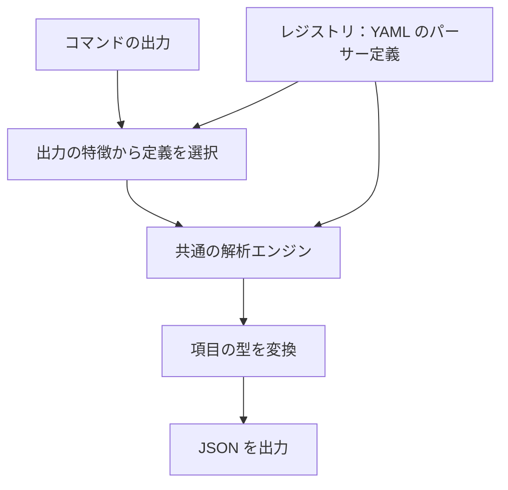

### 前書き：JSON, JSON, JSON...

最近、自作コマンドには必ず JSON 出力機能を追加しています。JSON はソフトウェアにとって扱いやすいフォーマットなので、出力を別のツールから再利用しやすくなります。

当然ですが、世の中の全てのコマンドに JSON 出力機能が搭載されているわけではありません。開発者たちに「JSON 出力をサポートしてください！ソフトウェア同士を連携しやすくするためなんです！」と Issue を出し続けるのは、流石に現実的ではないでしょう。

そこで、コマンド出力、ファイル、入力引数の内容を JSON 化する [nao1215/jsonize](https://github.com/nao1215/jsonize) を作りました。伝統的な JSON 系コマンドに合わせて、コマンド名は 2 文字で "jz" としています。




---

### 基本機能

[Cookbook](https://nao1215.github.io/jsonize/cookbook/) から、基本的な使い方を 4 つ紹介します。例に含まれるコマンド出力の値は、実行環境によって異なります。

#### コマンドから出力を受け取り、JSON 化して出力する機能

各コマンドの出力から自動で構造を判定し、JSON 化します。2026 年 9 月 16 日時点で、224 コマンド・596 種類の出力形式に対応しています。GNU 版・BSD 版・BusyBox 版などの実装差や、オプションによる出力形式の違いにも対応しています。

以下の例では、`df` コマンドの出力をパイプで受け取り、JSON に変換しています。

```shell
$ df -h | jz
[{"filesystem":"/dev/nvme0n1p2","size":"1.8T","used":"1.6T","available":"145G","use_percent":92,"mounted_on":"/"}, ...]
```

パイプを使わずにコマンド出力を受け取る場合は、`jz run` を用います。
```shell
$ jz run df -h
```

#### 必要な項目だけを取り出す機能

JSON 化した結果から必要な項目だけを取り出す場合は、`--extract` を用います。以下の例では、`df` コマンドの出力からマウント先と使用率だけを取り出しています。

```shell
$ df -h | jz --extract mounted_on --extract use_percent
[{"use_percent":92,"mounted_on":"/"},{"use_percent":1,"mounted_on":"/tmp"}]
```

逆に、不要な項目を除外する場合は `--exclude` を用います。

#### CSV ファイルを読み込み、型を指定して JSON 化する機能

`--file` を用いると、ファイルを読み込んで JSON 化できます。拡張子から形式を判定するため、CSV ファイルならパーサーを指定する必要はありません。

例えば、以下の `sales.csv` を読み込みます。

```csv
sku,units
007,12
008,
```

```shell
$ jz --file sales.csv --type units=int
[{"sku":"007","units":12},{"sku":"008","units":null}]
```

CSV の値はデフォルトでは文字列として扱います。`--type units=int` を指定すると、`units` 列を整数として出力し、空欄は `null` になります。型を指定していない `sku` 列は文字列のままなので、`007` の先頭のゼロも残ります。

なお、CSV のほか、TSV、LTSV、YAML にも対応しています。


#### 引数や変数から JSON を組み立てる機能

`jz new` を用いると、コマンドの引数から JSON を生成できます。`=` は文字列、`:=` は数値や真偽値などの JSON の値を指定するために使います。`--path` では、`/` で階層を指定してネストしたオブジェクトを作れます。

```shell
$ MESSAGE='@here: deploy := done'
$ jz new --string "message=$MESSAGE" --path /metadata/labels/app=api replicas:=3
{"message":"@here: deploy := done","metadata":{"labels":{"app":"api"}},"replicas":3}
```

通常の `key=@file` という指定はファイルの読み込みとして扱われます。変数の中身をそのまま文字列として渡したい場合は、上記のように `--string` を用います。これなら、`@` で始まるメッセージも文字列として JSON に格納できます。

---

### jsonize を支える技術

#### パーサーを YAML で管理するレジストリ

jsonize は Go で実装していますが、コマンドごとの読み取りルールは YAML に分離しています。この定義を集めたものが「レジストリ」です。定義には、出力を見分ける条件、表や正規表現による読み取り方法、各項目の型などを記述します。レジストリ形式を採用した理由は、外部コントリビューターがパーサーを書かずに jsonize を拡張できる状態を目指したからです。



例えば、`df` でも GNU 版と BSD 版では出力が異なるため、それぞれの形式を別の定義として管理します。既存の解析機能で表せる形式であれば、Go のコードを変更せず、YAML とテスト用の出力データを追加して対応できます。定義を一意に選べない場合はエラーにして、誤った形式での変換を防ぎます。

標準のレジストリはバイナリに同梱しています。独自の定義も `JSONIZE_REGISTRY_PATH` で追加できるため、社内コマンドへの対応などで jsonize 本体を再ビルドする必要はありません。詳しい追加方法は [Write a parser](https://nao1215.github.io/jsonize/write-a-parser/) にまとめています。

#### 定義のテストを atago の E2E で補う

レジストリに定義を追加したら、`jz test` で保存済みのコマンド出力を読み込み、期待する JSON と一致するか、別の定義が誤って反応しないかを検証します。

さらに、自作の CLI 向けテストランナー [atago](https://github.com/nao1215/atago) で、ビルドした `jz` を実際に動かす E2E（End-to-End）テストを実施しています。Linux・macOS・Windows・FreeBSD の CI 上で、実コマンドや保存済みの出力を使い、選ばれる定義、出力される JSON、標準エラー出力、終了コードを確認します。

#### 標準ライブラリのみを利用

jsonize は、配布物の小型化とサプライチェーンリスクの低減を目的として、標準ライブラリのみで構成しました。当初は、[goccy/go-yaml](https://github.com/goccy/go-yaml) に依存していましたが、一定量の YAML が集まった段階で必要な機能に絞った YAML パーサーを内製しました。



---

### 類似ツール

jsonize と類似の機能を持つ先行ツールを以下に示します。主な役割で比べると、jsonize は `jc + jo` という位置づけです。

| ツール | 主な入力 | JSON を作る方法 |
|---|---|---|
| [jc](https://github.com/kellyjonbrazil/jc) | コマンド出力・ファイル | 入力をパーサーで解析して JSON に変換する |
| [jo](https://github.com/jpmens/jo) | コマンドライン引数 | 引数から JSON を組み立てる |
| [jsonize](https://github.com/nao1215/jsonize) | コマンド出力・ファイル・コマンドライン引数 | `jz` で入力を JSON に変換し、`jz new` で引数から JSON を組み立てる |

開発中に差別化を強く意識したのは `jc` に対してであり、`jo` は途中で存在に気づきました。

---

### 2 文字縛りの JSON 系ツール一覧

下表の通り、JSON 系ツールは 2 文字が多い印象です。3 文字のものや長い名前もありますが。

| コマンド | プロジェクト | 用途 |
|---|---|---|
| `jc` | [kellyjonbrazil/jc](https://github.com/kellyjonbrazil/jc) | コマンド出力やファイルを JSON へ変換 |
| `jd` | [josephburnett/jd](https://github.com/josephburnett/jd) | JSON の構造的な差分取得とパッチ適用 |
| `jf` | [sayanarijit/jf](https://github.com/sayanarijit/jf) | テンプレートと引数から JSON を安全に生成 |
| `jg` | [jawher/jg](https://github.com/jawher/jg) | コマンドライン引数から JSON を生成 |
| `jg` | [gmmorris/jg](https://github.com/gmmorris/jg) | 構造パターンを使って JSON を検索 |
| `jj` | [tidwall/jj](https://github.com/tidwall/jj) | JSON 内の値を取得・更新 |
| `jl` | [chrisdone-archive/jl](https://github.com/chrisdone-archive/jl) | 関数型 DSL で JSON を検索・加工（アーカイブ済み） |
| `jo` | [jpmens/jo](https://github.com/jpmens/jo) | シェルの引数や標準入力から JSON を生成 |
| `jp` | [jmespath/jp](https://github.com/jmespath/jp) | JMESPath 式で JSON を検索・変換 |
| `jp` | [sgreben/jp](https://github.com/sgreben/jp) | JSON や CSV のデータをターミナル上にグラフ表示 |
| `jq` | [jqlang/jq](https://github.com/jqlang/jq) | JSON の抽出・フィルタリング・変換 |
| `jv` | [maxzender/jv](https://github.com/maxzender/jv) | JSON をターミナル上で閲覧 |
| `jx` | [sqwxl/jx](https://github.com/sqwxl/jx) | JSON ドキュメントを対話的に探索 |
| `jz` | [nao1215/jsonize](https://github.com/nao1215/jsonize) | コマンド出力・ファイル・引数から JSON を生成 |

---

### 最後に：jsonize の今後

jsonize は、人間向けに出力されたテキストを JSON に変換し、jq をはじめとする既存のツールへ橋渡しするグルーコマンドとして開発しています。

対応するコマンドや出力形式は、今後も追加していきます。普段使っているコマンドが未対応だった場合は、Issue で知らせてもらえると嬉しいです。パーサー定義の追加を含む Pull Request も歓迎しています。
