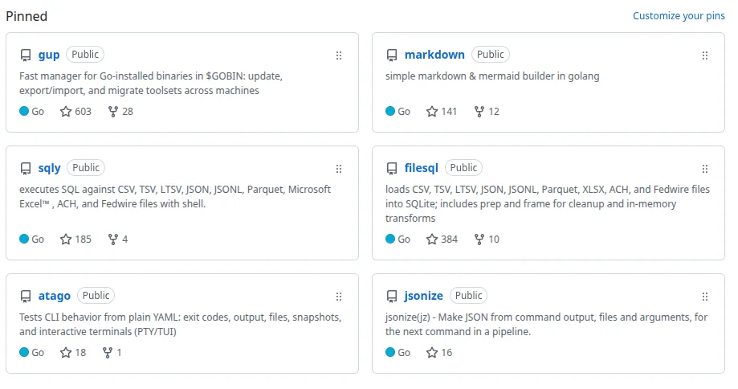
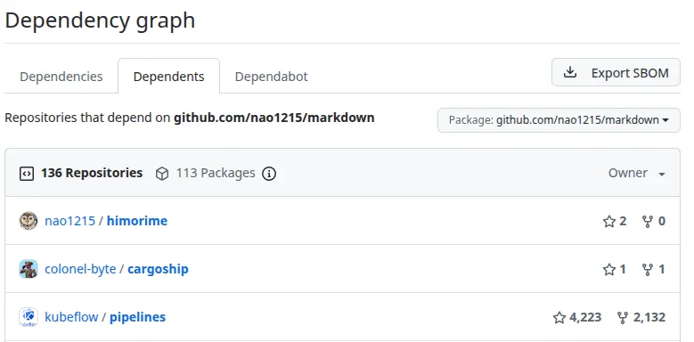

### Claude for Open Source に応募した話

本記事では、[Claude のキャンペーン](https://claude.com/contact-sales/claude-for-oss)に応募した際の申請文を共有します。申請から1ヶ月ほど経ちましたが返事はなく、サイレント不採択ではないかと予想しています。

---

### 応募条件（Who should apply）

以下が、Claude for Open Source の応募条件（英語、日本語）です。申請時点（2026年8月23日時点）の内容のため、現在は条件が異なる可能性があります。



- ‍Maintainers and library authors: You maintain packages that others build on: 500 or more dependent repos, 100 or more dependent packages, or 200,000 or more combined monthly downloads across any registry (npm, PyPI, crates.io, RubyGems, or similar)
- Core contributors: You're a listed committer or maintainer on a recognized foundation or language project: CPython, Rust team, Node.js TSC, Apache PMC, CNCF, Kubernetes, Linux kernel, Django, Rails, or similar
- Active contributors: You've authored 100 or more pull requests merged into repos you don't own in the last 12 months
- Community builders: One of your repos has had 20 or more unique external contributors with merged pull requests in the last 12 months
- Critical infrastructure: Any repo you maintain has an OpenSSF criticality score of 0.4 or above





- メンテナー・ライブラリ作者：他の開発者が利用するパッケージを保守しており、依存リポジトリが500以上、依存パッケージが100以上、または各種レジストリ（npm、PyPI、crates.io、RubyGemsなど）における月間ダウンロード数の合計が20万以上である
- コアコントリビューター：CPython、Rustチーム、Node.js TSC、Apache PMC、CNCF、Kubernetes、Linuxカーネル、Django、Railsなど、著名な財団・言語プロジェクトにコミッターまたはメンテナーとして名を連ねている
- アクティブコントリビューター：過去12カ月間に、自分が所有していないリポジトリへ送ったプルリクエストが100件以上マージされている
- コミュニティ形成者：所有するリポジトリのいずれかで、過去12カ月間に20人以上の外部コントリビューターによるプルリクエストがマージされている
- 重要インフラのメンテナー：管理するリポジトリのいずれかが、OpenSSF Criticality Scoreで0.4以上を獲得している



---

### 申請者のステータス

私は、[メンテナンスを継続している OSS が30個以上](https://github.com/nao1215)ありますが、下図に示す通り有名な OSS をまだ生み出せていません。言い換えると、「あのツールの作者ね！」という領域に達せていません。また、他の人が管理する OSS に対して積極的に貢献をしないタイプのエンジニアであり、一人で黙々タイプです。

Claude for Open Source の応募条件を満たしているのは、ビルダーパターンで Markdown を組み立てる [nao1215/markdown](https://github.com/nao1215/markdown) ライブラリでした。申請時点の GitHub Dependency graph では、130の依存リポジトリと105の依存パッケージが表示されており、「100 or more dependent packages」の条件を満たしていると判断しました（下図は本記事執筆時点）。なお、この数値には fork 由来のパッケージなどが含まれる可能性があり、独立した採用プロジェクト数を示すものではありません。

markdown は、以下に示すような著名企業・組織のリポジトリで利用されているので、この点を強調した申請文（後述）を書きました。

- [Argo Workflows](https://github.com/argoproj/argo-workflows)：ドキュメント生成、Telemetry、変数処理など5パッケージで直接利用
- [Azure/alzlib](https://github.com/Azure/alzlib)：Azure Landing Zones 関連の公式ライブラリ
- [Snyk/user-docs](https://github.com/snyk/user-docs) — Snyk公式ドキュメントの生成処理で利用

---

### キャンペーン応募時の申請文

申請文の方向性としては、nao1215/markdown が様々なプロジェクトで利用されていると説明しつつ、他の OSS 開発も精力的に行っているとアピールしました。

#### Q. Tell us about the project's reach and impact: e.g. download numbers, GitHub activity, who depends on it, or the gap it fills in the ecosystem.（プロジェクトのリーチと影響について教えてください。例えば、ダウンロード数、GitHubでの活動状況、依存しているユーザー、エコシステムにおけるその役割などです。）



GitHub’s dependency graph currently shows 130 dependent repositories and 105 dependent packages for `github.com/nao1215/markdown`.

Some of the projects using it directly include Argo Workflows, `Azure/alzlib`, and KubeVirt’s `project-infra`. They all currently list `github.com/nao1215/markdown` in their Go module dependencies.

The library provides a simple API for generating Markdown directly from Go code without using templates. It also supports 24 Mermaid diagram types, which makes it useful for generating documentation, reports, and diagrams from Go programs.

The repository has around 135 stars, 11 forks, and nearly 300 commits. I continue to maintain the library, add support for Markdown and Mermaid features, fix bugs, and keep the documentation and tests up to date.

I originally built it because I wanted a straightforward way to generate Markdown programmatically in Go, and it has since been adopted by a number of other Go projects.





GitHub の依存関係グラフでは現在、`github.com/nao1215/markdown` に130の依存リポジトリと105の依存パッケージが表示されています。

直接利用しているプロジェクトには、Argo Workflows、`Azure/alzlib`、KubeVirt の `project-infra` などがあります。いずれも現在、Go モジュールの依存関係に `github.com/nao1215/markdown` を含んでいます。

このライブラリは、テンプレートを使わずに Go のコードから直接 Markdown を生成するためのシンプルな API を提供しています。また、24種類の Mermaid ダイアグラムに対応しており、Go プログラムからドキュメント、レポート、図を生成する用途にも利用できます。

リポジトリには約135のスター、11のフォーク、約300件のコミットがあります。現在も継続してメンテナンスしており、Markdown や Mermaid の機能追加、バグ修正、ドキュメントとテストの更新を行っています。

もともとは、Go からプログラムで Markdown を生成するための分かりやすい方法が欲しくて開発しました。その後、さまざまな Go プロジェクトで利用されるようになりました。



#### Q. How will you use the subscription for your project?（プロジェクトでこのサブスクリプションをどのように活用しますか？）



I’ll use Claude mainly for maintaining and developing `nao1215/markdown`: reviewing changes, investigating bugs, improving tests, and adding support for new Markdown and Mermaid features.

I also maintain several other open source projects, mostly written in Go, and expect to use Claude for similar maintenance work across those projects as well. This includes code review, debugging, testing, documentation, and larger refactoring work.

Since I maintain these projects mostly on my own, having Claude as an additional reviewer would be particularly useful for catching mistakes and maintaining quality as the projects evolve.





Claudeは主に、`nao1215/markdown` の保守・開発に利用する予定です。変更内容のレビュー、不具合の調査、テストの改善、新しい Markdown および Mermaid 機能への対応などに活用します。

また、Go を中心に書かれた複数のオープンソースプロジェクトも保守しており、それらでも同様に Claude を利用する予定です。具体的には、コードレビュー、デバッグ、テスト、ドキュメント作成、大規模なリファクタリングなどです。

これらのプロジェクトはほぼ一人で保守しているため、追加のレビュアーとして Claude を活用することは、ミスを発見し、プロジェクトの発展に伴って品質を維持するうえで特に有用だと考えています。



#### Q. Other info（その他の情報について教えてください）



I also maintain several other open source projects, mainly in Go, including gup, filesql, sqly, and atago.  Some of these projects have been adopted by the wider Go ecosystem. For example, gup has around 600 GitHub stars and is distributed through package managers such as Homebrew, WinGet, mise, Nix, and aqua. filesql and sqly are also listed in Awesome Go.

I maintain these projects independently, including implementation, releases, CI, testing, documentation, dependency updates, and security-related maintenance. I expect to use Claude across this broader OSS maintenance work in addition to `nao1215/markdown`.





私はほかにも、gup、filesql、sqly、atago をはじめとする、主に Go で書かれた複数のオープンソースプロジェクトを保守しています。その一部は、Go のエコシステムで広く利用されています。たとえば、gup は GitHub で約600スターを獲得しており、Homebrew、WinGet、mise、Nix、aqua などのパッケージマネージャーを通じて配布されています。また、filesql と sqly は Awesome Go にも掲載されています。

これらのプロジェクトでは、実装、リリース、CI、テスト、ドキュメント作成、依存関係の更新、セキュリティ関連の保守をすべて個人で行っています。`nao1215/markdown`に加えて、こうした幅広い OSS 保守作業にも Claude を活用する予定です。



---

### 最後に：Claude for Open Source に応募した理由

LLM 代を毎月支払い続けたくないから。

[過去の週報](/weeknotes/2026-07-13/725f9360a38c/)でも書きましたが、なるべく LLM を使わないようにしています。LLM サブスクを1〜2週間ほど解約してから再開するのを繰り返して、少しでも支払う総額を減らしています。

昨年から今年7月頃までは、LLM の有料プランを継続的に利用しており、毎月130 USD（Claude 110 USD、Codex 20 USD）を支払っていました。単純計算で、年換算では「130 USD × 12ヶ月 = 1560 USD」。ドル円レートが155円／USDであれば、241,800円です。円安が進めば、もっと高くなります。

私は他の人よりも OSS 開発をするので、「趣味の代金として約24万は安いのでは？」という見方もあります。しかし、頭の中で「年5%で年間24万円を積み立てると、10年で約302万円、20年で約794万円」と考えてしまいます。24万は家族旅行できる金額ですしね。
