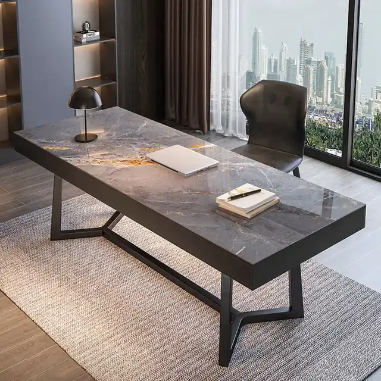
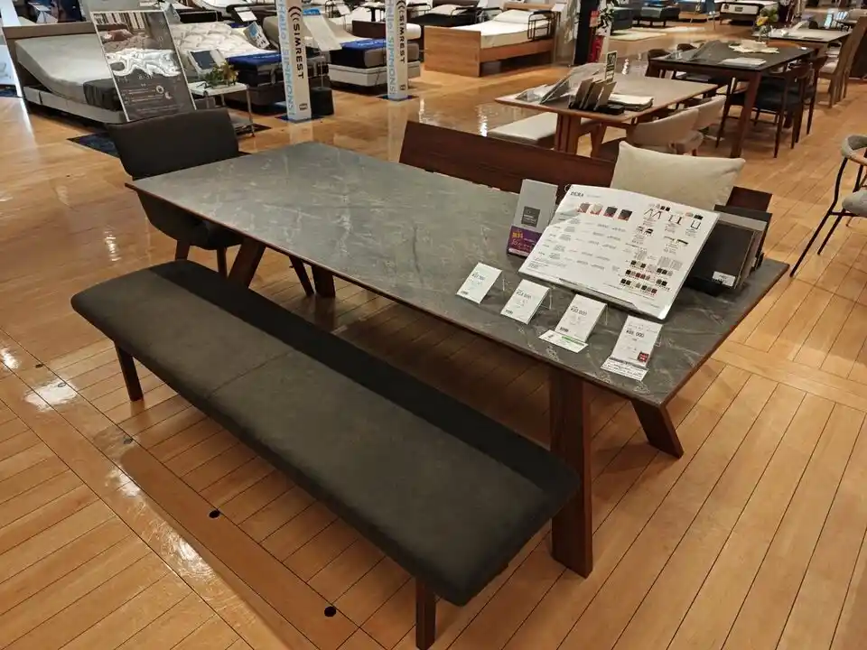

#### GitHub Sponsors の使い道

GitHub Sponsors を循環させることにした。つまり、私が合計5ドルのスポンサーを受けたら、私が他の人（複数）に合計5ドルのスポンサーを行う。自分のためにお金を使わない理由は、二つある。一つは、GitHub Sponsors が獲得できるレベルの OSS がリリースできた事実だけで嬉しいこと。もう一つは、他の人のOSS開発モチベを上げたかったこと。私だけかもしれないが、GitHub Sponsors を獲得できるとテンションが上がる。その気持ちを他の人にも分け与えたかった。

実行に移すには、スポンサー費用の予算決めが必要になる。年間予算を決めるより、自分が受け取った分を予算とする方式が分かりやすく、後腐れもない。プラマイゼロなので、心置きなく支払える（税金の分だけマイナスになる気もするが）。ここでの問題は、誰かが万単位の投げ銭を私に送ってきた時、他の人に迷わず寄付できるかである。人間性が試される。

この問題に直面できるようになるまで、OSS 開発を続けていきたい。

---

#### 古典的ディズニー作品に対する所感

息子と何度もピーターパンを見ているが、好きではないディズニー作品の一つだ。

登場人物に問題がある。怒鳴り声をあげるキャラが多いし、主人公のピーターパンも性格がクズ寄りで感情移入しづらい。ストーリーも夢があると言えば聞こえがいいが、典型的な「青い鳥」の構造で、ネバーランドへ行って戻ってくるだけの流れだ。子供から大人への階段を上るウェンディがネバーランドの現実を知って、永住せずに戻ってくる。ウェンディを理性的な大人として際立たせるために、他のキャラが幼稚で残酷な面を見せがちだ。ポッと出の人魚ですらイジメっ子のような振る舞いをする。ピーターパンがウェンディを放置プレイする描写も多い。不快なシーンが多い映画だ。

---

#### GitHub Release の利用者

GitHub Release からバイナリダウンロードする人など居ないと考えていたが、調べたら結構居た。やはり gup が強い。gup 誕生から4年以上経過したが、未だに同等の OSS を生み出せない。mimixbox や jose が意外とダウンロードされている理由が分からない。jose は開発者である私が、複雑なオプション体系にキレて使いこなせなかった過去がある。

| OSS      | Downloads |
| -------- | --------: |
| [gup](https://github.com/nao1215/gup)      |       45k |
| [sqly](https://github.com/nao1215/sqly)     |      4.5k |
| [mimixbox](https://github.com/nao1215/mimixbox) |        2k |
| [atago](https://github.com/nao1215/atago)    |      1.5k |
| [jose](https://github.com/nao1215/jose)     |      1.4k |
| [truss](https://github.com/nao1215/truss)    |       179 |
| [omokage](https://github.com/nao1215/omokage)  |        32 |
| [career](https://github.com/nao1215/career)   |         1 |

---

#### 仕事机の新調を検討

仕事机を新調したい。理由は、リモートワークで自室に一日中籠もっているので、テンションが上がる環境を作りたくなってきたからだ。石目柄が欲しい。Indoorplus で[候補](https://indoorplus.jp/collections/desk/products/7866352468215?variant=43665922883831)を見繕った（下画像）。

私の性格上、一生使う気がするので実物を見たい気持ちが強く、東京インテリアあたりで他候補も探す予定だ。見た目、横幅、奥行き、モニターアームが使えるかがポイントだろう。一応、壁掛けできる状態にしてあるが、可能な限り壁に穴を開けたくない。机と椅子の両方で予算30万と考えている。しかし、納得いくものと出会えなければ、安物になるかもしれない。探しすぎると、見た目ではなくて無骨な機能美を優先してしまいそうだ。

この文章を書いた次の日に東京インテリアに出向いたが、見た目と奥行きの感じではダイニングテーブルが意外と良さそう。値段も10万ぐらい。部屋まで搬入できない可能性はある。

---

#### ラズパイクラスタの存在を思い出す

フラー時代の知人が[自宅で Kubernetes 環境を建てて](https://blog.zitaku.net/2026/07/12/index.html/)おり、この記事を読んでから暫くして自分も[2020年頃にラズパイクラスタを組んでたこと](https://debimate.jp/post/ja/2020-09-27-%E7%92%B0%E5%A2%83%E6%A7%8B%E7%AF%89raspberry-pi-4%E5%8F%B0%E3%81%A7%E4%BD%9C%E3%82%8Bkubernetes%E3%82%AF%E3%83%A9%E3%82%B9%E3%82%BF/)を思い出した。完全に余談だが、フラー時代の知人とは8/1に飲む予定。

ラズパイクラスタの記事を読み返すと、2020年頃は紛うことなき社畜だった（年間600時間以上残業していた）はずなのに元気そうなツイートしていて怖い。自宅 Kubernetes の可能性に関してエアロバイクを漕ぎながら思いを馳せたが、クラスタ PC 1台あたりのパワーが低いので使い道がない。自宅で欲しいサーバーと言えば、ファイルサーバーかメディアサーバー。しかし、NAS で十分だ。最近の NAS は Docker が動くらしいので、十分すぎるだろう。Kubernetes を使うことを目的にしない限り、用途が本当に無い。

ただし、私はクラスタを作ることには楽しさを感じている。組み立てや環境構築が楽しい。

---

#### 日報より週報

週報を書き始め、分量を見ると日報でイケるのではないかと感じる。しかし、毎日確実に文章を書けるわけではない。1日でも日報を書き逃すと、やる気を失ってしまう。週報は1週間に1回でも何かを書けば、成功と言える。この緩さが続けやすさに繋がる。その時に感じていたことをダンプしておくと、数年後に読み返した時に懐かしく思える。未来の自分の楽しみのために、週報をせっせと書き溜めている。あと、作文能力を維持するために、自分の言葉で文章を書く行為は続けていきたい。

文章と言えば、技術評論社から「[Software Design for Beginners④ UNIXシェルスクリプト入門](https://gihyo.jp/book/2026/978-4-297-15764-7)」が出版予定であり、私が書いた過去記事が再録されている。読み返してみると、論文的に順を追って説明していくスタイルよりも、最初に読者の心を掴む構成の方が好ましかったと反省するなど、改善したい点はあった。LLM ばかりに文章を書かせていると、構成に対する審美眼は磨かれないだろう。

30代の間に、分厚い技術書を一冊書きたい。シェル系は既にネタ切れなので、別ネタで攻めたい。

---

#### 仕事机の現物確認 again

再び東京インテリアに出向き、幅210cm×奥行90cm×高さ70cmの机に決めた。高さがやや低く、デザインもベストではないが、当初予定よりも10万以上安い9.1万円（送料・組み立て料込）なのでヨシとした。不満があれば10年以上経ったら買い直す。椅子は購入していない。後は音響やデスクトップ周りの小物を整えたい。ダイニングテーブルであり、コンセントがないため、スマホ用の充電確保をどうするか検討中。USB 給電できるモニターに買い替える手もある。モニターは現行がウルトラワイド34インチで、このサイズ付近は5万前後。40インチを目指すと20万を超え始め、即断できない。ウルトラワイド2枚使う案もあるが、かなり横に長くなるので、アームを使って縦に並べる等の工夫が必要になる。

---

#### 大凧とその歴史

父親、息子と一緒に[ふるさと村](https://furusatomura.pref.niigata.jp/)、[しろね大凧と歴史の館](https://shirone-otako.com/)、[ガスト](https://www.skylark.co.jp/gusto/)へ行った。凧はふるさと村にもあるのだが、新潟で凧を見かける歴史的な経緯を知らなかった。帰宅後に調べたら、信濃川の支流である中ノ口川（川幅約80m）の両岸から大凧を揚げ、空中で絡ませて川に落とす伝統的な凧合戦があるらしい。この凧合戦の起源がただのご近所トラブルだった。ご近所トラブルも時間をかければ、伝統になる。なお、息子は凧の絵にビビって、大凧に近づかなかった。

> この凧合戦は、江戸時代の中頃、中ノ口川の堤防改修工事の完成祝いに、白根側の人が凧を揚げたところ、対岸の西白根側に凧が落ち、田畑を荒らしたことに腹を立てた西白根側の人が、対抗して凧を白根側にたたきつけたことが、起源と伝えられています。
> 出典：白根大凧合戦, https://www.shironekankou.jp/kite_battle/
