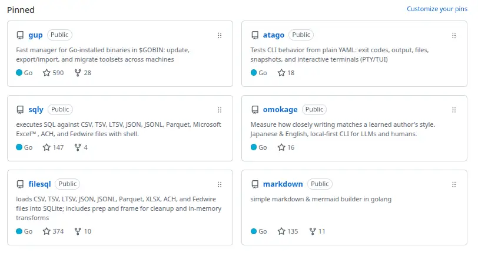

#### ブログの見た目を改善

最近はブログ（debimate）を整えている。例えば、以下のような内容をチマチマ設定していた。
- XServer からの移転時に対応していなかったリダイレクトを設定
- About ページを追加
- ページの横幅を調整

急にブログに力を入れ始めた理由は、SNS（特に X）から離れたいこと、ブログは自分好みに変更しがいがあることだ。X は、収益配分が導入されてから眉をひそめるようなポストを見かける頻度が増えた。問題発言をした方が稼ぎやすいので、人々の行動が負の方向へ最適化されている。「いや、あなたは現実世界でもその振る舞いされているんですか？」と尋ねたくなる人がいる。勿論、良い人もいる。趣味に全力の人も存在して、心温まるポストに遭遇する機会はゼロではない。しかし、不快なポストを見る機会の方が圧倒的に多いので、X から離れることにした。

X に比べると、ブログはほぼ無風だ。誰が読んでいるか分からない（と言いつつ、Google Analytics を導入しているため、Page View 程度は取得している）。ブログは週報と学習記録を残せるので、何でもかんでも記録したい私の性に合う。ブログでは書き散らせるが、SNS では他人の目を気にしてしまう。

---

#### アイマスの進化に驚く

私は、[Gleam 言語](https://gleam.run/) に一時期ハマり、[18パッケージをリリース](https://hex.pm/users/nao1215)した。ここから話が急に変わるのだが、Gleam 界隈で有名な方がアイマスユーザーである。私は、その方のポストを見て、思い出したかのようにアイマスを数ヶ月視聴していた。私がアイマスに触れていたのは2010年前後で、本編は PSP でプレイした筈だ。すぐ止めた記憶がある。

私はアイマスファンというより、二次創作を楽しむ派だった。ニコニコ動画で NovelsM@ster（例：ぷよm@s）を頻繁に見ていた。そんな私が約15年ぶりにアイマスコンテンツに触れ、[シャニソン](https://shinycolors-song-for-prism.idolmaster-official.jp/)の動画をリピートしている。昔と比べてアニメ調の3Dモデルが自然に表現されており、MV のカメラワークが現代的になったと感じる。特に「[快盗Vを見逃すな](https://youtu.be/5jnVYppFt48)」あたり。技術の進歩と時代の流れについて、現職の方と「このクオリティがスマホで動くのは凄い」「（集金的な意味合いで）昔よりも露出度上がってません？」などと、一方的に話した。昔より男性向けゲーム感が強まったのは、気の所為ではないはず。

残念ながら、私はスマホゲーをプレイする気力がないので、MV を見るだけでマネーを落とさないユーザーである。開発者の端くれなので、開発の労力を考えると課金しないことに罪悪感がある。昔は、ベスト盤 CD ぐらい購入していたのだが、最近は Spotify で完結してしまう。

---

#### sqly が複数の SQL 方言に対応できることに気づく

仕事で [goccy/bigquery-emulator](https://github.com/goccy/bigquery-emulator) を眺めていた時、大雑把な仕様が「BigQuery の SQL 方言（ZetaSQL クエリ）を受け付け、SQLite 方言に変換して SQLite（DB）にクエリする」だと知った。この仕様を自作 OSS へ横展開できることに気づいた。「[nao1215/filesql](https://github.com/nao1215/filesql) と [nao1215/sqly](https://github.com/nao1215/sqly)  を同じ仕様で拡張して、任意の SQL 方言でクエリを実行できるのでは？」と。

知らない読者向けに説明すると、filesql は任意のファイルフォーマットを SQLite3 に取り込むライブラリであり、sqly は filesql を用いてファイルに SQL を実行するコマンドである。sqly（filesql）は、SQL パーサーの実装が難易度高かったので、SQLite3 にパースを委譲している（[詳細は実装当時の記事を参照してください](https://debimate.jp/post/ja/2022-12-02-golangcsvtsvltsvjson%E3%81%ABsql%E3%82%92%E5%AE%9F%E8%A1%8C%E3%81%99%E3%82%8Bsqly%E3%82%B3%E3%83%9E%E3%83%B3%E3%83%89%E3%82%92%E4%BD%9C%E3%81%A3%E3%81%9F/)）。sqly は実装当初から [noborus/trdsql](https://github.com/noborus/trdsql) などの先発ツールに負けており、trdsql は MySQL や PostgreSQL とも接続できる強みがあった。安易に真似すると RDBMS サーバーをセットアップする労力がかかるので、私は避けていた。しかし、SQL 方言間の変換であれば、環境構築の労力が増えないので許容でき、ユーザーは使い慣れた SQL を実行できるメリットがあると判断した。現在、お試し実装中である。

なお、filesql は巨大なライブラリに成りつつあり、v1.0.0 前に API を整理するかもしれない。どうせ誰も filesql を使っていないので、気軽に変更できる。金融専用のフォーマットを導入した辺りでカオスになった。

---

#### 意図的に v1.0.0 を目指す

以前、Claude に OSS 開発の戦略を尋ねた時に「v1.0.0を目指せ」と言われた。確かに、私は滅多に v1.0.0 を付けようと考えない。理由は単純で、API 互換性を維持するコストがかかるからだ。

しかし、v1.0.0 を目指す過程でインターフェースが洗練され、無駄な機能を落とし、リファクタリングや QA の追い込みをかけ、ドキュメンテーションを磨き込む作業が始まる。2026年中に、少なくとも GitHub でピン止めしている OSS（下図）は v1.0.0 を目指そうと考えている。CLI は、GitHub Pages でドキュメントサイトを公開する方針として、[gup](https://nao1215.github.io/gup/)、[sqly](https://nao1215.github.io/sqly/)、[atago](https://nao1215.github.io/atago/) は公開済みである。Example や Cookbook を用意しており、それらが実装と乖離していないことを CI でチェックしている。sqly や atago は対応範囲が広がり、ドキュメントを読まなければ全体像を把握しにくくなっている。正直、機能過多であり、洗練させたい。

昔は UNIX 哲学の「一つのことをうまくやるプログラムを書く」を意識していたが、段々とユーザー獲得のために機能を増やしてしまった。作った機能が結果的に使われないことはある。しかし、その機能を残し続けるか、削るかは適宜判断しなければならない。その前提で、まずは sqly v1.0.0 を目指す。

---

#### 東京出張

泊まりで東京出張。ついでに知人と会う。新幹線に乗ったら、持ってきた USB が Type-C ではなくて Micro USB だったことに気づいた。流石にスマホ充電が保たないので、コンビニか電気屋で仕入れる予定。

前日の食事は、昼に[丸亀製麺](https://jp.marugame.com/menu/)、夜に[グラッチェガーデンズ](https://www.skylark.co.jp/grazie_gardens/)。どちらも嫁不在で、息子と一緒に行った。息子は、長い夏休み。親は、3食用意しなければならないハードモード。料理する元気がないので、外食を選んだ。贅沢だ。なお、外食ローテーションをしたかっただけで、丸亀もグラッチェガーデンズも好きではない。どちらも翌日に腹痛を起こす確率が高い。今回も腹痛になった。うどんはともかく、ピザと相性が悪い。適正量が掴めない。チーズが駄目な説がある。さらに言えば、ダイエット中なのに食べ放題を選択して、息子と一緒に原価安そうなポテトを食べて、カロリー気にしてドリンクバーでコーヒーを選択する奇行をしていた。出張前日で早めに寝たかったのに、23時まで寝付けなかった。出張自体は、つつがなく終了した。出張する必要性は感じなかった。

出張翌日の土曜日は、飲み会の開始時刻である18時まで時間を潰す必要があった。五反田のホテルから渋谷の Nintendo TOKYO へ移動し、ナビィ×2個、ムジュラの仮面1個、コップ1個を買った。ナビィは息子が使う公文のカバンにつける予定。残りは自室に保管する。その後、上野の国立科学博物館を見て回ったが、渋谷での日光ダメージが大きすぎて詳細を鑑賞する元気がなかった。それにしても、科博のような文化的なものを気軽に見れる関東圏の人が羨ましい。上野を歩いてて感じたが、上野動物園と科博は近いので、息子と一緒に楽しめそう。



飲み会の会場である北千住へ移動する際、駅ホームを間違えたので秋葉原のゲーセンで時間を潰した。3カ所ぐらいハシゴし、レトロゲームが置いてあるゲーセンに感動した。格闘ゲーム・シューティングが豊富に置いてあり、対戦相手もいた。最近のクリーンなゲーセンではなく、薄暗いが活気のあるゲーセンがそこにはあった。10年ぶりぐらいにウルⅣをプレイし、本田使いと対戦した。勝ち目はなかった。

時間が余りまくっていたので、人生で初めてアーケードのドンキーコングをプレイした。難易度が丁度良く、やり込まないと最後のステージまで辿り着かなそうな雰囲気だった。実際、数コインでは100m（ステージをメートルで表すようだ）までしかいけなかった。なお、🛢️の初出がアーケードドンキーだと初めて知った。このようなテーブル型の筐体で、たまにピコピコする環境が欲しい。調べたところ20〜30万程度は費用が必要。DIY するしかないか。



飲み会は元フラーが4名、現フラーが1名という謎の会合であった。私だけ新潟民なので、そそくさと帰った。上野から新幹線に乗ったら、長岡花火の前乗り組がいたのか、最初の1時間は座れなかった。飲み会での会話は近況報告で、AI の使い方はそんな感じに落ち着くよね、という感じだった。

私は飲み会に参加する前に疲れ切っていて、LUMINE のレストランフロアで唯一空いていた「とんかつ新宿さぼてん」で休憩がてらカツカレーを食べてしまい、飲み会で「お腹空いてない」と謝罪する羽目になった。東京の居酒屋に行く度に、変なメニューの店が多いなと感じる。新潟は正統派の素材で殴る系が多いので、東京は奇をてらっている感がある。恐らく、金額帯を上げていかないと、正統派の居酒屋に遭遇しないのだろう。あと、ハイボールが薄い。酔いが覚める。アルコールが感じられない。
