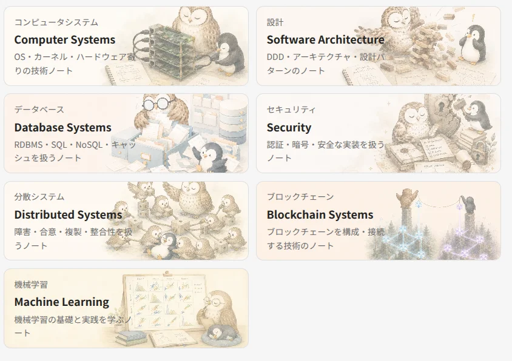
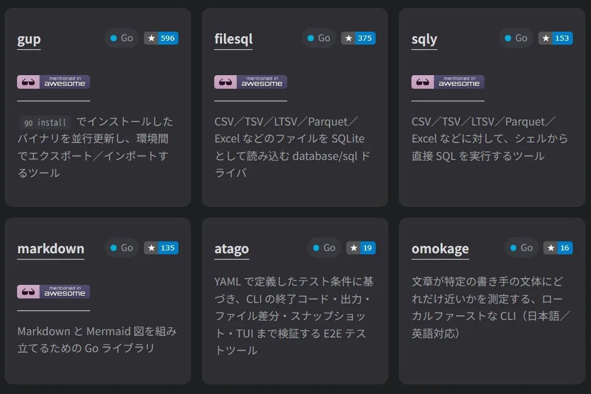
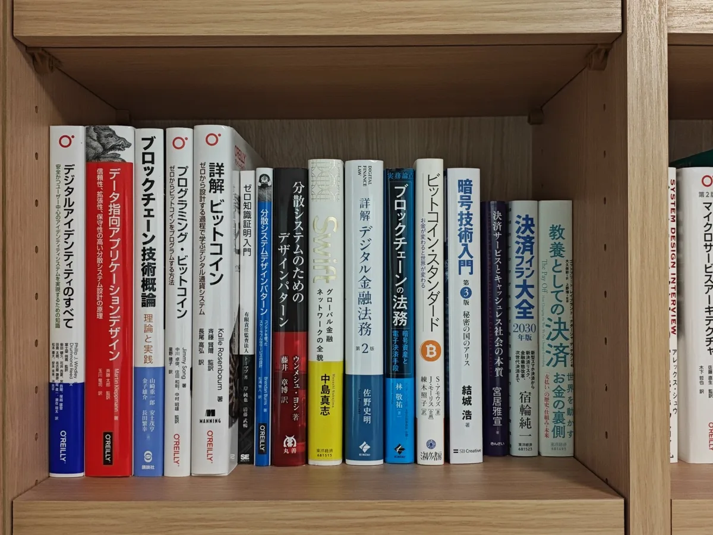

#### sqly v1.0.0 リリース

初回リリースから約3年9ヶ月で、[sqly](https://github.com/nao1215/sqly) は v1.0.0 となった。[gup](https://github.com/nao1215/gup) と比較して、非常に難産であった。1ヶ月近くバグ修正をしていた気がする。E2E テスト1000件超えが機能の複雑さを表している。以下の v1.0.0 リリース報告記事を書いてから、「いつになったらバグ取り終わるんだ。リリースできん」と思いながら作業を続けていた。おかげさまで、sqly と記事を同時リリースできた。準備が良かった訳ではなく、バグが多かっただけだ。

記事：[【Golang】CSV／JSON／Excel／Parquet に SQL を実行する sqly を約4年かけて v1.0.0 にした](https://debimate.jp/post/ja/2026-08-09-golangcsvjsonexcelparquet%E3%81%ABsql%E3%82%92%E5%AE%9F%E8%A1%8C%E3%81%99%E3%82%8Bsqly%E3%82%92v1.0.0%E3%81%AB%E3%81%99%E3%82%8B%E8%A9%B1/)

gup、sqly は息子が産まれた歳に開発した OSS の中で、唯一メンテナンスを続けている。他の同級生 OSS は、Public Archive してある。バックエンドエンジニアとして未熟な時期に sqly を開発したので、「当時の自分がこの設計をよく思いついたな」と感じる部分が多々ある。sqly は取り扱う題材が SQL なので、陳腐化せずに長く開発を続けられる筈だ。ここまでたどり着くのに結構コストかけているので、GitHub Star が付くことを祈る。無風は、キツイ。

---

#### フライパンを壊した

ティファール深型の炒め鍋（26cm）の取っ手がすっぽ抜けた。5〜6年の利用だっただろうか。最近は餃子が引っ付きやすく、買い替え時期が近そうだった。しかし、洗っている最中に取っ手が取れるとは。引退試合が用意されている選手ばかりではないと、どこぞの野球選手が話していたことを思い出した。私は、このフライパンの引退日が今日だとは考えもしなかった。

---

#### 技術ノートを地道に作成

[技術ノート](https://debimate.jp/notes/)のページに、今まで書いた記事のリンクを貼ったり、新規ノートをチマチマ追加している。記事とノートの違いだが、記事は私が主語であり、ノートは技術が主語である。[Computer Systems](http://debimate.jp/notes/computer-systems/) は、完全に過去記事リンク集だが、20代の頃（組み込み時代）の努力が可視化されていて好きだ。もう二度とデバイスドライバを書くことはないと思うが。

下図が現状の技術項目だ。自分の経験や興味のある分野、仕事で使う分野がピックアップされている。既に多い。ネットワークやクラウドインフラも思い浮かんだが、無邪気に追加すると泣きを見そうだったので止めた。Web フロントやモバイルが追加される日は来るのだろうか。マネージメントは追加される可能性がある。

自然言語（日本語）で技術ノートを残すのは、コードを書くより大変だ。テストで動作確認できないから、端から端までチェックする必要がある。雑に公開できる技術ノートならまだしも、Software Design のような雑誌に寄稿する時は本当に何度も何度も読み返している。魂を込めている。

詳しくない分野の技術ノートを作成し続けていると、技術に対する理解度の低さが露呈する。とは言え、技術ノートを賑やかす活動もある種の勉強であり、一つずつ理解しようとする姿勢が大事だと考えている。続けていけば、ある日ふと概念を体得できるだろう。私は他の人よりも腑に落ちるまでが長い。直ぐに血肉にならない。書籍を読んで実践で試して自分の言葉にしても、分かった振りを続けている感覚がある。なので、読み書きを繰り返す。

---

#### AI 時代、弱小開発者は OSS の宣伝が難しい

2022年頃は、何らかのペインを解消する OSS を実装すること自体が難しかった。Hacker News や Reddit で告知すれば、それなりの反応が得られた。 2026年現在は、AI を使えばツール作成なんて数日あれば完成してしまう。そんな有象無象を告知しても、無反応か、辛辣な言葉が返ってくるか、AI Slop としてシステムに弾かれるだけだ。sqly がまさにこの状況だ。Reddit に投稿すればシステムに弾かれるし、厳しいコメントもあった。

> [DuckDB](https://duckdb.org) does all of this and it wasn't vibe-coded in a week by one person. Sorry.  
>
> 訳：[DuckDB](https://duckdb.org) にはこれらすべての機能が実装されていますが、これは1人が1週間でバイブコーディングしたものではありません。ごめんなさい。

このコメントは、機能差異・開発期間の認識が正しくない。「sqly は DuckDB にない機能があるし、年単位開発したんだよ！」という気持ちが先立った。しかし、今後の開発方針に大いに影響を与えるコメントであることも確かだ。LLM 時代は、類似ツールが存在する状況下で、機能差異の少ない OSS を作ることの価値が相対的に下がってしまった。

今後の OSS 開発では、一言で説明できる強み、複数人での開発体制、AI に支配されないエコシステムを構築しなければならない。AI に対して拒否反応をもつユーザーが多い中で、信頼感を獲得するムーブが大事だ。信頼されないと、見向きもされない。既に有名な開発者は「新作 OSS だ！」と注目されるだろうが、私のような弱小開発者は開発以外に力を入れて勝負しなければならない。ﾅﾝﾀﾞｺﾚ、ｼｺﾞﾄ ｶ?

---

#### [nao1215/markdown](https://github.com/nao1215/markdown) が argo に組み込まれていることを知る

次なる v1.0.0 候補を探している最中に、nao1215/markdown ライブラリの利用者が Used by 表示されていること（下図）に気づいた。このライブラリは、ビルダーパターンで Markdown を組み立てる。テンプレートのように部分的に文字列を置換するのではなく、上から下に向かって Markdown を構築するイメージだ。

驚きだったのが、nao1215/markdown が Azure と KubeVirt、Argo で利用されていたことだ。有名どころばかりだ。以下のプロジェクトで利用されていた（他にも利用されていたが、割愛）。
- [argoproj/argo-workflows](https://github.com/argoproj/argo-workflows)
- [Azure/alzlib](https://github.com/Azure/alzlib)
- [kubevirt/project-infra](https://github.com/kubevirt/project-infra)

Argo に至っては、生成した Markdown を HTML に変換して[トレーシングリファレンス](https://argo-workflows.readthedocs.io/en/latest/tracing/)、[コンフィグマップリファレンス](https://argo-workflows.readthedocs.io/en/latest/workflow-controller-configmap/)、[ワークフロー変数カタログ](https://argo-workflows.readthedocs.io/en/latest/variable-flow/variables/)として公開していた。しかも、ゴールデンテストとしてドキュメント更新漏れがないかを CI でチェックしていた。便利に使っていただいているようで、ありがたい限りである。

---

#### [Awesome Go](https://github.com/avelino/awesome-go) に 自作 OSS を3つ登録（合計4個登録）

ソフトウェア界隈では、一定の品質に達しているツール・便利なツールを Awesome ○○○ としてリスト化したリポジトリがある。その Go 言語版に、自分が開発した sqly, markdown, filesql が追加された。markdown を v1.0.0 にアップグレードしたので、一度に3個登録申請した。すんなり承認された。以前から [gup](https://github.com/nao1215/gup) が登録されているので、4個目である。

Awesome Go には最後に [atago](https://github.com/nao1215/atago)（12月にならないと登録申請できない）を送り込んだら、次は別の言語で Awesome な OSS を作るつもりだ。ちなみに、Awesome Go はメンテナンス状況が怪しい。一定期間更新されていない OSS を除外する処理が壊れていそうだった。それだけでなく、一定の基準を満たした OSS が自動で追加される仕組みは、意図的でなく、実装ミスのようにも見えた。

---

#### 2026年のベストバイ：コラージュフルフル（ボディーソープ）

[コラージュフルフル](https://karadanokabi.jp/cfs/?_gl=1*18c5trq*_gcl_au*MTU0MzgyMDkzNC4xNzg2NjI1OTI3)をご存知だろうか。抗真菌（抗カビ）成分と殺菌成分が入ったシャンプーもしくはボディーソープである。かなりお高く、1000円（詰め替え）〜3000円（ボトル）のレンジで販売されており、サイズも小さい。ケチな私がリピートして買い続けている理由は、癜風（でんぷう）に効いたからだ。

癜風は、マラセチア菌が異常に増殖して、身体にシミのようなものが大量にできる病気である。汗のかきやすい季節に発生しやすい。私は、肉厚なので癜風が夏に出来やすかった。皮膚科でクリームを処方してもらい、1ヶ月単位で治すのが常なのだが、通院が面倒である。そんな中、学生時代に利用していたコラージュフルフルを思い出した（当時はフケがでたので利用していた）。コラージュフルフルが試したら抜群の効き目を発揮して、手放せない存在となった。

なお、コラージュフルフルのシャンプーは髪がゴワつくので利用していない。高かったので、買い続けない理由ができて丁度いい。ボディーソープがあれば十分だ。

---

#### 生姜醤油ラーメンとカップラーメン

久しぶりに生姜醤油ラーメンを食べた。10年ぶりぐらいかもしれない。長岡の人は生姜醤油に馴染みがあるかもしれないが、私はあまり食べる機会がない。背脂、生姜醤油、カレーラーメンあたりの新潟名物ラーメンは、本当に名物なのだろうか。現地の人々も、そこまで頻繁に食べているわけではないと思う。生姜醤油はキリッとしていると聞くが、私の舌だと正直何も感じない（嫌いとは言ってない）。

今日は、生姜醤油ラーメンとサイドメニューで約1500円。一昔前だと、高いと感じる金額だ。しかし、チャーシュー麺、卓上調味料の刻み生姜、唐揚げ、炒飯を食べると、流石に満足度が高い。ダイエット中だったので、舌に旨味が走った。寒天とは違う。問題は、接収カロリーが一食で一日分に近くなるこたおだ。金曜日だから許して欲しい。なお、最近は生じ量が増えているが、体重は増えていない。微減だ。

私は、カップラーメンだと[スーパーカップの醤油](https://www.acecook.co.jp/brand/super/)を頻繁に食べる。幼少期から食べているからか、もはや味の良し悪しで選んでない。慣れ親しんだ味が欲しい。盲目的に愛しているわけではなく、ここ数年でスーパーカップの味が落ちた認識がある。丸いチャーシュー時代が好きだった。カップラーメンは、スーパーカップかペヤングしか選択してない。保守的なのかもしれない。

----

#### 金融系の積読

特定の金融領域に特化した書籍が一気に集まっており、見事に積読状態。少しずつ読み進めていく。金融のドメイン知識を身につけるのは、それなりに難易度が高い。技術領域だけでなく、法律への関心が求められる。1回読んだだけでは理解できない。一部は、[技術ノート](https://debimate.jp/notes/)としてアウトプットしている。完全な余談だが、この本棚に収める本を買いに行ったとき、私のアイコン作者らしき人を10年振りぐらいに見かけた。話しかけていないが、本人だったと思う。10年前と、あまり変わってなかった。

----

#### 楽天ウォレット、bitbank

一つ上のコメント（特に画像）を見ていただければお分かりの通り、[ビットコインに関する書籍](https://www.minervashobo.co.jp/book/b577558.html)を読んでいる。今まで、暗号資産に手を出したことはあったが、ビットコインは保持していなかった。暗号資産に関わる仕事を始めるので、勉強がてら少額購入しようと考えた。なお、過去の記事で暗号資産から足を洗う的な内容を書いたが、戻ってきてしまった。

何となく [Coincheck](https://coincheck.com/ja/) を使い続ける選択肢を取りたくなかったので、楽天経済圏の[楽天ウォレット](https://www.rakuten-wallet.co.jp/)を選んだ。ビットコイン購入自体は済ませたのだが、UX が悪かった。ログインで30分以上、格闘した。二要素認証を一度削除し、パスキーで再ログインする時に PIN 入力が反応せず、画面遷移も「キャッシュでも残っているのか？」と感じるほど不自然だった。一般ユーザーは、この状態に陥るとログイン画面で離脱すると思われる。

Coincheck、楽天ウォレットともに、スプレッド（売値と買値の差。手数料）が高い。相場次第だが、販売所を使うと Coincheck は5〜8%、楽天ウォレットは3.5〜5%のスプレッドになるらしい。売買の両方でスプレッドがかかる。Coincheck の利点は、取引所（板）を使うとスプレッドがほぼ消える点、楽天ウォレットは楽天ポイントを暗号資産に交換できる点だ。選択肢を増やしたくて、[bitbank](https://bitbank.cc/) の口座も開設しておいた。

ポイントをビットコインにする遊びがしたかったので、楽天ウォレット（最も手数料が高い）をメインとした。ボラティリティが高い暗号資産を定期的に現金で買う選択肢が考えられない。なお、ここ数年で売却する予定がない。理由は、税制と確定申告が難解だからだ。税制は、変わる予定がある。現行は雑所得として総合課税なので最大55%だが、今後は20%の申告分離課税（損失の3年繰越）となる。確定申告は、届け出なしの場合、総平均法で1年間に購入したビットコインの平均単価を計算しなければならない。ポイントとビットコインを買い続けると、計算対象データが増える。ただでさえ面倒な確定申告に、面倒な計算が増える。
