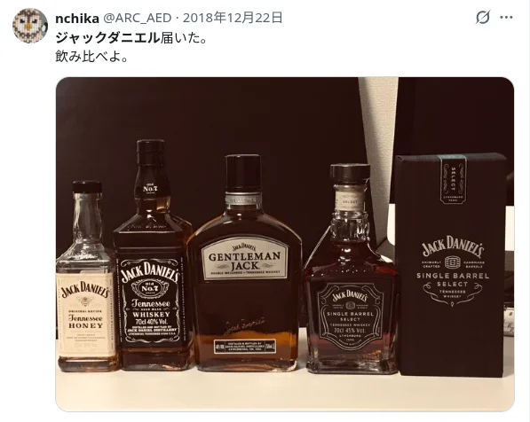

#### ガジェットよりも先に、家具を選ぶ

ガジェットを数点買うよりも、まともな家具を部屋にデプロイした方が費用対効果が優れている。だって、ガジェットは買っても使わないから。Realforce のキーボードだけが戦友レベルで使い潰せている。その一方で、中華ゲーム機は触らない月すらある。今までは、その現実を直視できなかった。ガジェットはロマンだから。しかし、最近は「1日中フルリモートで部屋に籠もっているから、高い家具で満足度を高めた方がテンション上がるよな」と考え直した。

机、デスクシェルフ、スピーカーは購入済みである。机が9月末に郵送されるので、環境構築できていない。そんな中で、椅子、机上の本棚、モニタ向け照明を追加で検討中である。椅子は Ergohuman が候補だが、1.5万円で購入した椅子の10倍以上する。ここ最近は2回ほどギックリ腰的な症状で苦しんだので、椅子に投資する選択肢は大いにある。しかし、10倍も腰に効くのかが疑い深い。安い椅子と、読書で使う一人用ソファを購入した方がトータルで幸せではないか、という案も出ている。

---

#### ブドウは自然に大きくならない

今年は、初めてブドウ（品種はピオーネ）が実った。私はまだ食べていないが、甘かったらしい。皮は硬めとのこと。今更ながら調べたところ、ブドウの木を成長させるために、数年は大半の実を摘房することが多いらしい。今年は数個切り落としたが、殆ど残した。大半のブドウは表面が不自然に黒くなっており、葉も病気のような兆候が見られた。病気に強いブドウの木は、接ぎ木された物が多く、値段も高め。私は安い木を買ったので、そこまで病気に強くないのかも知れない。






スーパーで見かけるブドウは実がギッシリしているが、我が家のはスカスカだ。原因は、複数あるらしい。樹勢が強すぎ、窒素肥料のやりすぎ、若木（低樹齢）、摘房・房作りが不十分など。来年は、多めに摘房する。大前提として、庭が小さいから枝の行き場がない。今回調べていて残念だったのは、ブドウの木の寿命が15〜25年と短いこと。私より早く定年を迎える気だ。何となく木は人間の数倍長生きな印象を持っていたが、違うらしい。できる限り長く実をつけていただきたい。

---

#### 8年ぶりにジェントルマンジャックを飲む

我が家は、酒屋でチーズを大量買いする習慣があるのだが（自分以外がムシャムシャ食べるのだが）、その際にジェントルマンジャックが3000円程度だったので衝動買いしてしまった。2018年にジャックダニエルシリーズを購入して以来なので、約8年ぶりだ（下図参照）。テネシーアップル、テネシーブラックベリー、ウィンタージャックなどの変わり種も、見つけ次第に飲んでみたい。ちなみに、ジェントルマンジャックは、通常版よりもクセが少なく、軽やかだ。人によっては物足りなさを感じるかも知れない。

---

#### 最終出社

最終出社だった。PR 5件ほど出して、サヨナラしてきた。1.5年ほど在籍した。転職活動を始めた時点では在籍期間1年ほどであり、「こんなに早く転職してよいのだろうか」と転職活動自体を迷った。私は安易な転職を良しとしない保守的な人間であり、自力で変革できないこと以外は耐えられるので、「この程度の不満で辞めるのはチョットな……」と迷いが生じた。カジュアル面談も一社だけ受けて、しかも「転職する気ないですよ」と伝えながら選考を進めて内定をいただいたりしていた。なお、私は転職活動で同時に一社しか受けない。会社情報が脳内で混ざると嫌なので。

転職理由は、抽象的に言えば音楽性の違いである。現職はクラシックがしたかったが、私はメタルがしたかった。メタルとクラシックは、技術、理論、練習量、アンサンブルのような土台を共有している。クラシックに合わせることもできる。しかし、楽譜がポンポンと変わり、定番曲を十分に演奏できず、演奏スタイルに違和感を感じながら、あと数年働く選択肢が弱かった。私のワガママである。

現職の面接を受ける前は、あらゆる公開物に目を通して、1週間以内に全ての面接を終えた。水が合うと表現されるぐらいだった。現実的には、私は淡水魚で、現職は海だった。とはいえ、海水の刺激を受けて、設計思想に大きな変化があった。

---

#### 同じアイス、別の体験

誕生日だった。息子と妻がサーティワンアイスのペコちゃん BOX を買ってきてくれた（おまけのポーチが床に落ちているのを見かけた）。息子の提案らしい。息子にとっては、サーティワンは誕生日に食べたいぐらい美味しいアイスなのだろう。先日、息子は初めてサーティワンを食べて、ニコニコしていた。私はサーティワンを食べても強く感動しないが、息子にとっては違う。まだ短い人生の中で食べたアイスの中で、とびきり美味しいものがサーティワンなのだ。





残念ながら、私が食事で喜びを感じることは殆どない（食欲がないとは言ってない。デブだから）。「息子が初めて外でアイスを食べた」などのイベントに紐づかないと、食事から感動を得られない。美味しいお肉を食べても、思い出にならないのだ。感受性が衰えている。そう考えると、私は息子や妻に美味しいものを食べてもらうのが最もコスパが高い。この2人は、よく喜ぶ。

惰性で誕生日ケーキも買っているが、子供の時のような「ケーキだ！」みたいなテンションではない。儀式。感情の波はない。もう何も考えずに、ショートケーキのイチゴを息子の口に入れるぐらいには、ケーキに興味がない。オッサンの誕生日は、デザートが豪華な平日でしかない。いや、夫婦で高い店に行く派閥があるのは知っているが、私は家から出たくない。自主的につまらない平日へとランクダウンさせている。

---

#### AI 使い、AI 使われ

最近は、AI に文章や資料を書かせながら、その内容を理解していない人がいる。生成された文章を一度も読んでいなさそうな人さえいる。私自身、魂を込めて Design Doc（詳細設計書）を書いていた時期と比べて、細部への理解が甘くなった。昔は完成した文章を何度も読み返したが、今ではせいぜい1回だ。読み込みが浅いので、仕様が脳に焼き付かない。対面で会話する時、理解度の低さに気づく。言葉に詰まるのだ。それだと困るケースも当然あるので、魂を込めるべき機能を選別して、その機能の設計書は「調査は AI、執筆は完全手書き」にしている。

格ゲー界隈では、「使われ」という蔑称がある。強キャラの高い性能のおかげで勝てているような人を◯◯使われと表現する。AI は紛れもない強キャラであり、AI 使われが増えていると感じている。私も振り回されている。昔は、自分が苦手な領域（例：文章、コーディング、管理）の作業を避ける人が多かった。今では、AI が作業を代替してくれ、自分で評価できないレベルのブツを生成してくれる。この生成物が AI Slop（低品質コンテンツ）になりがちだ。最近のテーマは、「AI 使われからの脱却」である。AI 使いへの道を歩む。

個人的な AI の良い使い方のひとつは、理解できない技術に関して質問攻めにすることだ。例えば、私は [Mastering Ethereum Chapter 4. Cryptography](https://masteringethereum.xyz/chapter_4.html) を読み終わった後、自分の言葉で何も語れなかった。今後の飯の種なので、ChatGPT に URL を渡してから質問攻めして理解度を上げている。同じことを人間にしたら、「もう少し自分で調べたら？」と呆れられるだろう。一方、思考を外注するための壁打ちは悪い使い方だ。回答が一意に決まらない曖昧な質問を繰り返しても、発散する。せめて判断基準を示すべきだ。「簡単に作れて、売れるゲームを教えて」と AI に尋ねても、答えは出ないだろう。
