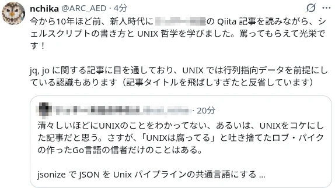
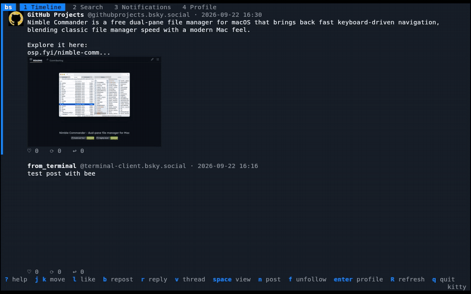
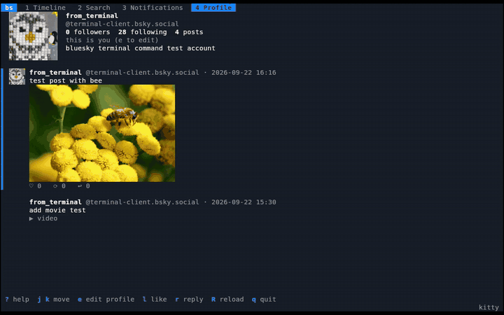

#### 秘密結社シェルショッカーから反応があった

[jsonize の記事](/post/ja/2026-09-16-jsonizeでjsonをunixパイプラインの共通言語にする/)がシェルスクリプト界隈で有名な方からリアクションされて嬉しい限り。最初は「アホの極み」とまで表現されていた。無反応よりは反応があった方がいい。一方的に発言者の人となりを把握していたので「アジテーションを感じるコメントのノリは懐かしいな」と思った。

下図のポストの大事な所は、ハッシュタグもつけてくださっていることだ（見切れているが）。拡散しようとしてくれている。

リポストにつけたコメントは皮肉ではない。私は、この方から影響を受けた。新人の頃は、シェルスクリプト界隈が今より盛り上がっていた。ワンライナーやシェル芸で遊ぶ人が多かったし、上記のポストをされた方や ShellSpec の作者からは強い影響を受けた。その影響が Software Design への寄稿に繋がり、今となっては開発したツールにダメ出しされている。自分の成長を感じた。

なお、タイトルを飛ばしすぎた反省がある。今までは「〜を作った話」と書いてきたが、少しインパクトが弱いかと思い、普段とワードチョイスを変えた。その結果、反応が良すぎた。

----

#### jsonize への意見を考察

[jsonize の記事](/post/ja/2026-09-16-jsonizeでjsonをunixパイプラインの共通言語にする/)が一定量読まれたため、各コメントに対して振り返っておく。意見は、おおよそ以下のパターンだった。

- 構造化パイプ派：Nushell、PowerShell との比較
- 既存ツール比較派：jc、jo が対象
- 発展案：Where-Object、ForEach-Object、MCPへの対応
- Unix原理主義者：UNIX を分かっていないという指摘
- 懐疑派：「気持ちはわかる」「jq で加工する以外に用途はあるのか」

上記の中で、構造化パイプや PowerShell 相当の機能は、jsonizeとは異なる抽象化である。導入するとカオスになる。UNIX 原理主義もネタ枠なので無視する。一方、既存ツールとの比較や懐疑的な意見は的を射ている。

既存ツール（jc, jo）も懐疑的な見方をされるツールかというと、そうではない。jo には、別システムへ渡す JSON をシェルから作るという明確な用途があり、jsonize も `jz new` で同じ使い方ができる。jc は CLI としては jq との連携が中心だが、Python ライブラリとして Ansible などの自動化基盤にも組み込める。

jsonize は jo の用途をカバーできる一方、ライブラリとしての jc とは同じ土俵に立ちにくい。特に Goなら、コマンド出力を自前でパースして構造体へ詰めたほうが早い場合も多い。この手の話は、一旦放置していると、ふと妙案が思いつくので暫くは静観する。下手に機能を足すと、ツールとしての方向性がブレる。

---

#### 学生食堂ワンダフルワールド（増田薫）を読んでいる

最近、漫画は食べ物系しか読んでいない。「[学生食堂ワンダフルワールド](https://www.amazon.co.jp/%E5%AD%A6%E7%94%9F%E9%A3%9F%E5%A0%82%E3%83%AF%E3%83%B3%E3%83%80%E3%83%95%E3%83%AB%E3%83%AF%E3%83%BC%E3%83%AB%E3%83%89-%E5%A2%97%E7%94%B0%E8%96%AB-ebook/dp/B0CR2PTVC5?crid=3Q29U38LJXNYD&dib=eyJ2IjoiMSJ9.DiyiUiXv6h2JhE_CBjrBGroZuZ9mewEu2pZ9KiC_e6IKh7rNz5YnNUeoz-Rf6ZBd4yeYA2U-Qn4IYwHctIUjzR_fizEygoUT_MtBdygFJxAvX6KudebCotxzlW4UHoUEoOsz3l89T9ZdRbObVCxv0lVj-4whBwPjj_fZr2rHyn0PB_Dnw6qqu-Esv07Taz4rVB12k7GemaRRrs4hVmr4vkB9EBbJjNENTsMaGffHRCr4b3ZvCV7Km83gDLS9fsVtX-h700x5LGm-NbUkumFdsh4C1RhxXQpVnR67Ba_mftA.6zCNoGw20X6ZGGc9Lf3hKDyCpK5cPCi0jl8YVgs6wmo&dib_tag=se&keywords=%E5%A2%97%E7%94%B0%E8%96%AB&qid=1789997469&sprefix=%E5%A2%97%E7%94%B0%2Caps%2C192&sr=8-1&linkCode=ll2&tag=debimate07-22&linkId=a6e26e37771bfdf505a1f9e0a5b46e20&ref_=as_li_ss_tl)」はオールカラーで、地域性のある話で好き。前作の「[いつか中華屋でチャーハンを](https://www.amazon.co.jp/%E3%81%84%E3%81%A4%E3%81%8B%E4%B8%AD%E8%8F%AF%E5%B1%8B%E3%81%A7%E3%83%81%E3%83%A3%E3%83%BC%E3%83%8F%E3%83%B3%E3%82%92-%E3%80%90%E9%9B%BB%E5%AD%90%E9%99%90%E5%AE%9A%E3%82%AA%E3%83%BC%E3%83%AB%E3%82%AB%E3%83%A9%E3%83%BC%E7%89%88%E3%80%91-%E5%A2%97%E7%94%B0%E8%96%AB-ebook/dp/B08PY6JPYZ?crid=3Q29U38LJXNYD&dib=eyJ2IjoiMSJ9.DiyiUiXv6h2JhE_CBjrBGroZuZ9mewEu2pZ9KiC_e6IKh7rNz5YnNUeoz-Rf6ZBd4yeYA2U-Qn4IYwHctIUjzR_fizEygoUT_MtBdygFJxAvX6KudebCotxzlW4UHoUEoOsz3l89T9ZdRbObVCxv0lVj-4whBwPjj_fZr2rHyn0PB_Dnw6qqu-Esv07Taz4rVB12k7GemaRRrs4hVmr4vkB9EBbJjNENTsMaGffHRCr4b3ZvCV7Km83gDLS9fsVtX-h700x5LGm-NbUkumFdsh4C1RhxXQpVnR67Ba_mftA.6zCNoGw20X6ZGGc9Lf3hKDyCpK5cPCi0jl8YVgs6wmo&dib_tag=se&keywords=%E5%A2%97%E7%94%B0%E8%96%AB&qid=1789997469&sprefix=%E5%A2%97%E7%94%B0%2Caps%2C192&sr=8-2&linkCode=ll2&tag=debimate07-22&linkId=bf66541cfc6cc783751e743a03f369b8&ref_=as_li_ss_tl)」も好きだった。他に読んでいるのは、めしばな刑事タチバナ、らーめん再遊記とか。「[鍋に弾丸を受けながら](https://www.amazon.co.jp/%E9%8D%8B%E3%81%AB%E5%BC%BE%E4%B8%B8%E3%82%92%E5%8F%97%E3%81%91%E3%81%AA%E3%81%8C%E3%82%89-%EF%BC%91-%E3%82%AB%E3%83%89%E3%82%AB%E3%83%AF%E3%83%87%E3%82%B8%E3%82%BF%E3%83%AB%E3%82%B3%E3%83%9F%E3%83%83%E3%82%AF%E3%82%B9-%E6%A3%AE%E5%B1%B1-%E6%85%8E-ebook/dp/B09NXMNX49?__mk_ja_JP=%E3%82%AB%E3%82%BF%E3%82%AB%E3%83%8A&crid=14J4RAAGUMWFL&dib=eyJ2IjoiMSJ9.lRfPXn33Dfl0xB9EgLigNa02Jd08wHbvo0MPb7JIJqHnBOFkU6L0U1erBEkj2hnFi2yPGwEVp_tGzD6kTGUw80Yh-HAyhynAdd10h8bRN78BPnQrRL0JS3izUwvycdLE0MbrllkTVen1WeY0GAcj2VsRgu9jHOEkdHhjt5XHivMqO56JJe9-DfJ3sT3CVCDyCVo2wCLUd4l0iIgk3Al59aP6NNHuMjKB8ZUh2nxL_G8.zAQy8OhmdfPQDwjFADZQnsnJB64Ecl1HBTLDHHY3M0c&dib_tag=se&keywords=%E9%8D%8B%E3%81%AB%E5%BC%BE%E4%B8%B8%E3%82%92&qid=1789997933&sprefix=%E9%8D%8B%E3%81%AB%E5%BC%BE%E4%B8%B8%E3%82%92%2Caps%2C242&sr=8-2-spons&sp_csd=d2lkZ2V0TmFtZT1zcF9hdGY&psc=1&linkCode=ll2&tag=debimate07-22&linkId=7d2a673e57f821453e7fc3e6c86248fc&ref_=as_li_ss_tl)」がお気に入りだが、最近休載している。ウンチクを語られたり、地域性のある話（エッセイ的なもの）が好きなのだと思う。

一応、普通の漫画（普通とは？）も買うけど、1巻の途中で読むのを止めるか、5巻程度で中だるみを感じてしまう。「これは出落ち（タイトル回収）しているだけで、話のプロットが面白くないのでは？」と余計なことを考えてしまう。食べ物の話は1話で完結するから読みやすいのかも知れない。1話完結と言えば、新幹線に乗りながらこち亀を読むようにもなった。歴史資料的な趣がある。

あとは、ダイの大冒険 勇者アバンと獄炎の魔王、フリーレン、サンキューピッチ、転生モノがいくつか最後の砦として残っている。面白い漫画があればこっそり教えていただきたい。

---

#### Googlebook OS + ラップトップ PC の情報が発表され始めた

- [Googlebook: The laptop your Android phone has been waiting for（公式）](https://blog.google/products-and-platforms/devices/googlebook/pre-order-googlebook/)
- [「Linuxデスクトップ元年」到来か。Debianが使えるGooglebook OS発表](https://smhn.info/202609-googlebook-os-debian-linux-environment-launch)
- [Googlebook OS の詳細が公開。Android と ChromeOS を統合、アップデートは最大 10 年](https://helentech.jp/news-googlebook-os-design-android-integration-91503/)

金額は、899 USD（約14万）から。Aluminium OS と呼ばれていた頃から注目していたが、ようやくお披露目された。個人的に注目している点は、2つ。一つは、Debian が動くこと。pKVM ベースの Level 5認証ハイパーバイザで隔離された Linux 環境を動かせる。もう一つは、Android アプリがネイティブに動かせる構成であること。ChromeOS が長年やってきたエミュレート／仮想化コンテナ内での実行ではなく、ネイティブに動かせる。勿論、全ての Android アプリが動くわけではないと思うが、大きな前進だ。個人的には、Gemini やスマホとの連携は正直興味がない。

次に買うラップトップは、間違いなく Googlebook のどれかになると思う。もう少し先の将来を予測すると、Chromebox のようにデスクトップ環境向けの OS が登場すると、かなりテンションが上がる。私の開発環境なんて、Go と Visual Studio Code が動けば問題ないので、Android アプリも動かせるオモチャみたいな OS が欲しい。ここ最近の製品発表で一番テンションが上がった。私に都合が良い世界線に到達すると、世の Android アプリ開発者は「こんなに色んな画面サイズや動作環境のこと考えられるか！」となるかもしれない。

---

#### Bluesky のターミナルクライアントを作った

[nao1215/atago](https://github.com/nao1215/atago) が TUI アプリを E2E テストでき、その機能を強化・検証するために、テスト対象アプリとして [nao1215/bluesky-terminal-client](https://github.com/nao1215/bluesky-terminal-client) を実装した。本当は Reddit クライアントがベストだったが、Reddit はパブリック API を自由に使えない問題があった。仕方なく、Bluesky を題材にした。

ターミナル上にインラインで画像を表示するために、Rust を採用した。私の把握している範囲では、Go の TUI ライブラリで高解像度の画像をインライン表示できるものは存在しない認識。

動画も再生できる。ただし、ブラウザのようにスクロール途中で動画が自動再生されたりはしない。明示的に再生ボタン（スペース）を押さないと、動き出さない。ブラウザと違って、まだ最適化されていないので画像表示すら高速ではない。とは言え、テキストしか表示しなかったり、低解像度の画像を表示するクライアントよりは、UI が良いと思う。

しっかりと記事を書いて GitHub Star 稼ぎをしても良いのだが、「今更 Bluesky クライアントを紹介してもな」というお気持ちがあったので、weeknotes でひっそりと紹介する。

---

#### 新しい机が届いて、開発環境が整った

2026/07/20週で「[仕事机の新調を検討](https://debimate.jp/weeknotes/2026-07-20/4c975a8cf076/)」、「[仕事机の現物確認 again](https://debimate.jp/weeknotes/2026-07-20/78170379e238/)」の話を書いたが、遂に机が届いた。ほぼ2か月待ちだった。ダイニングテーブルを仕事机にしているので、少し低めだ。






上記の机以外に追加で購入したものは、以下の通り。

- [Anker Charging Station](https://www.amazon.co.jp/dp/B0D31HML9J?th=1&linkCode=ll2&tag=debimate07-22&linkId=1b23830ced4f5d82a1c7568ae33a6300&ref_=as_li_ss_tl)（上記の画像に見えない位置に置いてある）
- [Edifier MR5 モニタースピーカー](https://www.amazon.co.jp/dp/B0DYJX892C?th=1&linkCode=ll2&tag=debimate07-22&linkId=29fb9eb5c071d97c639c6248f34c2d91&ref_=as_li_ss_tl)
- [VAYDEER 金属製デュアルモニタースタンド](https://www.amazon.co.jp/dp/B0GGQQ54DD?th=1&linkCode=ll2&tag=debimate07-22&linkId=1dacb9da8c45bb8474949beeb39ffad1&ref_=as_li_ss_tl)

机に余裕ができ、ドラムの音がしっかり聞こえるスピーカーに代わって、集中しやすい。モニタースタンド（デスクシェルフ）と Charging Station の両方に USB ポートが大量にあるので、PC 側の USB ポートが空いた。モニタースタンドには、タブレットやスマホを立てかけられ、下にキーボードとノート PC を同時に収納できる。引き出しが二か所あるのも便利だ。この利便性のために、木製の高級っぽいデスクシェルフを選ばなかった。

新しい椅子かソファも買う予定だったが、旅行やら何やらで予算オーバーした。暫く買い物は控えたい。

---

#### ガシャポンでカービィマウスパッドを手に入れた

マウスをガンガン使うと新しい机が傷つくから嫌だなと考えていたら、丁度良く「[星のカービィ マウスシートコレクション（フラットガシャポン）](https://www.bandai.co.jp/catalog/item.php?jan_cd=4582770069464000)」を見つけた。息子と一緒に買い物をしている最中に、目に入った。息子にも海洋生物のガチャをさせつつ、自分も500円を投入して1回だけ回した。一発で許容範囲のブツをゲットできた。デデデ大王だったら泣いていた。





最近のガチャは単価が300円〜2000円と高めだが、クオリティの高いブツが確定で手に入る。下手にクレーンゲームをするより、ガチャを回した方が個人的には納得感がある。イオンのゲーセンにあるアンパンマンの乗り物も、あまり乗せたくない。一瞬で終わるから。ガチャはブツが残る。なお、現実のガチャは回すが、ゲームのガチャは回さない。サービス終了したら悲しいので。

